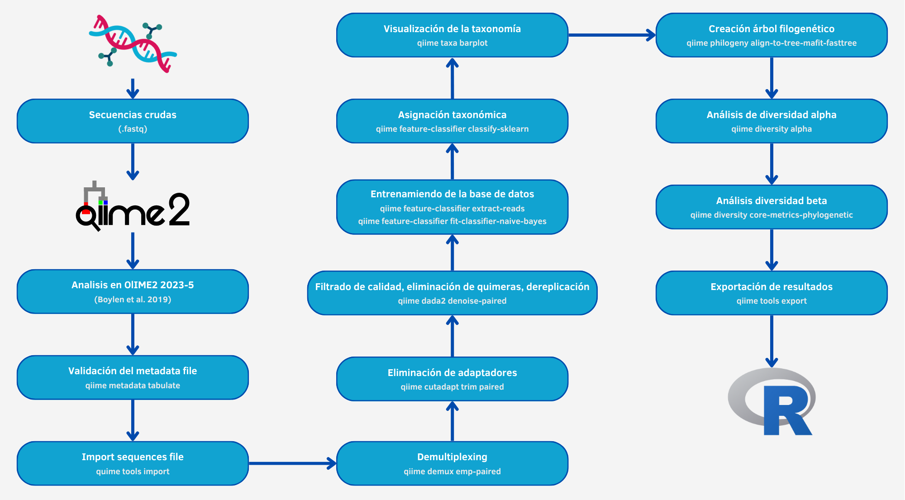

<!-- &&&&&&&&&&&&&&&&&&&&&&&&&&&&&&&&&&&&&&&&&&&&&&&&&&&&&&&&&&&&&&&&&&&&&&&&&&&&&&&&&&&&&&&&&&&&&&&&&&&&&&&&&&&&&&&&&&&&&&&&&&&&&&&&&&&&&&&&&&&&&&&&&&&&&&&&&&&&&& -->
<!--  TAB 1: METODOLOGÍA -->
<!-- &&&&&&&&&&&&&&&&&&&&&&&&&&&&&&&&&&&&&&&&&&&&&&&&&&&&&&&&&&&&&&&&&&&&&&&&&&&&&&&&&&&&&&&&&&&&&&&&&&&&&&&&&&&&&&&&&&&&&&&&&&&&&&&&&&&&&&&&&&&&&&&&&&&&&&&&&&&&&& -->


<!-- %%%%%%%%%%%%%%%%%%%%%%%%%%%%%%%%%%%%%%%%%%%%%%%%%%%%%%%%%%%%%%%%%%%%%%%%%%%%%%%%%%%%%%%%%%%%%%%%%%%%%%%%%%%%%%%%%%%%%%%%%%%%%%%%%%%%%%%%%%%% -->
<!--  CHATBOT -->
<!-- %%%%%%%%%%%%%%%%%%%%%%%%%%%%%%%%%%%%%%%%%%%%%%%%%%%%%%%%%%%%%%%%%%%%%%%%%%%%%%%%%%%%%%%%%%%%%%%%%%%%%%%%%%%%%%%%%%%%%%%%%%%%%%%%%%%%%%%%%%%% -->

```{=html}
<!-- Contenedor del chat -->
<div id="chat-container">
  <button id="chat-toggle"></button>
  <div id="chat-box">
    <div id="chat-info" class="chat-info">
      <h1>
        Mini Chat RAG (beta)
      </h1>

      <p>
        Hello! I am <strong>Geni</strong>, the intelligent assistant of <strong>GenoScribe</strong>.  
        I am here to help you interactively explore the content of this bioinformatics report.
      </p>

      <p>
        When you ask me a question, I first try to recognize whether it matches any of the patterns or expressions I know.  
        If I find a match, I will respond directly with a predefined answer, designed to be fast, clear, and even a bit witty.  
        If I do not recognize the pattern, I then activate my search tools: I generate vector representations (embeddings) and look for the most relevant fragments across multiple documents—including the report itself, external PDF and HTML files, and question-and-answer (QA) sessions.  
        Based on that information, I create a summary that aims to provide you with a coherent and useful response grounded in the existing content.
      </p>

      <p>
        Please note that this environment is experimental. I do not use large language models, so some responses may be approximate or incomplete.  
        The main goal is to provide a fast, understandable, and reproducible way to visualize the information contained in the documents, enabling a more dynamic exploration of the report.
      </p>

      <p>
        Currently, results may vary in accuracy, as I use lightweight local models to ensure the application runs in any environment without the need for external servers.  
        However, the system structure is designed to significantly improve its performance in the future through integration with more advanced models or external APIs.  
        To get started, simply type your question in the field below and let me take care of the rest. I promise to put all my code into it!
      </p>
    </div>
    <div id="chat-log"></div>
    <input id="chat-input" type="text" placeholder="Escribe tu pregunta..."/>
    <button id="chat-send" title="Enviar">
      <svg xmlns="http://www.w3.org/2000/svg" viewBox="0 0 24 24">
        <path d="M2 21l21-9L2 3v7l15 2-15 2v7z"/>
      </svg>
    </button>
  </div>
</div>
```


<!-- %%%%%%%%%%%%%%%%%%%%%%%%%%%%%%%%%%%%%%%%%%%%%%%%%%%%%%%%%%%%%%%%%%%%%%%%%%%%%%%%%%%%%%%%%%%%%%%%%%%%%%%%%%%%%%%%%%%%%%%%%%%%%%%%%%%%%%%%%%%% -->
<!--  IMPORTACIONES -->
<!-- %%%%%%%%%%%%%%%%%%%%%%%%%%%%%%%%%%%%%%%%%%%%%%%%%%%%%%%%%%%%%%%%%%%%%%%%%%%%%%%%%%%%%%%%%%%%%%%%%%%%%%%%%%%%%%%%%%%%%%%%%%%%%%%%%%%%%%%%%%%% -->

<!-- Incluir Font Awesome -->
<link href="https://cdnjs.cloudflare.com/ajax/libs/font-awesome/6.5.0/css/all.min.css" rel="stylesheet">


<!-- %%%%%%%%%%%%%%%%%%%%%%%%%%%%%%%%%%%%%%%%%%%%%%%%%%%%%%%%%%%%%%%%%%%%%%%%%%%%%%%%%%%%%%%%%%%%%%%%%%%%%%%%%%%%%%%%%%%%%%%%%%%%%%%%%%%%%%%%%%%% -->
<!--  CÓDIGO GLOBAL -->
<!-- %%%%%%%%%%%%%%%%%%%%%%%%%%%%%%%%%%%%%%%%%%%%%%%%%%%%%%%%%%%%%%%%%%%%%%%%%%%%%%%%%%%%%%%%%%%%%%%%%%%%%%%%%%%%%%%%%%%%%%%%%%%%%%%%%%%%%%%%%%%% -->

```{r, include = FALSE}
# Cargar librerías
library(glue)
library(fs)
library(stringr)
library(dplyr)


# Rutas clave
ruta_qmd <- getwd()
ruta_metagenomics_pipeline <- file.path("..", "..", "..", "..", "..", "..", "..")
ruta_metagenomics_pipeline_absoluta <- normalizePath(ruta_metagenomics_pipeline)
nombre_proyecto <- basename(params$project_path)


# Rutas de resultados Nextflow
ruta_nextflow_results <- file.path(ruta_metagenomics_pipeline, "resources", "02-nextflow-results")
ruta_proyecto_relativa <- file.path(ruta_metagenomics_pipeline, "resources", "02-nextflow-results", "01-project-data", nombre_proyecto)


# Rutas de resources
ruta_archives <- file.path(ruta_metagenomics_pipeline, "resources", "01-essential", "02-archives")
ruta_archives_metodologia <- file.path(ruta_archives, "02-tmp", "tab1-metodologia")


# Rutas de la carpeta Análisis
ruta_proyecto_analisis <- file.path(params$project_path, "Analisis")
ruta_proyecto_analisis_relativa <- file.path(ruta_proyecto_relativa, "Analisis")


# Rutas de archivos .ini y .sh en proyecto relativo
ruta_miarma_workflow_ini_relativa <- file.path(ruta_proyecto_analisis_relativa, "miARma_workflow.ini")
ruta_slurm_sh_relativa <- file.path(ruta_proyecto_analisis_relativa, "Slurm.sh")


# Rutas de archivos .ini y .sh en proyecto absoluto
ruta_miarma_workflow_ini <- file.path(ruta_proyecto_analisis, "miARma_workflow.ini")
ruta_slurm_sh <- file.path(ruta_proyecto_analisis, "Slurm.sh")


# Ruta de salida en txt de miARma_workflow.ini y slurm.sh
ruta_miarma_workflow_txt <- file.path(ruta_archives_metodologia, "miARma_workflow.txt")
ruta_slurm_txt <- file.path(ruta_archives_metodologia, "Slurm.txt")


# Ruta de archivos en la raíz del proyecto
ruta_main_nf_absoluta <- file.path(ruta_metagenomics_pipeline_absoluta, "main.nf")
ruta_main_nf <- file.path(ruta_metagenomics_pipeline, "main.nf")
ruta_main_nf_archives <- file.path(ruta_archives_metodologia, "main.nf")

ruta_nextflow_config_absoluta <- file.path(ruta_metagenomics_pipeline_absoluta, "nextflow.config")
ruta_nextflow_config <- file.path(ruta_metagenomics_pipeline, "nextflow.config")
ruta_nextflow_config_archives <- file.path(ruta_archives_metodologia, "nextflow.config")

ruta_params_yml_absoluta <- file.path(ruta_metagenomics_pipeline_absoluta, "params.yml")
ruta_params_yml <- file.path(ruta_metagenomics_pipeline, "params.yml")
ruta_params_yml_archives <- file.path(ruta_archives_metodologia, "params.yml")

ruta_quarto_yml_absoluta <- file.path(ruta_metagenomics_pipeline_absoluta, "_quarto.yml")
ruta_quarto_yml <- file.path(ruta_metagenomics_pipeline, "_quarto.yml")
ruta_quarto_yml_archives <- file.path(ruta_archives_metodologia, "_quarto.yml")


# Copiar archivos de la raiz del poryecto
file.copy(from = ruta_main_nf_absoluta, to = ruta_main_nf_archives, overwrite = TRUE)
file.copy(from = ruta_nextflow_config_absoluta, to = ruta_nextflow_config_archives, overwrite = TRUE)
file.copy(from = ruta_params_yml_absoluta, to = ruta_params_yml_archives, overwrite = TRUE)
file.copy(from = ruta_quarto_yml_absoluta, to = ruta_quarto_yml_archives, overwrite = TRUE)


# Vector con las rutas de los archivos copiados
archivos_copiados <- c(
  ruta_main_nf_archives,
  ruta_nextflow_config_archives,
  ruta_params_yml_archives,
  ruta_quarto_yml_archives
)

# Función auxiliar para cambiar extensión a "_txt"
cambiar_a_txt <- function(ruta_original) {
  # Quita la extensión original y añade "_txt.txt"
  ruta_sin_ext <- sub("\\.[^.]+$", "", ruta_original)
  ruta_nueva <- paste0(ruta_sin_ext, ".txt")
  return(ruta_nueva)
}

# Crear los nuevos archivos .txt
for (archivo in archivos_copiados) {
  # Leer contenido original
  contenido <- readLines(archivo, warn = FALSE)
  # Definir nueva ruta con _txt
  nueva_ruta <- cambiar_a_txt(archivo)
  # Escribir contenido en el nuevo archivo
  writeLines(contenido, nueva_ruta)
}


# Definir nuevas rutas de archivos modificados a .txt
ruta_main_txt_archives <- file.path(ruta_archives_metodologia, "main.txt")
ruta_nextflow_txt_archives <- file.path(ruta_archives_metodologia, "nextflow.txt")
ruta_params_txt_archives <- file.path(ruta_archives_metodologia, "params.txt")
ruta_quarto_txt_archives <- file.path(ruta_archives_metodologia, "_quarto.txt")
```


<!-- %%%%%%%%%%%%%%%%%%%%%%%%%%%%%%%%%%%%%%%%%%%%%%%%%%%%%%%%%%%%%%%%%%%%%%%%%%%%%%%%%%%%%%%%%%%%%%%%%%%%%%%%%%%%%%%%%%%%%%%%%%%%%%%%%%%%%%%%%%%% -->
<!--  TÍTULO Y RESUMEN CONTEXTUAL -->
<!-- %%%%%%%%%%%%%%%%%%%%%%%%%%%%%%%%%%%%%%%%%%%%%%%%%%%%%%%%%%%%%%%%%%%%%%%%%%%%%%%%%%%%%%%%%%%%%%%%%%%%%%%%%%%%%%%%%%%%%%%%%%%%%%%%%%%%%%%%%%%% -->

<div class="informe-titulo-tab-unique">
  <h1>Tab</h1>
  <h2>Methodology and Tools</h2>
</div>

<div class="flecha-abajo">
  ▼
</div>


<div class="informe-resumen">
  <h2>Summary</h2>

  <p>
    This tab is primarily technical and documents how the report was generated, which data were used, which tools were involved, and how the workflow was organized. Its purpose is to allow anyone consulting this report to understand the procedures performed, verify the results, and, if desired, reproduce the complete analysis accurately.
  </p>

  <p>
    During the preparation of the report, the user can select one or more markers: 
  </p>
  <ul>
    <li><strong>16S rRNA</strong> <strong>&rArr;</strong> for the identification of bacteria and archaea, widely used in environmental and clinical microbiomes.</li>
    <li><strong>18S rRNA</strong> <strong>&rArr;</strong> to characterize eukaryotes, such as protozoa and fungi, complementing or replacing 16S depending on the study.</li>
    <li><strong>ITS (Internal Transcribed Spacer)</strong> <strong>&rArr;</strong> a highly variable region mainly used for fungal identification at the genus and species level.</li>
  </ul>

  <p>
    The report data come from two main stages:
  </p>
  <ul>
    <li>
      <strong>Initial quality control</strong> <strong>&rArr;</strong> performed with <strong>miARma‑Seq</strong> (<em>Eduardo Andrés-León et al.</em>), processing <code>FASTQ</code> files and generating quality reports using <em>FastQC</em> and <em>MultiQC</em>.
    </li>
    <li>
      <strong>Metagenomic analysis</strong> <strong>&rArr;</strong> carried out with <strong>QIIME2</strong>, processing the selected markers, performing denoising with <em>DADA2</em>, generating abundance tables and diversity metrics, as well as functional predictions with <em>PICRUSt2</em> and statistical analysis in <em>R</em> using <em>MetagenomeSeq</em> and <em>ALDEx2</em>.
    </li>
  </ul>

  <p>
    Once the results are obtained, <strong>Nextflow</strong> organizes the data and prepares the configuration files that serve as the interface with <strong>Quarto</strong>:
  </p>
  <ul>
    <li><code>params.yml</code> <strong>&rArr;</strong> contains execution-specific parameters, paths, visualization options, analyzed marker, and report version.</li>
    <li><code>_quarto.yml</code> <strong>&rArr;</strong> defines the report structure, including templates, tabs, sections, and internal paths, generated using <code>yaml_generator.py</code>.</li>
  </ul>

  <p>
    When all previous processes have finished, Nextflow invokes <code>quarto render</code>, generating the final HTML report in the <code>report/</code> folder. This workflow ensures that the document fully, consistently, and reproducibly reflects all results.
  </p>

  <p>
    Thanks to this modular architecture:
  </p>
  <ul>
    <li>Each stage (quality control, metagenomic analysis, statistical analysis, report generation) can be executed independently or jointly.</li>
    <li>It allows combining different markers according to the study needs without compromising traceability or reproducibility.</li>
    <li>It facilitates verification and reconstruction of the report in the future with the same data and parameters.</li>
  </ul>

  <p>
    Additionally, this tab includes references to manuals, repositories, and supplementary documentation, accessible via information cards. For any questions or additional support, contact information is available on the home tab.
  </p>
</div>


<!-- %%%%%%%%%%%%%%%%%%%%%%%%%%%%%%%%%%%%%%%%%%%%%%%%%%%%%%%%%%%%%%%%%%%%%%%%%%%%%%%%%%%%%%%%%%%%%%%%%%%%%%%%%%%%%%%%%%%%%%%%%%%%%%%%%%%%%%%%%%%% -->
<!--  TABLA DE CONTENIDOS -->
<!-- %%%%%%%%%%%%%%%%%%%%%%%%%%%%%%%%%%%%%%%%%%%%%%%%%%%%%%%%%%%%%%%%%%%%%%%%%%%%%%%%%%%%%%%%%%%%%%%%%%%%%%%%%%%%%%%%%%%%%%%%%%%%%%%%%%%%%%%%%%%% -->

<div style="height: 15px; background-color: transparent;"></div>

<div class="titulo-toc">
  Table of contents of this tab
</div>

<div class="toc">
  <ul>
    <li>
      <a href="#tab1-intro">Metodology and tools</a>
      <ul>
        <li>
          <a href="#tab1-seccion1">1<span>.</span> Workflows and tools used for result generation</a>
          <ul>
            <li><a href="#tab1-seccion1.1">1.1. Workflow used with miARma-Seq (quality control)</a></li>
            <li><a href="#tab1-seccion1.2">1.2. Workflow used with QIIME 2 (metagenomic analysis)</a></li>
          </ul>
        </li>
        <li><a href="#tab1-seccion2">2<span>.</span> Structure of the data and generated results</a></li>
        <li>
          <a href="#tab1-seccion3">3<span>.</span> Automated report generation</a>
          <ul>
            <li><a href="#tab1-seccion3.1">3.1. Execution directory structure</a></li>
            <li><a href="#tab1-seccion3.2">3.2. Nextflow and Quarto integration</a></li>
            <li><a href="#tab1-seccion3.3">3.3. Configuration of _quarto.yml and params.yml files</a></li>
          </ul>
        </li>
        <li>
          <a href="#tab1-seccion4">4<span>.</span> Manuals, repositories, and supplementary documentation</a>
        </li>
      </ul>
    </li>
  </ul>
</div>


<!-- %%%%%%%%%%%%%%%%%%%%%%%%%%%%%%%%%%%%%%%%%%%%%%%%%%%%%%%%%%%%%%%%%%%%%%%%%%%%%%%%%%%%%%%%%%%%%%%%%%%%%%%%%%%%%%%%%%%%%%%%%%%%%%%%%%%%%%%%%%%% -->
<!--  REDACCIÓN -->
<!-- %%%%%%%%%%%%%%%%%%%%%%%%%%%%%%%%%%%%%%%%%%%%%%%%%%%%%%%%%%%%%%%%%%%%%%%%%%%%%%%%%%%%%%%%%%%%%%%%%%%%%%%%%%%%%%%%%%%%%%%%%%%%%%%%%%%%%%%%%%%% -->

<div style="height: 25px; background-color: transparent;"></div>

<div class="titulo1" id="tab1-intro">
  Methodology and Tools
</div>

<p>
  This section details the technical and methodological framework underlying the generation of this report, ensuring full <strong>transparency</strong> and <strong>reproducibility</strong> of the analysis. The objective is to comprehensively document the workflow, from the bioinformatic processing of raw data to the automated rendering of the final document, enabling any user to understand, audit, and replicate the exact process.
</p>

<p>
  In the subsection <strong>1. Workflows and Tools Used for Result Generation</strong>, the main pipeline is described, divided into two fundamental stages: an initial quality control of the reads orchestrated with <strong>miARma-Seq</strong>, followed by a detailed metagenomic analysis carried out with <strong>QIIME 2</strong> and the <strong>R</strong> language for differential processing of the selected markers (16S, 18S, or ITS). Next, in <strong>2. Structure of Generated Data and Results</strong>, the organization of the output directories and key files resulting from the experiment is detailed. 
</p>

<p>
  The subsection <strong>3. Automated Report Generation</strong> delves into the modular architecture of the system, explaining step by step how <strong>Nextflow</strong> manages the execution directories and interacts with <strong>Quarto</strong> through essential configuration files such as <code>params.yml</code> and <code>_quarto.yml</code>. Finally, section <strong>4. Manuals, Repositories, and Supplementary Documentation</strong> provides direct access to the official technical resources of the tools used to facilitate further consultation.
</p>


<div style="height: 20px; background-color: transparent;"></div>

<div class="titulo2" id="tab1-seccion1">
  1<span>.</span> Workflows and tools used for result generation
</div>

<p>
  The metagenomic analysis process carried out in this study is based on the combination of two main tools: 
  <strong>miARma-Seq</strong> and <strong>QIIME 2</strong>. Both are used complementarily to ensure data quality and obtain biologically interpretable results regarding the microbial composition of the analyzed samples.
</p>

<p>
  In the first phase, <strong>miARma-Seq</strong> was used to perform <strong>quality control</strong> on the original <code>FASTQ</code> files. This module evaluates the integrity of the reads and filters those that do not meet the established quality criteria, ensuring that the sequences passing to subsequent stages are suitable for metagenomic analysis. Although miARma-Seq was originally designed as a pipeline for <em>RNA-Seq</em> studies, its modular structure and configurability via <code>.ini</code> files allows adaptation to different data types, such as 16S, 18S, or ITS amplicons.
</p>

<p>
  In the second phase, the processed data were analyzed using <strong>QIIME 2</strong> (<em>Quantitative Insights Into Microbial Ecology</em>), one of the most established platforms for studying microbial communities from amplicon sequences. QIIME 2 provides a reproducible workflow that spans from importing and demultiplexing reads to generating diversity metrics, taxonomic assignment, and result visualization.
</p>

<p>
  Together, these two workflows provide a robust and reproducible strategy: <strong>miARma-Seq</strong> ensures the quality and cleaning of raw reads, while <strong>QIIME 2</strong> allows in-depth exploration of the microbial composition and diversity of the samples. The following sections describe both pipelines in detail, including their configuration, main execution stages, and obtained results.
</p>


<div style="height: 15x; background-color: transparent;"></div>

<div class="titulo3" id="tab1-seccion1.1">
  1.1. Workflow used with miARma-Seq (quality control)
</div>

<p>
  The tool <strong>miARma‑Seq</strong> is a comprehensive pipeline designed for RNA‑Seq analysis (mRNA, miRNA, and circRNA), developed by <em>Eduardo Andrés‑León et al</em>. It includes multiple modules that allow raw data to be processed in a modular and reproducible manner:
</p>

<ol>
  <li><strong>Initial quality control</strong> <strong>&rArr;</strong> Evaluation of <code>FASTQ</code> files using <em>FastQC</em>, generating individual reports and global summaries with <em>MultiQC</em>, allowing detection of adapters, composition biases, and positional quality issues.</li>
  <li><strong>Read trimming</strong> <strong>&rArr;</strong> Removal of adapters and low-quality bases using <em>Cutadapt</em> or <em>Reaper</em>, optimizing the data prior to alignment.</li>
  <li><strong>Alignment</strong> <strong>&rArr;</strong> Mapping against reference genomes using aligners such as <em>HISAT2</em>, <em>STAR</em>, <em>Bowtie</em>, or <em>BWA</em>, depending on the RNA type.</li>
  <li><strong>Quantification</strong> <strong>&rArr;</strong> Counting genes or isoforms with <em>featureCounts</em>, detecting circRNAs with <em>CIRI</em>, and quantifying miRNAs with <em>miRDeep2</em>.</li>
  <li><strong>Differential analysis</strong> <strong>&rArr;</strong> Identification of differentially expressed genes or miRNAs using <em>edgeR</em> or <em>NOISeq</em>, according to the experimental design.</li>
  <li><strong>Functional analysis</strong> <strong>&rArr;</strong> Prediction of miRNA‑mRNA interactions, inverse expression correlations, and functional enrichment analysis (GO, KEGG).</li>
</ol>

<p>
  Although <strong>miARma‑Seq</strong> provides a complete set of modules for RNA‑Seq analysis, in this report only the <strong>quality control (QC) module</strong> has been used for the <code>FASTQ</code> files in our metagenomic analysis. 
  This step is essential to ensure that raw reads of the selected markers (16S, 18S, ITS) are of high quality before being processed with <strong>QIIME2</strong> or any other analysis pipeline.
</p>

<p>
  All miARma‑Seq documentation and its official repository are available on <a href="https://github.com/eandresleon/miARma-seq" class="normalink" target="_blank">GitHub</a>, where all modules, parameters, and usage examples can be consulted. 
  Below is a schematic overview of the complete workflow of the tool:
</p>

<div class="box-images">
  
</div>

<div style="display: flex; justify-content: center; gap: 25px;">
  <a href="../../../../../01-images/tab1-metodologia/miARma_Seq_workflow.png" 
    target="_blank" 
    class="boton-image">
    <i class="fa-solid fa-sitemap"></i> View workflow in a new page
  </a>
  
  <a href="../../../../../01-images/tab1-metodologia/miARma_Seq_workflow.png" 
    download="miARma_Seq_workflow.png"
    class="boton-image-download">
    <i class="fa-solid fa-file-arrow-down"></i> Download image
  </a>
</div>

<p>
  To ensure <strong>reproducibility</strong> and <strong>modularity</strong>, <code>miARma‑Seq</code> uses a configuration file with the <code>.ini</code> extension. 
  This file is essential as it contains all parameters needed to run each pipeline module without requiring complex command-line inputs. In the context of this metagenomic report, the <code>.ini</code> file is configured solely to activate the <strong>quality control module</strong>, although it can be modified to run alignment, quantification, or differential analysis if needed.
</p>

<p>
  Therefore, for this report, the <code>.ini</code> file used is located in the following directory:
</p>

```{r, results='asis'}
if (file.exists(ruta_miarma_workflow_ini_relativa)) {
  cat(glue::glue('
  <p>
    <code>{ruta_miarma_workflow_ini}</code>.
  </p>
  '), sep = "\n")

} else {
  cat(glue::glue('
  <div class="alert-warning alert-box">
    <i class="fa-solid fa-triangle-exclamation"></i>
    <b>Warning</b><br>
    The file <code>{basename(ruta_miarma_workflow_ini)}</code> does not exist at the specified path:  
    <code>{ruta_miarma_workflow_ini}</code>.   
    Please ensure that this file is indeed located in this directory with this exact name.
  </div>
  \n\n'))
}
```

<p>
  As previously mentioned, this file configures only the quality control module, but the full structure—including alignment, quantification, and differential analysis for RNA‑Seq—can be consulted. The file can be viewed using the following <code>iframe</code> or, for more detail, in a new tab by clicking the button located just below. Additionally, it can also be downloaded if needed via the specific button next to it (for the download button to work, the report (<code>index.html</code>) must be opened through a server to enable JavaScript functions, as indicated in the home tab).
</p>

```{r, results="asis"}
if (file.exists(ruta_miarma_workflow_ini_relativa)) {
  # Leer el contenido del archivo
  contenido <- readLines(ruta_miarma_workflow_ini_relativa)
  
  # Guardar como .txt
  writeLines(contenido, ruta_miarma_workflow_txt)

  cat(glue::glue('
  <div class="iframe-container">
    <iframe src="{ruta_miarma_workflow_txt}" frameborder="0" style="height: 500px;"></iframe>
  </div>

  <div style="display: flex; justify-content: center; gap: 25px;">
    <a href="{ruta_miarma_workflow_txt}"
      target="_blank" 
      class="boton-iframe">
      <i class="fa-solid fa-file-lines"></i> View full file in a new page
    </a>

    <a href="{ruta_miarma_workflow_ini_relativa}"
      download="miARma_workflow.ini"
      class="boton-iframe-download">
      <i class="fa-solid fa-file-arrow-down"></i> Download file
    </a>
  </div>
  '), sep = "\n")
  
} else {
  cat(glue::glue('
  <div class="alert-warning alert-box">
    <i class="fa-solid fa-triangle-exclamation"></i>
    <b>Warning</b><br>
    As previously mentioned, the file <code>{basename(ruta_miarma_workflow_ini)}</code> does not exist at the specified path:  
    <code>{ruta_miarma_workflow_ini}</code>.   
    Please ensure it has been attached with the correct name in the corresponding directory.
  </div>
  \n\n'))
}
```

<p>
  A <code>.ini</code> file is organized into well-defined sections, such as <code>[General]</code>, <code>[QC]</code>, <code>[Aligner]</code>, <code>[ReadCount]</code>, each dedicated to a specific pipeline module. Each section defines key parameters, including:
</p>

<ul>
  <li>Input and output paths for files.</li>
  <li>Type of data to process (e.g., RNA, metagenomic).</li>
  <li>Number of threads or cores to use.</li>
  <li>Specific tools to employ at each step.</li>
  <li>Statistical criteria or quality filters applied.</li>
</ul>

<p>
  Execution of this pipeline in a <strong>High-Performance Computing (HPC)</strong> environment is done via a <code>.sh</code> script, which automates module loading, resource allocation (such as memory and cores), and runs miARma‑Seq with the <code>.ini</code> configuration file.
  
  Therefore, for this report, the script used is located in the following directory: 
</p>

```{r, results='asis'}
if (file.exists(ruta_slurm_sh_relativa)) {
  cat(glue::glue('
  <p>
    <code>{ruta_slurm_sh}</code>.
  </p>
  '), sep = "\n")

} else {
  cat(glue::glue('
  <div class="alert-warning alert-box">
    <i class="fa-solid fa-triangle-exclamation"></i>
    <b>Warning</b><br>
    The file <code>{basename(ruta_slurm_sh)}</code> does not exist at the specified path:  
    <code>{ruta_slurm_sh}</code>.   
    Please ensure that this file is indeed located in this directory with this exact name.
  </div>
  \n\n'))
}
```

<p>
  And we can view it similarly using the following <code>iframe</code>, as well as proceed with its respective download.
</p>

```{r, results="asis"}
if (file.exists(ruta_slurm_sh_relativa)) {
  # Leer el contenido del archivo
  contenido <- readLines(ruta_slurm_sh_relativa)
  
  # Guardar como .txt
  writeLines(contenido, ruta_slurm_txt)

  cat(glue::glue('
  <div class="iframe-container">
    <iframe src="{ruta_slurm_txt}" frameborder="0" style="height: 500px;"></iframe>
  </div>

  <div style="display: flex; justify-content: center; gap: 25px;">
    <a href="{ruta_slurm_txt}"
      target="_blank" 
      class="boton-iframe">
      <i class="fa-solid fa-file-lines"></i> View full file in a new page
    </a>

    <a href="{ruta_slurm_sh_relativa}"
      download="Slurm.sh"
      class="boton-iframe-download">
      <i class="fa-solid fa-file-arrow-down"></i> Download file
    </a>
  </div>
  '), sep = "\n")
  
} else {
  cat(glue::glue('
  <div class="alert-warning alert-box">
    <i class="fa-solid fa-triangle-exclamation"></i>
    <b>Warning</b><br>
    As previously mentioned, the file <code>{basename(ruta_slurm_sh)}</code> does not exist at the specified path:  
    <code>{ruta_slurm_sh}</code>.  
    Please ensure it is attached with the correct name in the corresponding directory.
  </div>
  \n\n'))
}
```

<p>
  Thanks to this structure, it is possible to reproducibly execute quality control on any set of <code>FASTQ</code> files, and in future extensions of the metagenomic analysis, other pipeline modules could be activated to include alignment, quantification, or differential analysis, thereby integrating a complete and modular workflow.
</p>

<p>
  For more information on miARma‑Seq and its complete pipeline, the official repository can be consulted at <a href="https://github.com/eandresleon/miARma-seq" class="normalink" target="_blank">GitHub: miARma‑Seq</a>.
</p>


<div style="height: 15x; background-color: transparent;"></div>

<div class="titulo3" id="tab1-seccion1.2">
  1.2. Workflow used with QIIME 2 (metagenomic analysis)
</div>

<p>
  <strong>QIIME2</strong> is a specialized platform for amplicon metagenomic analysis, especially of the 16S marker, with a modular, reproducible, and well-documented approach. Its workflow includes multiple stages that allow rigorous processing, filtering, and analysis of sequences, integrating statistical tools and advanced visualization.
</p>

<ol>
  <li>
    <strong>Raw sequences (.fastq)</strong> <strong>&rArr;</strong> Import the unprocessed sequencing files, which contain all DNA reads from the samples.
  </li>
  <li>
    <strong>Metadata file validation</strong> <strong>&rArr;</strong> Check that the information for each sample (e.g., experimental groups) is correctly formatted and consistent with the sequencing data.
  </li>
  <li>
    <strong>Sequence import</strong> <strong>&rArr;</strong> Convert <code>.fastq</code> files to QIIME2's native format, allowing execution of the subsequent pipeline steps.
  </li>
  <li>
    <strong>Demultiplexing</strong> <strong>&rArr;</strong> Separate reads by sample using indexes or barcodes, assigning each sequence to its source sample.
  </li>
  <li>
    <strong>Quality filtering, chimera removal, and dereplication</strong> <strong>&rArr;</strong> Remove low-quality and chimeric sequences (PCR artifacts), and generate unique sequences (ASVs, Amplicon Sequence Variants) representing real biological variants.
  </li>
  <li>
    <strong>Taxonomic assignment</strong> <strong>&rArr;</strong> Classify each ASV into taxonomic levels (species, genus, family, etc.) using reference databases.
  </li>
  <li>
    <strong>Database training</strong> <strong>&rArr;</strong> Train a machine learning classifier with reference databases (such as SILVA or Greengenes) to improve taxonomic assignment accuracy.
  </li>
  <li>
    <strong>Taxonomy visualization</strong> <strong>&rArr;</strong> Generate plots showing the microbial composition of each sample and the overall dataset.
  </li>
  <li>
    <strong>Phylogenetic tree construction</strong> <strong>&rArr;</strong> Build a phylogenetic tree representing evolutionary relationships among ASVs, essential for phylogeny-based diversity analyses.
  </li>
  <li>
    <strong>Alpha and beta diversity analysis</strong> <strong>&rArr;</strong> Calculate alpha diversity metrics (within each sample) and beta diversity metrics (between samples) to compare richness, evenness, and composition of microbial communities.
  </li>
  <li>
    <strong>Results export</strong> <strong>&rArr;</strong> Export ASV tables, taxonomic assignments, and diversity metrics to formats compatible with R or other software, facilitating statistical analysis, advanced visualizations, and functional predictions.
  </li>
</ol>

<p>
  The following image provides a more visual overview of the complete workflow described above and followed using this tool:
</p>

<div class="box-images">
  
</div>

<div style="display: flex; justify-content: center; gap: 25px;">
  <a href="../../../../../01-images/tab1-metodologia/qiime2_workflow.png"
    target="_blank" 
    class="boton-image">
    <i class="fa-solid fa-sitemap"></i> View workflow in a new page
  </a>
  
  <a href="../../../../../01-images/tab1-metodologia/qiime2_workflow.png"
    download="qiime2_workflow.png"
    class="boton-image-download">
    <i class="fa-solid fa-file-arrow-down"></i> Download image
  </a>
</div>

<p>
  The combined use of <strong>QIIME2</strong> and <strong>R</strong> enables a complete and reproducible analysis, integrating diversity, functionality, and advanced statistics. Official QIIME2 documentation is available at <a href="https://qiime2.org/" target="_blank" class="normalink">https://qiime2.org/</a>.
</p>

<p>
  Together, both pipelines (<strong>miARma‑Seq</strong> for quality control and <strong>QIIME2</strong> for metagenomic analysis) are integrated using <strong>Nextflow</strong> to generate a reproducible report in <strong>Quarto</strong>. This ensures traceability, modularity, and clarity in interpreting the results.
</p>


<div style="height: 20px; background-color: transparent;"></div>

<div class="titulo2" id="tab1-seccion2">
  2<span>.</span> Data structure and generated results
</div>

<p>
  Once the <strong>quality control</strong> (<em>miARma-Seq</em>) and <strong>metagenomic analysis</strong> (<em>QIIME 2</em>) phases are completed, the obtained results are organized in a <strong>directory structure</strong> that serves as the basis for generating this automated report. 
  This structure defines the location of intermediate files, final results, and metadata associated with each stage of the analysis, ensuring traceability and reproducibility of the complete workflow.
</p>

<p>
  This section, like the rest of this methodology tab, is purely technical and intended as an internal reference for the user who generated the report. Its purpose is to facilitate understanding and recall of how the project's output data were organized, so that, after some time, it is possible to <strong>quickly review the results structure</strong> without returning to the original analysis environment.
</p>

<p>
  The following shows the path of the main directory where the data and results generated for this project are stored:
</p>

```{r, results="asis"}
cat(glue::glue('<code>{params$project_path}</code>'), sep = "\n")
```

<p>
  The complete structure of this directory is shown below. 
  This representation allows visualization of the files and subfolders used as the basis for constructing the report:
</p>

<div class="box-files">

```{r, echo=FALSE, results="asis"}
if (!dir.exists(ruta_proyecto_relativa)) {
  cat(sprintf('<p><em>The path "%s" does not exist or is not accessible.</em></p>\n', ruta_proyecto_relativa))
} else {
  # List all files, without filters
  files <- list.files(ruta_proyecto_relativa, full.names = FALSE)
  
  if (length(files) == 0) {
    cat('<p><em>No files were found in the specified folder.</em></p>\n')
  } else {
    enlace <- ruta_proyecto_relativa
    
    cat("<ul>\n")
    for (f in files) {
      # Assign class according to extension
      clase <- if (!grepl("\\.", f)) {
        "file-folder"
      } else if (grepl("\\.html$", f)) {
        "file-html"
      } else if (grepl("\\.zip$", f)) {
        "file-zip"
      } else if (grepl("\\.fastq\\.gz$", f)) {
        "file-fastqgz"
      } else {
        "file-default"
      }
      
      cat(sprintf('<li class="%s"><a href="%s/%s" target="_blank">%s</a></li>\n',
                  clase, enlace, f, f))
    }
    cat("</ul>\n")
  }
}
```

</div>

```{r, results="asis"}
# For compatibility with absolute paths
enlace <- ruta_proyecto_relativa

# Print the link
cat(glue::glue('
<p style="text-align:center;">
  <a href="{enlace}" target="_blank" class="boton-files">
    <i class="fa-solid fa-folder-open"></i> Explore the files in the folder "{nombre_proyecto}" here
  </a>
</p>
'), sep = "\n")
```

```{r, results="asis"}
cat(glue::glue('
<<p>
  After interactively viewing the structure, a detailed breakdown of the folders and files generated during the metagenomic analysis is presented below. 
  This organization is designed to facilitate analysis reproducibility, result traceability, and subsequent interpretation.
</p>

<div class="items">
<ul>
  <li>
    <strong><code>{nombre_proyecto}/Analisis/reads/16S/</code></strong> <strong>&rArr;</strong> Contains the <strong>raw read files</strong> (<code>FASTQ</code>) for all 16S samples, prepared for processing with QIIME2. This ensures the correspondence between sample identifiers and their read files, guaranteeing traceability from the original data to the final results.
  </li>

  <li>
    <strong><code>{nombre_proyecto}/Resultados/Def_(16S/18S/ITS)/</code></strong> <strong>&rArr;</strong> Main folder that groups <strong>processed results</strong> from QIIME2 and functional prediction analyses of microbial communities. Its contents are organized modularly:
    <ul>
      <li>
        <strong><code>core-metrics-results/</code></strong> <strong>&rarr;</strong> Contains <code>.qzv</code> files generated by QIIME2 with alpha and beta diversity metrics, microbial composition, and distance analyses between samples. 
        These files can be viewed interactively via <a href="https://view.qiime2.org/" target="_blank" class="normalink">QIIME2 View</a> or within this report.
      </li>
      <li>
        <strong><code>sample-metadata.tsv</code></strong> <strong>&rarr;</strong> Sample metadata file, including information on sample type, experimental condition, replicates, and other relevant attributes. This file is essential for performing accurate statistical and comparative analyses.
      </li>
      <li>
        <strong><code>exported/</code></strong> <strong>&rarr;</strong> Contains <strong>differential abundance</strong> results exported for complementary analysis in R or Excel. Internal organization includes subfolders by taxonomic level (<code>genus/</code>, <code>family/</code>), each containing:
        <ul>
          <li><code>.xlsx</code> files with statistical results of group comparisons.</li>
          <li>Volcano plots highlighting the most and least abundant organisms, facilitating rapid interpretation of significant changes.</li>
        </ul>
      </li>
      <li>
        <strong>Functional prediction results (PICRUSt / Pycrust)</strong> <strong>&rarr;</strong> Files located directly in <code>Resultados/Def_(16S/18S/ITS)/</code> with indicative names such as <code>MetagenomeSeq</code>, <code>glm_test_p_values</code>, or <code>pca_p_0,05_all</code>. 
        These files allow evaluation of the potential functionality of microbial communities, identifying metabolic pathways or functions associated with the most abundant organisms.
      </li>
    </ul>
  </li>
</ul>
</div>

<p>
  This clear and modular organization not only facilitates automatic report generation but also ensures that all data and results are easily locatable, interpretable, and reusable. 
  It is particularly useful for documenting long-term projects, subsequent reviews, or collaboration among different members of the analysis team.
</p>
'), sep = "\n")
```


<div style="height: 20px; background-color: transparent;"></div>

<div class="titulo2" id="tab1-seccion3">
  3<span>.</span> Automated report generation
</div>

<p>
  Once the processed data are obtained through the <strong>miARma‑Seq</strong> (quality control) and <strong>QIIME2</strong> (metagenomic analysis) workflows, and the directory structure containing the results generated throughout the analysis process is displayed, the next step is the <strong>automated generation of the final report</strong>. This section aims to clearly and reproducibly document the entire process by which the report is constructed, detailing the organization of execution files, the integration of tools, and the configuration used.
</p>

<p>
  In particular, the following aspects will be addressed:
</p>

<ul>
  <li>
    <strong>3.1. Execution directory structure</strong> <strong>&rArr;</strong> Shows the location and organization of the files and folders from which the pipeline is executed, including Nextflow scripts and associated Quarto files. This allows the technical user to understand where the data, intermediate results, and configuration files required to generate the report are located.
  </li>
  <li>
    <strong>3.2. Integration of Nextflow and Quarto</strong> <strong>&rArr;</strong> Explains how <code>Nextflow</code> has been used to automate Quarto execution and final report generation, describing the role of the main scripts (<code>main.nf</code>) and how the different pipeline stages are coordinated.
  </li>
  <li>
    <strong>3.3. Configuration of the <code>_quarto.yml</code> and <code>params.yml</code> files</strong> <strong>&rArr;</strong> Shows the configuration files that allow exact report reproduction, including input paths, analysis parameters, and visualization options. This documentation ensures that any technical user can regenerate the report with identical results in the future, guaranteeing traceability and reproducibility.
  </li>
</ul>

<p>
  The purpose of this section is to provide a <strong>complete technical record</strong> of the workflow used to generate the report, so that anyone revisiting the project can clearly understand how the data were assembled, which tools were used, and how the execution environment was configured.
</p>


<div style="height: 15x; background-color: transparent;"></div>

<div class="titulo3" id="tab1-seccion3.1">
  3.1. Execution directory structure
</div>

<p>
  This subsection describes the <strong>file and folder structure</strong> from which the metagenomic pipeline generating the automated report is executed. This information is essential for understanding how input data, intermediate results, and Quarto and Nextflow configuration files are organized.
</p>

<p>
  The root path from which this pipeline is executed is:
</p>

```{r, results="asis"}
cat(glue::glue('<code>{ruta_metagenomics_pipeline_absoluta}</code>'), sep = "\n")
```

<p>
  The complete directory structure corresponding to this project is presented below. It is important to note that the listed elements (both files and subfolders) do not represent interactive links, but are shown solely to illustrate the internal organization of the contents. This representation allows the reader to clearly and visually understand how the different project components are distributed, facilitating conceptual navigation of the directory without needing to access each file directly.
</p>

<div class="box-files">

```{r, results="asis"}
if (!dir.exists(ruta_metagenomics_pipeline_absoluta)) {
  cat(sprintf('<p><em>The path "%s" does not exist or is not accessible.</em></p>\n', ruta_metagenomics_pipeline_absoluta))
} else {
  # List files and folders in the path
  files <- list.files(ruta_metagenomics_pipeline_absoluta, full.names = FALSE)
  files <- files[!grepl("(_cache|_libs|\\.html$)", files)]
  
  # Identify which are folders
  carpetas <- files[file.info(file.path(ruta_metagenomics_pipeline_absoluta, files))$isdir]
  archivos <- setdiff(files, carpetas)
  
  # Sort alphabetically if desired
  carpetas <- sort(carpetas)
  archivos <- sort(archivos)
  
  # Gather folders first
  files <- c(carpetas, archivos)

  if (length(files) == 0) {
    cat('<p><em>No files were found in the specified folder.</em></p>\n')
  } else {
    cat("<ul class='box-files'>\n")
    for (f in files) {
      ruta_f <- file.path(ruta_metagenomics_pipeline_absoluta, f)
      es_dir <- file.info(ruta_f)$isdir

      # Asignar clase según tipo
      clase <- if (es_dir) {
        "file-folder"
      } else if (grepl("\\.html?$", f, ignore.case = TRUE)) {
        "file-html"
      } else if (grepl("\\.zip$", f, ignore.case = TRUE)) {
        "file-zip"
      } else if (grepl("\\.fastq\\.gz$", f, ignore.case = TRUE)) {
        "file-fastqgz"
      } else if (grepl("\\.bam$", f, ignore.case = TRUE)) {
        "file-bam"
      } else if (grepl("\\.bai$", f, ignore.case = TRUE)) {
        "file-bai"
      } else if (grepl("\\.sam$", f, ignore.case = TRUE)) {
        "file-sam"
      } else if (grepl("\\.metrics$", f, ignore.case = TRUE)) {
        "file-metrics"
      } else if (grepl("\\.ht2$", f, ignore.case = TRUE)) {
        "file-ht2"
      } else if (grepl("\\.pdf$", f, ignore.case = TRUE)) {
        "file-pdf"
      } else if (grepl("\\.xlsx?$", f, ignore.case = TRUE)) {
        "file-xlsx"
      } else if (grepl("\\.sh$", f, ignore.case = TRUE)) {
        "file-sh"
      } else if (grepl("\\.ya?ml$", f, ignore.case = TRUE)) {
        "file-yml"
      } else if (grepl("\\.qmd$", f, ignore.case = TRUE)) {
        "file-qmd"
      } else if (grepl("\\.nf$", f, ignore.case = TRUE)) {
        "file-nf"
      } else if (grepl("\\.config$", f, ignore.case = TRUE)) {
        "file-config"
      } else {
        "file-default"
      }

      # Mostrar nombre
      cat(sprintf('<li class="%s">%s</li>\n', clase, f))
    }
    cat("</ul>\n")
  }
}
```

</div>

```{r, results="asis"}
# Para que funcione con rutas absolutas
enlace <- ruta_metagenomics_pipeline_absoluta

# Imprimir el enlace
cat(glue::glue('
<p style="text-align:center;">
  <a href="{enlace}" target="_blank" class="boton-files">
    <i class="fa-solid fa-folder-open"></i> Explorar los archivos de la carpeta "{basename(ruta_metagenomics_pipeline_absoluta)}" aquí
  </a>
</p>
'), sep = "\n")
```

<p>
  Below is a detailed description of the main organization of the pipeline root directory (<code>4-metagenomics</code>). 
  This description is intended as a technical reference: it indicates what each file or folder does, where the generated data are stored, and how the components are connected to produce the final <em>report</em>.
</p>

<div class="items">
<ul>
  <li>
    <strong><code>_quarto.yml</code>, <code>index.qmd</code></strong> <strong>&rArr;</strong> Base <strong>Quarto</strong> files defining the report structure (toc, formats, global parameters) and the index page. Each report tab is represented by a <code>.qmd</code>.
  </li>

  <li>
    <strong><code>main.nf</code>, <code>nextflow.config</code>, <code>params.yml</code></strong> <strong>&rArr;</strong> Nextflow pipeline control files:
    <ul>
      <li><code>main.nf</code> <strong>&rarr;</strong> main script that orchestrates tasks (organizing results, creating configuration scripts, and rendering the report).</li>
      <li><code>nextflow.config</code> <strong>&rarr;</strong> execution configuration (profiles, resources, modules, default paths).</li>
      <li><code>params.yml</code> <strong>&rarr;</strong> project-specific parameters (input paths, pipeline options) — generated or filled by the user/Nextflow for each run.</li>
    </ul>
  </li>

  <li>
    <strong><code>report/</code></strong> <strong>&rArr;</strong> Output folder where Nextflow / Quarto deposit the final report (HTML) and derived materials ready to share.
  </li>

  <li>
    <strong><code>resources/</code></strong> <strong>&rArr;</strong> Local repository of resources and consolidated results. At a high level:
    <ul>
      <li>
        <code>resources/01-essential/</code> <strong>&rarr;</strong> resources used by templates and <code>.qmd</code> files:
        <ul>
          <li><code>01-images/</code> <strong>&rarr;</strong> icons and graphics (cover, workflow diagrams, favicon, etc.).</li>
          <li><code>02-archives/</code> <strong>&rarr;</strong> copies of files of interest (scripts, logs, examples of <code>.ini</code>/<code>.sh</code>) used as reference or for download in the methodology tab.</li>
          <li><code>03-scripts/</code> <strong>&rarr;</strong> auxiliary scripts (R, Quarto templates, CSS, JS, Python, and Bash) that support report construction and artifact generation (e.g., <code>yaml_generator.py</code>).</li>
        </ul>
      </li>

      <li>
        <code>resources/02-nextflow-results/</code> <strong>&rarr;</strong> location where Nextflow consolidates project results:
        <ul>
          <li><code>01-project-data/{nombre_del_proyecto}/</code> <strong>&rarr;</strong> local copy of the processed project (input + results). Nextflow copies work data here so Quarto can consume it in a stable and reproducible manner.</li>
          <li><code>02-multiqc-report/</code> <strong>&rarr;</strong> centralized output of FastQC / MultiQC reports generated by the initial QC.</li>
          <li><code>03-analisis-estadistico/</code> <strong>&rarr;</strong> exported results and intermediate products ready for additional statistical analysis (e.g., exports for R, xlsx tables, volcano plots, etc.).</li>
        </ul>
      </li>
    </ul>
  </li>

  <li>
    <strong><code>run_cleaning_dir.sh</code>, <code>run_pipeline_shell.sh</code>, <code>run_pipeline_shiny.sh</code></strong> <strong>&rArr;</strong> <strong>Utility</strong> scripts in the root directory.
    <ul>
      <li><code>run_pipeline_shell.sh</code> <strong>&rarr;</strong> wrapper to launch the pipeline from the terminal (executes Nextflow with the appropriate profile/params).</li>
      <li><code>run_pipeline_shiny.sh</code> <strong>&rarr;</strong> invokes a graphical interface (Shiny) that allows pipeline execution via a form for less technical users.</li>
      <li><code>run_cleaning_dir.sh</code> <strong>&rarr;</strong> script to clean caches and temporary files (useful for freeing space, especially when Nextflow results and caches grow significantly).</li>
    </ul>
  </li>
</ul>
</div>

<p>
  Once the general structure of the execution directory has been described, it can be noted that the pipeline is organized modularly to ensure reproducibility, result traceability, and clarity in report generation. 
  The <code>.qmd</code> files represent the report tabs and subsections, while Nextflow consolidates previous results, generates additional reports when needed, and coordinates Quarto execution to produce the final document.
</p>

<p>
  Within <code>resources/01-essential/03-scripts/02-quarto</code>, two versions of the templates are maintained: 
  <code>01-full-version</code>, which includes the methodology tab and all detailed analysis sections, and <code>02-compact-version</code>, which omits the methodology tab and provides a more compact version of the report. Each <code>.qmd</code> file corresponds to a specific tab or subsection.
</p>

<p>
  Nextflow uses the existing metagenomic analysis results (quality control, abundances, and functional predictions) stored in <code>resources/02-nextflow-results/01-project-data/{nombre_del_proyecto}</code> and performs additional operations such as result consolidation, MultiQC report generation in <code>02-multiqc-report</code>, and preparation of statistical data in <code>03-analisis-estadistico</code>. It also generates the configuration files required by Quarto, including <code>params.yml</code> and, via <code>yaml_generator.py</code>, <code>_quarto.yml</code> with project-specific parameters and paths, ensuring that report rendering is reproducible and consistent.
</p>

<p>
  To generate the report, Nextflow invokes <code>quarto render</code> on the <code>.qmd</code> files and corresponding parameter files, producing the final HTML in <code>report/</code>. Auxiliary scripts in the project root, such as <code>run_pipeline_shell.sh</code>, <code>run_pipeline_shiny.sh</code>, and <code>run_cleaning_dir.sh</code>, allow pipeline execution from the terminal, via graphical interface, or for cleaning caches and temporary directories, respectively.
</p>

<p>
  To reproduce an exact report, a complete copy of the results in <code>resources/02-nextflow-results/01-project-data/{nombre_del_proyecto}</code>, as well as the <code>params.yml</code> and <code>_quarto.yml</code> files generated during execution, are required. This modular structure facilitates locating the necessary files and ensures that any user can consistently rebuild the report.
</p>

<p>
  For additional details and exact execution steps, it is recommended to consult the official project guide on GitHub: 
  <a href="https://github.com/adrichez/GenoScribe/blob/main/06-info/0202_METAGENOMICS_AMPLICON_GUIDE.md" target="_blank" class="normalink">GenoScribe: Amplicon Metagenomics Pipeline Guide</a>.
</p>


<div style="height: 15x; background-color: transparent;"></div>

<div class="titulo3" id="tab1-seccion3.2">
  3.2. Integration of Nextflow and Quarto
</div>

```{r, results="asis"}
cat(glue::glue('
<p>
  The integration between <strong>Nextflow</strong> and <strong>Quarto</strong> forms the technical foundation that enables automated generation of the final report from metagenomic analysis results. This approach aims to ensure <strong>reproducibility</strong>, <strong>modularity</strong>, and <strong>traceability</strong>, avoiding reliance on manual steps and reducing the risk of inconsistencies between the results and the generated documentation. Unlike a classic pipeline, in this case Nextflow does not execute the analytical processes of miARma-Seq or QIIME 2, but rather <strong>consumes their already generated results</strong>, performs necessary intermediate operations (structured copies, auxiliary report generation, parameter preparation), and finally <strong>invokes Quarto</strong> to build the report.
</p>

<p style="margin-botton: -25px">
  The general workflow is as follows: 
  <ol>
    <li>A set of parameters and base paths is defined via <code>nextflow.config</code>.</li>
    <li>Nextflow starts the pipeline, copies the essential project files to a reproducible working structure, and executes auxiliary processes such as MultiQC on the quality control reports.</li>
    <li>The configuration files that Quarto will use (<code>params.yml</code> and <code>_quarto.yml</code>) are generated or updated.</li>
    <li>Finally, <code>quarto render</code> is invoked to assemble the final HTML report in a fully automated manner.</li>
  </ol>
</p>

<p style="margin-top: -25px">
  The configuration file <strong><code>nextflow.config</code></strong>, located at <code>{ruta_nextflow_config_absoluta}</code>, is the starting point of this integration. It defines the pipeline global variables, including:
</p>

<ul>
  <li><strong><code>outdir</code></strong> <strong>&rArr;</strong> Standard output path where results and the final report will be stored.</li>
  <li><strong><code>project_path</code></strong> <strong>&rArr;</strong> Location of the analyzed project, containing the directory structure previously generated by miARma-Seq and QIIME 2.</li>
  <li><strong><code>amplicon_type</code></strong> <strong>&rArr;</strong> Numeric indicator representing the analyzed marker (<strong>1: 16S, 2: 18S, 3: ITS, 4: 16S-18S, 5: 16S-ITS, 6: 18S-ITS, 7: 16S-18S-ITS</strong>). This information dynamically determines which results will be included in the report.</li>
  <li><strong><code>report_version</code></strong> <strong>&rArr;</strong> Defines the report version to generate (<strong>full</strong> or <strong>compact</strong>), which dictates the tabs and content that Quarto will render.</li>
</ul>

<p>
  With this explained, the file can be visualized using the following <code>iframe</code>, as well as explored in more detail on a full page or downloaded (the report must be opened via a server for this action to work, as previously mentioned).
</p>

<!-- IFRAME for nextflow.config -->
<div class="iframe-container">
  <iframe src="{ruta_nextflow_txt_archives}" frameborder="0" style="height: 500px;"></iframe>
</div>

<div style="display: flex; justify-content: center; gap: 25px;">
  <a href="{ruta_nextflow_txt_archives}"
    target="_blank" 
    class="boton-iframe">
    <i class="fa-solid fa-file-lines"></i> View full file on a new page
  </a>

  <a href="{ruta_nextflow_config_archives}"
    download="nextflow.config"
    class="boton-iframe-download">
    <i class="fa-solid fa-file-arrow-down"></i> Download file
  </a>
</div>

<p>
  The file <strong><code>main.nf</code></strong>, located at <code>{ruta_main_nf_absoluta}</code>, constitutes the core of the pipeline and orchestrates the various processes required for report preparation. Among the most relevant stages managed by this script are:
</p>

<ul>
  <li>
    <strong>Structured copying of project files</strong> <strong>&rArr;</strong> Only the essential elements are selected (excluding large files like FASTQ or BAM) and transferred to <code>resources/02-nextflow-results/01-project-data/</code>. This ensures that Quarto works on a consolidated and lightweight structure.
  </li>
  <li>
    <strong>MultiQC execution</strong> <strong>&rArr;</strong> Using the quality control reports (FastQC) generated by miARma-Seq, MultiQC is run to unify the information and facilitate its visualization in the final report.
  </li>
  <li>
    <strong>Parameter preparation for Quarto</strong> <strong>&rArr;</strong> Based on variables defined in <code>nextflow.config</code>, the <code>params.yml</code> and <code>_quarto.yml</code> files (the latter via <code>yaml_generator.py</code>) are generated, acting as an interface between the pipeline and Quarto.
  </li>
  <li>
    <strong>Report rendering</strong> <strong>&rArr;</strong> Once all previous processes have successfully completed, <code>quarto render</code> is invoked to build the HTML report in the <code>report/</code> folder. This ensures that the report is always generated with complete data and consistent parameters.
  </li>
</ul>

<p>
  Similarly, this file can be visualized using the following <code>iframe</code>, as well as explored in more detail on a full page or downloaded.
</p>

<!-- IFRAME for main.nf -->
<div class="iframe-container">
  <iframe src="{ruta_main_txt_archives}" frameborder="0" style="height: 500px;"></iframe>
</div>

<div style="display: flex; justify-content: center; gap: 25px;">
<!-- Button to view full file -->
  <a href="{ruta_main_txt_archives}"
    target="_blank" 
    class="boton-iframe">
    <i class="fa-solid fa-file-lines"></i> View full file on a new page
  </a>

  <!-- Button to download file -->
  <a href="{ruta_main_txt_archives}"
    download="main.nf"
    class="boton-iframe-download">
    <i class="fa-solid fa-file-arrow-down"></i> Download file
  </a>
</div>

<p>
  This modular design allows the pipeline to be easily expanded or modified without compromising reproducibility. 
  By clearly separating data preparation stages and report generation, the traceability of each component is facilitated, ensuring that any report can be <strong>reconstructed in the future</strong> from the same parameters and result structure.
</p>
'), sep = "\n")
```


<div style="height: 15x; background-color: transparent;"></div>

<div class="titulo3" id="tab1-seccion3.3">
  3.3. Configuration of the _quarto.yml and params.yml files
</div>

```{r, results="asis"}
cat(glue::glue('
<p>
  Once the <strong>Nextflow</strong> pipeline has been executed, the configuration files <strong><code>_quarto.yml</code></strong> and <strong><code>params.yml</code></strong> are generated. These files serve as the interface between the pipeline and <strong>Quarto</strong>, allowing the final workflow step to execute <code>quarto render</code> and build the final HTML report from the provided data and parameters.
</p>

<p>
  The <code>params.yml</code> file contains all execution-specific parameters, including file paths, display options, analyzed marker, report version, and relevant project metadata. In turn, <code>_quarto.yml</code> establishes the report structure, defining templates, tabs, sections to render, and internal paths via the execution of the <code>yaml_generator.py</code> script. Together, these files allow report generation to be fully automated, consistent, and reproducible.
</p>

<p>
  The <code>params.yml</code> file can be visualized using the following <code>iframe</code>, explored interactively, or opened on a full page and downloaded if desired:
</p>

<!-- IFRAME for params.yml -->
<div class="iframe-container">
  <iframe src="{ruta_params_txt_archives}" frameborder="0" style="height: 500px;"></iframe>
</div>

<div style="display: flex; justify-content: center; gap: 25px;">
  <a href="{ruta_params_txt_archives}"
    target="_blank" 
    class="boton-iframe">
    <i class="fa-solid fa-file-lines"></i> View full file on a new page
  </a>

  <a href="{ruta_params_yml_archives}"
    download="params_yml"
    class="boton-iframe-download">
    <i class="fa-solid fa-file-arrow-down"></i> Download file
  </a>
</div>

<p>
  Once the content of <code>params.yml</code> is understood, <code>_quarto.yml</code> can be examined, which acts as the structural guide for Quarto, indicating which templates and sections should be included and how they should be organized within the report. This file is essential for <code>quarto render</code> to generate a final document consistent with the project data.
</p>

<!-- IFRAME for _quarto.yml -->
<div class="iframe-container">
  <iframe src="{ruta_quarto_txt_archives}" frameborder="0" style="height: 500px;"></iframe>
</div>

<div style="display: flex; justify-content: center; gap: 25px;">
  <a href="{ruta_quarto_txt_archives}"
    target="_blank" 
    class="boton-iframe">
    <i class="fa-solid fa-file-lines"></i> View full file on a new page
  </a>

  <a href="{ruta_quarto_yml_archives}"
    download="quarto_yml"
    class="boton-iframe-download">
    <i class="fa-solid fa-file-arrow-down"></i> Download file
  </a>
</div>

<p>
  This architecture ensures that any report can be exactly reproduced in the future, provided that the same consolidated results in <code>resources/02-nextflow-results/01-project-data/nombre_del_proyecto</code> and the <code>params.yml</code> and <code>_quarto.yml</code> files generated by the pipeline are available. The clear separation between data preparation and report generation ensures traceability, modularity, and consistency in the final reports.
</p>
'), sep = "\n")
```


<div style="height: 20px; background-color: transparent;"></div>

<div class="titulo2" id="tab1-seccion4">
  4<span>.</span> Manuals, repositories, and supplementary documentation
</div>

<p>
  This final section closes the methodology tab, aimed primarily at users interested in understanding in detail how the report was generated, which data were used, and how the integration between Nextflow and Quarto was structured. The information provided here allows access to additional resources, consultation of technical documentation, and location of code repositories to review or reuse the scripts employed.
</p>

<p>
  Similarly to the start cards, the following informational cards are presented to facilitate quick access to key resources related to this project:
</p>

```{r, results="asis"}
cat(glue::glue('
<div class="contact-cards">
<div class="contact-card blue">
  <i class="fa-brands fa-github fa-2x"></i>
  <p><strong>Code repository</strong></p>
  <a href="https://github.com/adrichez/GenoScribe" target="_blank">Project GitHub</a>
</div>
<div class="contact-card green">
  <i class="fa-solid fa-book fa-2x"></i>
  <p><strong>Documentation</strong></p>
  <a href="https://github.com/adrichez/GenoScribe/blob/main/06-info/0202_METAGENOMICS_AMPLICON_GUIDE.md" target="_blank">User manual</a>
</div>
<div class="contact-card purple">
  <i class="fa-solid fa-calendar fa-2x"></i>
  <p><strong>Report creation date</strong></p>
  <span>{Sys.Date()}</span>
</div>
</div>
'), sep = "\n")
```

<p style="margin-top: 25px;">
  For any additional questions or support inquiries, users can refer to the contact information shown on the report's home tab, which includes links to the CSIC Bioinformatics Unit and the support email.
</p>


<!-- %%%%%%%%%%%%%%%%%%%%%%%%%%%%%%%%%%%%%%%%%%%%%%%%%%%%%%%%%%%%%%%%%%%%%%%%%%%%%%%%%%%%%%%%%%%%%%%%%%%%%%%%%%%%%%%%%%%%%%%%%%%%%%%%%%%%%%%%%%%% -->
<!--  FOOTER -->
<!-- %%%%%%%%%%%%%%%%%%%%%%%%%%%%%%%%%%%%%%%%%%%%%%%%%%%%%%%%%%%%%%%%%%%%%%%%%%%%%%%%%%%%%%%%%%%%%%%%%%%%%%%%%%%%%%%%%%%%%%%%%%%%%%%%%%%%%%%%%%%% -->

<footer>
  <a href="#" class="arriba"><i class="fa-solid fa-angles-up"></i></a>
</footer>


<!-- %%%%%%%%%%%%%%%%%%%%%%%%%%%%%%%%%%%%%%%%%%%%%%%%%%%%%%%%%%%%%%%%%%%%%%%%%%%%%%%%%%%%%%%%%%%%%%%%%%%%%%%%%%%%%%%%%%%%%%%%%%%%%%%%%%%%%%%%%%%% -->
<!--  CARGAR SCRIPTS DE JAVASCRIPT -->
<!-- %%%%%%%%%%%%%%%%%%%%%%%%%%%%%%%%%%%%%%%%%%%%%%%%%%%%%%%%%%%%%%%%%%%%%%%%%%%%%%%%%%%%%%%%%%%%%%%%%%%%%%%%%%%%%%%%%%%%%%%%%%%%%%%%%%%%%%%%%%%% -->

<script type="module" src="../../../../04-javascript/chatbot.js"></script>
<script type="module" src="../../../../04-javascript/script.js"></script>
