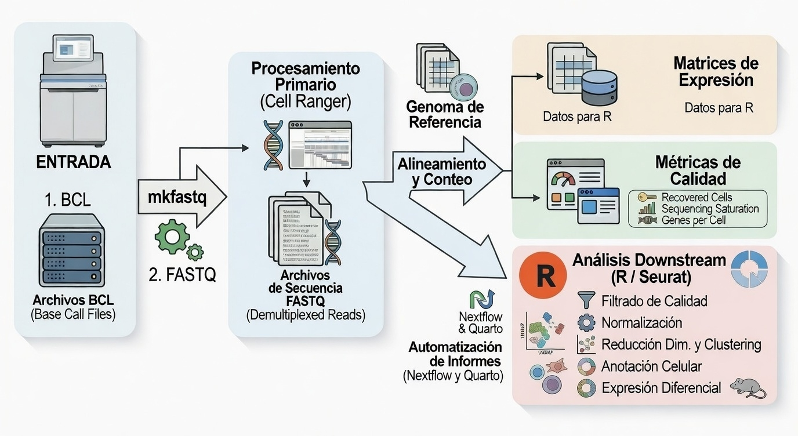

<p align="center">
  
</p>

<div align="center">
  <h1 style="color: #5aa0fb;">Sistema Inteligente y Reproducible para la Generación de Informes Bioinformáticos</h1>
  <h2 style="color: #7ebef6;">Guía de Usuario para el Análisis Transcriptómico de Single-Cell RNA-Seq</h2>

  <p>
    <a href="https://www.r-project.org/"></a>
    <a href="https://rmarkdown.rstudio.com/"></a>
    <a href="https://shiny.rstudio.com/"></a>
    <a href="https://quarto.org/"></a>
    <a href="https://www.python.org/"></a>
    <a href="https://spacy.io/"></a>
    <a href="https://jupyter.org/"></a>
    <a href="https://www.w3.org/html/"></a>
    <a href="https://www.w3.org/Style/CSS/"></a>
    <a href="https://www.javascript.com/"></a>
    <a href="https://www.d3js.org/"></a>
    <a href="https://www.nextflow.io/"></a>
    <a href="https://www.bioconductor.org/"></a>
    <a href="https://docs.conda.io/en/latest/"></a>
    <a href="https://www.docker.com/"></a>
    <a href="https://apptainer.org/"></a>
    <a href="https://www.markdownguide.org/"></a>
    <a href="https://git-scm.com/"></a>
    <a href="https://github.com/adrichez/GenoScribe"></a>
    <a href="https://www.latex-project.org/"></a>
  </p>

  <p>
    <a href="#section-1">Introducción</a> • 
    <a href="#section-2">Requisitos</a> • 
    <a href="#section-3">Workflow</a> • 
    <a href="#section-4">Descarga</a> • 
    <a href="#section-5">Métodos</a> • 
    <a href="#section-6">Parámetros</a> • 
    <a href="#section-7">Estructura</a> • 
    <a href="#section-8">Pipeline</a> • 
    <a href="#section-8">Informe</a> • 
    <a href="#section-10">Comentarios</a> • 
    <a href="#section-11">Contacto</a>
  </p>
</div>


<br>
<br>


<h2 id="section-1">1. 📖 Introducción y contexto</h2>

El presente documento constituye la **guía de usuario** para el análisis transcriptómico de datos de **Single-Cell RNA-Seq (scRNA-Seq)** dentro del sistema **GenoScribe**.  

En él se explican los pasos, parámetros y consideraciones necesarias para ejecutar este tipo de análisis, desde la **preparación del proyecto** y la **construcción del contenedor bioinformático**, hasta la **ejecución del pipeline unicelular** y la **generación del informe interpretativo final**.  

A diferencia de otras guías técnicas, el objetivo aquí no es solo listar comandos, sino también **ofrecer un marco conceptual y práctico** que permita comprender el valor del análisis unicelular y la interpretación biológica de los resultados obtenidos, incluyendo **clustering, obtención de marcadores, anotación celular, análisis diferencial por clúster y enriquecimiento**.


<br>


<h3 id="section-1.1">1.1. 🧬 ¿Qué es la Transcriptómica?</h3>  

La **Transcriptómica** es el campo de estudio que analiza el conjunto completo de ARN expresado en una célula, tejido o muestra biológica en un momento determinado. Este conjunto de ARN, conocido como **transcriptoma**, refleja qué genes están activos y en qué nivel de expresión.

A diferencia de la genómica, que estudia el ADN (información potencial), la transcriptómica analiza la **información funcional en acción**, permitiendo comprender cómo responde un sistema biológico ante diferentes condiciones, estímulos o patologías.

Actualmente, existen tres grandes enfoques tecnológicos para estudiar el transcriptoma:

📊 **Bulk RNA-Seq** → Analiza la expresión promedio de todas las células de una muestra.  
🧫 **Single-Cell RNA-Seq (scRNA-Seq)** → Analiza la expresión génica a nivel de célula individual.  
📍 **Transcriptómica Espacial** → Integra expresión génica con información de localización dentro del tejido.

Aunque esta guía se centra exclusivamente en **Single-Cell RNA-Seq**, es importante entender estas diferencias para contextualizar el tipo de análisis que se está realizando.


<br>


<h3 id="section-1.2">1.2. 🧫 ¿Qué es Single-Cell RNA-Seq?</h3>  

El análisis transcriptómico de **Single-Cell RNA-Seq (scRNA-Seq)** permite medir la **expresión génica de manera individual en cada célula**, revelando la heterogeneidad y la dinámica de las poblaciones celulares.  

Cada célula se convierte en una **unidad de análisis independiente**, lo que permite identificar **tipos y subtipos celulares**, evaluar **estados funcionales específicos** y reconstruir **trayectorias de diferenciación o activación**.

El flujo general del análisis unicelular incluye:

- 📥 **Secuenciación de ARN unicelular** y generación de lecturas por célula.  
- 🧬 **Alineamiento o pseudoalineamiento** por célula contra un genoma o transcriptoma de referencia.  
- 📊 **Cuantificación de expresión por célula**, generando una matriz genes × células.  
- 📈 **Clustering, anotación y análisis diferencial** entre subpoblaciones celulares.  
- 🕒 **Reconstrucción de trayectorias y pseudotiempo** para procesos dinámicos.

🔹 **Aplicaciones principales del scRNA-Seq:**  
- 🧩 Identificación de **tipos y subtipos celulares** en tejidos heterogéneos.  
- 🔍 Análisis de **expresión diferencial** entre clústeres o condiciones experimentales.  
- 🕒 Reconstrucción de **trayectorias celulares** y estados de diferenciación.  
- 🌐 Integración **multi-ómics** a nivel unicelular.  
- 🧠 Estudio de **heterogeneidad y plasticidad celular**, relevante en inmunología, desarrollo y oncología.

🔹 **Ventajas principales:**  
- Permite **resolver heterogeneidad celular** que Bulk no detecta.  
- Posibilita identificar **subpoblaciones y estados celulares raros**.  
- Facilita el estudio de **procesos dinámicos y trayectorias celulares**.

🔹 **Limitaciones:**  
- Mayor complejidad analítica y computacional.  
- Coste experimental elevado.  
- Datos más dispersos y ruidosos, requiriendo un **mayor control de calidad**.


<br>


<h3 id="section-1.3">1.3. 🔬 Bulk vs Single-Cell vs Transcriptómica Espacial</h3>  

Aunque todas estas técnicas estudian el transcriptoma, no capturan el mismo nivel de información biológica.  
La diferencia fundamental radica en la **unidad de análisis**, la **resolución** y la **información biológica que se puede extraer**.


<hr style="border:none; height:1.5px; background-color:#777; width:100%; margin:35px 0 20px 0;">

<h4 id="section-1.3.1">1.3.1. 📊 Bulk RNA-Seq</h4>

Analiza el ARN total de una muestra completa, generando un **perfil promedio de expresión**.  
Adecuado para identificar **cambios globales** en la expresión génica, pero no distingue qué células contribuyen a cada señal.  
Menor complejidad analítica y coste moderado.


<hr style="border:none; height:1.5px; background-color:#777; width:100%; margin:35px 0 20px 0;">

<h4 id="section-1.3.2">1.3.2. 🧫 Single-Cell RNA-Seq</h4>

Analiza **células individualmente**, revelando heterogeneidad y subpoblaciones.  
Permite identificar tipos celulares raros, estados transcripcionales y trayectorias dinámicas, a costa de mayor complejidad analítica y coste superior.


<hr style="border:none; height:1.5px; background-color:#777; width:100%; margin:35px 0 20px 0;">

<h4 id="section-1.3.3">1.3.3. 📍 Transcriptómica Espacial</h4>

Integra expresión génica con **información de localización**, preservando arquitectura tisular.  
Permite estudiar la **organización espacial y relaciones celulares**, siendo la aproximación más completa pero también la más compleja y costosa.


<hr style="border:none; height:1.5px; background-color:#777; width:100%; margin:35px 0 20px 0;">

<h4 id="section-1.3.4">1.3.4. ⚡️ Resumen</h4>

| Característica | Bulk RNA-Seq | Single-Cell RNA-Seq | Transcriptómica Espacial |
|----------------|--------------|---------------------|---------------------------|
| **Unidad de análisis** | Muestra completa | Célula individual | Célula o región espacial |
| **Resolución biológica** | Promedio global | Alta (nivel celular) | Alta + contexto espacial |
| **Heterogeneidad celular** | No detectable directamente | Detectable | Detectable + localización |
| **Complejidad analítica** | Media | Alta | Muy alta |
| **Costo experimental** | Moderado | Alto | Muy alto |
| **Tipo de pregunta principal** | Cambios globales | Identificación de subpoblaciones | Organización y arquitectura tisular |

Esta guía aborda exclusivamente el análisis de **Single-Cell RNA-Seq**, por lo que el pipeline y el informe generado están diseñados para **resolver heterogeneidad celular y caracterizar subpoblaciones**, sin promediar la señal como en Bulk RNA-Seq.


<br>


<h3 id="section-1.4">1.4. ❓ Ejemplo de pregunta biológica</h3>  

Un investigador puede plantear cuestiones como:  

👉 *“¿Qué subpoblaciones celulares emergen en el tejido inmunitario tras un tratamiento y cómo cambia la expresión génica dentro de cada tipo celular?”*  

Con **Single-Cell RNA-Seq** es posible obtener la respuesta mediante:  
- La **cuantificación de la expresión génica por célula**.  
- La **identificación de clústeres y tipos celulares** basados en perfiles transcriptómicos.  
- El **análisis de expresión diferencial** entre subpoblaciones.  
- La **reconstrucción de trayectorias celulares** para inferir procesos dinámicos.  
- La **interpretación funcional** de genes y rutas activadas en cada subpoblación.


<br>


<h3 id="section-1.5">1.5. 🎯 Objetivo de esta guía</h3>  

El propósito de esta guía no es únicamente mostrar cómo ejecutar el pipeline, sino sobre todo:  

1. 📂 **Centralizar** los datos obtenidos o generados por herramientas bioinformáticas.  
2. 📝 **Transformar** esos resultados en un **informe automatizado, claro y reproducible**.  
3. 👩‍🔬 **Facilitar la comprensión** de los resultados para investigadores sin necesidad de explorar manualmente cada archivo de salida.  
4. 🌐 **Mejorar la comunicación científica**, generando informes listos para ser **compartidos en equipos de investigación, colaboraciones o incluso publicaciones**.  


<br>


<h3 id="section-1.6">1.6. ✨ Valor añadido de GenoScribe</h3>  

Uno de los principales retos de los análisis unicelulares es que los resultados suelen presentarse en **archivos dispersos, de difícil lectura** o poco intuitivos para investigadores no especializados.  

⚡️ Aquí es donde **GenoScribe marca la diferencia**:  
- Genera **informes interactivos** con gráficos, tablas y resúmenes claros.  
- Permite **reproducibilidad**: cualquier investigador puede volver a ejecutar el análisis con los mismos parámetros y obtener el mismo informe.  
- Hace que la **bioinformática sea más accesible**, transformando datos complejos en **conocimiento visual y compartible**.  

> 💡 **En resumen:** GenoScribe no solo ejecuta análisis, sino que **traduce la complejidad unicelular en información útil y comunicable**.


<br>
<br>


<h2 id="section-2">2. 📂 Proyecto en GitHub y requisitos</h2>

El proyecto **GenoScribe** está publicado en GitHub y se organiza de forma modular para separar:  
- la **interfaz gráfica de usuario** (app Shiny),  
- los **pipelines de análisis** (Nextflow + Quarto),  
- los **entornos reproducibles** (Docker / Apptainer),  
- los **scripts de ejecución**,
- los **informes de ejemplo**,
- y la **documentación**. 

Esta organización permite que cada tipo de análisis **(Transcriptómica, Metagenómica, Metatranscriptómica, etc.)** y sus subtipos, dispongan de su propia carpeta con todo lo necesario para ser ejecutado, mantenido y extendido de manera independiente.


<br>


<h3 id="section-2.1">2.1. 🏗️ Estructura global del repositorio</h3>

```plaintext
GenoScribe         # Directorio principal del proyecto
├── 01-app         # App Shiny e interfaz web
├── 02-pipelines   # Pipelines bioinformáticos
├── 03-containers  # Definición de entornos reproducibles (Docker / Apptainer)
├── 04-launch      # Scripts de ejecución (local, contenedor, HPC/cloud)
├── 05-examples    # Estructuras base e informes de ejemplo
├── 06-info        # Documentación técnica y especificaciones
└── README.md      # Guía general del proyecto
```

Cada directorio tiene un rol específico y está descrito con mayor detalle en el [README](../README.md) general.


<br>


<h3 id="section-2.2">2.2. 🧬 Carpeta específica del pipeline de Single-Cell RNA-Seq</h3>

El pipeline para este tipo de análisis se encuentra en [GenoScribe/02-pipelines/01-transcriptomics/02-sc-rna-seq](../02-pipelines/01-transcriptomics/02-sc-rna-seq).

Dentro de esta carpeta se incluyen todos los recursos necesarios para ejecutar el análisis y generar informes Quarto:

```plaintext
02-sc-rna-seq
├── _quarto.yml
├── index_en.qmd
├── index_es.qmd
├── main.nf
├── nextflow.config
├── params.yml
├── report
├── resources
│   ├── 01-essential
│   │   ├── 01-images
│   │   │   ├── icons
│   │   │   │   ├── bot_blue.png
│   │   │   │   ├── bot_white.png
│   │   │   │   ├── favicon_form.ico
│   │   │   │   ├── favicon_form.svg
│   │   │   │   ├── favicon.ico
│   │   │   │   ├── favicon.svg
│   │   │   │   └── ipbln.png
│   │   │   ├── tab0-inicio
│   │   │   │   ├── transcriptomics_sc_rna_seq_cover_report.mp4
│   │   │   │   └── transcriptomics_sc_rna_seq_cover_report.png
│   │   │   ├── tab1-metodologia
│   │   │   │   └── cellranger_workflow.png
│   │   │   ├── tab2-resumen
│   │   │   └── tab3-analisis
│   │   ├── 02-archives
│   │   │   ├── 01-fixed
│   │   │   │   ├── tab0-inicio
│   │   │   │   ├── tab1-metodologia
│   │   │   │   ├── tab2-resumen
│   │   │   │   └── tab3-analisis
│   │   │   └── 02-tmp
│   │   │       ├── tab0-inicio
│   │   │       ├── tab1-metodologia
│   │   │       ├── tab2-resumen
│   │   │       └── tab3-analisis
│   │   └── 03-scripts
│   │       ├── 01-r
│   │       │   ├── 01-sections-code
│   │       │   │   ├── seccion4.R
│   │       │   │   └── seccion5.R
│   │       │   └── 02-nextflow-code
│   │       ├── 02-quarto
│   │       │   ├── 01-spanish-language
│   │       │   │   ├── 01-full-version
│   │       │   │   │   ├── tab1-metodologia
│   │       │   │   │   │   └── metodologia.qmd
│   │       │   │   │   ├── tab2-resumen
│   │       │   │   │   │   └── resumen.qmd
│   │       │   │   │   └── tab3-analisis
│   │       │   │   │       ├── 00-contexto.qmd
│   │       │   │   │       ├── 01-revision-inicial.qmd
│   │       │   │   │       ├── 02-control-calidad.qmd
│   │       │   │   │       ├── 03-clustering.qmd
│   │       │   │   │       ├── 04-marcadores.qmd
│   │       │   │   │       ├── 05-anotacion.qmd
│   │       │   │   │       ├── 06-agrupacion.qmd
│   │       │   │   │       ├── 07-expresion-diferencial.qmd
│   │       │   │   │       ├── 08-enriquecimiento.qmd
│   │       │   │   │       ├── 09-extra.qmd
│   │       │   │   │       └── 10-conclusiones.qmd
│   │       │   │   └── 02-compact-version
│   │       │   │       ├── tab2-resumen
│   │       │   │       │   └── resumen.qmd
│   │       │   │       └── tab3-analisis
│   │       │   │           ├── 00-contexto.qmd
│   │       │   │           ├── 01-revision-inicial.qmd
│   │       │   │           ├── 02-control-calidad.qmd
│   │       │   │           ├── 03-clustering.qmd
│   │       │   │           ├── 04-marcadores.qmd
│   │       │   │           ├── 05-anotacion.qmd
│   │       │   │           ├── 06-agrupacion.qmd
│   │       │   │           ├── 07-expresion-diferencial.qmd
│   │       │   │           ├── 08-enriquecimiento.qmd
│   │       │   │           ├── 09-extra.qmd
│   │       │   │           └── 10-conclusiones.qmd
│   │       │   └── 02-english-language
│   │       │       ├── 01-full-version
│   │       │       │   ├── tab1-metodologia
│   │       │       │   │   └── metodologia.qmd
│   │       │       │   ├── tab2-resumen
│   │       │       │   │   └── resumen.qmd
│   │       │       │   └── tab3-analisis
│   │       │       │       ├── 00-contexto.qmd
│   │       │       │       ├── 01-revision-inicial.qmd
│   │       │       │       ├── 02-control-calidad.qmd
│   │       │       │       ├── 03-clustering.qmd
│   │       │       │       ├── 04-marcadores.qmd
│   │       │       │       ├── 05-anotacion.qmd
│   │       │       │       ├── 06-agrupacion.qmd
│   │       │       │       ├── 07-expresion-diferencial.qmd
│   │       │       │       ├── 08-enriquecimiento.qmd
│   │       │       │       ├── 09-extra.qmd
│   │       │       │       └── 10-conclusiones.qmd
│   │       │       └── 02-compact-version
│   │       │           ├── tab2-resumen
│   │       │           │   └── resumen.qmd
│   │       │           └── tab3-analisis
│   │       │               ├── 00-contexto.qmd
│   │       │               ├── 01-revision-inicial.qmd
│   │       │               ├── 02-control-calidad.qmd
│   │       │               ├── 03-clustering.qmd
│   │       │               ├── 04-marcadores.qmd
│   │       │               ├── 05-anotacion.qmd
│   │       │               ├── 06-agrupacion.qmd
│   │       │               ├── 07-expresion-diferencial.qmd
│   │       │               ├── 08-enriquecimiento.qmd
│   │       │               ├── 09-extra.qmd
│   │       │               └── 10-conclusiones.qmd
│   │       ├── 03-css
│   │       │   └── styles.css
│   │       ├── 04-javascript
│   │       │   ├── chatbot.js
│   │       │   ├── embeddings_web_reduced.js
│   │       │   ├── english_responses.js
│   │       │   ├── script.js
│   │       │   └── spanish_responses.js
│   │       ├── 05-python
│   │       │   ├── html_tag_counter.ipynb
│   │       │   └── yaml_generator.py
│   │       └── 06-bash
│   │           └── run_report_server.sh
│   └── 02-nextflow-results
│       ├── 01-project-data
│       └── 02-analisis-estadistico
├── run_cleaning_dir.sh
├── run_pipeline_shell.sh
└── run_pipeline_shiny.sh
```

Más en detalle, tenemos:

* **`main.nf`** **&rArr;** script principal de **Nextflow** que orquesta el pipeline de Bulk RNA-Seq.
* **`nextflow.config`** **&rArr;** configuración general de **Nextflow** (recursos, perfiles de ejecución, paths).
* **`params.yml`** **&rArr;** parámetros para este tipo de análisis específico (incluye rutas de entrada, metadatos y opciones clave).
* **`_quarto.yml`** **&rArr;** define la estructura del informe final generado con **Quarto**.
* **`index.qmd`** **&rArr;** documento principal de Quarto que incluye el contenido de la pestaña inicial del informe.
* **`report/`** **&rArr;** directorio donde se generará el informe HTML final.
* **`resources/`** **&rArr;** recursos organizados en:
  * `01-essential/` **&rArr;** imágenes (portada, iconos), scripts en R, Python y estilos CSS y demás plantillas Quarto el resto de pestañas.
  * `02-nextflow-results/` **&rArr;** directorios de salida de Nextflow (copia de datos esenciales proporcionados por el usuario para la generación del informe, datos procesados, estadísticos, etc.).
* **(`run_pipeline_shell.sh` y `run_pipeline_shiny.sh`)** **&rArr;** permiten ejecutar el análisis directamente desde la terminal o integrarlo con la app Shiny con un simple comando.
* **`run_cleaning_dir.sh`** **&rArr;** script para limpiar los directorios de trabajo generados durante el análisis una vez finalizado si estos ya no son necesarios y así liberar espacio en disco.

📌 En paralelo, un ejemplo completo de este tipo de informe puede encontrarse en [GenoScribe/05-examples/02-reports/01-transcriptomics/02-sc-rna-seq](../05-examples/02-reports/01-transcriptomics/02-sc-rna-seq).

Todo informe generado tendría la siguiente estructura:

```plaintext
report
├── resources
├── site_libs
└── index.html
```

Donde:

- `resources/` contiene todos los recursos utilizados en el informe (imágenes, scripts, estilos, etc.).
- `site_libs/` incluye las bibliotecas necesarias para el correcto funcionamiento del informe.
- `index.html` es el informe final generado por Quarto (abrir esto en el navegador).

Adicionalmente, como se ha mencionado en el `README.md` general del proyecto, cada informe tiene incorporado un **Mini Chatbot RAG (Recuperación Augmentada por IA)** que permite al usuario interactuar y hacer preguntas relativas a la información contenida en el informe generado, además de disponer de información adicional sobre el sistema GenoScribe y temas relacionados con la bioinformática y el análisis de datos de secuenciación masiva.

Para que este Chatbot funcione correctamente, es necesario que el informe HTML se abra en un servidor local (necesario disponer de un entorno Python instalado), y para ello se ha diseñado un script específico llamado `run_report_server.sh` que se encuentra en `resources/01-essential/03-scripts/05-python/`, el cual puede lanzarse simplemente con doble clic o desde la terminal para iniciar un servidor local y abrir el informe en el navegador con todas sus funcionalidades activas (incluido el Chatbot).

El comando para ejecutar este script desde la terminal es:

```bash
cd resources/01-essential/03-scripts/05-python/
./run_report_server.sh
```

Y automáticamente abrirá el informe en el navegador predeterminado del sistema, con todas las funcionalidades activas.


<br>


<h3 id="section-2.3">2.3. ⚙️ Requisitos básicos</h3>

Antes de utilizar el sistema y ejecutar el pipeline de **Single-Cell RNA-Seq** asegúrese de contar con los siguientes elementos para garantizar un funcionamiento correcto y reproducible:

* 🐳 **Docker o Apptainer** **&rArr;** imprescindibles para construir y ejecutar los **contenedores** que incluyen la aplicación Shiny, los pipelines y todas las dependencias bioinformáticas.

  * **Docker** **&rarr;** recomendado para entornos de desarrollo, uso local y en la nube.
  * **Apptainer (antes Singularity)** **&rarr;** recomendado en clústeres HPC o entornos donde Docker no está permitido.

* 💻 **Terminal / Línea de comandos** **&rArr;** utilizada para lanzar los scripts y gestionar la ejecución de los contenedores.

  * Compatible con **macOS, Linux y Windows**.
  * En Windows se recomienda **WSL2 (Windows Subsystem for Linux)**, **Git Bash** o **PowerShell** con soporte adecuado para contenedores.

* 🌐 **Navegador web moderno** **&rArr;** necesario para explorar los **informes HTML interactivos** o la interfaz gráfica para el **formulario interactivo** (en el caso de sque se decida usar):

  * Se recomienda **Google Chrome** o **Firefox**.
  * Safari y Edge son compatibles pero pueden presentar limitaciones con algunos gráficos **D3.js** o en la visualización de algunos archivos incrustados.

* 📶 **Conexión a internet** **&rArr;** (opcional) necesaria si:

  * Desea descargar datos de referencia o bases externas durante la ejecución de un pipeline (normalmente no será necesario ya que esto se hace antes de generar el informe).
  * Si quiere descargar o actualizar imágenes de contenedores.
  * El sistema también puede ejecutarse **100% offline** si ya cuenta con los recursos necesarios preinstalados.

* 💾 **Recursos mínimos recomendados** **&rArr;** para un uso fluido en los análisis típicos tratados:

  * **RAM**: ≥ ideal ≥ 8 GB.
  * **CPU**: ≥ 4 núcleos.
  * **Almacenamiento**: ≥ 30 GB libres (la imagen del contenedor pesa unos 16 GB para la versión en docker y unos 4 GB para el archivo `.sif` de Apptainer).

> 💡 Con estos requisitos cumplidos, la instalación y ejecución del sistema es directa y garantiza que todos los elementos interactivos de los informes funcionen de manera correcta y reproducible.


<br>
<br>


<h2 id="section-3">3. 🔄 Workflow del análisis</h2>

El **workflow de GenoScribe** describe el recorrido completo desde la preparación de los datos hasta la obtención del informe interactivo final. Incluye decisiones clave como el **entorno de ejecución**, el uso de **contenedores** y la elección de la **interfaz de usuario**.


<br>


<h3 id="section-3.1">3.1. 📝 Diagrama general</h3>

El siguiente **diagrama de flujo esquemático** representa las rutas disponibles para ejecutar GenoScribe (centrándonos en el **pipeline de Single-Cell RNA-Seq**):

<p align="center">
  
</p>

<br>

**🗒️ Recorrido resumido:**

* 💻 **Ejecución en PC:**  

  * Directamente en el **ordenador** o dentro de un **contenedor** (recomendado).
  * Contenedores disponibles en **Docker** o **Apptainer**.
  * Interacción mediante **terminal (CLI, Shell)** o **interfaz gráfica (GUI, Shiny)**.

* 🖥️ **Ejecución en HPC / Nube:**  

  * Mediante un **cluster** o dentro de un **contenedor** (recomendado).
  * Contenedores disponibles en **Docker** o **Apptainer** (este último más común en HPC y recomendado).
  * Interacción mediante **terminal (CLI, Shell)** o **interfaz gráfica (GUI, Shiny)**.

> 💡 **Consejo:** Ejecutar siempre dentro de un **contenedor** garantiza **reproducibilidad**, aislamiento de dependencias y facilita la gestión. La ejecución directa (sin contenedor) se recomienda solo para pruebas o debugging.
> En HPC/Cloud pueden requerirse pasos adicionales, como cargar **módulos del sistema** o configurar variables de entorno, para asegurar que todas las dependencias estén disponibles.

Una vez que el usuario ha definido el entorno de ejecución de **GenoScribe** (local o clúster) y ha decidido si emplear o no la tecnología de contenedores, el siguiente paso es proporcionar los **parámetros de configuración** que orquestarán el análisis. Esta interacción puede llevarse a cabo a través de dos interfaces distintas:

* 🖥️ **Interfaz Gráfica (GUI, Shiny) &rArr;** Un entorno visual, guiado e intuitivo, ideal para usuarios menos experimentados, aunque con un despliegue ligeramente más lento.
* 💻 **Interfaz de Línea de Comandos (CLI, Shell) &rArr;** Una ejecución directa mediante consola, mucho más rápida, ligera y perfecta para la automatización en servidores.

Tras acceder a la interfaz deseada, la arquitectura modular de GenoScribe requiere que el usuario navegue por un proceso de selección en dos niveles. Primero, se selecciona la **Categoría Ómica** principal y, a continuación, el **Tipo de Análisis** específico:

🧬 **1. Transcriptómica**
  * 📊 **1.1. Bulk RNA-Seq &rArr;** Analiza la expresión génica promediada de un tejido o población celular completa, proporcionando una visión global de los cambios transcripcionales.
  * 🧫 **1.2. Single-Cell RNA-Seq (scRNA-Seq) &rArr;** Disecciona la expresión a nivel de célula individual, revelando la heterogeneidad oculta, subpoblaciones raras y dinámicas de linaje.
  * 📍 **1.3. Spatial Transcriptomics (ST-RNA-Seq) &rArr;** Integra los perfiles de expresión génica con la arquitectura histológica, mapeando exactamente en qué coordenada física del tejido ocurre cada proceso molecular.

🦠 **2. Metagenómica**
  * 🧩 **2.1. Shotgun Metagenomics &rArr;** Secuencia todo el ADN genómico presente en una muestra ambiental o clínica, perfilando tanto la taxonomía completa como el potencial funcional de la comunidad.
  * 🏷️ **2.2. Amplicones (16S/18S/ITS) &rArr;** Secuenciación dirigida exclusivamente a genes marcadores, ideal para realizar censos taxonómicos eficientes de bacterias, arqueas o ecosistemas fúngicos.

🔬 **3. Metatranscriptómica**
  * 🧪 **3.1. Shotgun Metatranscriptomics &rArr;** Captura el ARN mensajero de una comunidad microbiana, revelando no solo "quién está ahí", sino "qué genes están expresando activamente" en respuesta a su entorno.

Una vez definida esta ruta (ej. *Transcriptómica > Single-Cell*), el sistema desplegará el formulario correspondiente para configurar los parámetros biológicos y técnicos de ese *pipeline* en concreto. La ejecución culminará con la **generación de un informe HTML interactivo**, unificado y listo para su exploración.

<br>

**🧑‍🏫 Resumen conceptual del workflow actualizado:**

1. Preparación y validación de los **datos de entrada** (crudos o procesados).
2. Elección del **entorno de ejecución** (Estación de trabajo local vs. Servidor/HPC).
3. Decisión sobre el uso de **contenedores** (Docker/Apptainer) o entorno nativo.
4. Selección de la **interfaz de control** (GUI Shiny interactiva o CLI automatizada).
5. Selección de la **Categoría Ómica** (Transcriptómica, Metagenómica o Metatranscriptómica).
6. Elección del **Pipeline Específico** (Bulk, scRNA, Shotgun, Amplicones, etc.).
7. Configuración de **parámetros analíticos** y lanzamiento del módulo.
8. Obtención del **informe HTML interactivo** final.


<br>


<h3 id="section-3.2">3.2. 📐 Pasos resumidos</h3>

Para adaptarse a las distintas necesidades y entornos de trabajo, **GenoScribe** ofrece tres modalidades de ejecución principales empleando contenedores (garantizando así la máxima reproducibilidad computacional). Antes de comenzar a detallar cada flujo, estas son las opciones disponibles:

1. **🖼️ Interfaz Gráfica Interactiva (GUI, Shiny):** Ideal para usuarios que prefieren un entorno visual y amigable en el navegador web.
2. **🖥️ Interfaz de Terminal Interactiva (CLI Formulario):** Perfecta para trabajar rápidamente desde la consola mediante un menú guiado paso a paso.
3. **⚙️ Interfaz de Terminal Directa (CLI Directo):** Diseñada para entornos de supercomputación (HPC), permitiendo lanzar el proceso de forma desatendida mediante argumentos, ideal para gestores de colas como SLURM.

A continuación, se detalla el esquema lógico paso a paso de cada una de ellas:


<br>

**1. 🖼️ Interfaz gráfica interactiva (GUI, Shiny)**

Este flujo muestra la ejecución típica del sistema empleando la **interfaz gráfica web de Shiny** para rellenar el formulario de parámetros:

```ascii
→ Descargar repositorio GenoScribe desde GitHub.
   → Construir o descargar la imagen y contenedor (Docker/Apptainer).
   → Ejecutar el script "04-launch/02-docker/run_app_shiny_form.sh" o "04-launch/03-apptainer/run_app_shiny_form.sh".
   → Se despliega el servidor Shiny y se expone en el puerto 3838.
   → Acceder a la interfaz web a través del navegador local (localhost:3838).
   → Seleccionar de forma visual el tipo de análisis a reportar.
   → Rellenar las cajas de texto y menús desplegables con los parámetros del proyecto.
   → Pulsar el botón de ejecución para que Shiny lance el pipeline de Nextflow subyacente.
   → Se generan los outputs estadísticos y el informe HTML interactivo.
   → Acceder, descargar y explorar el informe final.
```


<br>

**2. 🖥️ Interfaz de terminal interactiva (CLI, Shell Formulario)**

Si se prefiere prescindir del navegador web pero se desea mantener una **guía paso a paso**, este flujo interactivo en consola es la opción adecuada:

```ascii
→ Descargar repositorio GenoScribe desde GitHub.
   → Construir o descargar la imagen y contenedor (Docker/Apptainer).
   → Ejecutar el script "04-launch/02-docker/run_app_shell_form.sh" o "04-launch/03-apptainer/run_app_shell_form.sh".
   → Se despliega un menú interactivo directamente en la terminal de comandos.
   → Seleccionar numéricamente el tipo de análisis deseado.
   → Introducir los parámetros solicitados por pantalla (rutas, nombres, versiones).
   → Al finalizar el cuestionario, el script lanza automáticamente el pipeline de Nextflow.
   → Se generan los outputs estadísticos y el informe HTML interactivo.
   → Acceder y explorar el informe final en el directorio del proyecto.
```


<br>

**3. ⚙️ Interfaz de terminal directa (CLI, Shell Directo)**

Esta es la modalidad más robusta y automatizable. En lugar de responder a un formulario interactivo, todos los parámetros se proporcionan de una sola vez mediante banderas (*flags*) en la misma línea de ejecución. Esto permite **integrar GenoScribe en scripts de envío (`sbatch`)** y delegar su ejecución al gestor de colas del clúster (ej. SLURM), optimizando los recursos y permitiendo configurar alertas automáticas (ej. correos al finalizar el trabajo).

```ascii
→ Descargar repositorio GenoScribe desde GitHub.
   → Construir o descargar la imagen y contenedor (Docker/Apptainer).
   → Preparar un script de envío para el clúster (sbatch) o abrir la terminal.
   → Ejecutar "run_app_shell_direct.sh" pasando los parámetros con banderas (ej. -oc 1 -at 1 -pp /ruta...).
   → El script valida los argumentos silenciosamente sin requerir interacción humana (modo desatendido).
   → El sistema inyecta las variables y lanza el pipeline de Nextflow de forma nativa.
   → Se generan los outputs estadísticos y el informe HTML interactivo en segundo plano.
   → El gestor de colas finaliza el trabajo (y opcionalmente notifica al usuario).
   → Acceder y explorar el informe final en el directorio del proyecto.
```

Estos esquemas permiten **visualizar rápidamente** la secuencia completa de pasos, ayudando a seleccionar la modalidad que mejor se adapte a su infraestructura (ordenador personal, servidor interactivo o nodo de computación HPC).


<br>


<h3 id="section-3.3">3.3. 🎬 Demostración visual</h3>

El siguiente **GIF** ofrece una visión dinámica del flujo principal: inicio de la app Shiny, completado del formulario, selección del análisis y ejecución del pipeline dentro del contenedor. El proceso finaliza con la **generación automática del informe HTML interactivo** y su exploración en el navegador.

<p align="center">
  
</p>

> 💡 **Nota:** Este GIF es una **guía visual rápida** y no muestra todos los pasos intermedios ni outputs secundarios. Para información completa, incluyendo **entradas, salidas y parámetros específicos**, continuar leyendo más adelante, donde se profundizará con más detalle en estos aspectos.


<br>
<br>


<h2 id="section-4">4. ⬇️ Descarga y preparación del entorno</h2>

Antes de ejecutar cualquier análisis con **GenoScribe**, es necesario obtener el repositorio completo y asegurarse de que todas las dependencias estén disponibles. Esta sección describe cómo **clonar o descargar el repositorio**, así como los pasos iniciales de preparación del entorno, tanto para usuarios que trabajen **en local** como aquellos que utilicen **HPC o la nube**.

El objetivo es que cualquier usuario pueda iniciar GenoScribe de manera rápida y reproducible, con un flujo de trabajo consistente y control sobre versiones y actualizaciones. Además, se facilita la construcción de contenedores **(Docker o Apptainer)**, que aseguran un entorno aislado y preconfigurado, evitando conflictos de dependencias y problemas de compatibilidad.

Dicho esto, comenzamos en el siguiente apartado comentando cómo obtener el código fuente del proyecto.


<br>


<h3 id="section-4.1">4.1. 🐙 Clonar o descargar el repositorio</h3>

Existen varias formas de obtener todo el código, pipelines y archivos necesarios para iniciar **GenoScribe**. Las dos opciones principales son:

* **🧑‍💻 Clonar con Git** **&rArr;** recomendado para usuarios habituales de Git y desarrolladores.
* **⬇️ Descargar ZIP desde GitHub** **&rArr;** opción sencilla para usuarios menos familiarizados con Git.

A continuación se detallan ambos métodos.


<hr style="border:none; height:1.5px; background-color:#777; width:100%; margin:35px 0 20px 0;">

<h4 id="section-4.1.1">4.1.1. 🧑‍💻 Clonar con Git (recomendado)</h4>

La opción más flexible y recomendable es **clonar el repositorio**, lo que permite mantenerlo actualizado fácilmente y gestionar versiones mediante `git pull`.

```bash
git clone https://github.com/adrichez/GenoScribe.git
cd GenoScribe
```

Una vez realizado esto, en el caso de que se quieran obtener también los archivos de ejemplo ubicados en la carpeta `05-examples/02-reports/`, se puede ejecutar el siguiente comando dentro del directorio clonado:

```bash
git lfs pull
```

Estos archivos se encuentran almacenados con **Git LFS (Large File Storage)** debido a su tamaño, por lo que es necesario tener instalado Git LFS previamente. Para más información sobre su instalación, consulte [https://git-lfs.github.com/](https://git-lfs.github.com/).

> 💡 Ventaja: facilita actualizaciones y control de versiones, ideal para usuarios que planean ejecutar el sistema regularmente o integrar nuevas funcionalidades.


<hr style="border:none; height:1.5px; background-color:#555; width:100%; margin:35px 0 20px 0;">

<h4 id="section-4.1.2">4.1.2. ⬇️ Descargar ZIP desde GitHub</h4>

Para un uso puntual o en sistemas sin Git, se puede descargar el ZIP directamente:

1. Acceda a [https://github.com/adrichez/GenosSribe](https://github.com/adrichez/GenoScribe).
2. Pulse **Code &rArr; Download ZIP**.
3. Descomprime y accede a la carpeta desde la terminal.

> 💡 Nota: esta opción es más limitada para actualizaciones, pero útil para pruebas rápidas o entornos donde Git no está disponible. Además hay que tener en cuenta que mediante esta opción no se obtendrán los archivos grandes almacenados con Git LFS.


<br>


<h3 id="section-4.2">4.2. 🛠️ Instalación de dependencias</h3>

GenoScribe requiere diversas herramientas y librerías para ejecutar correctamente los pipelines y generar los informes interactivos. La instalación depende del **modo de ejecución** elegido: dentro de un contenedor **(Docker o Apptainer)** o directamente en el **sistema local sin contenedor**.


<hr style="border:none; height:1.5px; background-color:#777; width:100%; margin:35px 0 20px 0;">

<h4 id="section-4.2.1">4.2.1. 📦 Dentro de contenedor (Docker / Apptainer)</h4>

Si se ejecuta GenoScribe dentro de un contenedor, **todas las dependencias ya están preinstaladas**. Esto incluye:

* Nextflow para la ejecución de pipelines.
* R con paquetes necesarios para análisis y generación de informes (shiny, tidyverse, ggplot2, DT, plotly, entre otros).
* Python y librerías bioinformáticas como `pandas`, `numpy`, `scipy`, `scanpy`, `biopython`.
* Quarto CLI para renderizar informes HTML interactivos.
* MultiQC para resumen de calidad de secuencias.
* Miniconda/Mamba y entornos específicos para análisis (por ejemplo, `genoscribe` environment).

> ✅ **Ventaja:** el contenedor garantiza un entorno reproducible y controlado, sin conflictos de dependencias. Esta es la opción **recomendada** para la ejecución de pipelines, tanto en local como en HPC o nube.


<hr style="border:none; height:1.5px; background-color:#777; width:100%; margin:35px 0 20px 0;">

<h4 id="section-4.2.2">4.2.2. 💻 Sin contenedor (local)</h4>

Ejecutar GenoScribe directamente en el sistema local requiere instalar manualmente todas las herramientas y librerías. Esto se puede deducir del **Dockerfile**, que lista los paquetes y dependencias necesarias:

* **Nextflow** **&rArr;** se instala con `curl -s https://get.nextflow.io | bash`.
* **R y RStudio** **&rArr;** incluyendo paquetes clave como `shiny`, `tidyverse`, `ggplot2`, `plotly`, `DT`, `dplyr`, `readxl`, `stringr`, `purrr`, `quarto`, `rmarkdown`, entre otros.
* **Python 3** y librerías bioinformáticas **&rArr;** `pandas`, `numpy`, `scipy`, `scanpy`, `biopython`.
* **Quarto CLI** **&rArr;** se descarga e instala desde [quarto.org](https://quarto.org).
* **Conda / Mamba** **&rArr;** para gestión de entornos y creación de entornos específicos (por ejemplo, `env_genoscribe.yml`).
* **Paquetes del sistema** **&rArr;** herramientas de compilación (`libssl-dev`, `libcurl4-openssl-dev`, `libxml2-dev`, `pkg-config`), Java (`openjdk-17-jre-headless`), utilidades (`curl`, `git`, `unzip`, `nano`, `less`).

> ⚠️ **Nota:** esta opción es más propensa a errores de instalación y conflictos de dependencias, y se recomienda principalmente **para depuración, desarrollo o pruebas rápidas**. Para análisis reproducibles y robustos, el uso de contenedores es siempre preferible.


<hr style="border:none; height:1.5px; background-color:#777; width:100%; margin:35px 0 20px 0;">

<h4 id="section-4.2.3">4.2.3. 📝 Resumen y recomendaciones</h4>

1. **Contenedor** **&rArr;** opción recomendada, ideal para producción, local/HPC/nube o ejecución repetida: reproducible, seguro y listo para usar.
2. **Local sin contenedor** **&rArr;** solo para pruebas, desarrollo o depuración: requiere instalación manual de todas las dependencias y configuración cuidadosa del entorno.

> 💡 **Consejo práctico:** aunque se ofrece la opción de ejecución local sin contenedor, **la instalación y mantenimiento de dependencias puede ser compleja**. Construir y ejecutar el contenedor simplifica enormemente este proceso y asegura resultados consistentes.


<br>


<h3 id="section-4.3">4.3. 🏗️ Construcción del contenedor</h3>

GenoScribe puede ejecutarse en **Docker** o adaptarse a **Apptainer**. La lógica principal está planteada en Docker, pero se proporcionan instrucciones para convertir la imagen a Apptainer, ideal para entornos HPC.

Dicho esto, se comienza explicando cómo construir/obtener la imagen Docker, para luego detallar la conversión/obtención de la imagen Apptainer.


<hr style="border:none; height:1.5px; background-color:#777; width:100%; margin:35px 0 20px 0;">

<h4 id="section-4.3.1">4.3.1. 🐳 Contenedor Docker</h4>

En este caso, podemos optar por obtener la imagen de dos formas diferentes:

* **🛠️ Construir la imagen localmente** a partir del Dockerfile.
* **⬇️ Descargar una imagen preconstruida** desde Docker Hub (recomendado).

A continuación se detallan ambas opciones.


<br>

**🛠️ Construir imagen localmente:**

Para construir la imagen Docker desde el Dockerfile incluido en el repositorio, ejecute:

```bash
cd GenoScribe
docker build --no-cache -f 03-containers/02-docker/Dockerfile -t adrichez/genoscribe:latest .
```

Esto construirá la imagen con todas las dependencias necesarias y estará disponible localmente bajo la etiqueta `adrichez/genoscribe:latest` en su sistema Docker.


<br>

**⬇️ Descargar imagen preconstruida:**

Para evitar tiempos de construcción largos, puede descargar la imagen ya construida y alojada en Docker Hub:

```bash
docker pull adrichez/genoscribe:latest
```

Esto descargará la imagen directamente a su sistema Docker, lista para usarse.

Y así, una vez que se dispone de la imagen Docker, se puede proceder a ejecutar los scripts de lanzamiento que se describen en la siguiente sección.

> 🔹 Nota: Siempre es recomendable descargar la imagen preconstruida para evitar tiempos de construcción largos y asegurar que se cuenta con la versión más reciente y estable.


<hr style="border:none; height:1.5px; background-color:#777; width:100%; margin:35px 0 20px 0;">

<h4 id="section-4.3.2">4.3.2. 🛡️ Contenedor Apptainer</h4>

Dado que la lógica principal de GenoScribe está planteada en Docker, para crear la imagen Apptainer se debe **convertir la imagen Docker previamente construida o descargada**. Esto garantiza que ambas imágenes sean equivalentes en cuanto a dependencias y funcionalidad.

Esto lo podemos realizar de varias formas, algunas de ellas pueden ser:

* **🛠️ Construir la imagen Apptainer a partir de una imagen Docker local**: primero se debe haber construido la imagen Docker desde el Dockerfile incluido en el repositorio o tenerla descargada en el sistema. Esta opción requiere disponer de Docker, ya que Apptainer utilizará la imagen local para generar el contenedor `.sif`.

* **🔄 Convertir la imagen Docker desde Docker Hub a formato Apptainer**: Apptainer puede descargar directamente la imagen desde Docker Hub y crear la versión `.sif`, sin necesidad de tener Docker instalado localmente. Esta es la **opción recomendada**, sencilla y reproducible.

* **⬇️ Descargar una imagen Apptainer preconstruida**: se puede obtener directamente un contenedor `.sif` alojado en un servidor externo, por ejemplo **Mega**. Esta es la forma más rápida y simple, ideal para usuarios que solo quieran ejecutar GenoScribe sin construir imágenes.


A continuación se detallan estas tres opciones.


<br>

**🛠️ Construir Apptainer desde imagen Docker local:**

Para construir la imagen Apptainer a partir de una imagen Docker local, primero debe haber construido la imagen Docker desde el Dockerfile incluido en el repositorio exactamente como se ha indicado anteriormente:

```bash
cd GenoScribe
docker build --no-cache -f 03-containers/02-docker/Dockerfile -t adrichez/genoscribe:latest .
```

o bien, haber descargada previamente la imagen desde Docker Hub:

```bash
docker pull adrichez/genoscribe:latest
```

Una vez que la imagen Docker está disponible localmente, se puede generar la versión Apptainer `.sif` mediante:

```bash
cd GenoScribe/03-containers/03-apptainer
apptainer build genoscribe-lab.sif docker-daemon://adrichez/genoscribe:latest
```

Donde:

* `docker-daemon://` **&rArr;** indica que Apptainer tomará la imagen directamente desde el daemon de Docker local.
* `genoscribe-lab.sif` **&rArr;** será el contenedor Apptainer resultante, listo para ejecutarse en entornos HPC.

> 🔹 Nota: Esta opción requiere Docker instalado y en ejecución, pero garantiza que la imagen Apptainer sea idéntica a la Docker.


<br>

**🔄 Convertir imagen Docker desde Docker Hub:**

Si no se desea construir o tener Docker instalado localmente, Apptainer permite descargar directamente la imagen desde Docker Hub y convertirla en `.sif`:

```bash
cd GenoScribe/03-containers/03-apptainer
apptainer pull genoscribe-lab.sif docker://adrichez/genoscribe:latest
```

* No requiere Docker instalado ni ejecutándose en el sistema.
* Apptainer descargará la imagen desde Docker Hub y la convertirá automáticamente en `.sif`.
* Esta es la opción **recomendada** por su simplicidad y reproducibilidad.

> 🔹 Nota: Se necesita conexión a Internet y permisos de escritura en el directorio donde se generará `genoscribe-lab.sif`.


<br>

**⬇️ Descargar imagen Apptainer preconstruida:**

La forma más rápida de obtener el contenedor Apptainer es descargar directamente una imagen `.sif` ya construida desde un servidor externo. En este caso, la imagen está alojada en **Mega** y se puede descargar empleando la herramienta `megatools`, que permite obtener archivos directamente desde MEGA mediante línea de comandos.

Primero, instala `megatools` (si aún no está disponible en tu sistema) utilizando **Homebrew**:

```bash
brew install megatools
```

Una vez instalada la herramienta, descarga la imagen `.sif` con el siguiente comando:

```bash
cd GenoScribe/03-containers/03-apptainer
megadl "https://mega.nz/file/oVliDKQR#3bXVPKVuLtugL30WfUthMDf_AvQWxL4VXnIgWHt9-5Y"
```

Esto descargará automáticamente el archivo `genoscribe.sif` en el directorio actual.

Alternativamente, también se puede descargar manualmente desde el navegador web accediendo al siguiente enlace: 👉 **[https://mega.nz/file/oVliDKQR#3bXVPKVuLtugL30WfUthMDf_AvQWxL4VXnIgWHt9-5Y](https://mega.nz/file/oVliDKQR#3bXVPKVuLtugL30WfUthMDf_AvQWxL4VXnIgWHt9-5Y)** y después una vez descargado el archivo, ubicarlo en el directorio correspondiente (`cd GenoScribe/03-containers/03-apptainer`) para su posterior uso.

Así, algunas de las ventajas de esta opción son:

* No requiere Docker ni construcción local.
* Ideal para usuarios que solo quieren ejecutar GenoScribe sin preocuparse por la creación de imágenes.
* Recomendable verificar la fuente y la integridad de la imagen antes de usarla en producción.

> 🔹 Nota: Este método es especialmente útil en entornos HPC donde no se permite construir imágenes localmente o se carece de permisos de administrador.


<hr style="border:none; height:1.5px; background-color:#777; width:100%; margin:35px 0 20px 0;">

<h4 id="section-4.3.3">4.3.3. 🎬 Visualización del proceso (GIF)</h4>

El flujo completo, desde la **construcción de la imagen hasta la generación del informe con la interfaz gráfica de Shiny**, se puede visualizar en el **GIF de ejemplo** mostrado en el apartado anterior de **<a href="#section-3.3">Demostración visual</a>**. En ese caso específico, dicha imagen se construyó de manera local a partir del Dockerfile, pero como ya hemos mencionado antiormente, existen distintas formas de obtener la imagen del contenedor (tanto Docker como Apptainer).

> 📌 Ilustra todo el proceso de preparación del entorno, permitiendo comprender de manera visual la secuencia de pasos recomendada.


<br>
<br>


<h2 id="section-5">5. 🚀 Métodos de uso</h2>

GenoScribe ofrece distintos modos de ejecución según el perfil del usuario y el entorno disponible. 

Una vez descargado el repositorio y construido el contenedor (si se opta por su uso), el siguiente paso es **poner en marcha GenoScribe**.  
Para adaptarse a los diferentes perfiles de usuario y arquitecturas computacionales, existen tres modalidades principales de ejecución:  

* 🖼️ **Interfaz Gráfica Interactiva (GUI, Formulario Shiny):** Ofrece una experiencia visual y guiada en el navegador web.  
* 🖥️ **Interfaz de Terminal Interactiva (CLI, Formulario Shell):** Despliega un menú guiado paso a paso directamente en la consola.
* ⚙️ **Interfaz de Terminal Directa (CLI, Directo):** Recibe todos los parámetros en una sola línea de comandos, ideal para flujos automatizados y gestores de colas en entornos HPC.

A su vez, cada una de estas tres opciones puede ejecutarse de tres formas distintas según el nivel de aislamiento deseado: **en local sin contenedor**, **dentro de un contenedor Docker**, o **dentro de un contenedor Apptainer**.

A continuación se detallan exhaustivamente estas modalidades y sus respectivos métodos de despliegue.


<br>


<h3 id="section-5.1">5.1. 🖼️ Ejecución mediante interfaz gráfica (GUI, Formulario Shiny)</h3>

La interfaz gráfica de **GenoScribe** está desarrollada en **R Shiny**, lo que permite ejecutar la aplicación en un servidor local o dentro de un contenedor, mostrando una interfaz web interactiva accesible desde el navegador. Esta opción está pensada para usuarios que prefieren una experiencia visual y guiada, ideal para explorar resultados, generar informes o realizar ajustes sin necesidad de usar comandos manuales.


<hr style="border:none; height:1.5px; background-color:#777; width:100%; margin:35px 0 20px 0;">

<h4 id="section-5.1.1">5.1.1. 💻 Ejecución en local sin contenedor</h4>

En esta modalidad, la aplicación se ejecuta directamente en el entorno local del usuario, sin usar contenedores.  
Es ideal para pruebas rápidas, desarrollo o entornos donde ya se tienen instaladas las dependencias necesarias.

Para lanzar la interfaz:

```bash
cd GenoScribe
./04-launch/01-local/run_app_shiny_form.sh
```

o bien:

```bash
cd GenoScribe/04-launch/01-local/
./run_app_shiny_form.sh
```

Este script iniciará el servidor Shiny en el puerto configurado (por defecto `localhost:3838`) y abriendo automáticamente dicho formulario en el navegador web predeterminado con la finalidad de proporcionar los parámetros necesarios para generar los informes. Además, si por cualquier caso no se abre automáticamente, se puede acceder manualmente a través de la URL: 👉 **[http://localhost:3838/app](http://localhost:3838/app)**.

> 🔹 **Nota:** asegúrese de tener instaladas todas las dependencias de R indicadas en la sección de instalación, así como permisos de ejecución para el script (`chmod +x` si fuera necesario).


<hr style="border:none; height:1.5px; background-color:#777; width:100%; margin:35px 0 20px 0;">

<h4 id="section-5.1.2">5.1.2. 🐳 Ejecución dentro de un contenedor Docker</h4>

Esta opción es la más conveniente para entornos donde se desea **aislar las dependencias** o garantizar la **reproducibilidad**.
Docker se encargará de lanzar la aplicación en un entorno controlado con todas las librerías preinstaladas.

Ejecute el siguiente script:

```bash
cd GenoScribe
./04-launch/02-docker/run_app_shiny_form.sh
```

o bien:

```bash
cd GenoScribe/04-launch/02-docker/
./run_app_shiny_form.sh
```

El script realiza automáticamente los siguientes pasos:

1. Comprueba si la imagen `adrichez/genoscribe:latest` está disponible localmente.
2. Si no lo está, la descarga desde **Docker Hub**.
3. Lanza un contenedor con los puertos correspondientes mapeados (por defecto `3838:3838`) para acceder desde el navegador a `http://localhost:3838`.

De igual modo que anteriormente, este script abrirá automáticamente la aplicación Shiny en el navegador predeterminado. Si no lo hace, puede acceder manualmente a través de: 👉 **[http://localhost:3838/app](http://localhost:3838/app)**.

> 🔹 **Ventaja:** no se requiere disponer de dependencias locales, ya que todo se ejecuta dentro del contenedor.
> 🔹 **Nota:** asegúrese de que el servicio Docker esté activo antes de ejecutar el script.


<hr style="border:none; height:1.5px; background-color:#777; width:100%; margin:35px 0 20px 0;">

<h4 id="section-5.1.3">5.1.3. 🛡️ Ejecución dentro de un contenedor Apptainer</h4>

Esta modalidad está pensada principalmente para entornos **HPC (High Performance Computing)**, donde el uso de Docker no suele estar permitido.
Apptainer permite ejecutar el mismo entorno de GenoScribe en formato `.sif`, garantizando portabilidad y compatibilidad en sistemas con restricciones.

Para ejecutar la app con Apptainer:

```bash
cd GenoScribe
./04-launch/03-apptainer/run_app_shiny_form.sh
```

o bien:

```bash
cd GenoScribe/04-launch/03-apptainer/
./run_app_shiny_form.sh
```

El script ejecuta internamente el siguiente flujo:

1. Comprueba la existencia del archivo `genoscribe-lab.sif` en el directorio actual.
2. Si no lo encuentra, intenta generar el contenedor `.sif` a partir de la imagen disponible en Docker Hub.
3. Inicia la aplicación Shiny dentro del entorno Apptainer, mapeando el puerto local (`3838`) y los directorios de trabajo necesarios.

Una vez iniciado, se puede acceder desde cualquier navegador web a: 👉 **[http://localhost:3838](http://localhost:3838)**.

En este caso, dado que está pensado para ejecuciones en servidores o clústeres, es posible que necesite configurar un túnel SSH para redirigir el puerto local al servidor remoto donde se está ejecutando la aplicación. Para hacer esto, por ejemplo en el caso específico del cluster Halowan del IPB-CSIC, puede usar el siguiente comando desde su máquina local:

```bash
# Crear túnel SSH para acceder a la aplicación Shiny en el cluster
ssh -L 3838:localhost:3838 -J user@halowan.ipb.csic.es user@nodo0X
```

Donde `user` es su nombre de usuario en el cluster y `nodo0X` es el nodo donde se está ejecutando la aplicación. Una vez realizado esto, ya sí podrá acceder al formulario web desde su navegador local en el enlace indicado anteriormente.

> 🔹 **Ventaja:** permite ejecutar GenoScribe en sistemas sin Docker, manteniendo la reproducibilidad y sin requerir permisos de root.
> 🔹 **Recomendación:** use esta opción en clústeres, servidores multiusuario o infraestructuras con control estricto de software.


<br>


<h3 id="section-5.2.">5.2. 💻 Ejecución mediante terminal de forma interactiva (CLI, Formulario Shell)</h3>

Además de la interfaz gráfica, **GenoScribe** puede ejecutarse directamente desde la **terminal (modo CLI o Shell)**.  
Esta modalidad permite lanzar los análisis o pipelines de forma más directa y automatizada, mostrando un formulario básico en texto donde el usuario introduce los parámetros necesarios para la ejecución.

Está especialmente pensada para:

* usuarios que prefieren trabajar en consola o entornos sin entorno gráfico,
* automatizar procesos en scripts o pipelines,
* y entornos **HPC o de servidor remoto** donde emplear una interfaz web puede ser más complejo y requiere realizar pasos adicionales como configurar túneles SSH, ya comentado anteriormente.


<hr style="border:none; height:1.5px; background-color:#777; width:100%; margin:35px 0 20px 0;">

<h4 id="section-5.2.1">5.2.1. 💻 Ejecución en local sin contenedor</h4>

En este modo, GenoScribe se ejecuta directamente en el entorno local, sin necesidad de contenedores.  
El formulario de entrada aparece directamente en la terminal, permitiendo introducir los parámetros paso a paso (por ejemplo, ruta de entrada, tipo de análisis, parámetros de configuración, etc.).

Para lanzar la aplicación en modo Shell:

```bash
cd GenoScribe
./04-launch/01-local/run_app_shell_form.sh
```

o bien:

```bash
cd GenoScribe/04-launch/01-local/
./run_app_shell_form.sh
```

Durante la ejecución, el script mostrará en la terminal las distintas opciones disponibles y solicitará la introducción de los valores correspondientes.
Una vez completado el formulario, el sistema iniciará automáticamente el pipeline o flujo de trabajo especificado.

> 🔹 **Nota:** asegúrese de tener instaladas las dependencias necesarias de R y bash indicadas en la sección de instalación, así como permisos de ejecución para el script (`chmod +x` si fuera necesario).


<hr style="border:none; height:1.5px; background-color:#777; width:100%; margin:35px 0 20px 0;">

<h4 id="section-5.2.2">5.2.2. 🐳 Ejecución dentro de un contenedor Docker</h4>

Esta opción es ideal para mantener la reproducibilidad y evitar conflictos de dependencias.
La aplicación se ejecutará en modo texto dentro del contenedor, utilizando exactamente el mismo entorno de ejecución que en la versión gráfica, pero sin interfaz web.

Para ejecutarla:

```bash
cd GenoScribe
./04-launch/02-docker/run_app_shell_form.sh
```

o bien:

```bash
cd GenoScribe/04-launch/02-docker/
./run_app_shell_form.sh
```

El script realiza automáticamente las siguientes tareas:

1. Comprueba si la imagen `adrichez/genoscribe:latest` está disponible localmente.
2. Si no lo está, la descarga desde **Docker Hub**.
3. Lanza el contenedor en modo interactivo (`-it`), permitiendo al usuario introducir los parámetros directamente desde la terminal.
4. Ejecuta el formulario CLI dentro del contenedor, mostrando las opciones disponibles paso a paso.

Durante la ejecución, los resultados generados se guardarán automáticamente en los directorios montados desde el sistema local, garantizando la persistencia de los datos.

> 🔹 **Ventaja:** no requiere tener instaladas dependencias locales, y se ejecuta en un entorno controlado y reproducible.
> 🔹 **Nota:** asegúrese de que el servicio Docker esté activo antes de ejecutar el script.


<hr style="border:none; height:1.5px; background-color:#777; width:100%; margin:35px 0 20px 0;">

<h4 id="section-5.2.3">5.2.3. 🛡️ Ejecución dentro de un contenedor Apptainer</h4>

En entornos donde Docker no está disponible (como clústeres HPC o servidores multiusuario), se puede utilizar **Apptainer** para ejecutar la versión CLI de GenoScribe.
El comportamiento es idéntico al modo Docker, pero utilizando la imagen `.sif` para garantizar portabilidad y compatibilidad.

Para lanzarlo con Apptainer:

```bash
cd GenoScribe
./04-launch/03-apptainer/run_app_shell_form.sh
```

o bien:

```bash
cd GenoScribe/04-launch/03-apptainer/
./run_app_shell_form.sh
```

El script ejecuta internamente el siguiente flujo:

1. Verifique la existencia del archivo `genoscribe-lab.sif` en el directorio `GenoScribe/03-containers/03-apptainer/`.
2. Si no lo encuentra, debe obtener este archivo siguiendo las instrucciones de la sección de construcción del contenedor Apptainer y colocarlo en la ruta indicada.
3. Ejecuta el contenedor en modo interactivo (`apptainer exec`), mostrando el formulario en la propia terminal del usuario.
4. Permite la introducción manual o automatizada de los parámetros necesarios, iniciando el pipeline correspondiente.

En el caso de ejecutarse en un **clúster remoto**, el usuario puede conectarse mediante SSH y lanzar la aplicación directamente en el nodo de cómputo.
No se requiere túnel ni entorno gráfico, ya que toda la interacción ocurre por línea de comandos.

> 🔹 **Ventaja:** ejecución 100 % reproducible y segura en entornos sin Docker ni permisos de root.
> 🔹 **Recomendación:** utilice esta opción para automatizar procesos o integrarla en flujos de análisis programados.


<br>


<h3 id="section-5.3.">5.3. ⌨️ Ejecución mediante terminal directa (CLI, Directo / Batch)</h3>

Esta es la modalidad más potente y robusta orientada a la **automatización masiva y supercomputación**. En lugar de responder a un cuestionario en pantalla, el usuario proporciona todos los parámetros de configuración en una única línea de comandos mediante el uso de *banderas* (flags).

Es la opción indispensable si se desea integrar GenoScribe en scripts de envío para gestores de colas como **SLURM (`sbatch`)**, permitiendo enviar decenas de análisis de forma simultánea y desatendida, o programar su ejecución automática. Al no requerir intervención humana, el proceso fluye desde la validación de parámetros hasta la generación final del informe en segundo plano.

**Tabla de Parámetros Disponibles:**
Los scripts directos aceptan la siguiente nomenclatura (se puede usar la versión corta o la larga indistintamente):

  * `-oc` o `--omics_category` ➜ **[Obligatorio]** Categoría Ómica (1: Transcriptómica, 2: Metagenómica, 3: Metatranscriptómica).
  * `-at` o `--analysis_type` ➜ **[Obligatorio]** Tipo de análisis (ej. 1 para Bulk RNA-Seq, 2 para scRNA-Seq, etc.).
  * `-pp` o `--path_project` ➜ **[Obligatorio]** Ruta absoluta a la carpeta de datos del proyecto.
  * `-rl` o `--report_language` ➜ **[Obligatorio]** Idioma en el que se generará el informe (1: Español, 2: Inglés).
  * `-rv` o `--report_version` ➜ **[Obligatorio]** Versión del informe (1: Full, 2: Compact).
  * `-en` o `--experiment_name` ➜ *(Condicional)* Nombre del experimento (Requerido en Bulk RNA-Seq).
  * `-am` o `--amplicon_type` ➜ *(Condicional)* Marcador taxonómico del 1 al 7 (Requerido en Metagenómica de Amplicones).
  * `-h` o `--help` ➜ (Opcional) Muestra el menú de ayuda con el listado completo de parámetros y correspondencias, finalizando la ejecución del script sin lanzar ningún análisis.


<hr style="border:none; height:1.5px; background-color:#777; width:100%; margin:35px 0 20px 0;">

<h4 id="section-5.2.1">5.2.1. 💻 Ejecución en local sin contenedor</h4>

En este modo, GenoScribe valida los parámetros pasados por línea de comandos y ejecuta el proceso directamente en el entorno local del sistema. Es ideal para incluir la ejecución dentro de otros scripts de Bash propios del usuario o tareas programadas (cron jobs).

Para lanzarlo:

```bash
cd GenoScribe/04-launch/01-local/
./run_app_shell_direct.sh -oc 1 -at 1 -pp "/ruta/absoluta/al/proyecto" -en "nombre_experimento" -rl 1 -rv 1
```

El script verificará silenciosamente que todas las rutas existan y que no falte ningún argumento obligatorio antes de arrancar el pipeline subyacente de Nextflow.

> 🔹 **Ventaja:** Automatización total sin esperas en la terminal.


<hr style="border:none; height:1.5px; background-color:#777; width:100%; margin:35px 0 20px 0;">

<h4 id="section-5.2.2">5.2.2. 🐳 Ejecución dentro de un contenedor Docker</h4>

Al igual que en la versión de formulario, pero sin detenerse a realizar preguntas, esta opción levanta el contenedor de Docker de forma efímera para procesar los datos indicados y se cierra al terminar. Es perfecta para flujos de integración continua (CI/CD) o servidores "headless" dedicados a análisis masivo.

Para lanzarlo:

```bash
cd GenoScribe/04-launch/02-docker/
./run_app_shell_docker_direct.sh -oc 2 -at 2 -pp "/ruta/absoluta/al/proyecto" -am 7 -rl 2 -rv 2
```

El script realiza automáticamente las siguientes tareas:

1.  Comprueba y obtiene la imagen `adrichez/genoscribe:latest` si no está presente.
2.  Parsea los argumentos y levanta el contenedor montando los volúmenes correspondientes.
3.  Ejecuta el pipeline en segundo plano y almacena los resultados en el directorio de su proyecto.

> 🔹 **Ventaja:** Trazabilidad, aislamiento absoluto y nula intervención del usuario.


<hr style="border:none; height:1.5px; background-color:#777; width:100%; margin:35px 0 20px 0;">

<h4 id="section-5.2.3">5.2.3. 🛡️ Ejecución dentro de un contenedor Apptainer</h4>

Esta es la forma estándar de trabajo en **HPC y supercomputación**. En un entorno de clúster, el investigador no debe ejecutar tareas pesadas en el nodo principal de conexión (nodo *login*), sino enviarlas a los nodos de cómputo mediante el gestor de colas (ej. **SLURM**).

Al poder pasarle todos los parámetros a Apptainer en una sola línea, GenoScribe se convierte en un comando más dentro de un archivo de trabajo (`.sh`).

**⚠️ Importante:** Para que el sistema resuelva correctamente las rutas internas relativas del repositorio, es **estrictamente necesario** que el script de SLURM haga un `cd` al directorio donde se encuentra el script `run_app_shell_direct.sh` antes de invocarlo.

A continuación se muestra un ejemplo de archivo **`job_genoscribe.sh`** listo para enviar a la cola:

```bash
#!/bin/bash
#SBATCH --job-name=GenoScribe  # Nombre del job
#SBATCH --nodelist=nodo01  # Nodo específico
#SBATCH --nodes=1  # Número de nodos
#SBATCH --ntasks=1  # Número de tareas
#SBATCH --cpus-per-task=16  # Núcleos a usar
#SBATCH --output=logs/genoscribe_%j.out  # Archivo de registro
#SBATCH --error=logs/genoscribe_%j.err  # Archivo de errores
#SBATCH --mail-user=tucorreocorreo@ipb.csic.es  # Mi correo
#SBATCH --mail-type=ALL  # Opciones: BEGIN, END, FAIL, REQUEUE, ALL
#SBATCH --get-user-env  # Cargar variables de entorno del usuario

# 1. Crear carpeta de logs si no existe
mkdir -p logs

# 2. Navegar al directorio donde se encuentra el lanzador de Apptainer
# ¡ESTO ES VITAL PARA QUE ENCUENTRE EL RESTO DE SCRIPTS DEL REPOSITORIO!
cd /ruta/absoluta/a/GenoScribe/04-launch/03-apptainer/

# 3. Lanzar la aplicación en modo CLI Directo inyectando todos los parámetros
./run_app_shell_direct.sh -oc 1 -at 2 -pp "/ruta/absoluta/al/proyecto" -rl 1 -rv 1
```

Una vez guardado este archivo, simplemente tiene que enviarlo a la cola del clúster desde la terminal mediante:

```bash
mkdir logs
sbatch job_genoscribe.sh
```

El gestor de colas se encargará de asignarle los recursos, ejecutar GenoScribe de forma transparente en el nodo correspondiente, y **enviarle un correo electrónico** cuando su informe esté terminado y listo para ser consultado en su carpeta de proyecto.

> 🔹 **Ventaja:** Permite lanzar y encolar múltiples informes de forma simultánea, gestionando eficientemente los recursos del clúster sin bloquear el terminal del usuario.
> 🔹 **Recomendación:** Guarde plantillas de sus scripts `sbatch` para futuros proyectos, cambiando únicamente la línea de ejecución de parámetros.
> 💡 **Tip avanzado:** Si en algún momento no recuerda qué número correspondía a cada opción, puede ejecutar cualquiera de los scripts directos añadiendo la bandera `--help` (ej. `./run_app_shell_direct.sh --help`) para imprimir por pantalla el glosario completo de opciones y advertencias de sintaxis.


<br>


<h3 id="section-5.4">5.4. 🧹 Scripts auxiliares de limpieza y depuración</h3>

Además de los scripts principales para lanzar la aplicación y ejecutar los pipelines, **GenoScribe** incluye una serie de **scripts auxiliares** ubicados en cada uno de los directorios correspondientes, según el modo de ejecución **(local, Docker o Apptainer)** que se desee emplear:

* **💻 Local** **&rArr;** `GenoScribe/04-launch/01-local/`
* **🐳 Docker** **&rArr;** `GenoScribe/04-launch/02-docker/`
* **🛡️ Apptainer** **&rArr;** `GenoScribe/04-launch/03-apptainer/`

Estos scripts están diseñados para facilitar tareas comunes de mantenimiento, depuración y gestión del entorno, asegurando que el usuario pueda mantener un control total sobre las ejecuciones y outputs generados. Dichos scripts incluyen:

* **`run_cleaning.sh`** **&rArr;** limpia logs, cachés y directorios temporales (`work`, `_quarto`, etc.) para liberar espacio y evitar conflictos en ejecuciones sucesivas.
* **`access_container.sh`** **&rArr;** abre terminal dentro de contenedor Docker o Apptainer para inspección manual, depuración o ejecución de comandos personalizados.
* **`docker_cleanup.sh`** **&rArr;** sirve para parar y eliminar contenedores Docker antiguos o no utilizados si se desea, al igual que imágenes huérfanas con el fin de liberar espacio en disco.
* **`apptainer_cleanup.sh`** **&rArr;** opción de eliminar imágenes Apptainer `.sif` antiguas o no utilizadas para mantener el entorno limpio.

> 💡 Mantener el entorno limpio y con control total sobre pipelines y outputs garantiza reproducibilidad y facilita la gestión de proyectos bioinformáticos complejos.

A continuación, más en detalle, se describen en detalle los scripts de limpieza y depuración, explicando su funcionalidad, estructura y modo de uso.


<hr style="border:none; height:1.5px; background-color:#777; width:100%; margin:35px 0 20px 0;">

<h4 id="section-5.4.1">5.4.1. 🚿 Script de limpieza de directorios</h4>

El script `run_cleaning.sh` se encuentra para todos los modos de ejecución (local, Docker, Apptainer) en los siguientes directorios:

* **💻 Local** **&rArr;** `GenoScribe/04-launch/01-local/run_cleaning.sh`
* **🐳 Docker** **&rArr;** `GenoScribe/04-launch/02-docker/run_cleaning.sh`
* **🛡️ Apptainer** **&rArr;** `GenoScribe/04-launch/03-apptainer/run_cleaning.sh`

Este script elimina de forma **segura y controlada** ficheros y directorios generados automáticamente por los pipelines. Entre los elementos eliminados están:

- Directorios temporales: `work/`, `.nextflow/`, `.quarto/`, `*_cache`, `*_freeze`  
- Archivos de logs y trazas: `*.log*`, `.nextflow.log*`, `.RData`, `.Rhistory`  
- Artefactos auxiliares del sistema: `*.DS_Store`, `*.rds`  
- Resultados de informes o análisis previos dentro de `resources/02-nextflow-results/`  

Además, en lugar de borrar completamente ciertas carpetas, **las vacía sin eliminarlas**, preservando su estructura y el archivo `.gitkeep` cuando existe. Ejemplos:  

- `report/`  
- `resources/02-nextflow-results/*`  
- `01-app/www/reports/<categoria>/<pipeline>`  


<br>

**📂 Estructura del script**

El script `run_cleaning.sh` actúa como un orquestador general y presenta un **menú interactivo** estructurado en dos niveles, guiando al usuario para seleccionar exactamente qué entorno de trabajo desea restaurar:

1. **Categoría Ómica &rArr;** Primero se selecciona la disciplina principal (Transcriptómica, Metagenómica, Metatranscriptómica o limpiar todo el proyecto).
2. **Análisis Específico &rArr;** Dentro de la categoría seleccionada, se concreta el *pipeline* exacto que se desea limpiar (ej. Bulk RNA-Seq, Single-Cell RNA-Seq, etc., o todos los de esa categoría).

```plaintext
📄 ¿Qué categoría ómica desea limpiar?:
========================================
1) Transcriptómica
2) Metagenómica
3) Metatranscriptómica
4) Limpiar todos los directorios
---> Ingrese el número de la opción: 

📄 ¿Qué análisis desea limpiar?
====================================================
1) Análisis específico 1 (ej. Bulk RNA-Seq)
2) Análisis específico 2 (ej. Single Cell RNA-Seq)
3) Análisis específico 3 (ej. Transcriptómica Espacial)
4) Todos los análisis de esta categoría
---> Ingrese el número de la opción: 
```

Internamente, este script lanza los correspondientes `run_cleaning_dir.sh` dentro de cada pipeline. Este script específico para cada tipo de análisis/directorio, contiene las reglas específicas de limpieza para cada pipeline, aplicando patrones de eliminación y vaciado de carpetas.


<br>

**▶️ Ejecución del script**

Este script puede ejecutarse para cada método de lanzamiento (local, Docker, Apptainer) directamente **desde la raíz del repositorio GenoScribe** de las siguientes formas:

- **💻 En local:**  

  ```bash
  cd GenoScribe
  ./04-launch/01-local/run_cleaning.sh
  ```

* **🐳 Dentro de contenedor Docker:**  

  ```bash
  cd GenoScribe
  ./04-launch/02-docker/run_cleaning.sh
  ```

* **🛡️ Dentro de contenedor Apptainer:**

  ```bash

  cd GenoScribe
  ./04-launch/03-apptainer/run_cleaning.sh
  ```

O bien, accediendo primeramente al **directorio donde se encuentra el script** para cada modo de ejecución y lanzándolo desde allí:

- **💻 En local:**  

  ```bash
  cd GenoScribe/04-launch/01-local/
  ./run_cleaning.sh
  ```

* **🐳 Dentro de contenedor Docker:**  

  ```bash
  cd GenoScribe/04-launch/02-docker/
  ./run_cleaning.sh
  ```

* **🛡️ Dentro de contenedor Apptainer:**

  ```bash
  cd GenoScribe/04-launch/03-apptainer/
  ./run_cleaning.sh
  ```

<br>

> 💡 **Recomendación:** ejecutar `run_cleaning.sh` antes de un nuevo análisis garantiza un entorno libre de residuos y evita errores inesperados.
> ⚠️ **Precaución:** este script elimina ficheros de forma irreversible, por lo que se recomienda revisar su contenido antes de ejecutarlo en proyectos con datos importantes.


<hr style="border:none; height:1.5px; background-color:#777; width:100%; margin:35px 0 20px 0;">

<h4 id="section-5.4.2">5.4.2. ⌨️ Script de acceso interactivo al contenedor</h4>

Otro script auxiliar útil, en el caso de que se haya decidido ejecutar GenoScribe dentro de un contenedor **(Docker o Apptainer)**, es `access_container.sh`, que abre una **terminal dentro del contenedor** empleado. Esto es útil para inspeccionar manualmente outputs, depurar fallos o lanzar comandos personalizados.

Dicho script se puede ejecutar para cada uno de los métodos (Docker o Apptainer) de las siguientes formas que se describen a continuación.


<br>

**🐳 Ejemplo de ejecución en Docker:**  

Directamente **desde la raíz del repositorio GenoScribe**:

```bash
cd GenoScribe
./04-launch/02-docker/access_container.sh
```

o bien, accediendo primeramente al **directorio donde se encuentra el script** y lanzándolo desde allí:

```bash
cd GenoScribe/04-launch/02-docker/
./access_container.sh
```


<br>

**🛡️ Ejemplo de ejecución en Apptainer:**  

Directamente **desde la raíz del repositorio GenoScribe**:

```bash
cd GenoScribe
./04-launch/03-apptainer/access_container.sh
```

o bien, accediendo primeramente al **directorio donde se encuentra el script** y lanzándolo desde allí:

```bash
cd GenoScribe/04-launch/03-apptainer/
./access_container.sh
```

<br>

> 💡 Nota: Para depuración avanzada, `access_container.sh` ofrece control directo sobre el contenedor sin modificar los pipelines principales.


<hr style="border:none; height:1.5px; background-color:#777; width:100%; margin:35px 0 20px 0;">

<h4 id="section-5.4.3">5.4.3. ⌨️ Scripts de limpieza de imágenes y contenedores</h4>

Finalmente, para gestionar el espacio en disco y mantener el entorno limpio, existen dos scripts específicos para eliminar imágenes y contenedores, según el método de ejecución empleado (Docker o Apptainer):

* **🐳 `docker_cleanup.sh`** **&rArr;** este script detiene y elimina contenedores Docker antiguos o no utilizados, así como imágenes huérfanas que ya no son necesarias.
* **🛡️ `apptainer_cleanup.sh`** **&rArr;** este script realiza una limpieza similar pero para archivos `.sif` de Apptainer.


<br>

**▶️ Ejecución de los scripts**

Estos scripts se encuentran en los siguientes directorios:

* **🐳 `docker_cleanup.sh`** **&rArr;** `GenoScribe/04-launch/02-docker/`
* **🛡️ `apptainer_cleanup.sh`** **&rArr;** `GenoScribe/04-launch/03-apptainer/`

Para ejecutarlos, de igual modo, se pueden ejecutar directamente desde la raíz del repositorio GenoScribe:

```bash
# Para Docker
cd GenoScribe/04-launch/02-docker/
./docker_cleanup.sh
```

```bash
# Para Apptainer
cd GenoScribe/04-launch/03-apptainer/
./apptainer_cleanup.sh
```

O bien accediendo primeramente al **directorio donde se encuentra el script** para cada modo de ejecución y lanzándolo desde allí:

```bash
# Para Docker
cd GenoScribe/04-launch/02-docker/
./docker_cleanup.sh
```

```bash
# Para Apptainer
cd GenoScribe/04-launch/03-apptainer/
./apptainer_cleanup.sh
```

<br>

> 💡 **Recomendación:** ejecutar estos scripts cuando se quiera liberar espacio y no se vaya a ejecutar GenoScribe en un periodo cercano.
> ⚠️ **Precaución:** estos scripts eliminan imágenes y contenedores de forma irreversible, por lo que se recomienda estar seguro de que ya no se necesitan antes de ejecutarlos. Una vez eliminados, el proceso de reconstrucción o descarga puede llevar tiempo y ser costoso en recursos.


<br>


<h3 id="section-5.5">5.5. 🎬 Flujo de ejecución resumido (GIF)</h3>

Para visualizar el **proceso completo de ejecución**, desde la construcción de la imagen del contenedor hasta la obtención del informe final, se puede consultar, al igual que en apartado anterior, el **GIF de ejemplo** en la sección **<a href="#section-3.3">3.3. Demostración visual</a>**.

> 📌 **Nota:** este GIF sirve como guía visual para entender el flujo recomendado, aunque los comandos pueden ejecutarse directamente en terminal para usuarios avanzados.


<br>
<br>


<h2 id="section-6">6. 📥 Proporción de parámetros para la generación del informe</h2>

Para ejecutar correctamente los análisis en **GenoScribe**, es necesario proporcionar unos **parámetros de entrada** bien definidos. Estos parámetros permiten localizar los datos generados previamente por herramientas bioinformáticas (como **<a href="https://github.com/eandresleon/miARma-seq">miARma-seq</a>**) y adaptarlos al flujo de generación de informes reproducibles.

Como ya hemos mencionado, disponemos de tres formas de proporcionar estos parámetros:

- **🖼️ Mediante formulario interactivo desde la interfaz gráfica (GUI, Shiny)** al ejecutar `run_app_shiny_form.sh`.  
- **💻 Mediante formulario interactivo desde la terminal (CLI, Shell)** al ejecutar `run_app_shell_form.sh`.  
- **⌨️ De forma directa desde la terminal (CLI, Shell)** al ejecutar `run_app_shell_direct.sh`.  


<br>


<h3 id="section-6.1">6.1. 📑 Parámetros y datos requeridos para el análisis de Single-Cell RNA-Seq</h3>

En el caso concreto de **Single-Cell RNA-Seq**, es necesario proporcionar los siguientes **3 parámetros** clave para que **GenoScribe** pueda localizar y procesar correctamente los resultados generados por el análisis bioinformático previo y generar el informe final tal y como se espera. Estos parámetros son:

1. **📁 Ruta absoluta del proyecto con los resultados del análisis bioinformático previo (`path_project`)**  

    - Corresponde a la **ruta de la carpeta** principal donde se encuentran los **resultados generados por la herramienta bioinformática** empleada.  
    - Ejemplo de cómo proporcionar esta ruta si GenoScribe se ejecuta en un entorno local: 

      ```bash
      /workspace/data/0102-EXT-25-Transcriptomics-Single-Cell-RNA-Seq
      ```

2. **📄 Idioma del informe (`report_language`)** - Indica el **idioma del informe** que se desea generar para adaptar el contenido según la preferencia o región del destinatario.  
    - Se dispone de una **versión en español** (`es`), ideal para laboratorios, clínicas o clientes finales de habla hispana, y de una **versión en inglés** (`en`), pensada para un público internacional o para ajustarse a estándares científicos globales.  
    - Para proporcionar este parámetro, se debe indicar un número entero (1-2), el cual representa cada uno de los idiomas disponibles para el informe:  
      - `1` **&rArr;** Informe en **español** (`es`).  
      - `2` **&rArr;** Informe en **inglés** (`en`).
    - Ejemplo:  

      ```bash
      1
      ```

3. **📄 Versión del informe (`report_version`)**  

    - Indica la **versión del informe** que se desea generar según a quien este vaya dirigido (por ejemplo, una versión para el laboratorio o una versión para el cliente final).  
    - Se dispone de una **versión más detallada** y extensa (`full`), donde se especifica cómo se ha construido el informe y detalles más técnicos que el usuario no experto puede no necesitar y de una **versión más resumida y simplificada** (`compact`), pensada para usuarios finales o clientes que solo quieren ver los resultados principales sin entrar en detalles técnicos.  
    - Para proporcionar este parámetro, se debe indicar un número entero (1-2), el cuál representa cada una de las posibles versiones del informe:  
      - `1` **&rArr;** Versión **completa** del informe (`full`).  
      - `2` **&rArr;** Versión **resumida** del informe (`compact`).
    - Ejemplo:  

      ```bash
      1
      ```


Ejemplo de todos los parámetros combinados (contenido del archivo `params.yaml`):

```yaml
path_project: "/workspace/data/0102-EXT-25-Transcriptomics-Single-Cell-RNA-Seq"
report_language: 1
report_version: 1
```


<br>

⚠️ **Importante**:  

Si la ejecución se hace desde la **interfaz gráfica de Shiny y empleando un contenedor** (Docker o Apptainer), la ruta local se monta como volumen. En ese caso, en el formulario Shiny se debe indicar una ruta absoluta, pero en este caso, dentro del contenedor. Por lo tanto, en lugar de la ruta completa del sistema local, se debe proporcionar la **ruta relativa dentro del contenedor** del siguiente modo:

```bash
workspace/data/{nombre_carpeta_proyecto}
```

Por ejemplo:

```bash
workspace/data/0102-EXT-25-Transcriptomics-Single-Cell-RNA-Seq
```

En lugar de la ruta completa de la máquina local, como se mostró anteriormente.


<br>

⚠️ **Adicionalmente**:

En el caso de proporcionar los parámetros mediante el script `run_app_shell_direct.sh` (de forma **directa desde la terminal**), es necesario especificar **2 parámetros adicionales** que indican el tipo de análisis con el que estamos trabajando. Esto se debe a que, al usar los scripts que despliegan el formulario interactivo, esta selección se realiza de forma guiada al inicio.

Estos parámetros son:

  - **🧬 Categoría Ómica (`omics_category`)** - Indica la **categoría principal** del análisis bioinformático.

      - Para proporcionar este parámetro, se debe indicar un número entero (1-3):
          - `1` **⇒** Transcriptómica (`transcriptomics`).
          - `2` **⇒** Metagenómica (`metagenomics`).
          - `3` **⇒** Metatranscriptómica (`metatranscriptomics`).
      - En este caso concreto, al estar en la guía de Single-Cell RNA-Seq, se debe especificar el valor `1`.

  - **🔬 Tipo de Análisis (`analysis_type`)** - Indica el **tipo de análisis específico** dentro de la categoría ómica seleccionada.

      - Las opciones disponibles dependen de la `omics_category`. Para el caso de Transcriptómica (`1`), disponemos de:
          - `1` **⇒** Bulk RNA-Seq.
          - `2` **⇒** Single-Cell RNA-Seq.
          - `3` **⇒** Spatial Transcriptomics.
      - Para este caso específico de Single-Cell RNA-Seq, se debe especificar el valor `2`.

Un ejemplo sería:

```bash
cd GenoScribe/04-launch/01-local/
./run_app_shell_direct.sh -oc 1 -at 2 -pp "/ruta/absoluta/al/proyecto" -rl 1 -rv 1
```


<br>


<h3 id="section-6.2">6.2. 🌟 Procedencia de los datos: Cell Ranger y Seurat</h3>

El **directorio con los datos** resultado del **análisis bioinformático previo** que se deben proporcionar a **GenoScribe** proviene de un flujo de trabajo secuencial en dos fases, empleando **Cell Ranger** (10x Genomics) para el procesamiento primario y **Seurat** (R) para el análisis *downstream*.

Las características principales de este flujo combinado son:

* **Demultiplexación y Alineamiento (Cell Ranger)**: Conversión de archivos crudos (BCL) a secuencias legibles (FASTQ) y mapeo contra el genoma de referencia (usando *STAR*).
* **Generación de matrices**: Cuantificación de expresión a nivel celular (matrices filtradas en formato `.h5`).
* **Control de calidad (QC)**: Evaluación estricta de viabilidad celular (eliminación de células muertas, dobletes o gotas vacías).
* **Reducción de dimensionalidad y clustering (Seurat)**: Proyecciones topológicas (PCA, UMAP) y agrupación celular mediante estrategias *Merged* o *Integrated* (corrección de efecto lote).
* **Anotación celular y Expresión Diferencial**: Asignación de identidades biológicas a los clústeres y contrastes estadísticos intrapoblacionales (ej. WT vs KO).
* **Enriquecimiento funcional**: Traducción de las firmas génicas a rutas biológicas (GO, KEGG).
* **Reproducibilidad**: Genera una estructura de carpetas altamente estandarizada y jerarquizada, lo que mapea directamente el flujo biológico del análisis y facilita su integración con GenoScribe.

El **workflow** típico diseñado para esta metodología incluye las **etapas** que podemos visualizar en el siguiente esquema:

<p align="center">
  
</p>

<br>

Así, una vez realizado todo el análisis bioinformático correspondiente para **Single-Cell RNA-Seq**, se debe aportar la carpeta del proyecto (ej. `{nombre_proyecto}`). **Es absolutamente crítico** que el interior de este directorio respete de forma estricta la jerarquía que se detalla a continuación. GenoScribe está programado para buscar rutas exactas; cualquier alteración en la estructura impedirá la correcta generación del informe.

`{nombre_proyecto}/`

  * **`data/`** **&rArr;** Directorio raíz que aloja datos crudos, matrices de expresión, objetos matemáticos y recursos.
    * `01_raw_blc/` **&rarr;** Archivos binarios directos del secuenciador. *(Opcional)*.
    * `02_fastq_cellranger/` **&rarr;** Resultados del procesamiento primario (FASTQ, matrices `.h5` y *web summaries*).
    * `03_processed_objects/` **&rarr;** Archivos `.rds` con los objetos de Seurat.
    * `04_resources/` **&rarr;** Diccionario biológico. Se subdivide en metadatos (`01_metadata/`), bases de datos y listas de genes (`02_annotations/dbs/` y `manual/`), objetos R adicionales (`03_aditional_r_objects/`) y documentación técnica (`04_documentation/`).

  * **`scripts/`** **&rArr;** Repositorio del código fuente ("las recetas") para garantizar la total reproducibilidad del estudio.
    * `01_main/` **&rarr;** Directorio que contiene los scripts de R principales encargados de ejecutar todo el flujo del análisis bioinformático paso a paso.
    * `02_functions/` **&rarr;** Archivos con funciones predefinidas y modulares que son llamadas de forma recurrente durante el análisis principal.
    * `03_extra/` **&rarr;** Carpeta destinada a scripts complementarios, pruebas de concepto o análisis alternativos, por si fuera necesario incluirlos en el proyecto.

  * **`analysis/`** **&rArr;** Carpeta principal de resultados biológicos. Esta sección posee un árbol profundamente anidado que GenoScribe leerá etapa por etapa:
    * `01_qc/` **&rarr;** Control de calidad de lecturas (`01_reads_qc/` con subcarpetas `fastp` y `fastqc`) y viabilidad celular (`02_cells_qc/`).
    * `02_dim_reduction/` **&rarr;** Gráficos de reducción dimensional.
    * `03_clustering/` **&rarr;** Mapas bidimensionales y proporciones, divididos rígidamente en estrategias simples (`01_seurat_merged_clusters/`) y corregidas por lote (`02_seurat_integrated_clusters/`).
    * `04_markers/` **&rarr;** Tablas de top markers, subdivididas igual que el clustering (`merged` e `integrated`).
    * `05_cell_annotation/` **&rarr;** Fase de identidad biológica. Contiene predicciones automáticas (`01_automatic_dbs_annotation/`) y mapas de revisión experta (`02_manual_annotation/` con sus respectivos niveles de resolución: `01_etapa` y `02_big_etapa`).
    * `06_population_aggregation/` **&rarr;** Contiene las distintas iteraciones de agrupación fenotípica ordenadas secuencialmente (`01_version/`, `02_version/`, etc.).
    * `07_deg_conditions/` **&rarr;** Núcleo estadístico de expresión diferencial. Estructurado en contrastes sobre clústeres numéricos (`01_deg_seurat_numeric_clusters/`), bases de datos automáticas (`02_deg_automatic_dbs_clusters/` con subcarpetas como HPCA, Monaco, etc.), y poblaciones manuales consolidadas (`03_deg_manual_aggregated_named_clusters/`).
    * `08_enrichment/` **&rarr;** Significado funcional. Mapea exactamente la misma estructura de 3 niveles que la carpeta `07_deg_conditions/`, pero subdividiendo cada contraste en metodologías `01_ora/` y `02_gsea/`, las cuales a su vez albergan los resultados para las bases `01_go_bp/`, `02_go_cc/`, `03_go_mf/` y `04_kegg/`.
    * `09_extra/` **&rarr;** Resultados ad hoc (ej. `01_specific_genes_of_interest/`).

<br>

> ⚠️ **Reglas críticas para la correcta integración:**
> 
> 1. **Estructura inamovible:** GenoScribe asume que si se ha realizado un paso (ej. Análisis funcional GSEA para KEGG), la ruta exacta `.../08_enrichment/.../02_gsea/04_kegg/` existirá. De faltar directorios, la herramienta podría omitir la generación de esas secciones en el informe interactivo.
> 2. **Control de Versiones (`01_version`, `02_version`):** En fases iterativas (como la agrupación manual de poblaciones o el cálculo de contrastes DEGs `reference_vs_test_within_cluster`, `reference_between_clusters_pairwise`), las carpetas deben numerarse secuencialmente (`01_version`, `02_version`, etc.). Esto permite a GenoScribe rastrear la evolución del análisis y presentar los datos ordenados cronológicamente.
> 3. **Nomenclatura de archivos:** Dentro de estos directorios, los archivos deben mantener un formato estandarizado. Por ejemplo, las tablas de resultados deben poseer extensiones específicas (`.xlsx`, `.csv`), los objetos deben ser legibles (`.rds`) y las imágenes deben estar generadas en los formatos esperados (`.pdf`, `.png`). Nombres atípicos o extensiones incorrectas provocarán que el pipeline de Quarto no pueda renderizar los recursos en el HTML final.

* **Ejemplo de ruta esperada:** `nombre_proyecto` = `basename(path_project) `**&rArr;** `0102-EXT-25-Transcriptomics-Single-Cell-RNA-Seq`

En la siguiente sección se profundizará en todos estos detalles técnicos, desglosando exhaustivamente las convenciones de nomenclatura y los formatos de archivo requeridos para cada etapa del análisis. Además, se proporcionará un **esquema visual completo del árbol de directorios** a modo de ejemplo, el cual servirá como plantilla definitiva para organizar sus resultados y garantizar una integración fluida y sin errores con GenoScribe. En la siguiente sección se detallarán dichos formatos en profundidad con un proyecto de ejemplo.


<br>
<br>


<h2 id="section-7">7. 🌳 Ejemplo de estructura base y formatos para el directorio con los datos a proporcionar</h2>

Una vez comprendido el flujo de trabajo biológico, de donde provienen dichos datos y la estructura de directorios general, es fundamental trasladar estos resultados a una organización de archivos estandarizada. En este apartado se detalla, en primer lugar, cómo desplegar automáticamente el árbol de carpetas vacío requerido por **GenoScribe** y, a continuación, se especifican los formatos y nomenclaturas exactas que debe contener cada subdirectorio para asegurar la correcta lectura de los datos.


<br>


<h3 id="section-7.1">7.1. 🏗️ Generación de la estructura base (Scaffolding)</h3>

Como se ha descrito en la sección anterior, la correcta generación del informe interactivo en **GenoScribe** depende de que los datos de entrada sigan una jerarquía estricta. Idealmente, el flujo de trabajo bioinformático previo, junto con las herramientas empleadas en él, generan esta organización de archivos de forma predeterminada. 

Sin embargo, en proyectos más complejos o con múltiples ramificaciones analíticas, las rutas de salida pueden alterarse. Para garantizar una compatibilidad total, facilitar la labor del investigador y evitar errores de lectura, GenoScribe proporciona un script de inicialización (*scaffolding*) ubicado en el directorio [`05-examples/01-structures`](../05-examples/01-structures).

Al ejecutar este script, se despliega automáticamente el árbol de directorios vacío con la estructura mínima y esencial requerida para un proyecto de **Single-Cell RNA-Seq**. Esta plantilla ilustra la organización exacta de las subcarpetas, reflejando el control de versiones iterativo y las profundas ramificaciones analíticas necesarias para los estudios de expresión diferencial y enriquecimiento funcional.

El script correspondiente es [`0102_run_scaffold_transcriptomics_sc_rna_seq.sh`](../05-examples/01-structures/0102_run_scaffold_transcriptomics_sc_rna_seq.sh) y se ejecuta desde la terminal de la siguiente manera:

```bash
./0102_run_scaffold_transcriptomics_sc_rna_seq.sh
```

Generando por consiguiente la siguiente estructura base detallada:

```plaintext
{project_name}/
├── analysis
│   ├── 01_qc
│   │   ├── 01_reads_qc
│   │   │   ├── fastp
│   │   │   └── fastqc
│   │   └── 02_cells_qc
│   ├── 02_dim_reduction
│   ├── 03_clustering
│   │   ├── 01_seurat_merged_clusters
│   │   │   ├── 01_cluster_umaps
│   │   │   └── 02_cluster_proportions
│   │   └── 02_seurat_integrated_clusters
│   │       ├── 01_cluster_umaps
│   │       └── 02_cluster_proportions
│   ├── 04_markers
│   │   ├── 01_seurat_merged_clusters
│   │   └── 02_seurat_integrated_clusters
│   ├── 05_cell_annotation
│   │   ├── 01_automatic_dbs_annotation
│   │   └── 02_manual_annotation
│   │       ├── 01_version
│   │       │   ├── 01_etapa
│   │       │   └── 02_big_etapa
│   │       └── 02_version
│   │           ├── 01_etapa
│   │           └── 02_big_etapa
│   ├── 06_population_aggregation
│   │   ├── 01_version
│   │   └── 02_version
│   ├── 07_deg_conditions
│   │   ├── 01_standard_comparisons
│   │   │   ├── 01_seurat_numeric_clusters
│   │   │   │   └── 01_reference_vs_test_within_cluster
│   │   │   ├── 02_automatic_dbs_clusters
│   │   │   │   ├── HPCA
│   │   │   │   ├── KO_vs_WT
│   │   │   │   ├── Monaco
│   │   │   │   ├── RNASeqMouse
│   │   │   │   └── TabulaMuris
│   │   │   └── 03_manual_aggregated_named_clusters
│   │   │       ├── 01_version
│   │   │       │   ├── 01_reference_vs_test_within_cluster
│   │   │       │   ├── 02_reference_between_clusters_pairwise
│   │   │       │   └── 03_test_between_clusters_pairwise
│   │   │       └── 02_version
│   │   │           ├── 01_reference_vs_test_within_cluster
│   │   │           ├── 02_reference_between_clusters_pairwise
│   │   │           └── 03_test_between_clusters_pairwise
│   │   └── 02_custom_comparisons
│   │       └── 01_condition_1_vs_condition_2
│   ├── 08_enrichment
│   │   ├── 01_standard_comparisons
│   │   │   ├── 01_seurat_numeric_clusters
│   │   │   │   └── 01_reference_vs_test_within_cluster
│   │   │   │       ├── 01_ora
│   │   │   │       │   ├── 01_go_bp
│   │   │   │       │   ├── 02_go_cc
│   │   │   │       │   ├── 03_go_mf
│   │   │   │       │   └── 04_kegg
│   │   │   │       └── 02_gsea
│   │   │   │           ├── 01_go_bp
│   │   │   │           ├── 02_go_cc
│   │   │   │           ├── 03_go_mf
│   │   │   │           └── 04_kegg
│   │   │   ├── 02_automatic_dbs_clusters
│   │   │   │   ├── HPCA
│   │   │   │   │   ├── 01_ora
│   │   │   │   │   │   ├── 01_go_bp
│   │   │   │   │   │   ├── 02_go_cc
│   │   │   │   │   │   ├── 03_go_mf
│   │   │   │   │   │   └── 04_kegg
│   │   │   │   │   └── 02_gsea
│   │   │   │   │       ├── 01_go_bp
│   │   │   │   │       ├── 02_go_cc
│   │   │   │   │       ├── 03_go_mf
│   │   │   │   │       └── 04_kegg
│   │   │   │   ├── KO_vs_WT
│   │   │   │   │   ├── 01_ora
│   │   │   │   │   │   ├── 01_go_bp
│   │   │   │   │   │   ├── 02_go_cc
│   │   │   │   │   │   ├── 03_go_mf
│   │   │   │   │   │   └── 04_kegg
│   │   │   │   │   └── 02_gsea
│   │   │   │   │       ├── 01_go_bp
│   │   │   │   │       ├── 02_go_cc
│   │   │   │   │       ├── 03_go_mf
│   │   │   │   │       └── 04_kegg
│   │   │   │   ├── Monaco
│   │   │   │   │   ├── 01_ora
│   │   │   │   │   │   ├── 01_go_bp
│   │   │   │   │   │   ├── 02_go_cc
│   │   │   │   │   │   ├── 03_go_mf
│   │   │   │   │   │   └── 04_kegg
│   │   │   │   │   └── 02_gsea
│   │   │   │   │       ├── 01_go_bp
│   │   │   │   │       ├── 02_go_cc
│   │   │   │   │       ├── 03_go_mf
│   │   │   │   │       └── 04_kegg
│   │   │   │   ├── RNASeqMouse
│   │   │   │   │   ├── 01_ora
│   │   │   │   │   │   ├── 01_go_bp
│   │   │   │   │   │   ├── 02_go_cc
│   │   │   │   │   │   ├── 03_go_mf
│   │   │   │   │   │   └── 04_kegg
│   │   │   │   │   └── 02_gsea
│   │   │   │   │       ├── 01_go_bp
│   │   │   │   │       ├── 02_go_cc
│   │   │   │   │       ├── 03_go_mf
│   │   │   │   │       └── 04_kegg
│   │   │   │   └── TabulaMuris
│   │   │   │       ├── 01_ora
│   │   │   │       │   ├── 01_go_bp
│   │   │   │       │   ├── 02_go_cc
│   │   │   │       │   ├── 03_go_mf
│   │   │   │       │   └── 04_kegg
│   │   │   │       └── 02_gsea
│   │   │   │           ├── 01_go_bp
│   │   │   │           ├── 02_go_cc
│   │   │   │           ├── 03_go_mf
│   │   │   │           └── 04_kegg
│   │   │   └── 03_manual_aggregated_named_clusters
│   │   │       ├── 01_version
│   │   │       │   ├── 01_reference_vs_test_within_cluster
│   │   │       │   │   ├── 01_ora
│   │   │       │   │   │   ├── 01_go_bp
│   │   │       │   │   │   ├── 02_go_cc
│   │   │       │   │   │   ├── 03_go_mf
│   │   │       │   │   │   └── 04_kegg
│   │   │       │   │   └── 02_gsea
│   │   │       │   │       ├── 01_go_bp
│   │   │       │   │       ├── 02_go_cc
│   │   │       │   │       ├── 03_go_mf
│   │   │       │   │       └── 04_kegg
│   │   │       │   ├── 02_reference_between_clusters_pairwise
│   │   │       │   │   ├── 01_ora
│   │   │       │   │   │   ├── 01_go_bp
│   │   │       │   │   │   ├── 02_go_cc
│   │   │       │   │   │   ├── 03_go_mf
│   │   │       │   │   │   └── 04_kegg
│   │   │       │   │   └── 02_gsea
│   │   │       │   │       ├── 01_go_bp
│   │   │       │   │       ├── 02_go_cc
│   │   │       │   │       ├── 03_go_mf
│   │   │       │   │       └── 04_kegg
│   │   │       │   └── 03_test_between_clusters_pairwise
│   │   │       │       ├── 01_ora
│   │   │       │       │   ├── 01_go_bp
│   │   │       │       │   ├── 02_go_cc
│   │   │       │       │   ├── 03_go_mf
│   │   │       │       │   └── 04_kegg
│   │   │       │       └── 02_gsea
│   │   │       │           ├── 01_go_bp
│   │   │       │           ├── 02_go_cc
│   │   │       │           ├── 03_go_mf
│   │   │       │           └── 04_kegg
│   │   │       └── 02_version
│   │   │           ├── 01_reference_vs_test_within_cluster
│   │   │           │   ├── 01_ora
│   │   │           │   │   ├── 01_go_bp
│   │   │           │   │   ├── 02_go_cc
│   │   │           │   │   ├── 03_go_mf
│   │   │           │   │   └── 04_kegg
│   │   │           │   └── 02_gsea
│   │   │           │       ├── 01_go_bp
│   │   │           │       ├── 02_go_cc
│   │   │           │       ├── 03_go_mf
│   │   │           │       └── 04_kegg
│   │   │           ├── 02_reference_between_clusters_pairwise
│   │   │           │   ├── 01_ora
│   │   │           │   │   ├── 01_go_bp
│   │   │           │   │   ├── 02_go_cc
│   │   │           │   │   ├── 03_go_mf
│   │   │           │   │   └── 04_kegg
│   │   │           │   └── 02_gsea
│   │   │           │       ├── 01_go_bp
│   │   │           │       ├── 02_go_cc
│   │   │           │       ├── 03_go_mf
│   │   │           │       └── 04_kegg
│   │   │           └── 03_test_between_clusters_pairwise
│   │   │               ├── 01_ora
│   │   │               │   ├── 01_go_bp
│   │   │               │   ├── 02_go_cc
│   │   │               │   ├── 03_go_mf
│   │   │               │   └── 04_kegg
│   │   │               └── 02_gsea
│   │   │                   ├── 01_go_bp
│   │   │                   ├── 02_go_cc
│   │   │                   ├── 03_go_mf
│   │   │                   └── 04_kegg
│   │   └── 02_custom_comparisons
│   │       └── 01_condition_1_vs_condition_2
│   │           ├── 01_ora
│   │           │   ├── 01_go_bp
│   │           │   ├── 02_go_cc
│   │           │   ├── 03_go_mf
│   │           │   └── 04_kegg
│   │           └── 02_gsea
│   │               ├── 01_go_bp
│   │               ├── 02_go_cc
│   │               ├── 03_go_mf
│   │               └── 04_kegg
│   └── 09_extra
│       └── 01_specific_genes_of_interest
├── data
│   ├── 01_raw_blc
│   ├── 02_fastq_cellranger
│   ├── 03_processed_objects
│   └── 04_resources
│       ├── 01_metadata
│       │   ├── fastq_mapping.tsv
│       │   └── sample_metadata.tsv
│       ├── 02_annotations
│       │   ├── dbs
│       │   └── manual
│       ├── 03_aditional_r_objects
│       └── 04_documentation
└── scripts
    ├── 01_main
    ├── 02_functions
    └── 03_extra
```

Una vez generada esta estructura base, el usuario únicamente debe trasladar los archivos resultantes de su análisis previo a sus carpetas correspondientes (si es que no los ha generado directamente siguiendo esta estructura), asegurando así una integración perfecta con el pipeline de generación del informe.

Adicionalmente, si se desea consultar un caso práctico para comprender exactamente cómo deben distribuirse los archivos dentro de cada carpeta, se incluye un directorio de prueba completamente funcional y poblado con datos reales en [`GenoScribe/05-examples/02-reports/01-transcriptomics/02-sc-rna-seq/`](../05-examples/02-reports/01-transcriptomics/02-sc-rna-seq), cuyo detalle se aborda en profundidad en la siguiente sección y en la <a href="#section-9.6">Sección 9.6</a>.


<br>


<h3 id="section-7.2">7.2. 📂 Formatos y nomenclatura de archivos: Caso práctico</h3>

Una vez desplegada la estructura base (ya sea de forma nativa por el flujo de trabajo previo o mediante el script de *scaffolding*), el paso más crítico es poblar estos directorios con los resultados bioinformáticos correspondientes. **GenoScribe** es estricto en cuanto a las rutas, nomenclaturas y extensiones de archivo que es capaz de leer para integrarlos correctamente en el informe interactivo final.

Para ilustrar de forma clara y precisa qué archivos se esperan en cada ruta y qué reglas de estandarización deben seguir, utilizaremos los datos de un proyecto de ejemplo completamente funcional (`0102-EXT-25-Transcriptomics-Single-Cell-RNA-Seq`):

```plaintext
basename(path_project) = project_name = 0102-EXT-25-Transcriptomics-Single-Cell-RNA-Seq
```

A continuación, procederemos a ir describiendo parte por parte dicha estructura (seguiremos un orden alfabético, tal y como se vio en la estructura anterior), detallando los archivos de ejemplo que irían en cada directorio y el formato específico que deben cumplir para una correcta lectura por parte de la herramienta.


<hr style="border:none; height:1.5px; background-color:#777; width:100%; margin:35px 0 20px 0;">

**Control de Calidad (`analysis/01_qc/`)**

```plaintext
0102-EXT-25-Transcriptomics-Single-Cell-RNA-Seq
├── analysis
│   ├── 01_qc
│   │   ├── 01_reads_qc
│   │   │   ├── fastp
│   │   │   │   ├── multiqc_data
│   │   │   │   │   ├── multiqc_citations.txt
│   │   │   │   │   ├── multiqc_data.json
│   │   │   │   │   ├── multiqc_fastp.txt
│   │   │   │   │   ├── multiqc_general_stats.txt
│   │   │   │   │   ├── multiqc.log
│   │   │   │   │   └── multiqc_sources.txt
│   │   │   │   ├── multiqc_report.html
│   │   │   │   ├── SCS003_24_KO_S18_fastp.html
│   │   │   │   ├── SCS003_24_KO_S18_fastp.json
│   │   │   │   ├── SCS003_24_WT__S1_fastp.html
│   │   │   │   └── SCS003_24_WT__S1_fastp.json
│   │   │   └── fastqc
│   │   │       ├── multiqc_data
│   │   │       │   ├── multiqc_citations.txt
│   │   │       │   ├── multiqc_data.json
│   │   │       │   ├── multiqc_fastqc.txt
│   │   │       │   ├── multiqc_general_stats.txt
│   │   │       │   ├── multiqc.log
│   │   │       │   ├── multiqc_software_versions.txt
│   │   │       │   └── multiqc_sources.txt
│   │   │       ├── multiqc_report.html
│   │   │       ├── SCS003_24_KO_S18_L005_R1_001_fastqc.html
│   │   │       ├── SCS003_24_KO_S18_L005_R1_001_fastqc.zip
│   │   │       ├── SCS003_24_KO_S18_L005_R2_001_fastqc.html
│   │   │       ├── SCS003_24_KO_S18_L005_R2_001_fastqc.zip
│   │   │       ├── SCS003_24_WT__S1_L001_R1_001_fastqc.html
│   │   │       ├── SCS003_24_WT__S1_L001_R1_001_fastqc.zip
│   │   │       ├── SCS003_24_WT__S1_L001_R2_001_fastqc.html
│   │   │       └── SCS003_24_WT__S1_L001_R2_001_fastqc.zip
│   │   └── 02_cells_qc
│   │       ├── Post_Quality_mergeSeurat.pdf
│   │       └── Pre_Quality_mergeSeurat.pdf
```

En este primer bloque de la carpeta `analysis` se almacenan todos los controles de calidad técnicos y biológicos generados durante las etapas iniciales. Para garantizar su correcta lectura, la jerarquía se divide en dos subdirectorios principales con normas específicas:

* 📂 **`01_reads_qc/` &rArr; Calidad de lecturas (Opcional):**
Contiene la evaluación técnica de las lecturas crudas de secuenciación. En los análisis de Single-Cell este paso **puede dejarse vacío**, ya que habitualmente se prioriza el *web summary* de Cell Ranger. Si se incluyen datos, la estructura debe dividirse en:
  * 📁 **`fastp/` &rArr;** Como esta herramienta procesa las lecturas de forma conjunta, GenoScribe espera que los archivos individuales sigan estrictamente el patrón de nomenclatura **`{nombre_muestra}_fastp.html`** y **`{nombre_muestra}_fastp.json`**.
  * 📁 **`fastqc/` &rArr;** Al evaluar las lecturas de forma independiente, los archivos deben hacer referencia a la cadena (R1 o R2) y terminar obligatoriamente en **`{nombre_archivo}_fastqc.html`** y **`{nombre_archivo}_fastqc.zip`**.
  * 📊 **Integración de MultiQC (Común a ambos) &rArr;** Si se desea incorporar el reporte unificado en el informe interactivo, el archivo central debe llamarse exactamente **`multiqc_report.html`**. Es indispensable que esté acompañado de su respectiva carpeta **`multiqc_data/`** (con sus logs y JSONs internos) para que el visor no pierda la interactividad.

* 📂 **`02_cells_qc/` &rArr; Viabilidad celular (Recomendado):**
Almacena los resultados biológicos del filtrado celular generado por Seurat (evaluando métricas clave como el porcentaje mitocondrial o la cantidad de genes detectados por célula). En este nivel, GenoScribe buscará de forma automatizada y estricta dos únicos archivos con exactamente estos nombres:
  * 📄 **`Pre_Quality_mergeSeurat.pdf` &rArr;** Gráficos de violín y dispersión antes de aplicar los filtros.
  * 📄 **`Post_Quality_mergeSeurat.pdf` &rArr;** Resultado gráfico tras la limpieza de la matriz.

> ⚠️ **Nota:** Modificar estos nombres provocará un error al presentar estos archivos en el informe final.


<hr style="border:none; height:1.5px; background-color:#777; width:100%; margin:35px 0 20px 0;">

**Reducción de Dimensionalidad (`analysis/02_dim_reduction/`)**

```plaintext
│   ├── 02_dim_reduction
│   │   ├── DimHeatmap.pdf
│   │   ├── ElbowPlot.pdf
│   │   └── FeatureScatter.pdf
```

Este segundo bloque de la carpeta `analysis` está destinado a almacenar las proyecciones iniciales y los gráficos matemáticos (como el PCA) que justifican cuántas dimensiones espaciales se han conservado para el posterior análisis topológico. 

* 📂 **`02_dim_reduction/` &rArr; Componentes Principales (Recomendado):**
  A diferencia de las carpetas de Control de Calidad, este directorio funciona con una política de **lectura flexible**. GenoScribe iterará sobre cualquier archivo en formato `.pdf` que encuentre en su interior y lo representará de forma automática e interactiva en el informe (dentro de *iframes* visuales). 
  * 📄 **`ElbowPlot.pdf` / `DimHeatmap.pdf` / `FeatureScatter.pdf` &rArr;** Estos son los tres gráficos estándar que se recomienda incluir para visualizar la varianza de los componentes (son los que se describen por defecto en el propio informe). Sin embargo, **el nombre exacto no es restrictivo**; la herramienta los leerá independientemente de cómo se llamen y siempre que mantengan la extensión `.pdf`, los presentará de forma interactiva mediante un *iframe*.
  * 📄 **Otros formatos &rArr;** Si se introducen archivos con extensiones distintas (como `.png`, `.txt` o `.csv`), GenoScribe no los renderizará visualmente en los *iframes*, sino que únicamente los añadirá como una lista estática en el menú interactivo para su consulta o descarga.

  > ⚠️ **Nota:** Este directorio puede dejarse completamente vacío sin que el pipeline global devuelva ningún error, aunque su inclusión es altamente recomendada para la correcta evaluación técnica del *clustering*.


<hr style="border:none; height:1.5px; background-color:#777; width:100%; margin:35px 0 20px 0;">

**Clustering y Proporciones Celulares (`analysis/03_clustering/`)**

```plaintext
│   ├── 03_clustering
│   │   ├── 01_seurat_merged_clusters
│   │   │   ├── 01_cluster_umaps
│   │   │   │   ├── UMAP_all_cells_by_condition.pdf
│   │   │   │   ├── UMAP_clusters_by_condition.pdf
│   │   │   │   └── UMAP_clusters.pdf
│   │   │   └── 02_cluster_proportions
│   │   └── 02_seurat_integrated_clusters
│   │       ├── 01_cluster_umaps
│   │       │   └── UMAP_clusters_by_condition.pdf
│   │       └── 02_cluster_proportions
│   │           ├── BarPlot_clusters_count.pdf
│   │           ├── BarPlot_clusters_porcentaje.pdf
│   │           ├── cluster_differences_by_counts.csv
│   │           └── dittoFreqPlot.pdf
```

Este tercer bloque de la carpeta `analysis` almacena los mapas celulares topológicos (UMAP/t-SNE) resultantes de agrupar las células por similitud transcripcional, junto con las métricas de abundancia de cada subpoblación.

La jerarquía interna se ha diseñado dividiendo el análisis en dos enfoques principales. Esta división se mantiene porque en el proyecto de referencia se evaluaron ambas estrategias (siendo una práctica altamente recomendable en estudios de *Single-Cell* que GenoScribe contempla por defecto):
- **Merged (Unión simple):** Agrupación directa de las muestras sin aplicar correcciones estadísticas profundas por efecto lote.
- **Integrated (Integración):** Agrupación tras aplicar algoritmos matemáticos (ej. Harmony, CCA) para corregir variaciones técnicas o biológicas entre muestras.

* 📂 **`01_seurat_merged_clusters/` y `02_seurat_integrated_clusters/` &rArr; Estrategias de agrupamiento (Recomendado):**
  Ambas ramas comparten exactamente la misma estructura interna y, al igual que en la reducción de dimensionalidad, funcionan con una **política de lectura flexible** (el nombre exacto de los archivos no es restrictivo):
  * 📁 **`01_cluster_umaps/` &rArr;** Destinado a las proyecciones bidimensionales. Se recomienda incluir gráficos como `UMAP_clusters.pdf`, `UMAP_all_cells_by_condition.pdf` o `UMAP_clusters_by_condition.pdf`, con estos nombres ya que son los que se describen para esta sección en el propio informe, aunque se podrán incluir archivos adicionales, siendo únicamente los que tengan formato `.pdf` los que se presenten de forma interactiva mediante *iframes*.
  * 📁 **`02_cluster_proportions/` &rArr;** Destinado a la evaluación de la abundancia celular entre condiciones. Se recomiendan visualizaciones como `BarPlot_clusters_count.pdf` o `dittoFreqPlot.pdf`, ya que son los que se comentan en el propio informe y de igual modo que anteriormente, se podrán incluir archivos adicionales, siendo únicamente los que tengan formato `.pdf` los que se presenten de forma interactiva mediante *iframes*
  * 📄 **Representación visual (`.pdf`) &rArr;** GenoScribe iterará sobre cualquier archivo `.pdf` que se encuentre en estas carpetas y lo incrustará automáticamente de forma interactiva en *iframes* dentro del informe.
  * 📄 **Otros formatos (`.csv`, `.txt`) &rArr;** Si se incluyen tablas numéricas (como `cluster_differences_by_counts.csv`), el informe no las renderizará visualmente en los *iframes*, pero las listará de forma organizada en el menú interactivo para facilitar su consulta y descarga.

  > ⚠️ **Nota:** Toda esta sección es recomendada, pero no obligatoria (como prácticamente todas). El pipeline no devolverá errores si un directorio completo o una subcarpeta se deja vacía (como ocurre en este ejemplo con el directorio `01_seurat_merged_clusters/02_cluster_proportions/`), simplemente se omitirá su representación en el reporte interactivo.


<hr style="border:none; height:1.5px; background-color:#777; width:100%; margin:35px 0 20px 0;">

**Marcadores de Clúster (`analysis/04_markers/`)**

```plaintext
│   ├── 04_markers
│   │   ├── 01_markers_seurat_merged_clusters
│   │   │   ├── markers_all_clusters_combined.pdf
│   │   │   ├── markers_cluster_0_vs_all.pdf
│   │   │   ├── markers_cluster_0_vs_all.tsv
│   │   │   ├── markers_cluster_10_vs_all.pdf
│   │   │   ├── markers_cluster_10_vs_all.tsv
│   │   │   ├── markers_cluster_11_vs_all.pdf
│   │   │   ├── markers_cluster_11_vs_all.tsv
│   │   │   ├── markers_cluster_12_vs_all.pdf
│   │   │   ├── markers_cluster_12_vs_all.tsv
│   │   │   ├── markers_cluster_13_vs_all.pdf
│   │   │   ├── markers_cluster_13_vs_all.tsv
│   │   │   ├── markers_cluster_1_vs_all.pdf
│   │   │   ├── markers_cluster_1_vs_all.tsv
│   │   │   ├── markers_cluster_2_vs_all.pdf
│   │   │   ├── markers_cluster_2_vs_all.tsv
│   │   │   ├── markers_cluster_3_vs_all.pdf
│   │   │   ├── markers_cluster_3_vs_all.tsv
│   │   │   ├── markers_cluster_4_vs_all.pdf
│   │   │   ├── markers_cluster_4_vs_all.tsv
│   │   │   ├── markers_cluster_5_vs_all.pdf
│   │   │   ├── markers_cluster_5_vs_all.tsv
│   │   │   ├── markers_cluster_6_vs_all.pdf
│   │   │   ├── markers_cluster_6_vs_all.tsv
│   │   │   ├── markers_cluster_7_vs_all.pdf
│   │   │   ├── markers_cluster_7_vs_all.tsv
│   │   │   ├── markers_cluster_8_vs_all.pdf
│   │   │   ├── markers_cluster_8_vs_all.tsv
│   │   │   ├── markers_cluster_9_vs_all.pdf
│   │   │   └── markers_cluster_9_vs_all.tsv
│   │   └── 02_markers_seurat_integrated_clusters
│   │       ├── markers_all_clusters_combined.pdf
│   │       ├── markers_by_cluster.csv
│   │       ├── markers_by_cluster.xlsx
│   │       ├── markers_cluster_0_vs_all.pdf
│   │       ├── markers_cluster_0_vs_all.tsv
│   │       ├── markers_cluster_10_vs_all.pdf
│   │       ├── markers_cluster_10_vs_all.tsv
│   │       ├── markers_cluster_11_vs_all.pdf
│   │       ├── markers_cluster_11_vs_all.tsv
│   │       ├── markers_cluster_12_vs_all.pdf
│   │       ├── markers_cluster_12_vs_all.tsv
│   │       ├── markers_cluster_13_vs_all.pdf
│   │       ├── markers_cluster_13_vs_all.tsv
│   │       ├── markers_cluster_14_vs_all.pdf
│   │       ├── markers_cluster_14_vs_all.tsv
│   │       ├── markers_cluster_15_vs_all.pdf
│   │       ├── markers_cluster_15_vs_all.tsv
│   │       ├── markers_cluster_1_vs_all.pdf
│   │       ├── markers_cluster_1_vs_all.tsv
│   │       ├── markers_cluster_2_vs_all.pdf
│   │       ├── markers_cluster_2_vs_all.tsv
│   │       ├── markers_cluster_3_vs_all.pdf
│   │       ├── markers_cluster_3_vs_all.tsv
│   │       ├── markers_cluster_4_vs_all.pdf
│   │       ├── markers_cluster_4_vs_all.tsv
│   │       ├── markers_cluster_5_vs_all.pdf
│   │       ├── markers_cluster_5_vs_all.tsv
│   │       ├── markers_cluster_6_vs_all.pdf
│   │       ├── markers_cluster_6_vs_all.tsv
│   │       ├── markers_cluster_7_vs_all.pdf
│   │       ├── markers_cluster_7_vs_all.tsv
│   │       ├── markers_cluster_8_vs_all.pdf
│   │       ├── markers_cluster_8_vs_all.tsv
│   │       ├── markers_cluster_9_vs_all.pdf
│   │       └── markers_cluster_9_vs_all.tsv
```

Este cuarto bloque de la carpeta `analysis` está destinado a almacenar los marcadores genéticos característicos de cada subpoblación (es decir, los genes que se expresan diferencialmente en un clúster frente a todos los demás). Al igual que en la sección anterior, la jerarquía mantiene la división entre las estrategias de agrupamiento puro (*merged*) e integrado (*integrated*).

* 📂 **`01_markers_seurat_merged_clusters/` y `02_markers_seurat_integrated_clusters/` &rArr; Marcadores por estrategia (Recomendado):**
  A diferencia de las carpetas de reducción de dimensionalidad o clustering, en esta sección **la nomenclatura de los archivos es estrictamente obligatoria**. Para que GenoScribe pueda leer, emparejar automáticamente la tabla de resultados con su gráfico correspondiente y mostrarlos de forma iterativa y ordenada en el informe, los archivos deben seguir este formato exacto:
  * 📄 **Marcadores por clúster (`.tsv` y `.pdf`) &rArr;** Cada pareja de archivos debe nombrarse como **`markers_cluster_{X}_vs_all.tsv`** y **`markers_cluster_{X}_vs_all.pdf`** (donde `{X}` es el número identificador del clúster, ej. 0, 1, 2...). 
  * 📄 **Gráficos combinados (`.pdf`) &rArr;** Si se incluye un archivo global (todos los gráficos individuales agrupados en un único `.pdf` con el fin de poder explorar y compartir todos estos resultados de forma rápida), debe llamarse obligatoriamente **`markers_all_clusters_combined.pdf`**.
  * 📄 **Tablas globales (`.csv` o `.xlsx`) &rArr;** En algunos casos, como en este ejemplo específico, se pueden incluir archivos adicionales, como resúmenes unificados (**`markers_by_cluster.csv`**, con cualquier otro nombre) para que se listen en el menú interactivo con el resto de archivos. Estos serían archivos adicionales que no se representarían de forma interactiva en *tablas* o *iframes*, ya que solo lo hacen los archivos que cumplen el formato anterior, pero igualmente se podrían incluir para completar el direcorio.

  > ⚠️ **Nota de tolerancia:** Esta pestaña es recomendada, pero el sistema está diseñado para ser flexible con el contenido. El pipeline no fallará si una de las carpetas está vacía, ni tampoco si se incluye el gráfico combinado pero faltan los individuales (o viceversa). **El único escenario donde se romperá la lectura del informe es si los archivos se incluyen pero no respetan el patrón de nomenclatura predefinido**, ya que el código no sabrá cómo emparejarlos.


<hr style="border:none; height:1.5px; background-color:#777; width:100%; margin:35px 0 20px 0;">

**Anotación Celular (`analysis/05_cell_annotation/`)**

```plaintext
│   ├── 05_cell_annotation
│   │   ├── 01_automatic_dbs_annotation
│   │   │   ├── cell_anot_mergeSeurat.filter.pdf
│   │   │   ├── cell_anot_stromal_cell_vs_allother.tsv
│   │   │   ├── cell_anot_T_cell_vs_allother.tsv
│   │   │   ├── GeneralCell_HPCA_Astrocyte_vs_allother.tsv
│   │   │   ├── GeneralCell_HPCA_DC_vs_allother.tsv
│   │   │   ├── GeneralCell_HPCA_Gametocytes_vs_allother.tsv
│   │   │   ├── GeneralCell_HPCA_HSC_CD34+_vs_allother.tsv
│   │   │   ├── GeneralCell_HPCA_mergeSeurat.filter.pdf
│   │   │   ├── GeneralCell_HPCA_Monocyte_vs_allother.tsv
│   │   │   ├── GeneralCell_Monaco_Basophils_vs_allother.tsv
│   │   │   ├── GeneralCell_Monaco_B_cells_vs_allother.tsv
│   │   │   ├── GeneralCell_Monaco_CD4+ T cells_vs_allother.tsv
│   │   │   ├── GeneralCell_Monaco_mergeSeurat.filter.pdf
│   │   │   ├── GeneralCell_Monaco_Monocytes_vs_allother.tsv
│   │   │   ├── GeneralCell_Monaco_T_cells_vs_allother.tsv
│   │   │   ├── GeneralCell_Mouse_B cells_vs_allother.tsv
│   │   │   ├── GeneralCell_Mouse_mergeSeurat.filter.pdf
│   │   │   └── GeneralCell_Mouse_T cells_vs_allother.tsv
│   │   └── 02_manual_annotation
│   │       └── 01_version
│   │           ├── 01_etapa
│   │           │   ├── Cell_type_APC_manual_etapa.pdf
│   │           │   ├── Cell_type_CD4sp_manual_etapa.pdf
│   │           │   ├── Cell_type_CD8sp_manual_etapa.pdf
│   │           │   ├── Cell_type_DN_manual_etapa.pdf
│   │           │   ├── Cell_type_DPbla1_manual_etapa.pdf
│   │           │   ├── Cell_type_DPbla2_manual_etapa.pdf
│   │           │   ├── Cell_type_DPbla3_manual_etapa.pdf
│   │           │   ├── Cell_type_DPbla4_manual_etapa.pdf
│   │           │   ├── Cell_type_DPre1_manual_etapa.pdf
│   │           │   ├── Cell_type_DPre2_manual_etapa.pdf
│   │           │   ├── Cell_type_DPre3_manual_etapa.pdf
│   │           │   ├── Cell_type_DPsel1_manual_etapa.pdf
│   │           │   ├── Cell_type_DPsel2_manual_etapa.pdf
│   │           │   ├── Cell_type_NCL_manual_etapa.pdf
│   │           │   └── Cell_type_preDP (ISP)_manual_etapa.pdf
│   │           └── 02_big_etapa
│   │               ├── Cell_type_APC_manual_big_etapa.pdf
│   │               ├── Cell_type_CD4sp_manual_big_etapa.pdf
│   │               ├── Cell_type_CD8sp_manual_big_etapa.pdf
│   │               ├── Cell_type_DN_manual_big_etapa.pdf
│   │               ├── Cell_type_DPbla_manual_big_etapa.pdf
│   │               ├── Cell_type_DPre_manual_big_etapa.pdf
│   │               ├── Cell_type_DPsel_manual_big_etapa.pdf
│   │               ├── Cell_type_NCL_manual_big_etapa.pdf
│   │               └── Cell_type_preDP (ISP)_manual_big_etapa.pdf
```

Este quinto módulo resulta fundamental para la traducción biológica del experimento, ya que permite asignar una identidad fenotípica (tipo celular, linaje o estadio) a cada clúster matemático previamente identificado. La estructura del directorio se bifurca en dos estrategias complementarias: predicciones automatizadas mediante atlas de referencia y curación manual experta.

* 📂 **`01_automatic_dbs_annotation/` &rArr; Predicción por Bases de Datos (Opcional):**
  Almacena las asignaciones poblacionales sugeridas por algoritmos predictivos (como *SingleR*). Para que el informe integre correctamente las proyecciones UMAP y los catálogos de marcadores, los archivos deben cumplir estas reglas de nomenclatura:
  * 📄 **Mapas de anotación (`.pdf`) &rArr;** El sistema prioriza los archivos que contengan la cadena `_mergeSeurat.filter.pdf`, aunque procesará cualquier archivo `.pdf` válido. Estos documentos actúan como reportes multipágina que proyectan la topología (UMAP) de las etiquetas sugeridas por cada base de datos (ej. HPCA, Monaco, MouseRNAseq), acompañadas visualmente por la distribución de expresión de sus genes marcadores.
  * 📄 **Tablas de marcadores por identidad (`.tsv` o `.csv`) &rArr;** Para exponer la validación estadística de las etiquetas, los catálogos de genes diferenciales deben seguir el patrón **`{NombreDB}_{TipoCelular}_vs_allother.tsv`**.
  * 💡 **Lógica de emparejamiento:** El motor de GenoScribe asocia automáticamente cada tabla de marcadores con su reporte gráfico correspondiente basándose en el prefijo de la base de datos (ej. `GeneralCell_HPCA_...`).

* 📂 **`02_manual_annotation/` &rArr; Curación Experta y Trazabilidad (Recomendado):**
  Contiene la anotación definitiva consensuada por los investigadores. Dada la naturaleza iterativa de este proceso, el directorio está diseñado para alojar un **histórico de versiones** que garantice la trazabilidad del modelo biológico.
  * 📁 **Versiones (`01_version`, `02_version`, ...) &rArr;** Cada iteración de la curación debe encapsularse en su propio directorio numerado. El informe auditará el historial completo, pero **desplegará y analizará exclusivamente la última versión** (ordenada alfabética/numéricamente) al considerarla el consenso definitivo.
  * 📁 **Niveles de Resolución:** Dentro de cada versión, los datos se estructuran preferiblemente en dos niveles jerárquicos (aunque si no se precisan, estas carpetas pueden omitirse o quedar vacías):
    * 📁 **`01_etapa/` (Resolución Fina) &rArr;** Diseñada para identidades celulares de máxima granularidad. Es recomendable nombrar los archivos como **`Cell_type_{Nombre}_manual_etapa.pdf`** o simplemente **`Cell_type_{Nombre}.pdf`**. Suelen contener *FeaturePlots* o UMAPs que aíslan una subpoblación concreta.
    * 📁 **`02_big_etapa/` (Resolución Agrupada / Compartimentos) &rArr;** Alberga las agrupaciones biológicas macroscópicas (ej. colapsar varios subestadios en un único linaje principal). Para que el sistema los distinga correctamente, el formato sugerido es **`Cell_type_{Nombre}_manual_big_etapa.pdf`** o **`Cell_type_{Nombre}_Big_etapa.pdf`**.

> ⚠️ **Nota sobre la integridad estructural y nomenclatura:**
> 
> Al igual que en módulos anteriores, la ausencia de archivos en un directorio no interrumpirá la ejecución del informe; el sistema lo detectará automáticamente y desplegará un mensaje informativo indicando que la carpeta está vacía.
> 
> **Sobre los archivos (Recomendado, no crítico):**
> A diferencia de versiones previas, no utilizar los sufijos específicos (`_mergeSeurat.filter.pdf`, `_vs_allother.tsv`, `_manual.pdf` o `_manual_big_etapa.pdf`) **no generará un error crítico**. El sistema es flexible y logrará procesar y renderizar los mapas (*iframes*) y las tablas. No obstante, **se recomienda encarecidamente** seguir la nomenclatura, ya que permite a los scripts de Quarto extraer la información y formatear los títulos del informe de forma óptima y limpia. Si se omiten los sufijos, los archivos se representarán igual o, en el peor de los casos, quedarán a disposición del usuario en los listados interactivos de exploración, pero su título visible podría no ser tan estético.
> 
> **Sobre los directorios (Requisito estricto):**
> Lo que sí constituye un requerimiento estructural inquebrantable es el mantenimiento de la arquitectura de las carpetas. Las rutas base deben existir tal cual se ha documentado. Especialmente crítico es el historial de curación manual: las iteraciones deben crearse **obligatoriamente** siguiendo el patrón de versionado secuencial (`01_version`, `02_version`, `03_version`...). Alterar este patrón (por ejemplo, llamando a la carpeta `version_final` o `mis_anotaciones`) impedirá que el algoritmo ordene y detecte correctamente la última versión consolidada, lo que **sí provocará fallos de renderizado** en la compilación del informe.


<hr style="border:none; height:1.5px; background-color:#777; width:100%; margin:35px 0 20px 0;">

**Agrupación de Poblaciones Biológicas (`analysis/06_population_aggregation/`)**

```plaintext
│   ├── 06_population_aggregation
│   │   ├── 01_version
│   │   │   ├── UMAP_clusters_combinado.pdf
│   │   │   └── UMAP_clusters_combinados_by_condition.pdf
│   │   └── 02_version
│   │       ├── UMAP_clusters_combinados_by_condition.pdf
│   │       └── UMAP_clusters_combinados.pdf
```

Este sexto bloque de la carpeta `analysis` documenta la síntesis biológica y estructural del proyecto. Tras la fase de anotación de alta granularidad, el objetivo es consolidar las subpoblaciones en un modelo de tejido robusto y definitivo, alcanzando el equilibrio óptimo entre la resolución biológica y la potencia estadística necesaria para los inminentes contrastes de expresión diferencial.

* 📂 **`01_version/`, `02_version/`, ..., `{NN}_version/` ➜ Iteraciones de Consenso (Recomendado):**
  Este sistema de directorios está diseñado para albergar el **histórico de agrupamientos** propuestos, evaluados y debatidos entre la unidad de bioinformática y el equipo investigador. 
  * 🔄 **Lógica de Versiones:** Las subcarpetas deben numerarse de forma secuencial (ej. `01_version`, `02_version`). GenoScribe identificará automáticamente el directorio con la numeración más alta como la **Versión Definitiva (Consenso Final)**, otorgándole un lugar destacado y prioritario en el informe interactivo.
  * 📄 **Mapas Topológicos Globales (`.pdf`) ➜** Se recomienda incluir proyecciones base como `UMAP_clusters_combinados.pdf`. Estos documentos reflejan la nueva nomenclatura unificada aplicada sobre la topología global del tejido.
  * 📄 **Mapas Segregados por Condición (`.pdf`) ➜** Es fundamental incorporar proyecciones separadas o *split* (ej. `UMAP_clusters_combinados_by_condition.pdf`). Estas representaciones permiten evaluar de forma visual y cualitativa los posibles desplazamientos o cambios en la distribución poblacional entre las diferentes condiciones experimentales (ej. WT frente a KO).

> ⚠️ **Nota sobre la visualización y los formatos:** Al igual que en módulos anteriores, GenoScribe explorará y procesará dinámicamente todo el contenido de estas carpetas. Si una de las versiones está vacía, el sistema lo notificará visualmente sin generar errores ni interrumpir el *pipeline*. Para garantizar la coherencia narrativa del informe, se recomienda encarecidamente incluir los dos PDF mencionados, ya que el texto autogenerado hace alusión directa a ellos. El sistema es flexible: renderizará automáticamente mediante visores interactivos (*iframes*) cualquier archivo adicional que tenga formato `.pdf`, mientras que los archivos con otras extensiones se organizarán en listas interactivas para su descarga directa.


<hr style="border:none; height:1.5px; background-color:#777; width:100%; margin:35px 0 20px 0;">

**Análisis de expresión diferencial (`analysis/07_deg_conditions/`)**

```plaintext
│   ├── 07_deg_conditions
│   │   ├── 01_standard_comparisons
│   │   │   ├── 01_seurat_numeric_clusters
│   │   │   │   └── 01_reference_vs_test_within_cluster
│   │   │   │       ├── ALL_DEGs_WT_vs_KO_by_cluster.csv
│   │   │   │       ├── DEG_cluster_0_WT_vs_KO_Integrated.tsv
│   │   │   │       ├── DEG_cluster_0_WT_vs_KO_plots.pdf
│   │   │   │       ├── DEG_cluster_10_WT_vs_KO_Integrated.tsv
│   │   │   │       ├── DEG_cluster_10_WT_vs_KO_plots.pdf
│   │   │   │       ├── DEG_cluster_11_WT_vs_KO_Integrated.tsv
│   │   │   │       ├── DEG_cluster_12_WT_vs_KO_Integrated.tsv
│   │   │   │       ├── DEG_cluster_13_WT_vs_KO_Integrated.tsv
│   │   │   │       ├── DEG_cluster_14_WT_vs_KO_Integrated.tsv
│   │   │   │       ├── DEG_cluster_15_WT_vs_KO_Integrated.tsv
│   │   │   │       ├── DEG_cluster_1_WT_vs_KO_Integrated.tsv
│   │   │   │       ├── DEG_cluster_1_WT_vs_KO_plots.pdf
│   │   │   │       ├── DEG_cluster_2_WT_vs_KO_Integrated.tsv
│   │   │   │       ├── DEG_cluster_2_WT_vs_KO_plots.pdf
│   │   │   │       ├── DEG_cluster_3_WT_vs_KO_Integrated.tsv
│   │   │   │       ├── DEG_cluster_3_WT_vs_KO_plots.pdf
│   │   │   │       ├── DEG_cluster_4_WT_vs_KO_Integrated.tsv
│   │   │   │       ├── DEG_cluster_4_WT_vs_KO_plots.pdf
│   │   │   │       ├── DEG_cluster_5_WT_vs_KO_Integrated.tsv
│   │   │   │       ├── DEG_cluster_5_WT_vs_KO_plots.pdf
│   │   │   │       ├── DEG_cluster_6_WT_vs_KO_Integrated.tsv
│   │   │   │       ├── DEG_cluster_6_WT_vs_KO_plots.pdf
│   │   │   │       ├── DEG_cluster_7_WT_vs_KO_Integrated.tsv
│   │   │   │       ├── DEG_cluster_8_WT_vs_KO_Integrated.tsv
│   │   │   │       ├── DEG_cluster_8_WT_vs_KO_plots.pdf
│   │   │   │       └── DEG_cluster_9_WT_vs_KO_Integrated.tsv
│   │   │   ├── 02_automatic_dbs_clusters
│   │   │   │   ├── HPCA
│   │   │   │   │   ├── DEG_Astrocyte_vs_All_HPCA.pdf
│   │   │   │   │   ├── DEG_Astrocyte_vs_All_HPCA.tsv
│   │   │   │   │   ├── DEG_Astrocyte_vs_AstrocyteSCS003_24_KO-SCS003_24_WT_HPCA.pdf
│   │   │   │   │   ├── DEG_Chondrocytes_vs_All_HPCA.pdf
│   │   │   │   │   ├── DEG_Chondrocytes_vs_All_HPCA.tsv
│   │   │   │   │   ├── DEG_DC_vs_All_HPCA.pdf
│   │   │   │   │   ├── DEG_DC_vs_All_HPCA.tsv
│   │   │   │   │   ├── DEG_Gametocytes_vs_All_HPCA.pdf
│   │   │   │   │   ├── DEG_Gametocytes_vs_All_HPCA.tsv
│   │   │   │   │   ├── DEG_HSC_CD34+_vs_All_HPCA.pdf
│   │   │   │   │   ├── DEG_HSC_CD34+_vs_All_HPCA.tsv
│   │   │   │   │   ├── DEG_HSC_-G-CSF_vs_All_HPCA.pdf
│   │   │   │   │   ├── DEG_HSC_-G-CSF_vs_All_HPCA.tsv
│   │   │   │   │   ├── DEG_Monocyte_vs_All_HPCA.pdf
│   │   │   │   │   ├── DEG_Monocyte_vs_All_HPCA.tsv
│   │   │   │   │   ├── DEG_Monocyte_vs_MonocyteSCS003_24_KO-SCS003_24_WT_HPCA.pdf
│   │   │   │   │   ├── DEG_Pre-B_cell_CD34-_vs_All_HPCA.pdf
│   │   │   │   │   ├── DEG_Pre-B_cell_CD34-_vs_All_HPCA.tsv
│   │   │   │   │   ├── DEG_Tissue_stem_cells_vs_All_HPCA.pdf
│   │   │   │   │   └── DEG_Tissue_stem_cells_vs_All_HPCA.tsv
│   │   │   │   ├── KO_vs_WT
│   │   │   │   │   ├── DEG_SCS003_24_KO_vs_All_WT_vs_KO.pdf
│   │   │   │   │   ├── DEG_SCS003_24_KO_vs_All_WT_vs_KO.tsv
│   │   │   │   │   ├── DEG_SCS003_24_WT_vs_All_WT_vs_KO.pdf
│   │   │   │   │   └── DEG_SCS003_24_WT_vs_All_WT_vs_KO.tsv
│   │   │   │   ├── Monaco
│   │   │   │   │   ├── DEG_Basophils_vs_All_Monaco.pdf
│   │   │   │   │   ├── DEG_Basophils_vs_All_Monaco.tsv
│   │   │   │   │   ├── DEG_Basophils_vs_BasophilsSCS003_24_KO-SCS003_24_WT_Monaco.pdf
│   │   │   │   │   ├── DEG_B cells_vs_All_Monaco.pdf
│   │   │   │   │   ├── DEG_B cells_vs_All_Monaco.tsv
│   │   │   │   │   ├── DEG_B cells_vs_B cellsSCS003_24_KO-SCS003_24_WT_Monaco.pdf
│   │   │   │   │   ├── DEG_CD4+ T cells_vs_All_Monaco.pdf
│   │   │   │   │   ├── DEG_CD4+ T cells_vs_All_Monaco.tsv
│   │   │   │   │   ├── DEG_CD4+ T cells_vs_CD4+ T cellsSCS003_24_KO-SCS003_24_WT_Monaco.pdf
│   │   │   │   │   ├── DEG_Monocytes_vs_All_Monaco.pdf
│   │   │   │   │   ├── DEG_Monocytes_vs_All_Monaco.tsv
│   │   │   │   │   ├── DEG_Neutrophils_vs_All_Monaco.pdf
│   │   │   │   │   ├── DEG_Neutrophils_vs_All_Monaco.tsv
│   │   │   │   │   ├── DEG_NK cells_vs_All_Monaco.pdf
│   │   │   │   │   ├── DEG_NK cells_vs_All_Monaco.tsv
│   │   │   │   │   ├── DEG_Progenitors_vs_All_Monaco.pdf
│   │   │   │   │   ├── DEG_Progenitors_vs_All_Monaco.tsv
│   │   │   │   │   ├── DEG_T cells_vs_All_Monaco.pdf
│   │   │   │   │   └── DEG_T cells_vs_All_Monaco.tsv
│   │   │   │   ├── RNASeqMouse
│   │   │   │   │   ├── DEG_B cells_vs_All_RNAseqMouse.pdf
│   │   │   │   │   ├── DEG_B cells_vs_All_RNAseqMouse.tsv
│   │   │   │   │   ├── DEG_Macrophages_vs_All_RNAseqMouse.pdf
│   │   │   │   │   ├── DEG_Macrophages_vs_All_RNAseqMouse.tsv
│   │   │   │   │   ├── DEG_Monocytes_vs_All_RNAseqMouse.pdf
│   │   │   │   │   ├── DEG_Monocytes_vs_All_RNAseqMouse.tsv
│   │   │   │   │   ├── DEG_NK cells_vs_All_RNAseqMouse.pdf
│   │   │   │   │   ├── DEG_NK cells_vs_All_RNAseqMouse.tsv
│   │   │   │   │   ├── DEG_NK cells_vs_All_RNASeqMouse.tsv
│   │   │   │   │   ├── DEG_T cells_vs_All_RNAseqMouse.pdf
│   │   │   │   │   ├── DEG_T cells_vs_All_RNAseqMouse.tsv
│   │   │   │   │   ├── DEG_T cells_vs_All_RNASeqMouse.tsv
│   │   │   │   │   └── DEG_T cells_vs_T cellsSCS003_24_KO-SCS003_24_WT_RNASeqMouse.pdf
│   │   │   │   └── TabulaMuris
│   │   │   │       ├── DEG_stromal cell_vs_All_Tabula_muris.pdf
│   │   │   │       ├── DEG_stromal cell_vs_All_Tabula_muris.tsv
│   │   │   │       ├── DEG_stromal cell_vs_All_TabulaMuris.tsv
│   │   │   │       ├── DEG_stromal cell_vs_stromal cellSCS003_24_KO-SCS003_24_WT_TabulaMuris.pdf
│   │   │   │       ├── DEG_T cell_vs_All_Tabula_muris.pdf
│   │   │   │       ├── DEG_T cell_vs_All_Tabula_muris.tsv
│   │   │   │       ├── DEG_T cell_vs_All_TabulaMuris.tsv
│   │   │   │       └── DEG_T cell_vs_T cellSCS003_24_KO-SCS003_24_WT_TabulaMuris.pdf
│   │   │   └── 03_manual_aggregated_named_clusters
│   │   │       ├── 01_version
│   │   │       │   ├── 01_reference_vs_test_within_cluster
│   │   │       │   │   ├── DEG_CD8.exhausted..naïve_KO_vs_WT_cell_annot_plots.pdf
│   │   │       │   │   ├── DEG_CD8 exhausted, naïve_KO_vs_WT_cell_annot.tsv
│   │   │       │   │   ├── DEG_Cluster 13_KO_vs_WT_cell_annot.tsv
│   │   │       │   │   ├── DEG_Cluster 14_KO_vs_WT_cell_annot.tsv
│   │   │       │   │   ├── DEG_Cluster.2.6_KO_vs_WT_cell_annot_plots.pdf
│   │   │       │   │   ├── DEG_Cluster 2-6_KO_vs_WT_cell_annot.tsv
│   │   │       │   │   ├── DEG_Cluster.9_KO_vs_WT_cell_annot_plots.pdf
│   │   │       │   │   ├── DEG_Cluster 9_KO_vs_WT_cell_annot.tsv
│   │   │       │   │   ├── DEG_DN..Precursors_KO_vs_WT_cell_annot_plots.pdf
│   │   │       │   │   ├── DEG_DN, Precursors_KO_vs_WT_cell_annot.tsv
│   │   │       │   │   ├── DEG_DPblast_KO_vs_WT_cell_annot_plots.pdf
│   │   │       │   │   ├── DEG_DPblast_KO_vs_WT_cell_annot.tsv
│   │   │       │   │   ├── DEG_DPre_KO_vs_WT_cell_annot_plots.pdf
│   │   │       │   │   ├── DEG_DPre_KO_vs_WT_cell_annot.tsv
│   │   │       │   │   ├── DEG_DPsel_KO_vs_WT_cell_annot_plots.pdf
│   │   │       │   │   ├── DEG_DPsel_KO_vs_WT_cell_annot.tsv
│   │   │       │   │   ├── DEG_Monocyte..Macrophages..Dendritic_KO_vs_WT_cell_annot_plots.pdf
│   │   │       │   │   ├── DEG_Monocyte, Macrophages, Dendritic_KO_vs_WT_cell_annot.tsv
│   │   │       │   │   ├── DEG_preDP..ISP._KO_vs_WT_cell_annot_plots.pdf
│   │   │       │   │   ├── DEG_preDP (ISP)_KO_vs_WT_cell_annot.tsv
│   │   │       │   │   ├── DEG_SP_KO_vs_WT_cell_annot_plots.pdf
│   │   │       │   │   ├── DEG_SP_KO_vs_WT_cell_annot.tsv
│   │   │       │   │   └── DEG_Stroma_KO_vs_WT_cell_annot.tsv
│   │   │       │   ├── 02_reference_between_clusters_pairwise
│   │   │       │   │   ├── DEG_cluster_vs_cluster_WT_CD8_exhausted_naive_vs_Cluster_14.tsv
│   │   │       │   │   ├── DEG_cluster_vs_cluster_WT_CD8_exhausted_naive_vs_Cluster_9.tsv
│   │   │       │   │   ├── DEG_cluster_vs_cluster_WT_CD8_exhausted_naive_vs_DN_Precursors.tsv
│   │   │       │   │   ├── DEG_cluster_vs_cluster_WT_CD8_exhausted_naive_vs_DPsel.tsv
│   │   │       │   │   ├── DEG_cluster_vs_cluster_WT_CD8_exhausted_naive_vs_Monocyte_Macrophages_Dendritic.tsv
│   │   │       │   │   ├── DEG_cluster_vs_cluster_WT_CD8_exhausted_naive_vs_SP.tsv
│   │   │       │   │   ├── DEG_cluster_vs_cluster_WT_CD8_exhausted_naive_vs_Stroma.tsv
│   │   │       │   │   ├── DEG_cluster_vs_cluster_WT_Cluster_13_vs_CD8_exhausted_naive.tsv
│   │   │       │   │   ├── DEG_cluster_vs_cluster_WT_Cluster_13_vs_Cluster_14.tsv
│   │   │       │   │   ├── DEG_cluster_vs_cluster_WT_Cluster_13_vs_Cluster_9.tsv
│   │   │       │   │   ├── DEG_cluster_vs_cluster_WT_Cluster_13_vs_DN_Precursors.tsv
│   │   │       │   │   ├── DEG_cluster_vs_cluster_WT_Cluster_13_vs_DPblast.tsv
│   │   │       │   │   ├── DEG_cluster_vs_cluster_WT_Cluster_13_vs_DPsel.tsv
│   │   │       │   │   ├── DEG_cluster_vs_cluster_WT_Cluster_13_vs_Monocyte_Macrophages_Dendritic.tsv
│   │   │       │   │   ├── DEG_cluster_vs_cluster_WT_Cluster_13_vs_preDP_ISP.tsv
│   │   │       │   │   ├── DEG_cluster_vs_cluster_WT_Cluster_13_vs_SP.tsv
│   │   │       │   │   ├── DEG_cluster_vs_cluster_WT_Cluster_13_vs_Stroma.tsv
│   │   │       │   │   ├── DEG_cluster_vs_cluster_WT_Cluster_2_6_vs_CD8_exhausted_naive.tsv
│   │   │       │   │   ├── DEG_cluster_vs_cluster_WT_Cluster_2_6_vs_Cluster_13.tsv
│   │   │       │   │   ├── DEG_cluster_vs_cluster_WT_Cluster_2_6_vs_Cluster_14.tsv
│   │   │       │   │   ├── DEG_cluster_vs_cluster_WT_Cluster_2_6_vs_Cluster_9.tsv
│   │   │       │   │   ├── DEG_cluster_vs_cluster_WT_Cluster_2_6_vs_DN_Precursors.tsv
│   │   │       │   │   ├── DEG_cluster_vs_cluster_WT_Cluster_2_6_vs_DPblast.tsv
│   │   │       │   │   ├── DEG_cluster_vs_cluster_WT_Cluster_2_6_vs_DPsel.tsv
│   │   │       │   │   ├── DEG_cluster_vs_cluster_WT_Cluster_2_6_vs_Monocyte_Macrophages_Dendritic.tsv
│   │   │       │   │   ├── DEG_cluster_vs_cluster_WT_Cluster_2_6_vs_preDP_ISP.tsv
│   │   │       │   │   ├── DEG_cluster_vs_cluster_WT_Cluster_2_6_vs_SP.tsv
│   │   │       │   │   ├── DEG_cluster_vs_cluster_WT_Cluster_2_6_vs_Stroma.tsv
│   │   │       │   │   ├── DEG_cluster_vs_cluster_WT_Cluster_9_vs_Cluster_14.tsv
│   │   │       │   │   ├── DEG_cluster_vs_cluster_WT_Cluster_9_vs_DN_Precursors.tsv
│   │   │       │   │   ├── DEG_cluster_vs_cluster_WT_Cluster_9_vs_SP.tsv
│   │   │       │   │   ├── DEG_cluster_vs_cluster_WT_Cluster_9_vs_Stroma.tsv
│   │   │       │   │   ├── DEG_cluster_vs_cluster_WT_DN_Precursors_vs_Cluster_14.tsv
│   │   │       │   │   ├── DEG_cluster_vs_cluster_WT_DN_Precursors_vs_SP.tsv
│   │   │       │   │   ├── DEG_cluster_vs_cluster_WT_DN_Precursors_vs_Stroma.tsv
│   │   │       │   │   ├── DEG_cluster_vs_cluster_WT_DPblast_vs_CD8_exhausted_naive.tsv
│   │   │       │   │   ├── DEG_cluster_vs_cluster_WT_DPblast_vs_Cluster_14.tsv
│   │   │       │   │   ├── DEG_cluster_vs_cluster_WT_DPblast_vs_Cluster_9.tsv
│   │   │       │   │   ├── DEG_cluster_vs_cluster_WT_DPblast_vs_DN_Precursors.tsv
│   │   │       │   │   ├── DEG_cluster_vs_cluster_WT_DPblast_vs_DPsel.tsv
│   │   │       │   │   ├── DEG_cluster_vs_cluster_WT_DPblast_vs_Monocyte_Macrophages_Dendritic.tsv
│   │   │       │   │   ├── DEG_cluster_vs_cluster_WT_DPblast_vs_SP.tsv
│   │   │       │   │   ├── DEG_cluster_vs_cluster_WT_DPblast_vs_Stroma.tsv
│   │   │       │   │   ├── DEG_cluster_vs_cluster_WT_DPre_vs_CD8_exhausted_naive.tsv
│   │   │       │   │   ├── DEG_cluster_vs_cluster_WT_DPre_vs_Cluster_13.tsv
│   │   │       │   │   ├── DEG_cluster_vs_cluster_WT_DPre_vs_Cluster_14.tsv
│   │   │       │   │   ├── DEG_cluster_vs_cluster_WT_DPre_vs_Cluster_2_6.tsv
│   │   │       │   │   ├── DEG_cluster_vs_cluster_WT_DPre_vs_Cluster_9.tsv
│   │   │       │   │   ├── DEG_cluster_vs_cluster_WT_DPre_vs_DN_Precursors.tsv
│   │   │       │   │   ├── DEG_cluster_vs_cluster_WT_DPre_vs_DPblast.tsv
│   │   │       │   │   ├── DEG_cluster_vs_cluster_WT_DPre_vs_DPsel.tsv
│   │   │       │   │   ├── DEG_cluster_vs_cluster_WT_DPre_vs_Monocyte_Macrophages_Dendritic.tsv
│   │   │       │   │   ├── DEG_cluster_vs_cluster_WT_DPre_vs_preDP_ISP.tsv
│   │   │       │   │   ├── DEG_cluster_vs_cluster_WT_DPre_vs_SP.tsv
│   │   │       │   │   ├── DEG_cluster_vs_cluster_WT_DPre_vs_Stroma.tsv
│   │   │       │   │   ├── DEG_cluster_vs_cluster_WT_DPsel_vs_Cluster_14.tsv
│   │   │       │   │   ├── DEG_cluster_vs_cluster_WT_DPsel_vs_Cluster_9.tsv
│   │   │       │   │   ├── DEG_cluster_vs_cluster_WT_DPsel_vs_DN_Precursors.tsv
│   │   │       │   │   ├── DEG_cluster_vs_cluster_WT_DPsel_vs_SP.tsv
│   │   │       │   │   ├── DEG_cluster_vs_cluster_WT_DPsel_vs_Stroma.tsv
│   │   │       │   │   ├── DEG_cluster_vs_cluster_WT_Monocyte_Macrophages_Dendritic_vs_Cluster_14.tsv
│   │   │       │   │   ├── DEG_cluster_vs_cluster_WT_Monocyte_Macrophages_Dendritic_vs_Cluster_9.tsv
│   │   │       │   │   ├── DEG_cluster_vs_cluster_WT_Monocyte_Macrophages_Dendritic_vs_DN_Precursors.tsv
│   │   │       │   │   ├── DEG_cluster_vs_cluster_WT_Monocyte_Macrophages_Dendritic_vs_DPsel.tsv
│   │   │       │   │   ├── DEG_cluster_vs_cluster_WT_Monocyte_Macrophages_Dendritic_vs_SP.tsv
│   │   │       │   │   ├── DEG_cluster_vs_cluster_WT_Monocyte_Macrophages_Dendritic_vs_Stroma.tsv
│   │   │       │   │   ├── DEG_cluster_vs_cluster_WT_preDP_ISP_vs_CD8_exhausted_naive.tsv
│   │   │       │   │   ├── DEG_cluster_vs_cluster_WT_preDP_ISP_vs_Cluster_14.tsv
│   │   │       │   │   ├── DEG_cluster_vs_cluster_WT_preDP_ISP_vs_Cluster_9.tsv
│   │   │       │   │   ├── DEG_cluster_vs_cluster_WT_preDP_ISP_vs_DN_Precursors.tsv
│   │   │       │   │   ├── DEG_cluster_vs_cluster_WT_preDP_ISP_vs_DPblast.tsv
│   │   │       │   │   ├── DEG_cluster_vs_cluster_WT_preDP_ISP_vs_DPsel.tsv
│   │   │       │   │   ├── DEG_cluster_vs_cluster_WT_preDP_ISP_vs_Monocyte_Macrophages_Dendritic.tsv
│   │   │       │   │   ├── DEG_cluster_vs_cluster_WT_preDP_ISP_vs_SP.tsv
│   │   │       │   │   ├── DEG_cluster_vs_cluster_WT_preDP_ISP_vs_Stroma.tsv
│   │   │       │   │   ├── DEG_cluster_vs_cluster_WT_SP_vs_Cluster_14.tsv
│   │   │       │   │   ├── DEG_cluster_vs_cluster_WT_SP_vs_Stroma.tsv
│   │   │       │   │   └── DEG_cluster_vs_cluster_WT_Stroma_vs_Cluster_14.tsv
│   │   │       │   └── 03_test_between_clusters_pairwise
│   │   │       │       ├── DEG_KO_CD8_exhausted_naive_vs_Cluster_13.tsv
│   │   │       │       ├── DEG_KO_CD8_exhausted_naive_vs_Cluster_14.tsv
│   │   │       │       ├── DEG_KO_CD8_exhausted_naive_vs_Cluster_9.tsv
│   │   │       │       ├── DEG_KO_CD8_exhausted_naive_vs_Stroma.tsv
│   │   │       │       ├── DEG_KO_Cluster_13_vs_Cluster_14.tsv
│   │   │       │       ├── DEG_KO_Cluster_13_vs_Stroma.tsv
│   │   │       │       ├── DEG_KO_Cluster_2_6_vs_CD8_exhausted_naive.tsv
│   │   │       │       ├── DEG_KO_Cluster_2_6_vs_Cluster_13.tsv
│   │   │       │       ├── DEG_KO_Cluster_2_6_vs_Cluster_14.tsv
│   │   │       │       ├── DEG_KO_Cluster_2_6_vs_Cluster_9.tsv
│   │   │       │       ├── DEG_KO_Cluster_2_6_vs_DN_Precursors.tsv
│   │   │       │       ├── DEG_KO_Cluster_2_6_vs_DPblast.tsv
│   │   │       │       ├── DEG_KO_Cluster_2_6_vs_Monocyte_Macrophages_Dendritic.tsv
│   │   │       │       ├── DEG_KO_Cluster_2_6_vs_preDP_ISP.tsv
│   │   │       │       ├── DEG_KO_Cluster_2_6_vs_SP.tsv
│   │   │       │       ├── DEG_KO_Cluster_2_6_vs_Stroma.tsv
│   │   │       │       ├── DEG_KO_Cluster_9_vs_Cluster_13.tsv
│   │   │       │       ├── DEG_KO_Cluster_9_vs_Cluster_14.tsv
│   │   │       │       ├── DEG_KO_Cluster_9_vs_Stroma.tsv
│   │   │       │       ├── DEG_KO_DN_Precursors_vs_CD8_exhausted_naive.tsv
│   │   │       │       ├── DEG_KO_DN_Precursors_vs_Cluster_13.tsv
│   │   │       │       ├── DEG_KO_DN_Precursors_vs_Cluster_14.tsv
│   │   │       │       ├── DEG_KO_DN_Precursors_vs_Cluster_9.tsv
│   │   │       │       ├── DEG_KO_DN_Precursors_vs_preDP_ISP.tsv
│   │   │       │       ├── DEG_KO_DN_Precursors_vs_Stroma.tsv
│   │   │       │       ├── DEG_KO_DPblast_vs_CD8_exhausted_naive.tsv
│   │   │       │       ├── DEG_KO_DPblast_vs_Cluster_13.tsv
│   │   │       │       ├── DEG_KO_DPblast_vs_Cluster_14.tsv
│   │   │       │       ├── DEG_KO_DPblast_vs_Cluster_9.tsv
│   │   │       │       ├── DEG_KO_DPblast_vs_DN_Precursors.tsv
│   │   │       │       ├── DEG_KO_DPblast_vs_preDP_ISP.tsv
│   │   │       │       ├── DEG_KO_DPblast_vs_Stroma.tsv
│   │   │       │       ├── DEG_KO_DPre_vs_CD8_exhausted_naive.tsv
│   │   │       │       ├── DEG_KO_DPre_vs_Cluster_13.tsv
│   │   │       │       ├── DEG_KO_DPre_vs_Cluster_14.tsv
│   │   │       │       ├── DEG_KO_DPre_vs_Cluster_2_6.tsv
│   │   │       │       ├── DEG_KO_DPre_vs_Cluster_9.tsv
│   │   │       │       ├── DEG_KO_DPre_vs_DN_Precursors.tsv
│   │   │       │       ├── DEG_KO_DPre_vs_DPblast.tsv
│   │   │       │       ├── DEG_KO_DPre_vs_DPsel.tsv
│   │   │       │       ├── DEG_KO_DPre_vs_Monocyte_Macrophages_Dendritic.tsv
│   │   │       │       ├── DEG_KO_DPre_vs_preDP_ISP.tsv
│   │   │       │       ├── DEG_KO_DPre_vs_SP.tsv
│   │   │       │       ├── DEG_KO_DPre_vs_Stroma.tsv
│   │   │       │       ├── DEG_KO_DPsel_vs_CD8_exhausted_naive.tsv
│   │   │       │       ├── DEG_KO_DPsel_vs_Cluster_13.tsv
│   │   │       │       ├── DEG_KO_DPsel_vs_Cluster_14.tsv
│   │   │       │       ├── DEG_KO_DPsel_vs_Cluster_2_6.tsv
│   │   │       │       ├── DEG_KO_DPsel_vs_Cluster_9.tsv
│   │   │       │       ├── DEG_KO_DPsel_vs_DN_Precursors.tsv
│   │   │       │       ├── DEG_KO_DPsel_vs_DPblast.tsv
│   │   │       │       ├── DEG_KO_DPsel_vs_Monocyte_Macrophages_Dendritic.tsv
│   │   │       │       ├── DEG_KO_DPsel_vs_preDP_ISP.tsv
│   │   │       │       ├── DEG_KO_DPsel_vs_SP.tsv
│   │   │       │       ├── DEG_KO_DPsel_vs_Stroma.tsv
│   │   │       │       ├── DEG_KO_Monocyte_Macrophages_Dendritic_vs_CD8_exhausted_naive.tsv
│   │   │       │       ├── DEG_KO_Monocyte_Macrophages_Dendritic_vs_Cluster_13.tsv
│   │   │       │       ├── DEG_KO_Monocyte_Macrophages_Dendritic_vs_Cluster_14.tsv
│   │   │       │       ├── DEG_KO_Monocyte_Macrophages_Dendritic_vs_Cluster_9.tsv
│   │   │       │       ├── DEG_KO_Monocyte_Macrophages_Dendritic_vs_DN_Precursors.tsv
│   │   │       │       ├── DEG_KO_Monocyte_Macrophages_Dendritic_vs_DPblast.tsv
│   │   │       │       ├── DEG_KO_Monocyte_Macrophages_Dendritic_vs_preDP_ISP.tsv
│   │   │       │       ├── DEG_KO_Monocyte_Macrophages_Dendritic_vs_SP.tsv
│   │   │       │       ├── DEG_KO_Monocyte_Macrophages_Dendritic_vs_Stroma.tsv
│   │   │       │       ├── DEG_KO_preDP_ISP_vs_CD8_exhausted_naive.tsv
│   │   │       │       ├── DEG_KO_preDP_ISP_vs_Cluster_13.tsv
│   │   │       │       ├── DEG_KO_preDP_ISP_vs_Cluster_14.tsv
│   │   │       │       ├── DEG_KO_preDP_ISP_vs_Cluster_9.tsv
│   │   │       │       ├── DEG_KO_preDP_ISP_vs_Stroma.tsv
│   │   │       │       ├── DEG_KO_SP_vs_CD8_exhausted_naive.tsv
│   │   │       │       ├── DEG_KO_SP_vs_Cluster_13.tsv
│   │   │       │       ├── DEG_KO_SP_vs_Cluster_14.tsv
│   │   │       │       ├── DEG_KO_SP_vs_Cluster_9.tsv
│   │   │       │       ├── DEG_KO_SP_vs_DN_Precursors.tsv
│   │   │       │       ├── DEG_KO_SP_vs_DPblast.tsv
│   │   │       │       ├── DEG_KO_SP_vs_preDP_ISP.tsv
│   │   │       │       ├── DEG_KO_SP_vs_Stroma.tsv
│   │   │       │       └── DEG_KO_Stroma_vs_Cluster_14.tsv
│   │   │       └── 02_version
│   │   │           ├── 01_reference_vs_test_within_cluster
│   │   │           │   ├── DEG_CD8_exhausted_naive_KO_vs_WT_cell_annot_plots.pdf
│   │   │           │   ├── DEG_CD8_exhausted_naive_KO_vs_WT_cell_annot.tsv
│   │   │           │   ├── DEG_Cluster_13_KO_vs_WT_cell_annot.tsv
│   │   │           │   ├── DEG_Cluster_14_KO_vs_WT_cell_annot.tsv
│   │   │           │   ├── DEG_Cluster_2_6_KO_vs_WT_cell_annot_plots.pdf
│   │   │           │   ├── DEG_Cluster_2_6_KO_vs_WT_cell_annot.tsv
│   │   │           │   ├── DEG_Cluster_9_KO_vs_WT_cell_annot_plots.pdf
│   │   │           │   ├── DEG_Cluster_9_KO_vs_WT_cell_annot.tsv
│   │   │           │   ├── DEG_DN_Precursors_KO_vs_WT_cell_annot_plots.pdf
│   │   │           │   ├── DEG_DN_Precursors_KO_vs_WT_cell_annot.tsv
│   │   │           │   ├── DEG_DPre_KO_vs_WT_cell_annot_plots.pdf
│   │   │           │   ├── DEG_DPre_KO_vs_WT_cell_annot.tsv
│   │   │           │   ├── DEG_DPsel_KO_vs_WT_cell_annot_plots.pdf
│   │   │           │   ├── DEG_DPsel_KO_vs_WT_cell_annot.tsv
│   │   │           │   ├── DEG_Monocyte_Macrophages_Dendritic_KO_vs_WT_cell_annot_plots.pdf
│   │   │           │   ├── DEG_Monocyte_Macrophages_Dendritic_KO_vs_WT_cell_annot.tsv
│   │   │           │   ├── DEG_preDP_DPblast_KO_vs_WT_cell_annot_plots.pdf
│   │   │           │   ├── DEG_preDP_DPblast_KO_vs_WT_cell_annot.tsv
│   │   │           │   ├── DEG_SP_KO_vs_WT_cell_annot_plots.pdf
│   │   │           │   ├── DEG_SP_KO_vs_WT_cell_annot.tsv
│   │   │           │   └── DEG_Stroma_KO_vs_WT_cell_annot.tsv
│   │   │           ├── 02_reference_between_clusters_pairwise
│   │   │           │   ├── DEG_WT_CD8_exhausted_naive_vs_Cluster_14.tsv
│   │   │           │   ├── DEG_WT_CD8_exhausted_naive_vs_Cluster_9.tsv
│   │   │           │   ├── DEG_WT_CD8_exhausted_naive_vs_DN_Precursors.tsv
│   │   │           │   ├── DEG_WT_CD8_exhausted_naive_vs_DPsel.tsv
│   │   │           │   ├── DEG_WT_CD8_exhausted_naive_vs_Monocyte_Macrophages_Dendritic.tsv
│   │   │           │   ├── DEG_WT_CD8_exhausted_naive_vs_SP.tsv
│   │   │           │   ├── DEG_WT_CD8_exhausted_naive_vs_Stroma.tsv
│   │   │           │   ├── DEG_WT_Cluster_13_vs_CD8_exhausted_naive.tsv
│   │   │           │   ├── DEG_WT_Cluster_13_vs_Cluster_14.tsv
│   │   │           │   ├── DEG_WT_Cluster_13_vs_Cluster_9.tsv
│   │   │           │   ├── DEG_WT_Cluster_13_vs_DN_Precursors.tsv
│   │   │           │   ├── DEG_WT_Cluster_13_vs_DPsel.tsv
│   │   │           │   ├── DEG_WT_Cluster_13_vs_Monocyte_Macrophages_Dendritic.tsv
│   │   │           │   ├── DEG_WT_Cluster_13_vs_preDP_DPblast.tsv
│   │   │           │   ├── DEG_WT_Cluster_13_vs_SP.tsv
│   │   │           │   ├── DEG_WT_Cluster_13_vs_Stroma.tsv
│   │   │           │   ├── DEG_WT_Cluster_2_6_vs_CD8_exhausted_naive.tsv
│   │   │           │   ├── DEG_WT_Cluster_2_6_vs_Cluster_13.tsv
│   │   │           │   ├── DEG_WT_Cluster_2_6_vs_Cluster_14.tsv
│   │   │           │   ├── DEG_WT_Cluster_2_6_vs_Cluster_9.tsv
│   │   │           │   ├── DEG_WT_Cluster_2_6_vs_DN_Precursors.tsv
│   │   │           │   ├── DEG_WT_Cluster_2_6_vs_DPsel.tsv
│   │   │           │   ├── DEG_WT_Cluster_2_6_vs_Monocyte_Macrophages_Dendritic.tsv
│   │   │           │   ├── DEG_WT_Cluster_2_6_vs_preDP_DPblast.tsv
│   │   │           │   ├── DEG_WT_Cluster_2_6_vs_SP.tsv
│   │   │           │   ├── DEG_WT_Cluster_2_6_vs_Stroma.tsv
│   │   │           │   ├── DEG_WT_Cluster_9_vs_Cluster_14.tsv
│   │   │           │   ├── DEG_WT_Cluster_9_vs_DN_Precursors.tsv
│   │   │           │   ├── DEG_WT_Cluster_9_vs_SP.tsv
│   │   │           │   ├── DEG_WT_Cluster_9_vs_Stroma.tsv
│   │   │           │   ├── DEG_WT_DN_Precursors_vs_Cluster_14.tsv
│   │   │           │   ├── DEG_WT_DN_Precursors_vs_SP.tsv
│   │   │           │   ├── DEG_WT_DN_Precursors_vs_Stroma.tsv
│   │   │           │   ├── DEG_WT_DPre_vs_CD8_exhausted_naive.tsv
│   │   │           │   ├── DEG_WT_DPre_vs_Cluster_13.tsv
│   │   │           │   ├── DEG_WT_DPre_vs_Cluster_14.tsv
│   │   │           │   ├── DEG_WT_DPre_vs_Cluster_2_6.tsv
│   │   │           │   ├── DEG_WT_DPre_vs_Cluster_9.tsv
│   │   │           │   ├── DEG_WT_DPre_vs_DN_Precursors.tsv
│   │   │           │   ├── DEG_WT_DPre_vs_DPsel.tsv
│   │   │           │   ├── DEG_WT_DPre_vs_Monocyte_Macrophages_Dendritic.tsv
│   │   │           │   ├── DEG_WT_DPre_vs_preDP_DPblast.tsv
│   │   │           │   ├── DEG_WT_DPre_vs_SP.tsv
│   │   │           │   ├── DEG_WT_DPre_vs_Stroma.tsv
│   │   │           │   ├── DEG_WT_DPsel_vs_Cluster_14.tsv
│   │   │           │   ├── DEG_WT_DPsel_vs_Cluster_9.tsv
│   │   │           │   ├── DEG_WT_DPsel_vs_DN_Precursors.tsv
│   │   │           │   ├── DEG_WT_DPsel_vs_SP.tsv
│   │   │           │   ├── DEG_WT_DPsel_vs_Stroma.tsv
│   │   │           │   ├── DEG_WT_Monocyte_Macrophages_Dendritic_vs_Cluster_14.tsv
│   │   │           │   ├── DEG_WT_Monocyte_Macrophages_Dendritic_vs_Cluster_9.tsv
│   │   │           │   ├── DEG_WT_Monocyte_Macrophages_Dendritic_vs_DN_Precursors.tsv
│   │   │           │   ├── DEG_WT_Monocyte_Macrophages_Dendritic_vs_DPsel.tsv
│   │   │           │   ├── DEG_WT_Monocyte_Macrophages_Dendritic_vs_SP.tsv
│   │   │           │   ├── DEG_WT_Monocyte_Macrophages_Dendritic_vs_Stroma.tsv
│   │   │           │   ├── DEG_WT_preDP_DPblast_vs_CD8_exhausted_naive.tsv
│   │   │           │   ├── DEG_WT_preDP_DPblast_vs_Cluster_14.tsv
│   │   │           │   ├── DEG_WT_preDP_DPblast_vs_Cluster_9.tsv
│   │   │           │   ├── DEG_WT_preDP_DPblast_vs_DN_Precursors.tsv
│   │   │           │   ├── DEG_WT_preDP_DPblast_vs_DPsel.tsv
│   │   │           │   ├── DEG_WT_preDP_DPblast_vs_Monocyte_Macrophages_Dendritic.tsv
│   │   │           │   ├── DEG_WT_preDP_DPblast_vs_SP.tsv
│   │   │           │   ├── DEG_WT_preDP_DPblast_vs_Stroma.tsv
│   │   │           │   ├── DEG_WT_SP_vs_Cluster_14.tsv
│   │   │           │   ├── DEG_WT_SP_vs_Stroma.tsv
│   │   │           │   └── DEG_WT_Stroma_vs_Cluster_14.tsv
│   │   │           └── 03_test_between_clusters_pairwise
│   │   │               ├── DEG_KO_CD8_exhausted_naive_vs_Cluster_13.tsv
│   │   │               ├── DEG_KO_CD8_exhausted_naive_vs_Cluster_14.tsv
│   │   │               ├── DEG_KO_CD8_exhausted_naive_vs_Cluster_9.tsv
│   │   │               ├── DEG_KO_CD8_exhausted_naive_vs_Stroma.tsv
│   │   │               ├── DEG_KO_Cluster_13_vs_Cluster_14.tsv
│   │   │               ├── DEG_KO_Cluster_13_vs_Stroma.tsv
│   │   │               ├── DEG_KO_Cluster_2_6_vs_CD8_exhausted_naive.tsv
│   │   │               ├── DEG_KO_Cluster_2_6_vs_Cluster_13.tsv
│   │   │               ├── DEG_KO_Cluster_2_6_vs_Cluster_14.tsv
│   │   │               ├── DEG_KO_Cluster_2_6_vs_Cluster_9.tsv
│   │   │               ├── DEG_KO_Cluster_2_6_vs_DN_Precursors.tsv
│   │   │               ├── DEG_KO_Cluster_2_6_vs_Monocyte_Macrophages_Dendritic.tsv
│   │   │               ├── DEG_KO_Cluster_2_6_vs_preDP_DPblast.tsv
│   │   │               ├── DEG_KO_Cluster_2_6_vs_SP.tsv
│   │   │               ├── DEG_KO_Cluster_2_6_vs_Stroma.tsv
│   │   │               ├── DEG_KO_Cluster_9_vs_Cluster_13.tsv
│   │   │               ├── DEG_KO_Cluster_9_vs_Cluster_14.tsv
│   │   │               ├── DEG_KO_Cluster_9_vs_Stroma.tsv
│   │   │               ├── DEG_KO_DN_Precursors_vs_CD8_exhausted_naive.tsv
│   │   │               ├── DEG_KO_DN_Precursors_vs_Cluster_13.tsv
│   │   │               ├── DEG_KO_DN_Precursors_vs_Cluster_14.tsv
│   │   │               ├── DEG_KO_DN_Precursors_vs_Cluster_9.tsv
│   │   │               ├── DEG_KO_DN_Precursors_vs_Stroma.tsv
│   │   │               ├── DEG_KO_DPre_vs_CD8_exhausted_naive.tsv
│   │   │               ├── DEG_KO_DPre_vs_Cluster_13.tsv
│   │   │               ├── DEG_KO_DPre_vs_Cluster_14.tsv
│   │   │               ├── DEG_KO_DPre_vs_Cluster_2_6.tsv
│   │   │               ├── DEG_KO_DPre_vs_Cluster_9.tsv
│   │   │               ├── DEG_KO_DPre_vs_DN_Precursors.tsv
│   │   │               ├── DEG_KO_DPre_vs_DPsel.tsv
│   │   │               ├── DEG_KO_DPre_vs_Monocyte_Macrophages_Dendritic.tsv
│   │   │               ├── DEG_KO_DPre_vs_preDP_DPblast.tsv
│   │   │               ├── DEG_KO_DPre_vs_SP.tsv
│   │   │               ├── DEG_KO_DPre_vs_Stroma.tsv
│   │   │               ├── DEG_KO_DPsel_vs_CD8_exhausted_naive.tsv
│   │   │               ├── DEG_KO_DPsel_vs_Cluster_13.tsv
│   │   │               ├── DEG_KO_DPsel_vs_Cluster_14.tsv
│   │   │               ├── DEG_KO_DPsel_vs_Cluster_2_6.tsv
│   │   │               ├── DEG_KO_DPsel_vs_Cluster_9.tsv
│   │   │               ├── DEG_KO_DPsel_vs_DN_Precursors.tsv
│   │   │               ├── DEG_KO_DPsel_vs_Monocyte_Macrophages_Dendritic.tsv
│   │   │               ├── DEG_KO_DPsel_vs_preDP_DPblast.tsv
│   │   │               ├── DEG_KO_DPsel_vs_SP.tsv
│   │   │               ├── DEG_KO_DPsel_vs_Stroma.tsv
│   │   │               ├── DEG_KO_Monocyte_Macrophages_Dendritic_vs_CD8_exhausted_naive.tsv
│   │   │               ├── DEG_KO_Monocyte_Macrophages_Dendritic_vs_Cluster_13.tsv
│   │   │               ├── DEG_KO_Monocyte_Macrophages_Dendritic_vs_Cluster_14.tsv
│   │   │               ├── DEG_KO_Monocyte_Macrophages_Dendritic_vs_Cluster_9.tsv
│   │   │               ├── DEG_KO_Monocyte_Macrophages_Dendritic_vs_DN_Precursors.tsv
│   │   │               ├── DEG_KO_Monocyte_Macrophages_Dendritic_vs_preDP_DPblast.tsv
│   │   │               ├── DEG_KO_Monocyte_Macrophages_Dendritic_vs_SP.tsv
│   │   │               ├── DEG_KO_Monocyte_Macrophages_Dendritic_vs_Stroma.tsv
│   │   │               ├── DEG_KO_preDP_DPblast_vs_CD8_exhausted_naive.tsv
│   │   │               ├── DEG_KO_preDP_DPblast_vs_Cluster_13.tsv
│   │   │               ├── DEG_KO_preDP_DPblast_vs_Cluster_14.tsv
│   │   │               ├── DEG_KO_preDP_DPblast_vs_Cluster_9.tsv
│   │   │               ├── DEG_KO_preDP_DPblast_vs_DN_Precursors.tsv
│   │   │               ├── DEG_KO_preDP_DPblast_vs_Stroma.tsv
│   │   │               ├── DEG_KO_SP_vs_CD8_exhausted_naive.tsv
│   │   │               ├── DEG_KO_SP_vs_Cluster_13.tsv
│   │   │               ├── DEG_KO_SP_vs_Cluster_14.tsv
│   │   │               ├── DEG_KO_SP_vs_Cluster_9.tsv
│   │   │               ├── DEG_KO_SP_vs_DN_Precursors.tsv
│   │   │               ├── DEG_KO_SP_vs_preDP_DPblast.tsv
│   │   │               ├── DEG_KO_SP_vs_Stroma.tsv
│   │   │               └── DEG_KO_Stroma_vs_Cluster_14.tsv
│   │   └── 02_custom_comparisons
│   │       └── 01_CtsD_high_vs_CtsD_low
```

Este séptimo bloque de la carpeta `analysis` aborda la pregunta central del experimento: identificar qué genes alteran su expresión al contrastar la condición de **Referencia** (ej. control, sano, *Wild-Type*) frente a la condición de **Prueba o *Test*** (ej. tratado, patológico, *Knock-Out*). 

Para adaptarse a cualquier diseño experimental, el directorio se divide ahora en dos grandes ramas: un *pipeline* estándar estructurado como un "embudo" analítico, y un espacio flexible para exploraciones personalizadas.

* 📂 **`01_standard_comparisons/` &rArr; Pipeline de Análisis Estándar:**
  Contiene la progresión habitual del estudio, transitando desde los controles técnicos preliminares hasta los resultados biológicos definitivos. Se subdivide en:
  * 📁 **`01_seurat_numeric_clusters/` &rArr; Control Técnico (Preliminar):** Almacena los contrastes ejecutados sobre la topología primaria de clústeres numéricos (Clúster 0, 1, 2...). Actúa como un control de calidad basal para verificar la potencia de la señal antes de aplicar cualquier sesgo de anotación. Se sugiere usar el prefijo `DEG_` y sufijos como **`_Integrated.tsv`** para la estadística y **`_plots.pdf`** para los gráficos (aunque no es obligatorio y el programa funcionaría exactamente igual si se prescinde de esto.)
  * 📁 **`02_automatic_dbs_clusters/` &rArr; Exploración Heurística (Referencia):** Contiene los contrastes basados en las identidades proyectadas por atlas internacionales (cada atlas en su propia subcarpeta). Se recomienda aportar archivos **`.tsv`** y **`.pdf`** nombrados de forma idéntica en su base (ej. `DEG_Astrocyte...`) para que el listado alfabético empareje automáticamente la tabla con su gráfico.
  * 📁 **`03_manual_aggregated_named_clusters/` &rArr; Análisis Definitivo (Consenso):** El núcleo de este módulo. Aplica la estadística sobre el modelo poblacional curado manualmente. Utiliza **versiones numeradas** (`01_version`, `02_version`) para asegurar la trazabilidad. Dentro de cada versión, se estructuran tres estrategias de contraste biológico:
    * 📁 **`01_reference_vs_test_within_cluster/` &rArr;** El objetivo primario. Compara la condición de Prueba frente a la de Referencia dentro de un mismo linaje celular (ej. *Células B Test vs Células B Referencia*).
    * 📁 **`02_reference_between_clusters_pairwise/` &rArr;** Contraste interpoblacional basal. Evalúa las distancias fisiológicas cruzando los clústeres entre sí, utilizando **exclusivamente** las muestras de Referencia/Control.
    * 📁 **`03_test_between_clusters_pairwise/` &rArr;** Contraste interpoblacional experimental. Idéntico al anterior, pero utilizando **exclusivamente** las muestras sometidas a la condición de Prueba/Test para evaluar si la perturbación fusiona o aleja linajes.

* 📂 **`02_custom_comparisons/` &rArr; Análisis Dirigidos y Flexibles (Ad-hoc):**
  Un nuevo repositorio diseñado para albergar preguntas biológicas específicas o diseños experimentales complejos que no encajan en el modelo binario estándar. Aquí se pueden depositar comparaciones basadas en umbrales de expresión (ej. aislar células y compararlas según alta o baja expresión de un gen), series temporales o múltiples condiciones cruzadas.
  * 📁 **Nomenclatura requerida:** Las carpetas de cada comparación deben ir enumeradas secuencialmente seguidas del nombre del diseño: **`[número]_[nombre]`** (por ejemplo `[número]_[condicion_A]_vs_[condicion_B]`, como podría ser `01_CtsD_high_vs_CtsD_low` o de forma similar `02_Tratamiento_vs_Control_vs_Placebo`), en definitiva, cualquier combinación posible, lo importante es que esté bien enumerado, y el nombre con guión bajo para que la herramienta pueda leer el nombre de forma adecuada.
  * 💡 **Flexibilidad total:** Dentro de cada una de estas carpetas ad-hoc, se pueden depositar archivos sueltos o crear nuevas subcarpetas. El sistema de GenoScribe leerá dinámicamente el contenido y construirá el explorador interactivo adaptándose a lo que encuentre.

> ⚠️ **Consideraciones sobre visualización y formato de archivos:**
> A diferencia de secciones anteriores, debido al enorme volumen de datos que genera el análisis de expresión diferencial, los archivos de este módulo **no se renderizan mediante visores incrustados (*iframes*) ni tablas de datos interactivas**. En su lugar, GenoScribe genera dinámicamente **cajas de archivos listados (*box-files*)** ordenados alfabéticamente, desde donde el usuario puede abrirlos en una nueva pestaña o descargarlos con un solo clic.
> 
> 1. **Flexibilidad de archivos vs. Rigidez de directorios:** En este módulo, **mantener la estructura y nomenclatura exacta de los directorios base y las versiones es obligatorio** para que el informe compile. Sin embargo, respecto a los archivos en sí, el sistema es totalmente flexible: detectará y listará de forma interactiva cualquier archivo depositado (tablas, imágenes, documentos extra), sin importar su nombre o extensión.
> 2. **Buenas prácticas de nomenclatura:** Aunque no hay restricciones de formato en los archivos, es **altamente recomendable** mantener la coherencia utilizando `.tsv` o `.csv` para datos tabulares y `.pdf` para gráficos. Nombrar la tabla y el gráfico con el mismo prefijo exacto asegurará que queden emparejados visualmente en la lista alfabética, facilitando enormemente su interpretación conjunta.
> 3. **Tolerancia a carpetas vacías:** Si su proyecto no requiere un análisis *ad-hoc*, o si una versión preliminar carece de ciertos contrastes, simplemente deje las carpetas vacías. El informe no fallará; detectará la ausencia de datos y mostrará un aviso metodológico informativo, garantizando una ejecución limpia e ininterrumpida.


<hr style="border:none; height:1.5px; background-color:#777; width:100%; margin:35px 0 20px 0;">

**Análisis Funcional y de Enriquecimiento (`analysis/08_enrichment/`)**

```plaintext
│   ├── 08_enrichment
│   │   ├── 01_standard_comparisons
│   │   │   ├── 01_seurat_numeric_clusters
│   │   │   │   └── 01_reference_vs_test_within_cluster
│   │   │   │       ├── 01_ora
│   │   │   │       │   ├── 01_go_bp
│   │   │   │       │   ├── 02_go_cc
│   │   │   │       │   ├── 03_go_mf
│   │   │   │       │   └── 04_kegg
│   │   │   │       └── 02_gsea
│   │   │   │           ├── 01_go_bp
│   │   │   │           ├── 02_go_cc
│   │   │   │           ├── 03_go_mf
│   │   │   │           └── 04_kegg
│   │   │   ├── 02_automatic_dbs_clusters
│   │   │   │   ├── HPCA
│   │   │   │   │   ├── 01_ora
│   │   │   │   │   │   ├── 01_go_bp
│   │   │   │   │   │   ├── 02_go_cc
│   │   │   │   │   │   ├── 03_go_mf
│   │   │   │   │   │   └── 04_kegg
│   │   │   │   │   └── 02_gsea
│   │   │   │   │       ├── 01_go_bp
│   │   │   │   │       ├── 02_go_cc
│   │   │   │   │       ├── 03_go_mf
│   │   │   │   │       └── 04_kegg
│   │   │   │   ├── KO_vs_WT
│   │   │   │   │   ├── 01_ora
│   │   │   │   │   │   ├── 01_go_bp
│   │   │   │   │   │   ├── 02_go_cc
│   │   │   │   │   │   ├── 03_go_mf
│   │   │   │   │   │   └── 04_kegg
│   │   │   │   │   └── 02_gsea
│   │   │   │   │       ├── 01_go_bp
│   │   │   │   │       ├── 02_go_cc
│   │   │   │   │       ├── 03_go_mf
│   │   │   │   │       └── 04_kegg
│   │   │   │   ├── Monaco
│   │   │   │   │   ├── 01_ora
│   │   │   │   │   │   ├── 01_go_bp
│   │   │   │   │   │   ├── 02_go_cc
│   │   │   │   │   │   ├── 03_go_mf
│   │   │   │   │   │   └── 04_kegg
│   │   │   │   │   └── 02_gsea
│   │   │   │   │       ├── 01_go_bp
│   │   │   │   │       ├── 02_go_cc
│   │   │   │   │       ├── 03_go_mf
│   │   │   │   │       └── 04_kegg
│   │   │   │   ├── RNASeqMouse
│   │   │   │   │   ├── 01_ora
│   │   │   │   │   │   ├── 01_go_bp
│   │   │   │   │   │   ├── 02_go_cc
│   │   │   │   │   │   ├── 03_go_mf
│   │   │   │   │   │   └── 04_kegg
│   │   │   │   │   └── 02_gsea
│   │   │   │   │       ├── 01_go_bp
│   │   │   │   │       ├── 02_go_cc
│   │   │   │   │       ├── 03_go_mf
│   │   │   │   │       └── 04_kegg
│   │   │   │   └── TabulaMuris
│   │   │   │       ├── 01_ora
│   │   │   │       │   ├── 01_go_bp
│   │   │   │       │   ├── 02_go_cc
│   │   │   │       │   ├── 03_go_mf
│   │   │   │       │   └── 04_kegg
│   │   │   │       └── 02_gsea
│   │   │   │           ├── 01_go_bp
│   │   │   │           ├── 02_go_cc
│   │   │   │           ├── 03_go_mf
│   │   │   │           └── 04_kegg
│   │   │   └── 03_manual_aggregated_named_clusters
│   │   │       ├── 01_version
│   │   │       │   ├── 01_reference_vs_test_within_cluster
│   │   │       │   │   ├── 01_ora
│   │   │       │   │   │   ├── 01_go_bp
│   │   │       │   │   │   ├── 02_go_cc
│   │   │       │   │   │   ├── 03_go_mf
│   │   │       │   │   │   └── 04_kegg
│   │   │       │   │   └── 02_gsea
│   │   │       │   │       ├── 01_go_bp
│   │   │       │   │       ├── 02_go_cc
│   │   │       │   │       ├── 03_go_mf
│   │   │       │   │       └── 04_kegg
│   │   │       │   ├── 02_reference_between_clusters_pairwise
│   │   │       │   │   ├── 01_ora
│   │   │       │   │   │   ├── 01_go_bp
│   │   │       │   │   │   ├── 02_go_cc
│   │   │       │   │   │   ├── 03_go_mf
│   │   │       │   │   │   └── 04_kegg
│   │   │       │   │   └── 02_gsea
│   │   │       │   │       ├── 01_go_bp
│   │   │       │   │       ├── 02_go_cc
│   │   │       │   │       ├── 03_go_mf
│   │   │       │   │       └── 04_kegg
│   │   │       │   └── 03_test_between_clusters_pairwise
│   │   │       │       ├── 01_ora
│   │   │       │       │   ├── 01_go_bp
│   │   │       │       │   ├── 02_go_cc
│   │   │       │       │   ├── 03_go_mf
│   │   │       │       │   └── 04_kegg
│   │   │       │       └── 02_gsea
│   │   │       │           ├── 01_go_bp
│   │   │       │           ├── 02_go_cc
│   │   │       │           ├── 03_go_mf
│   │   │       │           └── 04_kegg
│   │   │       └── 02_version
│   │   │           ├── 01_reference_vs_test_within_cluster
│   │   │           │   ├── 01_ora
│   │   │           │   │   ├── 01_go_bp
│   │   │           │   │   ├── 02_go_cc
│   │   │           │   │   ├── 03_go_mf
│   │   │           │   │   └── 04_kegg
│   │   │           │   └── 02_gsea
│   │   │           │       ├── 01_go_bp
│   │   │           │       ├── 02_go_cc
│   │   │           │       ├── 03_go_mf
│   │   │           │       └── 04_kegg
│   │   │           ├── 02_reference_between_clusters_pairwise
│   │   │           │   ├── 01_ora
│   │   │           │   │   ├── 01_go_bp
│   │   │           │   │   ├── 02_go_cc
│   │   │           │   │   ├── 03_go_mf
│   │   │           │   │   └── 04_kegg
│   │   │           │   └── 02_gsea
│   │   │           │       ├── 01_go_bp
│   │   │           │       ├── 02_go_cc
│   │   │           │       ├── 03_go_mf
│   │   │           │       └── 04_kegg
│   │   │           └── 03_test_between_clusters_pairwise
│   │   │               ├── 01_ora
│   │   │               │   ├── 01_go_bp
│   │   │               │   ├── 02_go_cc
│   │   │               │   ├── 03_go_mf
│   │   │               │   └── 04_kegg
│   │   │               └── 02_gsea
│   │   │                   ├── 01_go_bp
│   │   │                   ├── 02_go_cc
│   │   │                   ├── 03_go_mf
│   │   │                   └── 04_kegg
│   │   └── 02_custom_comparisons
│   │       └── 01_CtsD_high_vs_CtsD_low
│   │           ├── High_Low_CtsD_Enrichment_140426.pdf
│   │           └── High_Low_CtsD_Enrichment_140426.xlsx
```

Este octavo bloque representa la culminación interpretativa del análisis. Su objetivo principal es realizar la "traducción funcional" de los genes diferencialmente expresados (DEGs) identificados en el módulo anterior, proyectándolos sobre bases de conocimiento biológico para descubrir qué rutas metabólicas, procesos celulares y funciones moleculares han sido alterados por la variable de estudio. Al igual que la expresión diferencial, este directorio se bifurca en un espacio estándar y otro personalizado.

* 📂 **`01_standard_comparisons/` &rArr; Pipeline de Análisis Estándar:**
  Mantiene una simetría arquitectónica total con el directorio homólogo de expresión diferencial (`07_deg_conditions`).
  * 📁 **`01_seurat_numeric_clusters/` y `02_automatic_dbs_clusters/` &rArr; Repositorios Exploratorios:** Garantizan la reproducibilidad metodológica por si el investigador decide auditar funcionalmente linajes preliminares.
  * 📁 **`03_manual_aggregated_named_clusters/` &rArr; El Núcleo Biológico (Definitivo):** Se centra en el modelo poblacional consensuado. Se organiza en **versiones numeradas** (`01_version`, `02_version`), priorizando GenoScribe la última de ellas. Dentro, hereda los tres contrastes biológicos definidos en el módulo 7 (`01_reference_vs_test_within_cluster`, etc.).
  * 🛠️ **Arquitectura Interna de Métodos y Ontologías:**
    Para lidiar con el enorme volumen de datos que genera el análisis funcional, la estructura estándar proporciona subcarpetas metodológicas (`01_ora` para *Over-Representation Analysis* y `02_gsea` para *Gene Set Enrichment Analysis*). A su vez, estas se subdividen en bases de datos (`01_go_bp`, `02_go_cc`, `03_go_mf`, `04_kegg`).
    * 💡 *Nota de flexibilidad:* Aunque esta subestructuración tan granular es **altamente recomendable** para mantener el orden, **no es estrictamente obligatoria**. Si el investigador lo prefiere, puede omitir estas subcarpetas y depositar los archivos directamente en el nivel superior.

* 📂 **`02_custom_comparisons/` &rArr; Análisis Dirigidos y Flexibles (Ad-hoc):**
  Espacio habilitado para explorar funcionalmente los diseños experimentales atípicos o preguntas específicas definidas en el módulo anterior.
  * 📁 **Nomenclatura requerida:** Las carpetas deben seguir el patrón secuencial **`[número]_[nombre]`** (por ejemplo, `01_CtsD_high_vs_CtsD_low`).
  * 💡 **Flexibilidad total:** En estas carpetas personalizadas, el usuario puede agrupar todos sus reportes (PDFs, Excel, TSV) en un único nivel sin necesidad de replicar el árbol complejo de ORA/GSEA/GO. El sistema leerá dinámicamente el contenido y construirá el explorador interactivo adaptándose a los archivos presentes.

> ⚠️ **Consideraciones sobre la visualización y tolerancia a vacíos:**
> 
> 1. **Archivos dinámicos sin nomenclatura estricta:** A diferencia de otras etapas tempranas del *pipeline*, los archivos dentro del módulo de enriquecimiento **no requieren seguir un patrón de nombres estricto**. GenoScribe desplegará dinámicamente cajas de exploración interactivas (*box-files*) para cualquier documento encontrado. Se recomienda utilizar `.pdf` para los reportes gráficos (ej. *DotPlots*, *RidgePlots*) y `.tsv`, `.csv` o `.xlsx` para las matrices de significancia.
> 2. **Tolerancia absoluta a directorios vacíos:** Es completamente normal y esperado que muchas de estas carpetas estén vacías (por ejemplo, es común que un proyecto decida omitir por completo el análisis estándar y centrarse solo en la carpeta `02_custom_comparisons`, dejando el resto en blanco). **Esto no provoca ningún error crítico**. GenoScribe está diseñado para detectar la ausencia de archivos y emitir un aviso metodológico elegante en el reporte, permitiendo una navegación ininterrumpida por las secciones que sí contienen resultados biológicos.


<hr style="border:none; height:1.5px; background-color:#777; width:100%; margin:35px 0 20px 0;">

**Análisis Personalizados y Ad Hoc (`analysis/09_extra/`)**

```plaintext
│   └── 09_extra
│       └── 01_specific_genes_of_interest
│           ├── Cort.pdf
│           ├── FeaturePlot_H1f3.pdf
│           ├── FeaturePlot_Kif1b.pdf
│           ├── FeaturePlot_Sstr2.pdf
│           ├── FeaturePlot_top10.pdf
│           └── FeaturePlot_Zfp990.pdf
```

Este noveno y último bloque del directorio de análisis ha sido concebido como un ecosistema dinámico, flexible y modular. Su propósito es albergar todas aquellas exploraciones complementarias y peticiones *ad hoc* solicitadas expresamente por el equipo investigador que escapan al flujo de trabajo automatizado y estandarizado de las secciones anteriores.

* 📂 **`09_extra/` &rArr; Repositorio de Exploración Dirigida (Opcional):**
  A diferencia de los módulos anteriores, este directorio no tiene un contenido biológico predefinido, sino que evoluciona en respuesta a las demandas específicas del proyecto (por ejemplo, validando hipótesis sobre dianas terapéuticas, revisando marcadores concretos o aislando linajes específicos). Para su correcta integración en el informe, la organización se rige por la siguiente lógica:

  * 📁 **Subdirectorios Numerados (Requisito Estricto) &rArr;** Es indispensable que las carpetas creadas dentro de este bloque sigan una nomenclatura numérica secuencial (ej. **`01_`**, **`02_`**, **`03_`**). GenoScribe utiliza exclusivamente estos prefijos para establecer el orden lógico de aparición en el informe. Además, el sistema procesará automáticamente el nombre de la carpeta para generar títulos de sección limpios y legibles (por ejemplo, transformando `01_specific_genes_of_interest` en el título *"Specific Genes Of Interest"*).
  
  * 📄 **Contenido de los Archivos (Libertad Total) &rArr;** Debido a que el alcance y volumen de esta sección puede ser extraordinariamente amplio, **los archivos depositados aquí no se renderizan mediante visores incrustados (*iframes*) ni tablas de datos interactivas**. Para evitar la sobrecarga visual de la página, GenoScribe genera dinámicamente exploradores interactivos (*box-files*) que listan todo el contenido de cada directorio. Independientemente de su nombre o extensión (`.pdf`, `.csv`, `.png`, etc.), todos los archivos serán detectados y presentados en forma de lista, permitiendo al usuario abrirlos en una nueva pestaña o descargarlos directamente con un solo clic.

> ⚠️ **Nota sobre la flexibilidad del repositorio:** Al tratarse de un espacio complementario, el sistema es completamente tolerante. No se producirá ningún error técnico si el directorio `09_extra` está vacío, si faltan secuencias numéricas o si alguna de sus subcarpetas no contiene archivos. En caso de ausencia de datos, el informe simplemente desplegará un aviso metodológico indicando que el repositorio se encuentra en estado pasivo, garantizando en todo momento la fluidez y correcta compilación del documento final.


<hr style="border:none; height:1.5px; background-color:#777; width:100%; margin:35px 0 20px 0;">

**Datos del Proyecto (`data/`)**

```plaintext
├── data
│   ├── 01_raw_blc
│   ├── 02_fastq_cellranger
│   │   ├── SCS003_24_KO_S18
│   │   │   ├── outs
│   │   │   │   ├── analysis
│   │   │   │   │   ├── clustering
│   │   │   │   │   ├── diffexp
│   │   │   │   │   ├── pca
│   │   │   │   │   ├── tsne
│   │   │   │   │   └── umap
│   │   │   │   ├── cloupe.cloupe
│   │   │   │   ├── filtered_feature_bc_matrix
│   │   │   │   │   ├── barcodes.tsv.gz
│   │   │   │   │   ├── features.tsv.gz
│   │   │   │   │   └── matrix.mtx.gz
│   │   │   │   ├── filtered_feature_bc_matrix.h5
│   │   │   │   ├── metrics_summary.csv
│   │   │   │   ├── molecule_info.h5
│   │   │   │   ├── raw_feature_bc_matrix
│   │   │   │   │   ├── barcodes.tsv.gz
│   │   │   │   │   ├── features.tsv.gz
│   │   │   │   │   └── matrix.mtx.gz
│   │   │   │   ├── raw_feature_bc_matrix.h5
│   │   │   │   └── web_summary.html
│   │   │   ├── SC_RNA_COUNTER_CS
│   │   │   ├── SCS003_24_KO_S18.mri.tgz
│   │   ├── SCS003_24_KO_S18_L005_R1_001.fastq.gz
│   │   ├── SCS003_24_KO_S18_L005_R2_001.fastq.gz
│   │   ├── SCS003_24_WT_S1
│   │   │   ├── outs
│   │   │   │   ├── analysis
│   │   │   │   │   ├── clustering
│   │   │   │   │   ├── diffexp
│   │   │   │   │   ├── pca
│   │   │   │   │   ├── tsne
│   │   │   │   │   └── umap
│   │   │   │   ├── cloupe.cloupe
│   │   │   │   ├── filtered_feature_bc_matrix
│   │   │   │   │   ├── barcodes.tsv.gz
│   │   │   │   │   ├── features.tsv.gz
│   │   │   │   │   └── matrix.mtx.gz
│   │   │   │   ├── filtered_feature_bc_matrix.h5
│   │   │   │   ├── metrics_summary.csv
│   │   │   │   ├── molecule_info.h5
│   │   │   │   ├── raw_feature_bc_matrix
│   │   │   │   │   ├── barcodes.tsv.gz
│   │   │   │   │   ├── features.tsv.gz
│   │   │   │   │   └── matrix.mtx.gz
│   │   │   │   ├── raw_feature_bc_matrix.h5
│   │   │   │   └── web_summary.html
│   │   │   ├── SC_RNA_COUNTER_CS
│   │   │   ├── SCS003_24_WT_S1.mri.tgz
│   │   ├── SCS003_24_WT_S1_L001_R1_001.fastq.gz
│   │   └── SCS003_24_WT_S1_L001_R2_001.fastq.gz
│   ├── 03_processed_objects
│   │   ├── mergeSeurat.filter.rds
│   │   ├── SCS003_24_KO.rds
│   │   └── SCS003_24_WT.rds
│   └── 04_resources
│       ├── 01_metadata
│       │   ├── fastq_mapping.tsv
│       │   └── sample_metadata.tsv
│       ├── 02_annotations
│       │   ├── dbs
│       │   │   ├── annotations_droplet.csv
│       │   │   ├── annotations_droplet_Thymus.csv
│       │   │   └── Thymus-10X_P7_11
│       │   │       ├── barcodes.tsv.gz
│       │   │       ├── features.tsv.gz
│       │   │       ├── genes.tsv.gz
│       │   │       └── matrix.mtx.gz
│       │   └── manual
│       │       ├── anotaciones.tsv
│       │       └── manual_anottation.txt
│       ├── 03_aditional_r_objects
│       │   ├── 05-INT-24-scRNASeq_Timo_Mdelgado.Rproj
│       │   ├── deg_WT_backup.rds
│       │   └── Mario_281224.RData
│       └── 04_documentation
```

Este directorio raíz actúa como el almacén central de la información "cruda" y los objetos procesados. Aunque contiene archivos de gran tamaño que no se renderizan directamente en el informe HTML, es la base sobre la cual se construye toda la lógica de GenoScribe.

* 📂 **`01_raw_blc/` &rArr; Archivos Binarios (Opcional):**
  Destinado a los archivos BCL directos del secuenciador. GenoScribe/Quarto no utiliza este directorio para la generación del informe, por lo que puede dejarse vacío sin consecuencias.

* 📂 **`02_fastq_cellranger/` &rArr; Resultados de Cell Ranger (Importante):**
  Contiene las secuencias y los informes de alineamiento inicial. Es vital para la trazabilidad técnica del proyecto:
  * 📄 **Archivos FASTQ &rArr;** Deben seguir el formato estándar **`{nombre}.fastq.gz`**.
  * 📁 **Directorios de muestra (ej. `SCS003_.../`) &rArr;** Quarto recorrerá de forma automática cada carpeta de muestra que encuentre en este nivel. El nombre de la carpeta es libre, pero su contenido interno es estricto.
  * 📄 **Informes técnicos &rArr;** Dentro de cada carpeta de muestra debe existir un subdirectorio llamado **`outs/`** que contenga obligatoriamente los archivos **`web_summary.html`** (informe de calidad de 10x) y **`metrics_summary.csv`** con sus nombres originales.

* 📂 **`03_processed_objects/` &rArr; Objetos de Seurat (Recomendado):**
  Almacena los archivos binarios de R (**`.rds`**) con los objetos Seurat ya filtrados y procesados. Son fundamentales para que otros investigadores puedan cargar el análisis exactamente en el mismo punto en el que se generó el informe.

* 📂 **`04_resources/` &rArr; Diccionarios, Metadatos y Documentación (Recomendado):**
  Este es el compartimento logístico del proyecto y se divide en cuatro áreas:
  * 📁 **`01_metadata/` (Crítico) &rArr;** GenoScribe requiere obligatoriamente que aquí se encuentren los archivos **`fastq_mapping.tsv`** y **`sample_metadata.tsv`** con esos nombres exactos. Estos archivos vinculan las muestras con sus condiciones experimentales y metadatos clínicos.
  * 📁 **`02_annotations/` &rArr;** Dividido en `manual/` (para diccionarios de identidad celular, preferiblemente en **`.tsv`**) y `dbs/` (para las bases de datos de referencia). Los archivos aquí depositados se listarán de forma interactiva en el menú del informe; el formato de nombre es libre.
  * 📁 **`03_aditional_r_objects/` &rArr;** Reservado para copias de seguridad (`.RData` o `.rds`) o archivos de proyecto de RStudio (`.Rproj`). GenoScribe no utiliza este contenido para el renderizado.
  * 📁 **`04_documentation/` &rArr;** Espacio libre para protocolos, PDFs informativos o notas técnicas del proyecto.

> ⚠️ **Nota sobre la rigidez de nombres:** Mientras que GenoScribe es muy flexible con los archivos de anotación o documentación, es **extremadamente estricto** con la ubicación y nombre de los metadatos (`sample_metadata.tsv` y `fastq_mapping.tsv`) y los reportes de Cell Ranger (`web_summary.html`). Si estos archivos no están donde se espera, el informe carecerá de las métricas de alineamiento y la información de las muestras.


<hr style="border:none; height:1.5px; background-color:#777; width:100%; margin:35px 0 20px 0;">

**Scripts y Código Fuente (`scripts/`)**

```plaintext
└── scripts
    ├── 01_main
    │   ├── analisys_edu.R
    │   └── analisys_gon.R
    ├── 02_functions
    │   └── scRNASeq.R
    └── 03_extra
```

Este último bloque de la estructura raíz contiene el motor lógico del proyecto. Aquí se almacena todo el código fuente necesario para ejecutar el análisis desde cero, garantizando que el estudio sea totalmente reproducible por otros investigadores o auditores.

* 📂 **`01_main/` &rArr; Scripts Principales de Análisis (Recomendado):**
  Contiene los archivos de R encargados de ejecutar el flujo completo de Seurat (desde la carga de la matriz hasta la generación de los resultados finales).
  * 📄 **Multiplicidad de enfoques:** Es posible incluir varios archivos (como `analisys_edu.R` o `analisys_gon.R`) si el proyecto ha requerido explorar diferentes metodologías, parámetros o caminos analíticos.
  * 📄 **Formato:** Los archivos deben tener estrictamente la extensión **`.R`**. Aunque el nombre es libre, se recomienda que sea descriptivo para facilitar la trazabilidad.

* 📂 **`02_functions/` &rArr; Funciones Auxiliares y Modulares (Recomendado):**
  Almacena scripts que contienen funciones predefinidas y personalizadas que son llamadas de forma recurrente por los scripts del directorio *main*. 
  * 📄 **Trazabilidad:** Al igual que el bloque anterior, es preferible que este directorio no esté vacío, ya que modularizar el código es una buena práctica bioinformática que simplifica la lectura de los procesos. Los archivos deben terminar en **`.R`**.

* 📂 **`03_extra/` &rArr; Código Complementario (Opcional):**
  Espacio destinado a scripts de apoyo, pruebas de concepto o scripts de limpieza de datos que no forman parte del flujo central de análisis. Al igual que el resto de la carpeta `scripts/`, este contenido no se utiliza directamente en la redacción automática del informe con Quarto, pero es esencial para la integridad del repositorio del proyecto.

> 💡 **Conclusión de la estructura:** Con este último bloque, queda definida la organización integral de un proyecto de Single-Cell RNA-Seq en **GenoScribe**. Respetar esta jerarquía y las nomenclaturas aquí descritas asegura que el informe interactivo se genere con todos sus componentes perfectamente vinculados, ofreciendo una experiencia de navegación fluida y profesional.


<br>


<h3 id="section-7.3">7.3. ✅ Resumen práctico</h3>

Para garantizar que **GenoScribe** genere el informe de **Single-Cell RNA-Seq** de manera fluida y sin errores, recuerde los siguientes puntos clave:

* Los **parámetros de entrada** indispensables son:
  1.  **Ruta absoluta** del directorio raíz del proyecto con los resultados.
  2.  **Versión de complejidad** del informe (ajustada al nivel de detalle requerido).

* **Procedencia y Formatos:** Los resultados deben derivar del flujo de trabajo **Cell Ranger + Seurat**. Es fundamental que las muestras estén en formato **`.fastq.gz`**, las tablas de expresión en **`.tsv`** o **`.csv`**, y los reportes gráficos en **`.pdf`**.

* **Contenido del Proyecto:** La carpeta debe contener los outputs necesarios (FastQC, viabilidad celular, UMAPs, marcadores, DEGs, enriquecimientos, etc.) distribuidos en la jerarquía explicada.

* **Configuración en Entorno Docker:** Si utiliza la interfaz gráfica de **Shiny** a través de un contenedor, recuerda emplear rutas absolutas mapeadas internamente (típicamente `/workspace/data/{nombre_proyecto}`).

> ⚠️ **¡Regla de Oro sobre la Estructura!**
> Es absolutamente **imprescindible respetar la jerarquía completa de directorios** detallada en esta guía. Aunque su análisis no incluya ciertos pasos (por ejemplo, si no ha realizado un análisis de enriquecimiento), **NUNCA borre las carpetas aunque estén vacías**. 
>
> El sistema debe comprobar sistemáticamente cada ruta para verificar la existencia de datos; si la carpeta física no existe, el pipeline de Quarto devolverá un error crítico de lectura y no podrá generar el informe. Si la carpeta existe pero está vacía, el sistema lo gestionará correctamente mostrando un aviso informativo.


<br>
<br>


<h2 id="section-8">8. 🔬 Etapas del pipeline de Nextflow</h2>

El pipeline de **Single-Cell RNA-Seq** implementado en Nextflow dentro de GenoScribe organiza el flujo de trabajo en **fases secuenciales**, cada una con un propósito específico y outputs intermedios que posteriormente alimentan la generación del informe final.  

Estas etapas no reemplazan al análisis primario (realizado con **Cell Ranger** o **R**), sino que lo **complementan**: GenoScribe toma los resultados ya procesados (clústeres, marcadores, anotaciones, DEG, enriquecimientos, etc.) y los convierte en un **informe reproducible y personalizable** mediante *Quarto*.  


<br>


<h3 id="section-8.1">8.1. 📂 Copia del proyecto</h3>

**Proceso: `COPIAR_CARPETA_PROYECTO`**  

- **Objetivo**: Copiar las carpetas esenciales del proyecto del análisis bioinformático previo (`analysis`, `data`, `scripts`) hacia el directorio de trabajo gestionado por **Nextflow**.

- **Motivo**:  
  - Garantizar que se trabaja sobre un **espacio controlado y reproducible**.  
  - Excluir archivos demasiado grandes (>200 MB) que no son necesarios para el informe (e.g. BAM completos), además de archivos sensibles que no desean compartirse.  
  - Disponer de los datos esenciales dentro del directorio de recursos del informe generado para así poder compartir dicho informe sin depender de archivos externos.  

- **Output**:  
  ```
  outdir/01-project-data/
  ├── analysis/
  ├── data/
  └── scripts/
  ```

Esto asegura que los siguientes procesos del pipeline siempre accedan a la **misma estructura estandarizada**.


<br>


<h3 id="section-8.2">8.2. 📑 Creación de un archivo con los parámetros proporcionados</h3>

**Proceso: `CREAR_PARAMS_YML`**  

- **Objetivo**: Crear un archivo `params.yml` con los parámetros de entrada.

- **Motivo**:  
  - Facilitar la integración de los parámetros en el informe de **Quarto**.
  - Permitir que el informe sea **dinámico y reproducible** según los datos específicos del proyecto.
  - Estandarizar la forma en que los parámetros se pasan al informe, evitando errores manuales.
  - Hacer que el informe sea fácilmente reutilizable para diferentes proyectos simplemente cambiando este archivo de parámetros.

- **Input esperado**:  
  - Parámetros proporcionados mediante la línea de comandos o interfaz gráfica:  
    - `path_project`  
    - `report_version`

- **Output**:
  ```
  params.yml
  ```

Este archivo `params.yml` se emplea posteriormente en la etapa de renderizado del informe en **Quarto** y es esencial para las siguientes fases del pipeline.


<br>


<h3 id="section-8.3">3.3. 📄 Creación de un archivo con la configuración de Quarto</h3>

**Proceso: `CREAR_QUARTO_YML`**  

- **Objetivo**: Crear un archivo `_quarto.yml` con la configuración necesaria para el informe, mediante un archivo `yaml_generator.py` encargado de generar este archivo dinámicamente, según los parámetros proporcionados.

- **Motivo**:  
  - Estandarizar la configuración del informe en **Quarto**.
  - Facilitar la personalización del informe según las necesidades del proyecto.
  - Permitir que el informe sea **dinámico y reproducible** según los datos específicos del proyecto.
  - Obtención de informes diferentes (completo o compacto) según el parámetro `report_version`.

- **Input esperado**:  
  - Parámetros proporcionados mediante la línea de comandos o interfaz gráfica:  
    - `report_version`

- **Output**:
  ```
  quarto.yml
  ```

Este archivo `_quarto.yml` se emplea posteriormente en la etapa de renderizado del informe en **Quarto** y es esencial para la siguiente fase del pipeline.


<br>


<h3 id="section-8.4">8.4. 📝 Renderizado de informe en Quarto</h3>

**Proceso: `RENDER_QUARTO`**  

- **Objetivo**: Renderizar el informe final en **Quarto**, integrando todos los resultados y parámetros proporcionados.  

- **Funcionamiento**:  
  - Se crea un informe HTML interactivo que consolida todos los resultados del análisis de **Single-Cell RNA-Seq**.  
  - El informe se genera en la carpeta `report/` del pipeline, que actúa como un sitio web estático.  
  - Se emplean los archivos `params.yml` y `_quarto.yml` generados en pasos anteriores para personalizar el contenido y la estructura del informe.
  - Se ejecuta:  
    ```bash
    quarto render --execute-params params.yml
    ```  

- **Output**:  
  ```
  /report/resources
  /report/site_libs
  /report/index.html
  ```


<br>


<h3 id="section-8.5">8.5. 🔄 Ejemplo de flujo de outputs</h3>

Para ilustrar cómo se organizan los resultados generados por el **pipeline de Single-Cell RNA-Seq**, tomemos como ejemplo el proyecto comentado anteriormente.

Al ejecutar el pipeline, los outputs principales definidos en **`outdir/`** tendrán una estructura similar a la siguiente:

```bash
outdir/
├── 01-project-data/              # Copia del proyecto original de entrada
└── 02-analisis-estadistico/      # Resultados del análisis estadístico (en el caso que fuera necesario implementarlos)
```


<br>

💡 **Nota importante sobre la localización de los outputs**:

* Durante la ejecución, Nextflow genera resultados intermedios en su carpeta de trabajo temporal **`/work`**, dentro del directorio del pipeline de **Single-Cell RNA-Seq**:

  ```bash
  GenoScribe/02-pipelines/01-transcriptomics/02-sc-rna-seq/work
  ```

* Posteriormente, mediante la directiva **`publishDir`**, los resultados generados se copian automáticamente al directorio de salida especificado en el parámetro **`outdir`** (en este caso, **`resources/02-nextflow-results`**).
  De este modo, el pipeline asegura que todos los archivos relevantes queden disponibles y organizados en carpetas temáticas.

  Esta organización tiene un propósito doble:

  1. **Facilitar el acceso y la interpretación** de los resultados desde el informe generado con **Quarto**.
  2. **Permitir la correcta distribución del informe** de forma independiente, incluyendo todos los datos necesarios ya consolidados y listos para su consulta, sin depender de la ubicación de los datos originales o externos.
 
  Así, las siguientes líneas en el script de Nextflow aseguran que los outputs clave se publiquen en el directorio definido por `outdir`:

  ```groovy
  publishDir "${params.outdir}/1-project-data", mode: 'copy'  /* COPIAR_CARPETA_PROYECTO */
  publishDir "${workflow.projectDir}", mode: 'copy'  /* CREAR_PARAMS_YML */
  publishDir "${workflow.projectDir}", mode: 'copy'  /* CREAR_QUARTO_YML */
  publishDir "${params.outdir}/report", mode: 'copy'  /* RENDER_QUARTO */
  ```


<br>

📊 **Generación del informe final**  

Una vez finalizado el pipeline de **Nextflow**, como resultado final del último proceso `RENDER_QUARTO` se obtiene el informe interactivo HTML relativo al análisis **Single-Cell RNA-Seq** y el cuál se encuentra almacenado en el siguiente directorio:

```bash
GenoScribe/02-pipelines/01-transcriptomics/02-sc-rna-seq/report/
```

Este informe actúa como un **sitio web estático** que integra y organiza todos los resultados producidos por el pipeline (análisis de calidad, tablas de expresión, gráficos, etc.), ofreciendo a los investigadores una **vista unificada, interactiva y fácilmente interpretable** de los datos.

<br>

✨ **En resumen:**

1. Los resultados se generan primero en **`/work`**.
2. Luego, se publican en la carpeta definida por **`outdir`** siguiendo la estructura establecida.
3. Finalmente, se integran en un **informe reproducible en Quarto**, almacenado en la carpeta **`report/`** del pipeline.

De esta manera, todo el flujo de outputs queda **automatizado, organizado y accesible**, facilitando tanto el análisis como la posterior comunicación científica ✅.


<br>


<h3 id="section-8.6">8.6. ✅ Resumen conceptual</h3>

En términos generales, el pipeline desarrollado en **Nextflow** sigue una secuencia lógica y automatizada:

1. **Organiza los datos iniciales**, copiando y estructurando la información relevante del proyecto original.
2. **Guarda los parámetros proporcionados**, generando un archivo destinado a ello.
3. **Define la configuración de Quarto**,  generando un archivo que define la estructura del informe.
4. **Produce un informe final en Quarto**, totalmente automatizado y reproducible, que integra todos los resultados en un único documento coherente.

De esta manera, **GenoScribe** pone el foco en la **fase de integración y comunicación de resultados**, donde convierte análisis complejos y dispersos en un **informe claro, estructurado y fácilmente compartible**, favoreciendo la reproducibilidad y la distribución independiente de los datos originales.


<br>
<br>


<h2 id="section-9">9. 📊 Resultados e informe</h2>

El pipeline de **Single-Cell RNA-Seq** en GenoScribe genera un **informe interactivo, reproducible y auto-contenido**, estructurado en tres pestañas principales (versión `compact`) o cuatro (versión `full`, con la pestaña técnica adicional de "Metodología") que permiten explorar de manera progresiva y ordenada todos los resultados del experimento.

Mediante el siguiente GIF se puede apreciar de forma visual la estructura y funcionalidad del informe:

<p align="center">
  
</p>


<br>


<h3 id="section-9.1">9.1. 🏠 Pestaña “Inicio”</h3>

Esta pestaña, definida por `index.qmd`, ofrece una **introducción general** y al análisis realizado, incluyendo:

* Introducción al análisis Single-Cell RNA-Seq y al planteamiento de este informe.
* Explicación de la estructura del informe y de la navegación interactiva por este.
* Guía de usuario del Mini Chatbot RAG.
* Información y contacto.

Sirve como punto de partida para comprender el alcance del proyecto y la lógica del pipeline antes de profundizar en los resultados.


<br>


<h3 id="section-9.2">9.2. 📑 Pestaña “Metodología”</h3>

Generada a partir de `tab1-metodologia/metodologia.qmd`, esta sección tiene un carácter **eminentemente técnico** y detalla **la arquitectura del análisis**, **las herramientas empleadas** y **la trazabilidad del flujo de trabajo**.

* **Arquitectura y tecnologías base** **&rArr;** describe la naturaleza híbrida del pipeline, destacando **10x Genomics Cell Ranger** para el mapeo y conteo primario, la suite **Seurat (en R)** para el análisis estadístico y bioinformático avanzado (filtrado, clustering, anotación, DEGs), y la orquestación automatizada mediante **Nextflow**.
* **Estructura de datos y configuración** **&rArr;** explica cómo se organizan las entradas del proyecto (FastQ, objetos `.rds` procesados, metadatos y diccionarios) y cómo se parametriza el entorno utilizando los archivos `params.yml` y `_quarto.yml` (variables clave como `project_path` y `report_version`).
* **Generación del informe dinámico** **&rArr;** detalla el proceso mediante el cual Nextflow invoca `quarto render` para compilar e integrar todos los objetos, tablas y visualizaciones generadas por R en el informe HTML interactivo final.
* **Documentación y soporte** **&rArr;** proporciona enlaces directos (mediante tarjetas interactivas) al código fuente de GenoScribe, a los manuales de uso en GitHub y a la Unidad de Bioinformática del CSIC, facilitando la auditoría y la resolución de dudas.

Esta pestaña asegura la **transparencia, reproducibilidad y rigor metodológico** del proceso, dotando al investigador de toda la información técnica necesaria para comprender, auditar y replicar con precisión cómo se han obtenido los resultados del experimento Single-Cell.


<br>


<h3 id="section-9.3">9.3. 📑 Pestaña “Resumen”</h3>

Generada a partir de `tab2-resumen/resumen.qmd`, esta sección proporciona **una visión general integral y ejecutiva del proyecto scRNA-Seq**, funcionando como un panel de control avanzado que destaca:

* **Diseño experimental y metadatos** **&rArr;** presentación del diccionario biológico (condiciones clínicas, tejido de origen, lote, etc.) y el trazado informático (mapeo con los archivos `.fastq.gz` originales).
* **Rendimiento global de secuenciación** **&rArr;** métricas críticas de captura celular obtenidas con *Cell Ranger* (células estimadas, mediana de genes/célula, lecturas/célula, pureza de señal y saturación), expuestas mediante tarjetas visuales rápidas y tablas interactivas detalladas por muestra.
* **Paisaje celular y abundancia** **&rArr;** proyecciones espaciales definitivas (UMAP) del tejido curado y gráficos de distribución poblacional, que permiten identificar a simple vista la estructura celular y sus variaciones fenotípicas entre condiciones.
* **Resumen del impacto transcriptómico (DEGs)** **&rArr;** instantánea global de los genes diferencialmente expresados significativos (*Up* y *Down*) por cada tipo celular, revelando qué subpoblaciones han sufrido una mayor alteración experimental.

Esta pestaña establece las bases para validar el éxito técnico de la partición y la secuenciación celular, proporcionando una comprensión biológica rápida antes de que el usuario profundice en el flujo de trabajo metodológico dentro de la pestaña **Análisis**.


<br>


<h3 id="section-9.4">9.4. 🔬 Pestaña “Análisis”</h3>

Incluye todos los archivos `.qmd` dentro de `tab3-analisis` y tiene como objetivo ofrecer **una visión completa y estructurada del pipeline de Single-Cell RNA-Seq**, describiendo cada etapa del análisis interactivo y permitiendo al lector acceder de forma modular a los resultados generados por herramientas como Cell Ranger y Seurat:


<hr style="border:none; height:1.5px; background-color:#777; width:100%; margin:35px 0 20px 0;">

<h4 id="section-9.4.1">9.4.1. 📖 Contenido principal de esta pestaña:</h4>

* **00-contexto.qmd** **&rArr;** Índice interactivo, contextualización del diseño experimental y guía de navegación.
* **01-control-calidad.qmd** **&rArr;** Control de calidad y viabilidad celular:
   * Evaluación de métricas de captura (UMIs y genes por célula).
   * Identificación y filtrado de células muertas o dañadas mediante porcentajes de expresión mitocondrial y ribosomal.
* **02-reduccion-dimensionalidad.qmd** **&rArr;** Reducción de dimensionalidad y topología:
   * Selección de características hipervariables y Análisis de Componentes Principales (PCA).
   * Proyecciones topológicas globales en 2D (algoritmos UMAP y t-SNE).
* **03-clustering.qmd** **&rArr;** Modelado poblacional y agrupamiento celular:
   * Algoritmos de clustering de grafos para la detección de comunidades celulares a múltiples niveles de resolución.
* **04-marcadores.qmd** **&rArr;** Firmas transcripcionales y marcadores de clúster:
   * Identificación estadística de los genes intrínsecamente responsables de definir cada clúster numérico frente a los demás.
* **05-anotacion.qmd** **&rArr;** Predicción y anotación celular:
   * Proyecciones basadas en atlas biológicos automatizados (ej. Tabula Muris, HPCA, Monaco).
   * Integración de diccionarios de curación manual experta en distintas resoluciones (*Etapa* y compartimentos macro o *Big Etapa*).
* **06-agrupacion.qmd** **&rArr;** Agrupación de poblaciones biológicas:
   * Consolidación del modelo definitivo. Muestra la evolución iterativa de las anotaciones hasta alcanzar el mapa topológico final consensuado, sirviendo como el marco inamovible sobre el que se ejecutarán los análisis de perturbación posteriores.
* **07-expresion-diferencial.qmd** **&rArr;** Análisis de expresión diferencial:
   * El epicentro estadístico para responder a las hipótesis de trabajo. Presenta una arquitectura bifocal: por un lado, ejecuta un *Pipeline Estándar* que contrasta el transcriptoma de la condición de prueba (Test) frente al estado basal (Referencia) dentro de cada linaje celular; y por otro, integra un bloque de *Análisis Dirigidos* para resolver diseños complejos o comparaciones *ad-hoc*. Esto permite identificar con precisión quirúrgica el catálogo de genes (DEGs) alterados por el experimento.
* **08-enriquecimiento.qmd** **&rArr;** Análisis funcional y de enriquecimiento:
   * La interpretación sistémica de los datos. Proyecta las listas de DEGs alterados sobre bases del conocimiento global (como GO y KEGG) utilizando algoritmos avanzados (ORA y GSEA) para revelar qué rutas metabólicas, organelas o procesos de señalización se han visto comprometidos por la perturbación.
* **09-extra.qmd** **&rArr;** Análisis personalizados y ad hoc:
    * Repositorio dinámico para exploraciones a medida solicitadas por el equipo investigador (validación de dianas terapéuticas, *FeaturePlots* específicos, etc.).
* **10-conclusiones.qmd** **&rArr;** Síntesis del impacto biológico del estudio, hallazgos fundamentales y perspectivas futuras.

Esta organización **modular, jerárquica y guiada** permite que el lector explore el tejido a nivel de célula individual de manera extremadamente flexible; pudiendo profundizar en la viabilidad técnica inicial o saltar directamente a los resultados biológicos definitivos. Cada subsección presenta el análisis mediante **visores de PDF incrustados (iframes), tablas interactivas (DataTables) y resúmenes interpretativos**, facilitando la comprensión y descarga inmediata de los resultados.


<br>


<h3 id="section-9.5">9.5. 📂 Organización de archivos y recursos</h3>

El informe se genera como un **sitio web auto-contenido** con la siguiente estructura:

```bash
report/
├── index.html  # Página principal del informe
├── resources  # Recursos del informe (imágenes, scripts, estilos, etc.)
└── site_libs  # Librerías necesarias para la interactividad
```

Esta estructura asegura que el informe puede **visualizarse, compartirse y navegarse de forma independiente** sin depender de la ubicación de los datos brutos.

Como ya se había mencionado anteriormente, más en detalle:

- `resources/` contiene todos los recursos utilizados en el informe (imágenes, scripts, estilos, etc.).
- `site_libs/` incluye las bibliotecas necesarias para el correcto funcionamiento del informe.
- `index.html` es el informe final generado por Quarto (abrir esto en el navegador).

Adicionalmente, como se ha mencionado en el `README.md` general del proyecto, cada informe tiene incorporado un **Mini Chatbot RAG (Recuperación Augmentada por IA)** que permite al usuario interactuar y hacer preguntas relativas a la información contenida en el informe generado, además de disponer de información adicional sobre el sistema GenoScribe y temas relacionados con la bioinformática y el análisis de datos de secuenciación masiva.

Para que este Chatbot funcione correctamente, es necesario que el informe HTML se abra en un servidor local (necesario disponer de un entorno Python instalado), y para ello se ha diseñado un script específico llamado `run_report_server.sh` que se encuentra en `resources/01-essential/03-scripts/05-python/`, el cual puede lanzarse simplemente con doble clic o desde la terminal para iniciar un servidor local y abrir el informe en el navegador con todas sus funcionalidades activas (incluido el Chatbot).

El comando para ejecutar este script desde la terminal es:

```bash
cd resources/01-essential/03-scripts/05-python/
./run_report_server.sh
```

Y automáticamente abrirá el informe en el navegador predeterminado del sistema, con todas las funcionalidades activas.


<br>


<h3 id="section-9.6">9.6. 🧪 Informe de ejemplo y demostración interactiva</h3>

Como se ha comentado anteriormente, además de disponer de un **ejemplo de informe de Single-Cell RNA-Seq** dentro del directorio [`GenoScribe/05-examples/02-reports/01-transcriptomics/02-sc-rna-seq`](../05-examples/02-reports/01-transcriptomics/02-sc-rna-seq), se ha creado un **repositorio específico** para alojar este informe y facilitar su acceso mediante un simple enlace, sin necesidad de descargar nada.

Puede acceder al informe de las siguientes formas:

- **📦 Repositorio del informe de ejemplo:**  
  [https://github.com/adrichez/GenoScribe-Transcriptomics-Single-Cell-RNA-Seq-Report](https://github.com/adrichez/GenoScribe-Transcriptomics-Single-Cell-RNA-Seq-Report)

- **🌐 Informe interactivo alojado en GitHub Pages:**  
  [https://adrichez.github.io/GenoScribe-Transcriptomics-Single-Cell-RNA-Seq-Report/](https://adrichez.github.io/GenoScribe-Transcriptomics-Single-Cell-RNA-Seq-Report/)

Este informe está diseñado para ser **auto-contenido, interactivo y fácil de explorar**, permitiendo consultar gráficos, tablas y resúmenes de expresión génica de manera progresiva y clara.

Si desea obtener **más información sobre cómo se generó este informe**, incluyendo el uso de un **cluster HPC**, **Apptainer** y la **interfaz gráfica Shiny**, puede consultar el siguiente **video demostrativo en YouTube**:

<p align="center">
  <a href="https://youtu.be/ddT5yJihnVE" target="_blank">
    
  </a>
</p>

<p align="center">
  👉 <a href="https://youtu.be/ddT5yJihnVE" target="_blank"><strong>Ver video en YouTube</strong></a>
</p>

Este recurso permite visualizar **todo el flujo de trabajo** de GenoScribe, desde la descarga del repositorio hasta la generación final del informe interactivo, ofreciendo una **demostración práctica y reproducible** de la herramienta.


<br>
<br>


<h2 id="section-10">10. 💬 Comentarios finales</h2>

El módulo de **Single-Cell RNA-Seq** dentro del proyecto **GenoScribe** tiene como propósito principal **facilitar la última fase del análisis bioinformático**, transformando resultados dispersos y datos intermedios en un **informe automatizado, reproducible y fácilmente interpretable**. Su diseño modular permite:

* Centralizar los resultados de control de calidad, alineamiento, cuantificación y análisis estadístico de expresión diferencial.
* Presentar estos resultados de manera organizada y accesible para distintos perfiles de usuario, desde biólogos hasta bioinformáticos.
* Garantizar la **reproducibilidad** mediante la integración con Nextflow y Quarto, lo que asegura que los informes puedan generarse de forma consistente independientemente del entorno de ejecución.


<br>


<h3 id="section-10.1">10.1. 🎯 Objetivos alcanzados</h3>

Con este módulo se ha logrado:

1. **Automatización completa del flujo de resultados** **&rArr;** los outputs intermedios y finales se copian y estructuran automáticamente en carpetas temáticas mediante `publishDir`.
2. **Generación de informes reproducibles** **&rArr;** el informe final en Quarto integra todas las fases del análisis, con gráficos interactivos, tablas dinámicas y resúmenes interpretativos.
3. **Modularidad y flexibilidad** **&rArr;** cada etapa del pipeline se documenta en secciones independientes, permitiendo explorar tanto la visión global como los detalles técnicos de cada proceso.
4. **Compatibilidad con múltiples entornos** **&rArr;** el pipeline puede ejecutarse en local, HPC o nube, con contenedores Docker o Apptainer, garantizando portabilidad y consistencia de resultados.


<br>


<h3 id="section-10.2">10.2. 🛠️ Limitaciones y futuras mejoras</h3>

A pesar de los avances alcanzados, existen algunas limitaciones y áreas de mejora que se han identificado para próximas versiones:

* **Dependencia de formatos y estructura de datos** **&rArr;** el pipeline requiere que los datos de entrada estén organizados según las convenciones establecidas; cualquier desviación puede generar errores en la ejecución.
* **Recursos computacionales** **&rArr;** análisis de grandes experimentos con cientos de muestras pueden requerir memoria y CPU significativas; la optimización de paralelización y uso de HPC podría ampliarse.
* **Extensión de métricas de calidad y análisis funcional** **&rArr;** actualmente se incluyen métricas estándar de QC y análisis funcional básico; se podrían integrar nuevos indicadores, métricas de batch effect o análisis más avanzados de rutas metabólicas.
* **Automatización de reportes avanzados** **&rArr;** la inclusión de visualizaciones personalizadas adicionales, resúmenes ejecutivos y enlaces directos a resultados crudos podría mejorar la experiencia de usuario.
* **Compatibilidad con otros pipelines de preprocesamiento** **&rArr;** hoy se asume la salida de miARma-Seq; futuras versiones podrían permitir integración directa con otros pipelines de RNA-Seq o metagenómica.
* **Mejora del Mini Chatbot RAG** **&rArr;** se podrían añadir nuevas funcionalidades y optimizar su integración con el informe mediante la incorporación de **modelos LLM más avanzados**, capaces de ofrecer **respuestas más precisas y contextualizadas** según el contenido del proyecto. Asimismo, podría implementarse una **búsqueda semántica más eficiente** y funciones de **resumen automático o exploración interactiva de resultados**, mejorando así la utilidad del chatbot como asistente técnico dentro del entorno del informe.

En conjunto, este módulo representa un **paso fundamental en la consolidación de resultados de Single-Cell RNA-Seq**, sirviendo como herramienta robusta para la generación de informes finales claros y completos, al tiempo que establece una base sólida para futuras mejoras y ampliaciones funcionales del proyecto.


<br>
<br>


<h2 id="section-11">11. 📬 Contacto</h2>

Para consultas, sugerencias o reportes de errores relacionados con este proyecto, puedes contactarnos a través de:

<ul style="list-style:none; padding:0; margin:0; gap:10px;">
  <li style="display:flex; align-items:center; gap:10px; margin-bottom:8px;">
    <a href="mailto:asanca33@gmail.com" style="text-decoration:none;">
      <span style="background-color:#ff6f61;color:white;padding:4px 10px;border-radius:12px;font-weight:bold;">📧 Email</span>
    </a>
    <span><strong>&rArr; Correo electrónico para consultas:</strong> <a href="mailto:asanca33@gmail.com">asanca33@gmail.com</a></span>
  </li>

  <li style="display:flex; align-items:center; gap:10px; margin-bottom:8px;">
    <a href="https://github.com/adrichez/GenoScribe" style="text-decoration:none;">
      <span style="background-color:#6cc644;color:white;padding:4px 10px;border-radius:12px;font-weight:bold;">🐙 GitHub</span>
    </a>
    <span><strong>&rArr; Repositorio y contribuciones:</strong> <a href="https://github.com/adrichez/GenoScribe">https://github.com/adrichez/GenoScribe</a></span>
  </li>

  <li style="display:flex; align-items:center; gap:10px; margin-bottom:8px;">
    <a href="06-info/" style="text-decoration:none;">
      <span style="background-color:#1da1f2;color:white;padding:4px 10px;border-radius:12px;font-weight:bold;">📚 Docs</span>
    </a>
    <span><strong>&rArr; Documentación adicional:</strong> <a href="06-info/">06-info/</a></span>
  </li>
</ul>

<br>

<hr style="border:none; height:0.3px; background-color:#777; width:65%; margin:20px auto 25px auto;">

<p align="center" style="margin-top:0.5rem; color:#777; font-size:0.95rem;">
  💡 Sus comentarios y contribuciones ayudan a que GenoScribe sea más <strong>robusto, reproducible y accesible</strong> para la comunidad bioinformática.
</p>
