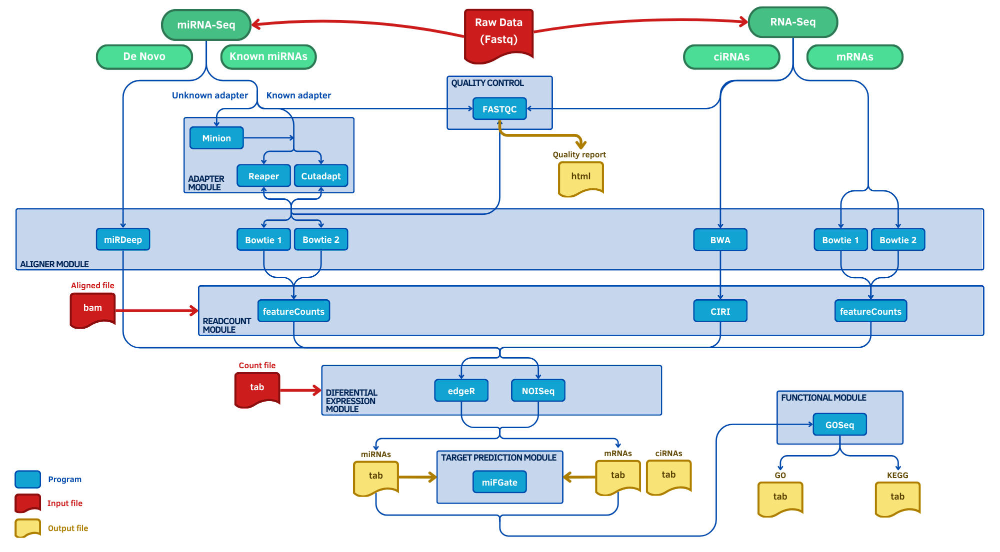

<p align="center">
  
</p>

<div align="center">
  <h1 style="color: #3a8eee">Sistema Inteligente y Reproducible para la Generación de Informes Bioinformáticos</h1>
  <h2 style="color: #4EA4D9">Guía de Usuario para el Análisis Metagenómico de Amplicones (16S/18S/ITS)</h2>

  <hr style="border:none; height:0.3px; background-color:#777; width:65%; margin:30px auto 35px auto;">

  <p>
    <a href="https://www.r-project.org/"></a>
    <a href="https://rmarkdown.rstudio.com/"></a>
    <a href="https://shiny.rstudio.com/"></a>
    <a href="https://quarto.org/"></a>
    <a href="https://www.python.org/"></a>
    <a href="https://spacy.io/"></a>
    <a href="https://jupyter.org/"></a>
    <a href="https://www.w3.org/html/"></a>
    <a href="https://www.w3.org/Style/CSS/"></a>
    <a href="https://www.javascript.com/"></a>
    <a href="https://www.d3js.org/"></a>
    <a href="https://www.nextflow.io/"></a>
    <a href="https://www.bioconductor.org/"></a>
    <a href="https://docs.conda.io/en/latest/"></a>
    <a href="https://www.docker.com/"></a>
    <a href="https://apptainer.org/"></a>
    <a href="https://www.markdownguide.org/"></a>
    <a href="https://git-scm.com/"></a>
    <a href="https://github.com/adrichez/GenoScribe"></a>
    <a href="https://www.latex-project.org/"></a>
  </p>

  <p>
    <a href="#section-1">Introducción</a> • 
    <a href="#section-2">Requisitos</a> • 
    <a href="#section-3">Workflow</a> • 
    <a href="#section-4">Descarga</a> • 
    <a href="#section-5">Métodos</a> • 
    <a href="#section-6">Parámetros</a> • 
    <a href="#section-7">Estructura</a> • 
    <a href="#section-8">Pipeline</a> • 
    <a href="#section-8">Informe</a> • 
    <a href="#section-10">Comentarios</a> • 
    <a href="#section-11">Contacto</a>
  </p>
</div>


<br>
<br>


<h2 id="section-1">1. 📖 Introducción y contexto</h2> 

El presente documento constituye la **guía de usuario** para el análisis de datos de **Metagenómica de Amplicones (Targeted)** dentro del sistema **GenoScribe**.  

En él se explican los pasos, parámetros y consideraciones necesarias para ejecutar este tipo de análisis, desde la **descarga del proyecto** y la **construcción del contenedor**, hasta la **ejecución del pipeline** y la **generación del informe bioinformático final**.  

A diferencia de otras guías técnicas, el objetivo aquí no es solo indicar qué comandos ejecutar, sino también **ofrecer un marco conceptual y práctico** que permita comprender el valor del análisis taxonómico y de los informes de diversidad generados.


<br>


<h3 id="section-1.1">1.1. 🧬 ¿Qué es la Metagenómica?</h3>  

La **Metagenómica** es el campo de estudio que analiza el material genético recuperado directamente de muestras ambientales o biológicas. A diferencia de los estudios clásicos de microbiología, que requieren **aislar y cultivar cada organismo individualmente**, la metagenómica permite estudiar a las comunidades microbianas en su contexto natural, ofreciendo un **perfil integral** de los microorganismos que conviven en ese entorno (el **microbioma**).

Esto significa que podemos identificar **qué especies están presentes**, en qué proporción y, dependiendo de la técnica, qué capacidades funcionales podrían tener. La metagenómica es especialmente útil para estudiar **microbios difíciles o imposibles de cultivar en laboratorio**, lo que ha revolucionado áreas como la salud humana, la ecología y la biotecnología.

🔹 **Aplicaciones principales de la Metagenómica:**

* 📊 **Comparación de comunidades microbianas** entre condiciones diferentes (ej. microbiota de individuos sanos vs. enfermos, suelos tratados vs. no tratados).
* 🔍 **Detección de cambios en abundancia**, permitiendo identificar qué microorganismos proliferan o desaparecen ante un estímulo.
* 🌱 **Evaluación de la diversidad y ecología microbiana**, ayudando a entender la complejidad y estabilidad de un ecosistema.
* 💡 **Identificación de biomarcadores clínicos**, como bacterias específicas asociadas a una enfermedad o respuesta a fármacos.

En resumen, la metagenómica nos permite mirar un **universo completo de microorganismos** dentro de una muestra. Sin embargo, para abordar este estudio, existen principalmente **dos estrategias tecnológicas** distintas según la profundidad y el objetivo del análisis: la secuenciación de **Amplicones** y la secuenciación **Shotgun**.


<br>


<h3 id="section-1.2">1.2. 🏷️ ¿Qué es la Metagenómica de Amplicones?</h3>

La **Metagenómica de Amplicones (Targeted)** es una estrategia específica dentro de la metagenómica que se centra en secuenciar únicamente un **gen marcador concreto**, utilizado como identificador taxonómico.

En lugar de analizar todo el ADN presente en la muestra, esta técnica amplifica por PCR una región genética conservada que actúa como un “código de barras biológico”, permitiendo determinar **qué organismos están presentes y en qué proporción** (abundancia relativa).

🔹 **Genes marcadores más utilizados:**

* **Bacterias y Arqueas:** gen **16S rRNA**
* **Hongos:** región **ITS** (Internal Transcribed Spacer)
* **Eucariotas:** gen **18S rRNA**

🔹 **¿Qué información proporciona?**

* Identificación taxonómica (generalmente hasta nivel de género o especie)
* Comparación de abundancias relativas entre muestras
* Análisis de diversidad alfa y beta

🔹 **Ventajas principales:**

* Técnica **económica y eficiente**
* Requiere menor profundidad de secuenciación
* Funciona bien en muestras con bajo contenido microbiano o alta contaminación de ADN del huésped

🔹 **Limitaciones:**

* No permite analizar el genoma completo
* La función metabólica solo puede inferirse, no medirse directamente
* No detecta virus ni plásmidos de forma fiable

Esta es la estrategia abordada en la presente guía.


<br>


<h3 id="section-1.3">1.3. 🔍 Metagenómica Shotgun vs de Amplicones</h3>  

Dentro del campo de la metagenómica existen dos estrategias principales de análisis: la **Metagenómica de Amplicones (Targeted)** y la **Metagenómica Shotgun (Whole Genome Sequencing, WGS)**.  

Ambas permiten estudiar comunidades microbianas completas, pero difieren en la **profundidad del análisis**, el **tipo de información obtenida** y las **preguntas biológicas que pueden responder**.


<hr style="border:none; height:1.5px; background-color:#777; width:100%; margin:35px 0 20px 0;">

<h4 id="section-1.3.1">1.3.1. 🏷️ Metagenómica de Amplicones</h4>

La metagenómica de amplicones se basa en la secuenciación de **genes marcadores específicos** (por ejemplo 16S para bacterias, ITS para hongos o 18S para eucariotas).  
Esto permite identificar los organismos presentes y estimar su **abundancia relativa** dentro de la comunidad.  

Este enfoque es robusto, económico y eficiente cuando el objetivo principal es caracterizar **quién está presente** y la diversidad taxonómica de la muestra.  
Su principal limitación es que no permite acceder al **contenido funcional real del microbioma**, y la resolución está limitada a niveles de género o especie, sin distinguir cepas o variantes genéticas completas.


<hr style="border:none; height:1.5px; background-color:#777; width:100%; margin:35px 0 20px 0;">

<h4 id="section-1.3.2">1.3.2. 🧩 Metagenómica Shotgun (WGS)</h4>

La metagenómica Shotgun secuencia **todo el ADN presente en la muestra**, sin seleccionar genes específicos.  
Esto proporciona información **taxonómica de alta resolución** (incluso a nivel de cepa) y permite acceder directamente al **potencial funcional del microbioma**, incluyendo rutas metabólicas, genes de resistencia a antibióticos, factores de virulencia, virus y plásmidos.  

Es ideal cuando se desea un **perfil completo del ecosistema microbiano**, pero implica mayor complejidad experimental y analítica, mayor coste y necesidad de profundidad de secuenciación para cubrir todo el genoma.


<hr style="border:none; height:1.5px; background-color:#777; width:100%; margin:35px 0 20px 0;">

<h4 id="section-1.3.3">1.3.3. ⚡️ Resumen</h4>

La siguiente tabla compara las características clave de ambos enfoques:

| Característica       | Shotgun (WGS)                            | Amplicones (Esta guía)        |
| -------------------- | ---------------------------------------- | ----------------------------- |
| **Objetivo**         | Taxonomía + Función (¿Qué pueden hacer?) | Taxonomía (¿Quién está?)      |
| **Genes analizados** | Genoma completo                          | Solo marcadores (16S/ITS/18S) |
| **Costo**            | Alto 💰💰💰                              | Bajo 💰                       |
| **Resolución**       | Cepa / Variedad                          | Género / Especie              |
| **Virus/Plásmidos**  | Detectables                              | No detectables                |

Esta guía se centra exclusivamente en la **metagenómica de amplicones**, por lo que el pipeline y el informe generado están diseñados para analizar **la composición taxonómica y la diversidad microbiana**, sin abordar directamente el potencial funcional completo del microbioma.


<br>


<h3 id="section-1.4">1.4. ❓ Ejemplo de preguntas biológicas</h3>  

Un investigador puede plantear cuestiones ecológicas y clínicas como:

👉 *“¿Disminuye la diversidad bacteriana (Diversidad Alfa) en el intestino tras el uso de antibióticos?”*

O también:

👉 *“¿Existen familias de hongos (ITS) o bacterias (16S) específicas que actúen como marcadores diferenciales en suelos de cultivo ecológico frente a intensivo?”*

Con **Metagenómica de Amplicones** es posible obtener respuestas a este tipo de preguntas mediante:

* La **creación de tablas de abundancia** (OTUs o ASVs) que cuantifican cuántas veces aparece cada microbio.
* El **análisis de coordenadas principales (PCoA)** para visualizar si las muestras se agrupan por condición (ej. Tratamiento vs Control).
* La **estadística diferencial** para detectar qué géneros o familias son responsables de las diferencias observadas entre grupos.
* El **estudio de la disbiosis**, evaluando si hay un desequilibrio en la estructura normal de la comunidad microbiana.

En conjunto, este análisis ofrece una visión sólida de la **estructura y dinámica de la comunidad**, siendo la herramienta fundamental para entender las interacciones ecológicas y los cambios en la composición del microbioma.


<br>


<h3 id="section-1.4">1.4. 🎯 Objetivo de esta guía</h3>  

El propósito de esta guía no es únicamente mostrar cómo ejecutar el pipeline, sino sobre todo:  

1. 📂 **Centralizar** los datos obtenidos o generados por herramientas bioinformáticas.  
2. 📝 **Transformar** esos resultados en un **informe automatizado, claro y reproducible**.  
3. 👩‍🔬 **Facilitar la comprensión** de los resultados para investigadores sin necesidad de explorar manualmente cada archivo de salida.  
4. 🌐 **Mejorar la comunicación científica**, generando informes listos para ser **compartidos en equipos de investigación, colaboraciones o incluso publicaciones**.  


<br>


<h3 id="section-1.5">1.5. ✨ Valor añadido de GenoScribe</h3>  

Uno de los principales retos de los análisis bioinformáticos es que los resultados suelen presentarse en **archivos dispersos, de difícil lectura** o poco intuitivos para investigadores no especializados en programación.  

⚡️ Aquí es donde **GenoScribe marca la diferencia**:  
- Genera **informes interactivos** con gráficos, tablas y resúmenes claros.  
- Permite **reproducibilidad**: cualquier investigador puede volver a ejecutar el análisis con los mismos parámetros y obtener el mismo informe.  
- Hace que la **bioinformática sea más accesible**, transformando datos complejos en **conocimiento visual y compartible**.  

> [!NOTE]
> **En resumen:** GenoScribe no solo ejecuta análisis, sino que **traduce la complejidad en información útil y comunicable**.


<br>
<br>


<h2 id="section-2">2. 📂 Proyecto en GitHub y requisitos</h2>

El proyecto **GenoScribe** está publicado en GitHub y se organiza de forma modular para separar:  
- la **interfaz gráfica de usuario** (app Shiny),  
- los **pipelines de análisis** (Nextflow + Quarto),  
- los **entornos reproducibles** (Docker / Apptainer),  
- los **scripts de ejecución**,
- los **informes de ejemplo**,
- y la **documentación**. 

Esta organización permite que cada tipo de análisis **(Transcriptómica, Metagenómica, Metatranscriptómica, etc.)** y sus subtipos, dispongan de su propia carpeta con todo lo necesario para ser ejecutado, mantenido y extendido de manera independiente.


<br>


<h3 id="section-2.1">2.1. 🏗️ Estructura global del repositorio</h3>

```plaintext
GenoScribe         # Directorio principal del proyecto
├── 01-app         # App Shiny e interfaz web
├── 02-pipelines   # Pipelines bioinformáticos
├── 03-containers  # Definición de entornos reproducibles (Docker / Apptainer)
├── 04-launch      # Scripts de ejecución (local, contenedor, HPC/cloud)
├── 05-examples    # Estructuras base e informes de ejemplo
├── 06-info        # Documentación técnica y especificaciones
└── README.md      # Guía general del proyecto
```

Cada directorio tiene un rol específico y está descrito con mayor detalle en el [README](../README.md) general.


<br>


<h3 id="section-2.2">2.2. 🧬 Carpeta específica del pipeline de Single-Cell RNA-Seq</h3>

El pipeline para este tipo de análisis se encuentra en [GenoScribe/02-pipelines/02-metagenomics/02-amplicon](../02-pipelines/02-metagenomics/02-amplicon).

Dentro de esta carpeta se incluyen todos los recursos necesarios para ejecutar el análisis y generar informes Quarto:

```plaintext
02-amplicon
├── _quarto.yml
├── index_en.qmd
├── index_es.qmd
├── main.nf
├── nextflow.config
├── params.yml
├── report
├── resources
│   ├── 01-essential
│   │   ├── 01-images
│   │   │   ├── icons
│   │   │   │   ├── bot_blue.png
│   │   │   │   ├── bot_white.png
│   │   │   │   ├── favicon_form.ico
│   │   │   │   ├── favicon_form.svg
│   │   │   │   ├── favicon.ico
│   │   │   │   ├── favicon.svg
│   │   │   │   └── ipbln.png
│   │   │   ├── tab0-inicio
│   │   │   │   ├── metagenomics_amplicon_cover_report.mp4
│   │   │   │   └── metagenomics_amplicon_cover_report.png
│   │   │   ├── tab1-metodologia
│   │   │   │   ├── miARma_Seq_workflow.png
│   │   │   │   └── qiime2_workflow.png
│   │   │   ├── tab2-resumen
│   │   │   │   ├── tab2-1-resumen-16S
│   │   │   │   ├── tab2-2-resumen-18S
│   │   │   │   └── tab2-3-resumen-ITS
│   │   │   └── tab3-analisis
│   │   │       ├── tab3-1-analisis-16S
│   │   │       ├── tab3-2-analisis-18S
│   │   │       └── tab3-3-analisis-ITS
│   │   ├── 02-archives
│   │   │   ├── 01-fixed
│   │   │   │   ├── tab0-inicio
│   │   │   │   ├── tab1-metodologia
│   │   │   │   ├── tab2-resumen
│   │   │   │   │   ├── tab2-1-resumen-16S
│   │   │   │   │   ├── tab2-2-resumen-18S
│   │   │   │   │   └── tab2-3-resumen-ITS
│   │   │   │   └── tab3-analisis
│   │   │   │       ├── tab3-1-analisis-16S
│   │   │   │       ├── tab3-2-analisis-18S
│   │   │   │       └── tab3-3-analisis-ITS
│   │   │   └── 02-tmp
│   │   │       ├── tab0-inicio
│   │   │       ├── tab1-metodologia
│   │   │       ├── tab2-resumen
│   │   │       │   ├── tab2-1-resumen-16S
│   │   │       │   ├── tab2-2-resumen-18S
│   │   │       │   └── tab2-3-resumen-ITS
│   │   │       └── tab3-analisis
│   │   │           ├── tab3-1-analisis-16S
│   │   │           ├── tab3-2-analisis-18S
│   │   │           └── tab3-3-analisis-ITS
│   │   └── 03-scripts
│   │       ├── 01-r
│   │       │   ├── 01-sections-code
│   │       │   └── 02-nextflow-code
│   │       ├── 02-quarto
│   │       │   ├── 01-spanish-language
│   │       │   │   ├── 01-full-version
│   │       │   │   │   ├── tab1-metodologia
│   │       │   │   │   │   └── metodologia.qmd
│   │       │   │   │   ├── tab2-resumen
│   │       │   │   │   │   ├── tab2-1-resumen-16S
│   │       │   │   │   │   │   └── resumen.qmd
│   │       │   │   │   │   ├── tab2-2-resumen-18S
│   │       │   │   │   │   │   └── resumen.qmd
│   │       │   │   │   │   └── tab2-3-resumen-ITS
│   │       │   │   │   │       └── resumen.qmd
│   │       │   │   │   └── tab3-analisis
│   │       │   │   │       ├── tab3-1-analisis-16S
│   │       │   │   │       │   ├── 00-contexto.qmd
│   │       │   │   │       │   ├── 01-revision-inicial.qmd
│   │       │   │   │       │   ├── 02-control-calidad.qmd
│   │       │   │   │       │   ├── 03-generacion-asvs.qmd
│   │       │   │   │       │   ├── 04-taxonomia-filogenia.qmd
│   │       │   │   │       │   ├── 05-analisis-diferencial.qmd
│   │       │   │   │       │   ├── 06-diversidad-microbiana.qmd
│   │       │   │   │       │   ├── 07-prediccion-funcional.qmd
│   │       │   │   │       │   └── 08-conclusiones.qmd
│   │       │   │   │       ├── tab3-2-analisis-18S
│   │       │   │   │       │   ├── 00-contexto.qmd
│   │       │   │   │       │   ├── 01-revision-inicial.qmd
│   │       │   │   │       │   ├── 02-control-calidad.qmd
│   │       │   │   │       │   ├── 03-generacion-asvs.qmd
│   │       │   │   │       │   ├── 04-taxonomia-filogenia.qmd
│   │       │   │   │       │   ├── 05-analisis-diferencial.qmd
│   │       │   │   │       │   ├── 06-diversidad-microbiana.qmd
│   │       │   │   │       │   ├── 07-prediccion-funcional.qmd
│   │       │   │   │       │   └── 08-conclusiones.qmd
│   │       │   │   │       └── tab3-3-analisis-ITS
│   │       │   │   │           ├── 00-contexto.qmd
│   │       │   │   │           ├── 01-revision-inicial.qmd
│   │       │   │   │           ├── 02-control-calidad.qmd
│   │       │   │   │           ├── 03-generacion-asvs.qmd
│   │       │   │   │           ├── 04-taxonomia-filogenia.qmd
│   │       │   │   │           ├── 05-analisis-diferencial.qmd
│   │       │   │   │           ├── 06-diversidad-microbiana.qmd
│   │       │   │   │           ├── 07-prediccion-funcional.qmd
│   │       │   │   │           └── 08-conclusiones.qmd
│   │       │   │   └── 02-compact-version
│   │       │   │       ├── tab2-resumen
│   │       │   │       │   ├── tab2-1-resumen-16S
│   │       │   │       │   │   └── resumen.qmd
│   │       │   │       │   ├── tab2-2-resumen-18S
│   │       │   │       │   │   └── resumen.qmd
│   │       │   │       │   └── tab2-3-resumen-ITS
│   │       │   │       │       └── resumen.qmd
│   │       │   │       └── tab3-analisis
│   │       │   │           ├── tab3-1-analisis-16S
│   │       │   │           │   ├── 00-contexto.qmd
│   │       │   │           │   ├── 01-revision-inicial.qmd
│   │       │   │           │   ├── 02-control-calidad.qmd
│   │       │   │           │   ├── 03-generacion-asvs.qmd
│   │       │   │           │   ├── 04-taxonomia-filogenia.qmd
│   │       │   │           │   ├── 05-analisis-diferencial.qmd
│   │       │   │           │   ├── 06-diversidad-microbiana.qmd
│   │       │   │           │   ├── 07-prediccion-funcional.qmd
│   │       │   │           │   └── 08-conclusiones.qmd
│   │       │   │           ├── tab3-2-analisis-18S
│   │       │   │           │   ├── 00-contexto.qmd
│   │       │   │           │   ├── 01-revision-inicial.qmd
│   │       │   │           │   ├── 02-control-calidad.qmd
│   │       │   │           │   ├── 03-generacion-asvs.qmd
│   │       │   │           │   ├── 04-taxonomia-filogenia.qmd
│   │       │   │           │   ├── 05-analisis-diferencial.qmd
│   │       │   │           │   ├── 06-diversidad-microbiana.qmd
│   │       │   │           │   ├── 07-prediccion-funcional.qmd
│   │       │   │           │   └── 08-conclusiones.qmd
│   │       │   │           └── tab3-3-analisis-ITS
│   │       │   │               ├── 00-contexto.qmd
│   │       │   │               ├── 01-revision-inicial.qmd
│   │       │   │               ├── 02-control-calidad.qmd
│   │       │   │               ├── 03-generacion-asvs.qmd
│   │       │   │               ├── 04-taxonomia-filogenia.qmd
│   │       │   │               ├── 05-analisis-diferencial.qmd
│   │       │   │               ├── 06-diversidad-microbiana.qmd
│   │       │   │               ├── 07-prediccion-funcional.qmd
│   │       │   │               └── 08-conclusiones.qmd
│   │       │   └── 02-english-language
│   │       │       ├── 01-full-version
│   │       │       │   ├── tab1-metodologia
│   │       │       │   │   └── metodologia.qmd
│   │       │       │   ├── tab2-resumen
│   │       │       │   │   ├── tab2-1-resumen-16S
│   │       │       │   │   │   └── resumen.qmd
│   │       │       │   │   ├── tab2-2-resumen-18S
│   │       │       │   │   │   └── resumen.qmd
│   │       │       │   │   └── tab2-3-resumen-ITS
│   │       │       │   │       └── resumen.qmd
│   │       │       │   └── tab3-analisis
│   │       │       │       ├── tab3-1-analisis-16S
│   │       │       │       │   ├── 00-contexto.qmd
│   │       │       │       │   ├── 01-revision-inicial.qmd
│   │       │       │       │   ├── 02-control-calidad.qmd
│   │       │       │       │   ├── 03-generacion-asvs.qmd
│   │       │       │       │   ├── 04-taxonomia-filogenia.qmd
│   │       │       │       │   ├── 05-analisis-diferencial.qmd
│   │       │       │       │   ├── 06-diversidad-microbiana.qmd
│   │       │       │       │   ├── 07-prediccion-funcional.qmd
│   │       │       │       │   └── 08-conclusiones.qmd
│   │       │       │       ├── tab3-2-analisis-18S
│   │       │       │       │   ├── 00-contexto.qmd
│   │       │       │       │   ├── 01-revision-inicial.qmd
│   │       │       │       │   ├── 02-control-calidad.qmd
│   │       │       │       │   ├── 03-generacion-asvs.qmd
│   │       │       │       │   ├── 04-taxonomia-filogenia.qmd
│   │       │       │       │   ├── 05-analisis-diferencial.qmd
│   │       │       │       │   ├── 06-diversidad-microbiana.qmd
│   │       │       │       │   ├── 07-prediccion-funcional.qmd
│   │       │       │       │   └── 08-conclusiones.qmd
│   │       │       │       └── tab3-3-analisis-ITS
│   │       │       │           ├── 00-contexto.qmd
│   │       │       │           ├── 01-revision-inicial.qmd
│   │       │       │           ├── 02-control-calidad.qmd
│   │       │       │           ├── 03-generacion-asvs.qmd
│   │       │       │           ├── 04-taxonomia-filogenia.qmd
│   │       │       │           ├── 05-analisis-diferencial.qmd
│   │       │       │           ├── 06-diversidad-microbiana.qmd
│   │       │       │           ├── 07-prediccion-funcional.qmd
│   │       │       │           └── 08-conclusiones.qmd
│   │       │       └── 02-compact-version
│   │       │           ├── tab2-resumen
│   │       │           │   ├── tab2-1-resumen-16S
│   │       │           │   │   └── resumen.qmd
│   │       │           │   ├── tab2-2-resumen-18S
│   │       │           │   │   └── resumen.qmd
│   │       │           │   └── tab2-3-resumen-ITS
│   │       │           │       └── resumen.qmd
│   │       │           └── tab3-analisis
│   │       │               ├── tab3-1-analisis-16S
│   │       │               │   ├── 00-contexto.qmd
│   │       │               │   ├── 01-revision-inicial.qmd
│   │       │               │   ├── 02-control-calidad.qmd
│   │       │               │   ├── 03-generacion-asvs.qmd
│   │       │               │   ├── 04-taxonomia-filogenia.qmd
│   │       │               │   ├── 05-analisis-diferencial.qmd
│   │       │               │   ├── 06-diversidad-microbiana.qmd
│   │       │               │   ├── 07-prediccion-funcional.qmd
│   │       │               │   └── 08-conclusiones.qmd
│   │       │               ├── tab3-2-analisis-18S
│   │       │               │   ├── 00-contexto.qmd
│   │       │               │   ├── 01-revision-inicial.qmd
│   │       │               │   ├── 02-control-calidad.qmd
│   │       │               │   ├── 03-generacion-asvs.qmd
│   │       │               │   ├── 04-taxonomia-filogenia.qmd
│   │       │               │   ├── 05-analisis-diferencial.qmd
│   │       │               │   ├── 06-diversidad-microbiana.qmd
│   │       │               │   ├── 07-prediccion-funcional.qmd
│   │       │               │   └── 08-conclusiones.qmd
│   │       │               └── tab3-3-analisis-ITS
│   │       │                   ├── 00-contexto.qmd
│   │       │                   ├── 01-revision-inicial.qmd
│   │       │                   ├── 02-control-calidad.qmd
│   │       │                   ├── 03-generacion-asvs.qmd
│   │       │                   ├── 04-taxonomia-filogenia.qmd
│   │       │                   ├── 05-analisis-diferencial.qmd
│   │       │                   ├── 06-diversidad-microbiana.qmd
│   │       │                   ├── 07-prediccion-funcional.qmd
│   │       │                   └── 08-conclusiones.qmd
│   │       ├── 03-css
│   │       │   └── styles.css
│   │       ├── 04-javascript
│   │       │   ├── chatbot.js
│   │       │   ├── embeddings_web_reduced.js
│   │       │   ├── english_responses.js
│   │       │   ├── script.js
│   │       │   └── spanish_responses.js
│   │       ├── 05-python
│   │       │   ├── html_tag_counter.ipynb
│   │       │   └── yaml_generator.py
│   │       └── 06-bash
│   │           └── run_report_server.sh
│   └── 02-nextflow-results
│       ├── 01-project-data
│       ├── 02-multiqc-report
│       └── 03-analisis-estadistico
├── run_cleaning_dir.sh
├── run_pipeline_shell.sh
└── run_pipeline_shiny.sh
```

Más en detalle, tenemos:

* **`main.nf`** **&rArr;** script principal de **Nextflow** que orquesta el pipeline de Bulk RNA-Seq.
* **`nextflow.config`** **&rArr;** configuración general de **Nextflow** (recursos, perfiles de ejecución, paths).
* **`params.yml`** **&rArr;** parámetros para este tipo de análisis específico (incluye rutas de entrada, metadatos y opciones clave).
* **`_quarto.yml`** **&rArr;** define la estructura del informe final generado con **Quarto**.
* **`index.qmd`** **&rArr;** documento principal de Quarto que incluye el contenido de la pestaña inicial del informe.
* **`report/`** **&rArr;** directorio donde se generará el informe HTML final.
* **`resources/`** **&rArr;** recursos organizados en:
  * `01-essential/` **&rArr;** imágenes (portada, iconos), scripts en R, Python y estilos CSS y demás plantillas Quarto el resto de pestañas.
  * `02-nextflow-results/` **&rArr;** directorios de salida de Nextflow (datos procesados, QC, estadísticos, copia de datos esenciales proporcionados por el usuario para la generación del informe).
* **(`run_pipeline_shell.sh` y `run_pipeline_shiny.sh`)** **&rArr;** permiten ejecutar el análisis directamente desde la terminal o integrarlo con la app Shiny con un simple comando.
* **`run_cleaning_dir.sh`** **&rArr;** script para limpiar los directorios de trabajo generados durante el análisis una vez finalizado si estos ya no son necesarios y así liberar espacio en disco.

📌 En paralelo, un ejemplo completo de este tipo de informe puede encontrarse en [GenoScribe/05-examples/02-reports/02-metagenomics/02-amplicon](../05-examples/02-reports/02-metagenomics/02-amplicon).

Todo informe generado tendría la siguiente estructura:

```plaintext
report
├── resources
├── site_libs
└── index.html
```

Donde:

- `resources/` contiene todos los recursos utilizados en el informe (imágenes, scripts, estilos, etc.).
- `site_libs/` incluye las bibliotecas necesarias para el correcto funcionamiento del informe.
- `index.html` es el informe final generado por Quarto (abrir esto en el navegador).

Adicionalmente, como se ha mencionado en el `README.md` general del proyecto, cada informe tiene incorporado un **Mini Chatbot RAG (Recuperación Augmentada por IA)** que permite al usuario interactuar y hacer preguntas relativas a la información contenida en el informe generado, además de disponer de información adicional sobre el sistema GenoScribe y temas relacionados con la bioinformática y el análisis de datos de secuenciación masiva.

Para que este Chatbot funcione correctamente, es necesario que el informe HTML se abra en un servidor local (necesario disponer de un entorno Python instalado), y para ello se ha diseñado un script específico llamado `run_report_server.sh` que se encuentra en `resources/01-essential/03-scripts/05-python/`, el cual puede lanzarse simplemente con doble clic o desde la terminal para iniciar un servidor local y abrir el informe en el navegador con todas sus funcionalidades activas (incluido el Chatbot).

El comando para ejecutar este script desde la terminal es:

```bash
cd resources/01-essential/03-scripts/05-python/
./run_report_server.sh
```

Y automáticamente abrirá el informe en el navegador predeterminado del sistema, con todas las funcionalidades activas.


<br>


<h3 id="section-2.3">2.3. ⚙️ Requisitos básicos</h3>

Antes de utilizar el sistema y ejecutar el pipeline de **Single-Cell RNA-Seq** asegúrese de contar con los siguientes elementos para garantizar un funcionamiento correcto y reproducible:

* 🐳 **Docker o Apptainer** **&rArr;** imprescindibles para construir y ejecutar los **contenedores** que incluyen la aplicación Shiny, los pipelines y todas las dependencias bioinformáticas.

  * **Docker** **&rarr;** recomendado para entornos de desarrollo, uso local y en la nube.
  * **Apptainer (antes Singularity)** **&rarr;** recomendado en clústeres HPC o entornos donde Docker no está permitido.

* 💻 **Terminal / Línea de comandos** **&rArr;** utilizada para lanzar los scripts y gestionar la ejecución de los contenedores.

  * Compatible con **macOS, Linux y Windows**.
  * En Windows se recomienda **WSL2 (Windows Subsystem for Linux)**, **Git Bash** o **PowerShell** con soporte adecuado para contenedores.

* 🌐 **Navegador web moderno** **&rArr;** necesario para explorar los **informes HTML interactivos** o la interfaz gráfica para el **formulario interactivo** (en el caso de sque se decida usar):

  * Se recomienda **Google Chrome** o **Firefox**.
  * Safari y Edge son compatibles pero pueden presentar limitaciones con algunos gráficos **D3.js** o en la visualización de algunos archivos incrustados.

* 📶 **Conexión a internet** **&rArr;** (opcional) necesaria si:

  * Desea descargar datos de referencia o bases externas durante la ejecución de un pipeline (normalmente no será necesario ya que esto se hace antes de generar el informe).
  * Si quiere descargar o actualizar imágenes de contenedores.
  * El sistema también puede ejecutarse **100% offline** si ya cuenta con los recursos necesarios preinstalados.

* 💾 **Recursos mínimos recomendados** **&rArr;** para un uso fluido en los análisis típicos tratados:

  * **RAM**: ≥ ideal ≥ 8 GB.
  * **CPU**: ≥ 4 núcleos.
  * **Almacenamiento**: ≥ 30 GB libres (la imagen del contenedor pesa unos 16 GB para la versión en docker y unos 4 GB para el archivo `.sif` de Apptainer).

> [!NOTE]
> Con estos requisitos cumplidos, la instalación y ejecución del sistema es directa y garantiza que todos los elementos interactivos de los informes funcionen de manera correcta y reproducible.


<br>
<br>


<h2 id="section-3">3. 🔄 Workflow del análisis</h2>

El **workflow de GenoScribe** describe el recorrido completo desde la preparación de los datos hasta la obtención del informe interactivo final. Incluye decisiones clave como el **entorno de ejecución**, el uso de **contenedores** y la elección de la **interfaz de usuario**.


<br>


<h3 id="section-3.1">3.1. 📝 Diagrama general</h3>

El siguiente **diagrama de flujo esquemático** representa las rutas disponibles para ejecutar GenoScribe (centrándonos en el **pipeline de Metagenómica**):

<p align="center">
  
</p>

<br>

**🗒️ Recorrido resumido:**

* 💻 **Ejecución en PC:**  

  * Directamente en el **ordenador** o dentro de un **contenedor** (recomendado).
  * Contenedores disponibles en **Docker** o **Apptainer**.
  * Interacción mediante **terminal (CLI, Shell)** o **interfaz gráfica (GUI, Shiny)**.

* 🖥️ **Ejecución en HPC / Nube:**  

  * Mediante un **cluster** o dentro de un **contenedor** (recomendado).
  * Contenedores disponibles en **Docker** o **Apptainer** (este último más común en HPC y recomendado).
  * Interacción mediante **terminal (CLI, Shell)** o **interfaz gráfica (GUI, Shiny)**.

> [!TIP]
> **Consejo:** Ejecutar siempre dentro de un **contenedor** garantiza **reproducibilidad**, aislamiento de dependencias y facilita la gestión. La ejecución directa (sin contenedor) se recomienda solo para pruebas o debugging.
> En HPC/Cloud pueden requerirse pasos adicionales, como cargar **módulos del sistema** o configurar variables de entorno, para asegurar que todas las dependencias estén disponibles.

Una vez que el usuario ha definido el entorno de ejecución de **GenoScribe** (local o clúster) y ha decidido si emplear o no la tecnología de contenedores, el siguiente paso es proporcionar los **parámetros de configuración** que orquestarán el análisis. Esta interacción puede llevarse a cabo a través de dos interfaces distintas:

* 🖥️ **Interfaz Gráfica (GUI, Shiny) &rArr;** Un entorno visual, guiado e intuitivo, ideal para usuarios menos experimentados, aunque con un despliegue ligeramente más lento.
* 💻 **Interfaz de Línea de Comandos (CLI, Shell) &rArr;** Una ejecución directa mediante consola, mucho más rápida, ligera y perfecta para la automatización en servidores.

Tras acceder a la interfaz deseada, la arquitectura modular de GenoScribe requiere que el usuario navegue por un proceso de selección en dos niveles. Primero, se selecciona la **Categoría Ómica** principal y, a continuación, el **Tipo de Análisis** específico:

🧬 **1. Transcriptómica**
  * 📊 **1.1. Bulk RNA-Seq &rArr;** Analiza la expresión génica promediada de un tejido o población celular completa, proporcionando una visión global de los cambios transcripcionales.
  * 🧫 **1.2. Single-Cell RNA-Seq (scRNA-Seq) &rArr;** Disecciona la expresión a nivel de célula individual, revelando la heterogeneidad oculta, subpoblaciones raras y dinámicas de linaje.
  * 📍 **1.3. Spatial Transcriptomics (ST-RNA-Seq) &rArr;** Integra los perfiles de expresión génica con la arquitectura histológica, mapeando exactamente en qué coordenada física del tejido ocurre cada proceso molecular.

🦠 **2. Metagenómica**
  * 🧩 **2.1. Shotgun Metagenomics &rArr;** Secuencia todo el ADN genómico presente en una muestra ambiental o clínica, perfilando tanto la taxonomía completa como el potencial funcional de la comunidad.
  * 🏷️ **2.2. Amplicones (16S/18S/ITS) &rArr;** Secuenciación dirigida exclusivamente a genes marcadores, ideal para realizar censos taxonómicos eficientes de bacterias, arqueas o ecosistemas fúngicos.

🔬 **3. Metatranscriptómica**
  * 🧪 **3.1. Shotgun Metatranscriptomics &rArr;** Captura el ARN mensajero de una comunidad microbiana, revelando no solo "quién está ahí", sino "qué genes están expresando activamente" en respuesta a su entorno.

Una vez definida esta ruta (ej. *Metagenómica > Amplicones*), el sistema desplegará el formulario correspondiente para configurar los parámetros biológicos y técnicos de ese *pipeline* en concreto. La ejecución culminará con la **generación de un informe HTML interactivo**, unificado y listo para su exploración.

<br>

**🧑‍🏫 Resumen conceptual del workflow actualizado:**

1. Preparación y validación de los **datos de entrada** (crudos o procesados).
2. Elección del **entorno de ejecución** (Estación de trabajo local vs. Servidor/HPC).
3. Decisión sobre el uso de **contenedores** (Docker/Apptainer) o entorno nativo.
4. Selección de la **interfaz de control** (GUI Shiny interactiva o CLI automatizada).
5. Selección de la **Categoría Ómica** (Transcriptómica, Metagenómica o Metatranscriptómica).
6. Elección del **Pipeline Específico** (Bulk, scRNA, Shotgun, Amplicones, etc.).
7. Configuración de **parámetros analíticos** y lanzamiento del módulo.
8. Obtención del **informe HTML interactivo** final.


<br>


<h3 id="section-3.2">3.2. 📐 Pasos resumidos</h3>

Para adaptarse a las distintas necesidades y entornos de trabajo, **GenoScribe** ofrece tres modalidades de ejecución principales empleando contenedores (garantizando así la máxima reproducibilidad computacional). Antes de comenzar a detallar cada flujo, estas son las opciones disponibles:

1. **🖼️ Interfaz Gráfica Interactiva (GUI, Shiny):** Ideal para usuarios que prefieren un entorno visual y amigable en el navegador web.
2. **🖥️ Interfaz de Terminal Interactiva (CLI Formulario):** Perfecta para trabajar rápidamente desde la consola mediante un menú guiado paso a paso.
3. **⚙️ Interfaz de Terminal Directa (CLI Directo):** Diseñada para entornos de supercomputación (HPC), permitiendo lanzar el proceso de forma desatendida mediante argumentos, ideal para gestores de colas como SLURM.

A continuación, se detalla el esquema lógico paso a paso de cada una de ellas:


<br>

**1. 🖼️ Interfaz gráfica interactiva (GUI, Shiny)**

Este flujo muestra la ejecución típica del sistema empleando la **interfaz gráfica web de Shiny** para rellenar el formulario de parámetros:

```ascii
→ Descargar repositorio GenoScribe desde GitHub.
   → Construir o descargar la imagen y contenedor (Docker/Apptainer).
   → Ejecutar el script "04-launch/02-docker/run_app_shiny_form.sh" o "04-launch/03-apptainer/run_app_shiny_form.sh".
   → Se despliega el servidor Shiny y se expone en el puerto 3838.
   → Acceder a la interfaz web a través del navegador local (localhost:3838).
   → Seleccionar de forma visual el tipo de análisis a reportar.
   → Rellenar las cajas de texto y menús desplegables con los parámetros del proyecto.
   → Pulsar el botón de ejecución para que Shiny lance el pipeline de Nextflow subyacente.
   → Se generan los outputs estadísticos y el informe HTML interactivo.
   → Acceder, descargar y explorar el informe final.
```


<br>

**2. 🖥️ Interfaz de terminal interactiva (CLI, Shell Formulario)**

Si se prefiere prescindir del navegador web pero se desea mantener una **guía paso a paso**, este flujo interactivo en consola es la opción adecuada:

```ascii
→ Descargar repositorio GenoScribe desde GitHub.
   → Construir o descargar la imagen y contenedor (Docker/Apptainer).
   → Ejecutar el script "04-launch/02-docker/run_app_shell_form.sh" o "04-launch/03-apptainer/run_app_shell_form.sh".
   → Se despliega un menú interactivo directamente en la terminal de comandos.
   → Seleccionar numéricamente el tipo de análisis deseado.
   → Introducir los parámetros solicitados por pantalla (rutas, nombres, versiones).
   → Al finalizar el cuestionario, el script lanza automáticamente el pipeline de Nextflow.
   → Se generan los outputs estadísticos y el informe HTML interactivo.
   → Acceder y explorar el informe final en el directorio del proyecto.
```


<br>

**3. ⚙️ Interfaz de terminal directa (CLI, Shell Directo)**

Esta es la modalidad más robusta y automatizable. En lugar de responder a un formulario interactivo, todos los parámetros se proporcionan de una sola vez mediante banderas (*flags*) en la misma línea de ejecución. Esto permite **integrar GenoScribe en scripts de envío (`sbatch`)** y delegar su ejecución al gestor de colas del clúster (ej. SLURM), optimizando los recursos y permitiendo configurar alertas automáticas (ej. correos al finalizar el trabajo).

```ascii
→ Descargar repositorio GenoScribe desde GitHub.
   → Construir o descargar la imagen y contenedor (Docker/Apptainer).
   → Preparar un script de envío para el clúster (sbatch) o abrir la terminal.
   → Ejecutar "run_app_shell_direct.sh" pasando los parámetros con banderas (ej. -oc 1 -at 1 -pp /ruta...).
   → El script valida los argumentos silenciosamente sin requerir interacción humana (modo desatendido).
   → El sistema inyecta las variables y lanza el pipeline de Nextflow de forma nativa.
   → Se generan los outputs estadísticos y el informe HTML interactivo en segundo plano.
   → El gestor de colas finaliza el trabajo (y opcionalmente notifica al usuario).
   → Acceder y explorar el informe final en el directorio del proyecto.
```

Estos esquemas permiten **visualizar rápidamente** la secuencia completa de pasos, ayudando a seleccionar la modalidad que mejor se adapte a su infraestructura (ordenador personal, servidor interactivo o nodo de computación HPC).


<br>


<h3 id="section-3.3">3.3. 🎬 Demostración visual</h3>

El siguiente **GIF** ofrece una visión dinámica del flujo principal: inicio de la app Shiny, completado del formulario, selección del análisis y ejecución del pipeline dentro del contenedor. El proceso finaliza con la **generación automática del informe HTML interactivo** y su exploración en el navegador.

<p align="center">
  
</p>

> [!NOTE]
> Este GIF es una **guía visual rápida** y no muestra todos los pasos intermedios ni outputs secundarios. Para información completa, incluyendo **entradas, salidas y parámetros específicos**, continuar leyendo más adelante, donde se profundizará con más detalle en estos aspectos.


<br>
<br>


<h2 id="section-4">4. ⬇️ Descarga y preparación del entorno</h2>

Antes de ejecutar cualquier análisis con **GenoScribe**, es necesario obtener el repositorio completo y asegurarse de que todas las dependencias estén disponibles. Esta sección describe cómo **clonar o descargar el repositorio**, así como los pasos iniciales de preparación del entorno, tanto para usuarios que trabajen **en local** como aquellos que utilicen **HPC o la nube**.

El objetivo es que cualquier usuario pueda iniciar GenoScribe de manera rápida y reproducible, con un flujo de trabajo consistente y control sobre versiones y actualizaciones. Además, se facilita la construcción de contenedores **(Docker o Apptainer)**, que aseguran un entorno aislado y preconfigurado, evitando conflictos de dependencias y problemas de compatibilidad.

Dicho esto, comenzamos en el siguiente apartado comentando cómo obtener el código fuente del proyecto.


<br>


<h3 id="section-4.1">4.1. 🐙 Clonar o descargar el repositorio</h3>

Existen varias formas de obtener todo el código, pipelines y archivos necesarios para iniciar **GenoScribe**. Las dos opciones principales son:

* **🧑‍💻 Clonar con Git** **&rArr;** recomendado para usuarios habituales de Git y desarrolladores.
* **⬇️ Descargar ZIP desde GitHub** **&rArr;** opción sencilla para usuarios menos familiarizados con Git.

A continuación se detallan ambos métodos.


<hr style="border:none; height:1.5px; background-color:#777; width:100%; margin:35px 0 20px 0;">

<h4 id="section-4.1.1">4.1.1. 🧑‍💻 Clonar con Git (recomendado)</h4>

La opción más flexible y recomendable es **clonar el repositorio**, lo que permite mantenerlo actualizado fácilmente y gestionar versiones mediante `git pull`.

```bash
git clone https://github.com/adrichez/GenoScribe.git
cd GenoScribe
```

Una vez realizado esto, en el caso de que se quieran obtener también los archivos de ejemplo ubicados en la carpeta `05-examples/02-reports/`, se puede ejecutar el siguiente comando dentro del directorio clonado:

```bash
git lfs pull
```

Estos archivos se encuentran almacenados con **Git LFS (Large File Storage)** debido a su tamaño, por lo que es necesario tener instalado Git LFS previamente. Para más información sobre su instalación, consulte [https://git-lfs.github.com/](https://git-lfs.github.com/).

> [!NOTE]
> **Ventaja:** facilita actualizaciones y control de versiones, ideal para usuarios que planean ejecutar el sistema regularmente o integrar nuevas funcionalidades.


<hr style="border:none; height:1.5px; background-color:#555; width:100%; margin:35px 0 20px 0;">

<h4 id="section-4.1.2">4.1.2. ⬇️ Descargar ZIP desde GitHub</h4>

Para un uso puntual o en sistemas sin Git, se puede descargar el ZIP directamente:

1. Acceda a [https://github.com/adrichez/GenosSribe](https://github.com/adrichez/GenoScribe).
2. Pulse **Code &rArr; Download ZIP**.
3. Descomprime y accede a la carpeta desde la terminal.

> [!NOTE]
> Esta opción es más limitada para actualizaciones, pero útil para pruebas rápidas o entornos donde Git no está disponible. Además hay que tener en cuenta que mediante esta opción no se obtendrán los archivos grandes almacenados con Git LFS.


<br>


<h3 id="section-4.2">4.2. 🛠️ Instalación de dependencias</h3>

GenoScribe requiere diversas herramientas y librerías para ejecutar correctamente los pipelines y generar los informes interactivos. La instalación depende del **modo de ejecución** elegido: dentro de un contenedor **(Docker o Apptainer)** o directamente en el **sistema local sin contenedor**.


<hr style="border:none; height:1.5px; background-color:#777; width:100%; margin:35px 0 20px 0;">

<h4 id="section-4.2.1">4.2.1. 📦 Dentro de contenedor (Docker / Apptainer)</h4>

Si se ejecuta GenoScribe dentro de un contenedor, **todas las dependencias ya están preinstaladas**. Esto incluye:

* Nextflow para la ejecución de pipelines.
* R con paquetes necesarios para análisis y generación de informes (shiny, tidyverse, ggplot2, DT, plotly, entre otros).
* Python y librerías bioinformáticas como `pandas`, `numpy`, `scipy`, `scanpy`, `biopython`.
* Quarto CLI para renderizar informes HTML interactivos.
* MultiQC para resumen de calidad de secuencias.
* Miniconda/Mamba y entornos específicos para análisis (por ejemplo, `genoscribe` environment).

> [!NOTE]
> **Ventaja:** el contenedor garantiza un entorno reproducible y controlado, sin conflictos de dependencias. Esta es la opción **recomendada** para la ejecución de pipelines, tanto en local como en HPC o nube.


<hr style="border:none; height:1.5px; background-color:#777; width:100%; margin:35px 0 20px 0;">

<h4 id="section-4.2.2">4.2.2. 💻 Sin contenedor (local)</h4>

Ejecutar GenoScribe directamente en el sistema local requiere instalar manualmente todas las herramientas y librerías. Esto se puede deducir del **Dockerfile**, que lista los paquetes y dependencias necesarias:

* **Nextflow** **&rArr;** se instala con `curl -s https://get.nextflow.io | bash`.
* **R y RStudio** **&rArr;** incluyendo paquetes clave como `shiny`, `tidyverse`, `ggplot2`, `plotly`, `DT`, `dplyr`, `readxl`, `stringr`, `purrr`, `quarto`, `rmarkdown`, entre otros.
* **Python 3** y librerías bioinformáticas **&rArr;** `pandas`, `numpy`, `scipy`, `scanpy`, `biopython`.
* **Quarto CLI** **&rArr;** se descarga e instala desde [quarto.org](https://quarto.org).
* **Conda / Mamba** **&rArr;** para gestión de entornos y creación de entornos específicos (por ejemplo, `env_genoscribe.yml`).
* **Paquetes del sistema** **&rArr;** herramientas de compilación (`libssl-dev`, `libcurl4-openssl-dev`, `libxml2-dev`, `pkg-config`), Java (`openjdk-17-jre-headless`), utilidades (`curl`, `git`, `unzip`, `nano`, `less`).

> [!NOTE]
> Esta opción es más propensa a errores de instalación y conflictos de dependencias, y se recomienda principalmente **para depuración, desarrollo o pruebas rápidas**. Para análisis reproducibles y robustos, el uso de contenedores es siempre preferible.


<hr style="border:none; height:1.5px; background-color:#777; width:100%; margin:35px 0 20px 0;">

<h4 id="section-4.2.3">4.2.3. 📝 Resumen y recomendaciones</h4>

1. **Contenedor** **&rArr;** opción recomendada, ideal para producción, local/HPC/nube o ejecución repetida: reproducible, seguro y listo para usar.
2. **Local sin contenedor** **&rArr;** solo para pruebas, desarrollo o depuración: requiere instalación manual de todas las dependencias y configuración cuidadosa del entorno.

> [!TIP]
> **Consejo práctico:** aunque se ofrece la opción de ejecución local sin contenedor, **la instalación y mantenimiento de dependencias puede ser compleja**. Construir y ejecutar el contenedor simplifica enormemente este proceso y asegura resultados consistentes.


<br>


<h3 id="section-4.3">4.3. 🏗️ Construcción del contenedor</h3>

GenoScribe puede ejecutarse en **Docker** o adaptarse a **Apptainer**. La lógica principal está planteada en Docker, pero se proporcionan instrucciones para convertir la imagen a Apptainer, ideal para entornos HPC.

Dicho esto, se comienza explicando cómo construir/obtener la imagen Docker, para luego detallar la conversión/obtención de la imagen Apptainer.


<hr style="border:none; height:1.5px; background-color:#777; width:100%; margin:35px 0 20px 0;">

<h4 id="section-4.3.1">4.3.1. 🐳 Contenedor Docker</h4>

En este caso, podemos optar por obtener la imagen de dos formas diferentes:

* **🛠️ Construir la imagen localmente** a partir del Dockerfile.
* **⬇️ Descargar una imagen preconstruida** desde Docker Hub (recomendado).

A continuación se detallan ambas opciones.


<br>

**🛠️ Construir imagen localmente:**

Para construir la imagen Docker desde el Dockerfile incluido en el repositorio, ejecute:

```bash
cd GenoScribe
docker build --no-cache -f 03-containers/02-docker/Dockerfile -t adrichez/genoscribe:latest .
```

Esto construirá la imagen con todas las dependencias necesarias y estará disponible localmente bajo la etiqueta `adrichez/genoscribe:latest` en su sistema Docker.


<br>

**⬇️ Descargar imagen preconstruida:**

Para evitar tiempos de construcción largos, puede descargar la imagen ya construida y alojada en Docker Hub:

```bash
docker pull adrichez/genoscribe:latest
```

Esto descargará la imagen directamente a su sistema Docker, lista para usarse.

Y así, una vez que se dispone de la imagen Docker, se puede proceder a ejecutar los scripts de lanzamiento que se describen en la siguiente sección.

> [!NOTE]
> Siempre es recomendable descargar la imagen preconstruida para evitar tiempos de construcción largos y asegurar que se cuenta con la versión más reciente y estable.


<hr style="border:none; height:1.5px; background-color:#777; width:100%; margin:35px 0 20px 0;">

<h4 id="section-4.3.2">4.3.2. 🛡️ Contenedor Apptainer</h4>

Dado que la lógica principal de GenoScribe está planteada en Docker, para crear la imagen Apptainer se debe **convertir la imagen Docker previamente construida o descargada**. Esto garantiza que ambas imágenes sean equivalentes en cuanto a dependencias y funcionalidad.

Esto lo podemos realizar de varias formas, algunas de ellas pueden ser:

* **🛠️ Construir la imagen Apptainer a partir de una imagen Docker local**: primero se debe haber construido la imagen Docker desde el Dockerfile incluido en el repositorio o tenerla descargada en el sistema. Esta opción requiere disponer de Docker, ya que Apptainer utilizará la imagen local para generar el contenedor `.sif`.

* **🔄 Convertir la imagen Docker desde Docker Hub a formato Apptainer**: Apptainer puede descargar directamente la imagen desde Docker Hub y crear la versión `.sif`, sin necesidad de tener Docker instalado localmente. Esta es la **opción recomendada**, sencilla y reproducible.

* **⬇️ Descargar una imagen Apptainer preconstruida**: se puede obtener directamente un contenedor `.sif` alojado en un servidor externo, por ejemplo **Mega**. Esta es la forma más rápida y simple, ideal para usuarios que solo quieran ejecutar GenoScribe sin construir imágenes.


A continuación se detallan estas tres opciones.


<br>

**🛠️ Construir Apptainer desde imagen Docker local:**

Para construir la imagen Apptainer a partir de una imagen Docker local, primero debe haber construido la imagen Docker desde el Dockerfile incluido en el repositorio exactamente como se ha indicado anteriormente:

```bash
cd GenoScribe
docker build --no-cache -f 03-containers/02-docker/Dockerfile -t adrichez/genoscribe:latest .
```

o bien, haber descargada previamente la imagen desde Docker Hub:

```bash
docker pull adrichez/genoscribe:latest
```

Una vez que la imagen Docker está disponible localmente, se puede generar la versión Apptainer `.sif` mediante:

```bash
cd GenoScribe/03-containers/03-apptainer
apptainer build genoscribe-lab.sif docker-daemon://adrichez/genoscribe:latest
```

Donde:

* `docker-daemon://` **&rArr;** indica que Apptainer tomará la imagen directamente desde el daemon de Docker local.
* `genoscribe-lab.sif` **&rArr;** será el contenedor Apptainer resultante, listo para ejecutarse en entornos HPC.

> [!NOTE]
> Esta opción requiere Docker instalado y en ejecución, pero garantiza que la imagen Apptainer sea idéntica a la Docker.


<br>

**🔄 Convertir imagen Docker desde Docker Hub:**

Si no se desea construir o tener Docker instalado localmente, Apptainer permite descargar directamente la imagen desde Docker Hub y convertirla en `.sif`:

```bash
cd GenoScribe/03-containers/03-apptainer
apptainer pull genoscribe-lab.sif docker://adrichez/genoscribe:latest
```

* No requiere Docker instalado ni ejecutándose en el sistema.
* Apptainer descargará la imagen desde Docker Hub y la convertirá automáticamente en `.sif`.
* Esta es la opción **recomendada** por su simplicidad y reproducibilidad.

> [!NOTE]
> Se necesita conexión a Internet y permisos de escritura en el directorio donde se generará `genoscribe-lab.sif`.


<br>

**⬇️ Descargar imagen Apptainer preconstruida:**

La forma más rápida de obtener el contenedor Apptainer es descargar directamente una imagen `.sif` ya construida desde un servidor externo. En este caso, la imagen está alojada en **Mega** y se puede descargar empleando la herramienta `megatools`, que permite obtener archivos directamente desde MEGA mediante línea de comandos.

Primero, instala `megatools` (si aún no está disponible en tu sistema) utilizando **Homebrew**:

```bash
brew install megatools
```

Una vez instalada la herramienta, descarga la imagen `.sif` con el siguiente comando:

```bash
cd GenoScribe/03-containers/03-apptainer
megadl "https://mega.nz/file/oVliDKQR#3bXVPKVuLtugL30WfUthMDf_AvQWxL4VXnIgWHt9-5Y"
```

Esto descargará automáticamente el archivo `genoscribe.sif` en el directorio actual.

Alternativamente, también se puede descargar manualmente desde el navegador web accediendo al siguiente enlace: 👉 **[https://mega.nz/file/oVliDKQR#3bXVPKVuLtugL30WfUthMDf_AvQWxL4VXnIgWHt9-5Y](https://mega.nz/file/oVliDKQR#3bXVPKVuLtugL30WfUthMDf_AvQWxL4VXnIgWHt9-5Y)** y después una vez descargado el archivo, ubicarlo en el directorio correspondiente (`cd GenoScribe/03-containers/03-apptainer`) para su posterior uso.

Así, algunas de las ventajas de esta opción son:

* No requiere Docker ni construcción local.
* Ideal para usuarios que solo quieren ejecutar GenoScribe sin preocuparse por la creación de imágenes.
* Recomendable verificar la fuente y la integridad de la imagen antes de usarla en producción.

> [!NOTE]
> Este método es especialmente útil en entornos HPC donde no se permite construir imágenes localmente o se carece de permisos de administrador.


<hr style="border:none; height:1.5px; background-color:#777; width:100%; margin:35px 0 20px 0;">

<h4 id="section-4.3.3">4.3.3. 🎬 Visualización del proceso (GIF)</h4>

El flujo completo, desde la **construcción de la imagen hasta la generación del informe con la interfaz gráfica de Shiny**, se puede visualizar en el **GIF de ejemplo** mostrado en el apartado anterior de **<a href="#section-3.3">Demostración visual</a>**. En ese caso específico, dicha imagen se construyó de manera local a partir del Dockerfile, pero como ya hemos mencionado antiormente, existen distintas formas de obtener la imagen del contenedor (tanto Docker como Apptainer).

> [!NOTE]
> Ilustra todo el proceso de preparación del entorno, permitiendo comprender de manera visual la secuencia de pasos recomendada.


<br>
<br>


<h2 id="section-5">5. 🚀 Métodos de uso</h2>

GenoScribe ofrece distintos modos de ejecución según el perfil del usuario y el entorno disponible. 

Una vez descargado el repositorio y construido el contenedor (si se opta por su uso), el siguiente paso es **poner en marcha GenoScribe**.  
Para adaptarse a los diferentes perfiles de usuario y arquitecturas computacionales, existen tres modalidades principales de ejecución:  

* 🖼️ **Interfaz Gráfica Interactiva (GUI, Formulario Shiny):** Ofrece una experiencia visual y guiada en el navegador web.  
* 🖥️ **Interfaz de Terminal Interactiva (CLI, Formulario Shell):** Despliega un menú guiado paso a paso directamente en la consola.
* ⚙️ **Interfaz de Terminal Directa (CLI, Directo):** Recibe todos los parámetros en una sola línea de comandos, ideal para flujos automatizados y gestores de colas en entornos HPC.

A su vez, cada una de estas tres opciones puede ejecutarse de tres formas distintas según el nivel de aislamiento deseado: **en local sin contenedor**, **dentro de un contenedor Docker**, o **dentro de un contenedor Apptainer**.

A continuación se detallan exhaustivamente estas modalidades y sus respectivos métodos de despliegue.


<br>


<h3 id="section-5.1">5.1. 🖼️ Ejecución mediante interfaz gráfica (GUI, Formulario Shiny)</h3>

La interfaz gráfica de **GenoScribe** está desarrollada en **R Shiny**, lo que permite ejecutar la aplicación en un servidor local o dentro de un contenedor, mostrando una interfaz web interactiva accesible desde el navegador. Esta opción está pensada para usuarios que prefieren una experiencia visual y guiada, ideal para explorar resultados, generar informes o realizar ajustes sin necesidad de usar comandos manuales.


<hr style="border:none; height:1.5px; background-color:#777; width:100%; margin:35px 0 20px 0;">

<h4 id="section-5.1.1">5.1.1. 💻 Ejecución en local sin contenedor</h4>

En esta modalidad, la aplicación se ejecuta directamente en el entorno local del usuario, sin usar contenedores.  
Es ideal para pruebas rápidas, desarrollo o entornos donde ya se tienen instaladas las dependencias necesarias.

Para lanzar la interfaz:

```bash
cd GenoScribe
./04-launch/01-local/run_app_shiny_form.sh
```

o bien:

```bash
cd GenoScribe/04-launch/01-local/
./run_app_shiny_form.sh
```

Este script iniciará el servidor Shiny en el puerto configurado (por defecto `localhost:3838`) y abriendo automáticamente dicho formulario en el navegador web predeterminado con la finalidad de proporcionar los parámetros necesarios para generar los informes. Además, si por cualquier caso no se abre automáticamente, se puede acceder manualmente a través de la URL: 👉 **[http://localhost:3838/app](http://localhost:3838/app)**.

> [!IMPORTANT]
> Asegúrese de tener instaladas todas las dependencias de R indicadas en la sección de instalación, así como permisos de ejecución para el script (`chmod +x` si fuera necesario).


<hr style="border:none; height:1.5px; background-color:#777; width:100%; margin:35px 0 20px 0;">

<h4 id="section-5.1.2">5.1.2. 🐳 Ejecución dentro de un contenedor Docker</h4>

Esta opción es la más conveniente para entornos donde se desea **aislar las dependencias** o garantizar la **reproducibilidad**.
Docker se encargará de lanzar la aplicación en un entorno controlado con todas las librerías preinstaladas.

Ejecute el siguiente script:

```bash
cd GenoScribe
./04-launch/02-docker/run_app_shiny_form.sh
```

o bien:

```bash
cd GenoScribe/04-launch/02-docker/
./run_app_shiny_form.sh
```

El script realiza automáticamente los siguientes pasos:

1. Comprueba si la imagen `adrichez/genoscribe:latest` está disponible localmente.
2. Si no lo está, la descarga desde **Docker Hub**.
3. Lanza un contenedor con los puertos correspondientes mapeados (por defecto `3838:3838`) para acceder desde el navegador a `http://localhost:3838`.

De igual modo que anteriormente, este script abrirá automáticamente la aplicación Shiny en el navegador predeterminado. Si no lo hace, puede acceder manualmente a través de: 👉 **[http://localhost:3838/app](http://localhost:3838/app)**.

> [!NOTE]
> **Ventaja:** no se requiere disponer de dependencias locales, ya que todo se ejecuta dentro del contenedor.

> [!IMPORTANT]
> Asegúrese de que el servicio Docker esté activo antes de ejecutar el script.


<hr style="border:none; height:1.5px; background-color:#777; width:100%; margin:35px 0 20px 0;">

<h4 id="section-5.1.3">5.1.3. 🛡️ Ejecución dentro de un contenedor Apptainer</h4>

Esta modalidad está pensada principalmente para entornos **HPC (High Performance Computing)**, donde el uso de Docker no suele estar permitido.
Apptainer permite ejecutar el mismo entorno de GenoScribe en formato `.sif`, garantizando portabilidad y compatibilidad en sistemas con restricciones.

Para ejecutar la app con Apptainer:

```bash
cd GenoScribe
./04-launch/03-apptainer/run_app_shiny_form.sh
```

o bien:

```bash
cd GenoScribe/04-launch/03-apptainer/
./run_app_shiny_form.sh
```

El script ejecuta internamente el siguiente flujo:

1. Comprueba la existencia del archivo `genoscribe-lab.sif` en el directorio actual.
2. Si no lo encuentra, intenta generar el contenedor `.sif` a partir de la imagen disponible en Docker Hub.
3. Inicia la aplicación Shiny dentro del entorno Apptainer, mapeando el puerto local (`3838`) y los directorios de trabajo necesarios.

Una vez iniciado, se puede acceder desde cualquier navegador web a: 👉 **[http://localhost:3838](http://localhost:3838)**.

En este caso, dado que está pensado para ejecuciones en servidores o clústeres, es posible que necesite configurar un túnel SSH para redirigir el puerto local al servidor remoto donde se está ejecutando la aplicación. Para hacer esto, por ejemplo en el caso específico del cluster Halowan del IPB-CSIC, puede usar el siguiente comando desde su máquina local:

```bash
# Crear túnel SSH para acceder a la aplicación Shiny en el cluster
ssh -L 3838:localhost:3838 -J user@halowan.ipb.csic.es user@nodo0X
```

Donde `user` es su nombre de usuario en el cluster y `nodo0X` es el nodo donde se está ejecutando la aplicación. Una vez realizado esto, ya sí podrá acceder al formulario web desde su navegador local en el enlace indicado anteriormente.

> [!NOTE]
> **Ventaja:** permite ejecutar GenoScribe en sistemas sin Docker, manteniendo la reproducibilidad y sin requerir permisos de root.

> [!TIP]
> **Recomendación:** use esta opción en clústeres, servidores multiusuario o infraestructuras con control estricto de software.


<br>


<h3 id="section-5.2.">5.2. 💻 Ejecución mediante terminal de forma interactiva (CLI, Formulario Shell)</h3>

Además de la interfaz gráfica, **GenoScribe** puede ejecutarse directamente desde la **terminal (modo CLI o Shell)**.  
Esta modalidad permite lanzar los análisis o pipelines de forma más directa y automatizada, mostrando un formulario básico en texto donde el usuario introduce los parámetros necesarios para la ejecución.

Está especialmente pensada para:

* usuarios que prefieren trabajar en consola o entornos sin entorno gráfico,
* automatizar procesos en scripts o pipelines,
* y entornos **HPC o de servidor remoto** donde emplear una interfaz web puede ser más complejo y requiere realizar pasos adicionales como configurar túneles SSH, ya comentado anteriormente.


<hr style="border:none; height:1.5px; background-color:#777; width:100%; margin:35px 0 20px 0;">

<h4 id="section-5.2.1">5.2.1. 💻 Ejecución en local sin contenedor</h4>

En este modo, GenoScribe se ejecuta directamente en el entorno local, sin necesidad de contenedores.  
El formulario de entrada aparece directamente en la terminal, permitiendo introducir los parámetros paso a paso (por ejemplo, ruta de entrada, tipo de análisis, parámetros de configuración, etc.).

Para lanzar la aplicación en modo Shell:

```bash
cd GenoScribe
./04-launch/01-local/run_app_shell_form.sh
```

o bien:

```bash
cd GenoScribe/04-launch/01-local/
./run_app_shell_form.sh
```

Durante la ejecución, el script mostrará en la terminal las distintas opciones disponibles y solicitará la introducción de los valores correspondientes.
Una vez completado el formulario, el sistema iniciará automáticamente el pipeline o flujo de trabajo especificado.

> [!IMPORTANT]
> Asegúrese de tener instaladas las dependencias necesarias de R y bash indicadas en la sección de instalación, así como permisos de ejecución para el script (`chmod +x` si fuera necesario).


<hr style="border:none; height:1.5px; background-color:#777; width:100%; margin:35px 0 20px 0;">

<h4 id="section-5.2.2">5.2.2. 🐳 Ejecución dentro de un contenedor Docker</h4>

Esta opción es ideal para mantener la reproducibilidad y evitar conflictos de dependencias.
La aplicación se ejecutará en modo texto dentro del contenedor, utilizando exactamente el mismo entorno de ejecución que en la versión gráfica, pero sin interfaz web.

Para ejecutarla:

```bash
cd GenoScribe
./04-launch/02-docker/run_app_shell_form.sh
```

o bien:

```bash
cd GenoScribe/04-launch/02-docker/
./run_app_shell_form.sh
```

El script realiza automáticamente las siguientes tareas:

1. Comprueba si la imagen `adrichez/genoscribe:latest` está disponible localmente.
2. Si no lo está, la descarga desde **Docker Hub**.
3. Lanza el contenedor en modo interactivo (`-it`), permitiendo al usuario introducir los parámetros directamente desde la terminal.
4. Ejecuta el formulario CLI dentro del contenedor, mostrando las opciones disponibles paso a paso.

Durante la ejecución, los resultados generados se guardarán automáticamente en los directorios montados desde el sistema local, garantizando la persistencia de los datos.

> [!NOTE]
> **Ventaja:** no requiere tener instaladas dependencias locales, y se ejecuta en un entorno controlado y reproducible.

> [!IMPORTANT]
> Asegúrese de que el servicio Docker esté activo antes de ejecutar el script.


<hr style="border:none; height:1.5px; background-color:#777; width:100%; margin:35px 0 20px 0;">

<h4 id="section-5.2.3">5.2.3. 🛡️ Ejecución dentro de un contenedor Apptainer</h4>

En entornos donde Docker no está disponible (como clústeres HPC o servidores multiusuario), se puede utilizar **Apptainer** para ejecutar la versión CLI de GenoScribe.
El comportamiento es idéntico al modo Docker, pero utilizando la imagen `.sif` para garantizar portabilidad y compatibilidad.

Para lanzarlo con Apptainer:

```bash
cd GenoScribe
./04-launch/03-apptainer/run_app_shell_form.sh
```

o bien:

```bash
cd GenoScribe/04-launch/03-apptainer/
./run_app_shell_form.sh
```

El script ejecuta internamente el siguiente flujo:

1. Verifique la existencia del archivo `genoscribe-lab.sif` en el directorio `GenoScribe/03-containers/03-apptainer/`.
2. Si no lo encuentra, debe obtener este archivo siguiendo las instrucciones de la sección de construcción del contenedor Apptainer y colocarlo en la ruta indicada.
3. Ejecuta el contenedor en modo interactivo (`apptainer exec`), mostrando el formulario en la propia terminal del usuario.
4. Permite la introducción manual o automatizada de los parámetros necesarios, iniciando el pipeline correspondiente.

En el caso de ejecutarse en un **clúster remoto**, el usuario puede conectarse mediante SSH y lanzar la aplicación directamente en el nodo de cómputo.
No se requiere túnel ni entorno gráfico, ya que toda la interacción ocurre por línea de comandos.

> [!NOTE]
> **Ventaja:** ejecución 100 % reproducible y segura en entornos sin Docker ni permisos de root.

> [!TIP]
> **Recomendación:** utilice esta opción para automatizar procesos o integrarla en flujos de análisis programados.


<br>


<h3 id="section-5.3.">5.3. ⌨️ Ejecución mediante terminal directa (CLI, Directo / Batch)</h3>

Esta es la modalidad más potente y robusta orientada a la **automatización masiva y supercomputación**. En lugar de responder a un cuestionario en pantalla, el usuario proporciona todos los parámetros de configuración en una única línea de comandos mediante el uso de *banderas* (flags).

Es la opción indispensable si se desea integrar GenoScribe en scripts de envío para gestores de colas como **SLURM (`sbatch`)**, permitiendo enviar decenas de análisis de forma simultánea y desatendida, o programar su ejecución automática. Al no requerir intervención humana, el proceso fluye desde la validación de parámetros hasta la generación final del informe en segundo plano.

**Tabla de Parámetros Disponibles:**
Los scripts directos aceptan la siguiente nomenclatura (se puede usar la versión corta o la larga indistintamente):

  * `-oc` o `--omics_category` ➜ **[Obligatorio]** Categoría Ómica (1: Transcriptómica, 2: Metagenómica, 3: Metatranscriptómica).
  * `-at` o `--analysis_type` ➜ **[Obligatorio]** Tipo de análisis (ej. 1 para Bulk RNA-Seq, 2 para scRNA-Seq, etc.).
  * `-pp` o `--path_project` ➜ **[Obligatorio]** Ruta absoluta a la carpeta de datos del proyecto.
  * `-rl` o `--report_language` ➜ **[Obligatorio]** Idioma en el que se generará el informe (1: Español, 2: Inglés).
  * `-rv` o `--report_version` ➜ **[Obligatorio]** Versión del informe (1: Full, 2: Compact).
  * `-en` o `--experiment_name` ➜ *(Condicional)* Nombre del experimento (Requerido en Bulk RNA-Seq).
  * `-am` o `--amplicon_type` ➜ *(Condicional)* Marcador taxonómico del 1 al 7 (Requerido en Metagenómica de Amplicones).
  * `-h` o `--help` ➜ (Opcional) Muestra el menú de ayuda con el listado completo de parámetros y correspondencias, finalizando la ejecución del script sin lanzar ningún análisis.


<hr style="border:none; height:1.5px; background-color:#777; width:100%; margin:35px 0 20px 0;">

<h4 id="section-5.2.1">5.2.1. 💻 Ejecución en local sin contenedor</h4>

En este modo, GenoScribe valida los parámetros pasados por línea de comandos y ejecuta el proceso directamente en el entorno local del sistema. Es ideal para incluir la ejecución dentro de otros scripts de Bash propios del usuario o tareas programadas (cron jobs).

Para lanzarlo:

```bash
cd GenoScribe/04-launch/01-local/
./run_app_shell_direct.sh -oc 1 -at 1 -pp "/ruta/absoluta/al/proyecto" -en "nombre_experimento" -rl 1 -rv 1
```

El script verificará silenciosamente que todas las rutas existan y que no falte ningún argumento obligatorio antes de arrancar el pipeline subyacente de Nextflow.

> [!NOTE]
> **Ventaja:** Automatización total sin esperas en la terminal.


<hr style="border:none; height:1.5px; background-color:#777; width:100%; margin:35px 0 20px 0;">

<h4 id="section-5.2.2">5.2.2. 🐳 Ejecución dentro de un contenedor Docker</h4>

Al igual que en la versión de formulario, pero sin detenerse a realizar preguntas, esta opción levanta el contenedor de Docker de forma efímera para procesar los datos indicados y se cierra al terminar. Es perfecta para flujos de integración continua (CI/CD) o servidores "headless" dedicados a análisis masivo.

Para lanzarlo:

```bash
cd GenoScribe/04-launch/02-docker/
./run_app_shell_docker_direct.sh -oc 2 -at 2 -pp "/ruta/absoluta/al/proyecto" -am 7 -rl 2 -rv 2
```

El script realiza automáticamente las siguientes tareas:

1.  Comprueba y obtiene la imagen `adrichez/genoscribe:latest` si no está presente.
2.  Parsea los argumentos y levanta el contenedor montando los volúmenes correspondientes.
3.  Ejecuta el pipeline en segundo plano y almacena los resultados en el directorio de su proyecto.

> [!NOTE]
> **Ventaja:** Trazabilidad, aislamiento absoluto y nula intervención del usuario.


<hr style="border:none; height:1.5px; background-color:#777; width:100%; margin:35px 0 20px 0;">

<h4 id="section-5.2.3">5.2.3. 🛡️ Ejecución dentro de un contenedor Apptainer</h4>

Esta es la forma estándar de trabajo en **HPC y supercomputación**. En un entorno de clúster, el investigador no debe ejecutar tareas pesadas en el nodo principal de conexión (nodo *login*), sino enviarlas a los nodos de cómputo mediante el gestor de colas (ej. **SLURM**).

Al poder pasarle todos los parámetros a Apptainer en una sola línea, GenoScribe se convierte en un comando más dentro de un archivo de trabajo (`.sh`).

> [!IMPORTANT]
> Para que el sistema resuelva correctamente las rutas internas relativas del repositorio, es **estrictamente necesario** que el script de SLURM haga un `cd` al directorio donde se encuentra el script `run_app_shell_direct.sh` antes de invocarlo.

A continuación se muestra un ejemplo de archivo **`job_genoscribe.sh`** listo para enviar a la cola:

```bash
#!/bin/bash
#SBATCH --job-name=GenoScribe  # Nombre del job
#SBATCH --nodelist=nodo01  # Nodo específico
#SBATCH --nodes=1  # Número de nodos
#SBATCH --ntasks=1  # Número de tareas
#SBATCH --cpus-per-task=16  # Núcleos a usar
#SBATCH --output=logs/genoscribe_%j.out  # Archivo de registro
#SBATCH --error=logs/genoscribe_%j.err  # Archivo de errores
#SBATCH --mail-user=tucorreocorreo@ipb.csic.es  # Mi correo
#SBATCH --mail-type=ALL  # Opciones: BEGIN, END, FAIL, REQUEUE, ALL
#SBATCH --get-user-env  # Cargar variables de entorno del usuario

# 1. Crear carpeta de logs si no existe
mkdir -p logs

# 2. Navegar al directorio donde se encuentra el lanzador de Apptainer
# ¡ESTO ES VITAL PARA QUE ENCUENTRE EL RESTO DE SCRIPTS DEL REPOSITORIO!
cd /ruta/absoluta/a/GenoScribe/04-launch/03-apptainer/

# 3. Lanzar la aplicación en modo CLI Directo inyectando todos los parámetros
./run_app_shell_direct.sh -oc 2 -at 2 -pp "/ruta/absoluta/al/proyecto" -am 1 -rl 1 -rv 1
```

Una vez guardado este archivo, simplemente tiene que enviarlo a la cola del clúster desde la terminal mediante:

```bash
mkdir logs
sbatch job_genoscribe.sh
```

El gestor de colas se encargará de asignarle los recursos, ejecutar GenoScribe de forma transparente en el nodo correspondiente, y **enviarle un correo electrónico** cuando su informe esté terminado y listo para ser consultado en su carpeta de proyecto.

> [!NOTE]
> **Ventaja:** Permite lanzar y encolar múltiples informes de forma simultánea, gestionando eficientemente los recursos del clúster sin bloquear el terminal del usuario.

> [!TIP]
> 🔹 **Recomendación:** Guarde plantillas de sus scripts `sbatch` para futuros proyectos, cambiando únicamente la línea de ejecución de parámetros.

> [!TIP]
> 💡 **Tip avanzado:** Si en algún momento no recuerda qué número correspondía a cada opción, puede ejecutar cualquiera de los scripts directos añadiendo la bandera `--help` (ej. `./run_app_shell_direct.sh --help`) para imprimir por pantalla el glosario completo de opciones y advertencias de sintaxis.


<br>


<h3 id="section-5.4">5.4. 🧹 Scripts auxiliares de limpieza y depuración</h3>

Además de los scripts principales para lanzar la aplicación y ejecutar los pipelines, **GenoScribe** incluye una serie de **scripts auxiliares** ubicados en cada uno de los directorios correspondientes, según el modo de ejecución **(local, Docker o Apptainer)** que se desee emplear:

* **💻 Local** **&rArr;** `GenoScribe/04-launch/01-local/`
* **🐳 Docker** **&rArr;** `GenoScribe/04-launch/02-docker/`
* **🛡️ Apptainer** **&rArr;** `GenoScribe/04-launch/03-apptainer/`

Estos scripts están diseñados para facilitar tareas comunes de mantenimiento, depuración y gestión del entorno, asegurando que el usuario pueda mantener un control total sobre las ejecuciones y outputs generados. Dichos scripts incluyen:

* **`run_cleaning.sh`** **&rArr;** limpia logs, cachés y directorios temporales (`work`, `_quarto`, etc.) para liberar espacio y evitar conflictos en ejecuciones sucesivas.
* **`access_container.sh`** **&rArr;** abre terminal dentro de contenedor Docker o Apptainer para inspección manual, depuración o ejecución de comandos personalizados.
* **`docker_cleanup.sh`** **&rArr;** sirve para parar y eliminar contenedores Docker antiguos o no utilizados si se desea, al igual que imágenes huérfanas con el fin de liberar espacio en disco.
* **`apptainer_cleanup.sh`** **&rArr;** opción de eliminar imágenes Apptainer `.sif` antiguas o no utilizadas para mantener el entorno limpio.

> [!TIP]
> Mantener el entorno limpio y con control total sobre pipelines y outputs garantiza reproducibilidad y facilita la gestión de proyectos bioinformáticos complejos.

A continuación, más en detalle, se describen en detalle los scripts de limpieza y depuración, explicando su funcionalidad, estructura y modo de uso.


<hr style="border:none; height:1.5px; background-color:#777; width:100%; margin:35px 0 20px 0;">

<h4 id="section-5.4.1">5.4.1. 🚿 Script de limpieza de directorios</h4>

El script `run_cleaning.sh` se encuentra para todos los modos de ejecución (local, Docker, Apptainer) en los siguientes directorios:

* **💻 Local** **&rArr;** `GenoScribe/04-launch/01-local/run_cleaning.sh`
* **🐳 Docker** **&rArr;** `GenoScribe/04-launch/02-docker/run_cleaning.sh`
* **🛡️ Apptainer** **&rArr;** `GenoScribe/04-launch/03-apptainer/run_cleaning.sh`

Este script elimina de forma **segura y controlada** ficheros y directorios generados automáticamente por los pipelines. Entre los elementos eliminados están:

- Directorios temporales: `work/`, `.nextflow/`, `.quarto/`, `*_cache`, `*_freeze`  
- Archivos de logs y trazas: `*.log*`, `.nextflow.log*`, `.RData`, `.Rhistory`  
- Artefactos auxiliares del sistema: `*.DS_Store`, `*.rds`  
- Resultados de informes o análisis previos dentro de `resources/02-nextflow-results/`  

Además, en lugar de borrar completamente ciertas carpetas, **las vacía sin eliminarlas**, preservando su estructura y el archivo `.gitkeep` cuando existe. Ejemplos:  

- `report/`  
- `resources/02-nextflow-results/*`  
- `01-app/www/reports/<categoria>/<pipeline>`  


<br>

**📂 Estructura del script**

El script `run_cleaning.sh` actúa como un orquestador general y presenta un **menú interactivo** estructurado en dos niveles, guiando al usuario para seleccionar exactamente qué entorno de trabajo desea restaurar:

1. **Categoría Ómica &rArr;** Primero se selecciona la disciplina principal (Transcriptómica, Metagenómica, Metatranscriptómica o limpiar todo el proyecto).
2. **Análisis Específico &rArr;** Dentro de la categoría seleccionada, se concreta el *pipeline* exacto que se desea limpiar (ej. Shotgun, Amplicones, etc., o todos los de esa categoría).

```plaintext
📄 ¿Qué categoría ómica desea limpiar?:
========================================
1) Transcriptómica
2) Metagenómica
3) Metatranscriptómica
4) Limpiar todos los directorios
---> Ingrese el número de la opción (1-4): 2

📄 ¿Qué análisis de Metagenómica desea limpiar?
=================================================
1) Shotgun
2) Amplicones
3) Todos los de Metagenómica
---> Ingrese el número de la opción (1-3): 2
```

Internamente, este script lanza los correspondientes `run_cleaning_dir.sh` dentro de cada pipeline. Este script específico para cada tipo de análisis/directorio, contiene las reglas específicas de limpieza para cada pipeline, aplicando patrones de eliminación y vaciado de carpetas.


<br>

**▶️ Ejecución del script**

Este script puede ejecutarse para cada método de lanzamiento (local, Docker, Apptainer) directamente **desde la raíz del repositorio GenoScribe** de las siguientes formas:

- **💻 En local:**  

  ```bash
  cd GenoScribe
  ./04-launch/01-local/run_cleaning.sh
  ```

* **🐳 Dentro de contenedor Docker:**  

  ```bash
  cd GenoScribe
  ./04-launch/02-docker/run_cleaning.sh
  ```

* **🛡️ Dentro de contenedor Apptainer:**

  ```bash

  cd GenoScribe
  ./04-launch/03-apptainer/run_cleaning.sh
  ```

O bien, accediendo primeramente al **directorio donde se encuentra el script** para cada modo de ejecución y lanzándolo desde allí:

- **💻 En local:**  

  ```bash
  cd GenoScribe/04-launch/01-local/
  ./run_cleaning.sh
  ```

* **🐳 Dentro de contenedor Docker:**  

  ```bash
  cd GenoScribe/04-launch/02-docker/
  ./run_cleaning.sh
  ```

* **🛡️ Dentro de contenedor Apptainer:**

  ```bash
  cd GenoScribe/04-launch/03-apptainer/
  ./run_cleaning.sh
  ```

<br>

> [!TIP]
> **Recomendación:** ejecutar `run_cleaning.sh` antes de un nuevo análisis garantiza un entorno libre de residuos y evita errores inesperados.

> [!CAUTION]
> **Precaución:** este script elimina ficheros de forma irreversible, por lo que se recomienda revisar su contenido antes de ejecutarlo en proyectos con datos importantes.


<hr style="border:none; height:1.5px; background-color:#777; width:100%; margin:35px 0 20px 0;">

<h4 id="section-5.4.2">5.4.2. ⌨️ Script de acceso interactivo al contenedor</h4>

Otro script auxiliar útil, en el caso de que se haya decidido ejecutar GenoScribe dentro de un contenedor **(Docker o Apptainer)**, es `access_container.sh`, que abre una **terminal dentro del contenedor** empleado. Esto es útil para inspeccionar manualmente outputs, depurar fallos o lanzar comandos personalizados.

Dicho script se puede ejecutar para cada uno de los métodos (Docker o Apptainer) de las siguientes formas que se describen a continuación.


<br>

**🐳 Ejemplo de ejecución en Docker:**  

Directamente **desde la raíz del repositorio GenoScribe**:

```bash
cd GenoScribe
./04-launch/02-docker/access_container.sh
```

o bien, accediendo primeramente al **directorio donde se encuentra el script** y lanzándolo desde allí:

```bash
cd GenoScribe/04-launch/02-docker/
./access_container.sh
```


<br>

**🛡️ Ejemplo de ejecución en Apptainer:**  

Directamente **desde la raíz del repositorio GenoScribe**:

```bash
cd GenoScribe
./04-launch/03-apptainer/access_container.sh
```

o bien, accediendo primeramente al **directorio donde se encuentra el script** y lanzándolo desde allí:

```bash
cd GenoScribe/04-launch/03-apptainer/
./access_container.sh
```

<br>

> [!NOTE]
> Para depuración avanzada, `access_container.sh` ofrece control directo sobre el contenedor sin modificar los pipelines principales.


<hr style="border:none; height:1.5px; background-color:#777; width:100%; margin:35px 0 20px 0;">

<h4 id="section-5.4.3">5.4.3. ⌨️ Scripts de limpieza de imágenes y contenedores</h4>

Finalmente, para gestionar el espacio en disco y mantener el entorno limpio, existen dos scripts específicos para eliminar imágenes y contenedores, según el método de ejecución empleado (Docker o Apptainer):

* **🐳 `docker_cleanup.sh`** **&rArr;** este script detiene y elimina contenedores Docker antiguos o no utilizados, así como imágenes huérfanas que ya no son necesarias.
* **🛡️ `apptainer_cleanup.sh`** **&rArr;** este script realiza una limpieza similar pero para archivos `.sif` de Apptainer.


<br>

**▶️ Ejecución de los scripts**

Estos scripts se encuentran en los siguientes directorios:

* **🐳 `docker_cleanup.sh`** **&rArr;** `GenoScribe/04-launch/02-docker/`
* **🛡️ `apptainer_cleanup.sh`** **&rArr;** `GenoScribe/04-launch/03-apptainer/`

Para ejecutarlos, de igual modo, se pueden ejecutar directamente desde la raíz del repositorio GenoScribe:

```bash
# Para Docker
cd GenoScribe/04-launch/02-docker/
./docker_cleanup.sh
```

```bash
# Para Apptainer
cd GenoScribe/04-launch/03-apptainer/
./apptainer_cleanup.sh
```

O bien accediendo primeramente al **directorio donde se encuentra el script** para cada modo de ejecución y lanzándolo desde allí:

```bash
# Para Docker
cd GenoScribe/04-launch/02-docker/
./docker_cleanup.sh
```

```bash
# Para Apptainer
cd GenoScribe/04-launch/03-apptainer/
./apptainer_cleanup.sh
```

<br>

> [!TIP]
> Ejecutar estos scripts cuando se quiera liberar espacio y no se vaya a ejecutar GenoScribe en un periodo cercano.

> [!CAUTION]
> Estos scripts eliminan imágenes y contenedores de forma irreversible, por lo que se recomienda estar seguro de que ya no se necesitan antes de ejecutarlos. Una vez eliminados, el proceso de reconstrucción o descarga puede llevar tiempo y ser costoso en recursos.


<br>


<h3 id="section-5.5">5.5. 🎬 Flujo de ejecución resumido (GIF)</h3>

Para visualizar el **proceso completo de ejecución**, desde la construcción de la imagen del contenedor hasta la obtención del informe final, se puede consultar, al igual que en apartado anterior, el **GIF de ejemplo** en la sección **<a href="#section-3.3">3.3. Demostración visual</a>**.

> [!NOTE]
> Este GIF sirve como guía visual para entender el flujo recomendado, aunque los comandos pueden ejecutarse directamente en terminal para usuarios avanzados.


<br>
<br>


<h2 id="section-6">6. 📥 Proporción de parámetros para la generación del informe</h2>

Para ejecutar correctamente los análisis en **GenoScribe**, es necesario proporcionar unos **parámetros de entrada** bien definidos. Estos parámetros permiten localizar los datos generados previamente por herramientas bioinformáticas (como **<a href="https://github.com/eandresleon/miARma-seq">miARma-seq</a>**) y adaptarlos al flujo de generación de informes reproducibles.

Como ya hemos mencionado, disponemos de tres formas de proporcionar estos parámetros:

- **🖼️ Mediante formulario interactivo desde la interfaz gráfica (GUI, Shiny)** al ejecutar `run_app_shiny_form.sh`.  
- **💻 Mediante formulario interactivo desde la terminal (CLI, Shell)** al ejecutar `run_app_shell_form.sh`.  
- **⌨️ De forma directa desde la terminal (CLI, Shell)** al ejecutar `run_app_shell_direct.sh`.   


<br>


<h3 id="section-6.1">6.1. 📑 Parámetros requeridos para el análisis Metagenómico de Amplicones</h3>

En el caso concreto de **Metagenómica de Amplicones**, es necesario proporcionar los siguientes **4 parámetros** clave para que **GenoScribe** pueda localizar y procesar correctamente los resultados generados por **miARma-seq** y genrar el informe final tal y como se espera. Estos parámetros son:

1. **📁 Ruta absoluta del proyecto con los resultados del análisis bioinformático previo (`path_project`)**  

    - Corresponde a la **ruta de la carpeta** principal donde se encuentran los **resultados generados por la herramienta bioinformática** empleada.  
    - Ejemplo de cómo proporcionar esta ruta si GenoScribe se ejecuta en un entorno local: 

      ```bash
      /workspace/data/0202-EXT-25-Metagenomics-Amplicon
      ```

2. **🧪 Tipo de análisis (`analisys_type`)**  

    - Indica el **tipo de análisis** que se ha realizado previamente y cuyos resultados se desean procesar para generar el informe.
    - Actualmente, se tienen plantillas específicas definidas para **tres tipos de análisis metagenómicos (16S, 18S e ITS)**.
    - Para proporcionar este parámetro, se debe indicar un número entero (1-7), el cuál representa cada una de las posibles combinaciones de estos tres tipos de análisis, ya que el informe final puede incluir uno o varios de ellos según los resultados disponibles.  
    - Las posibles combinaciones son las siguientes:
      - `1` **&rArr;** Análisis metagenómico de **16S rRNA**.  
      - `2` **&rArr;** Análisis metagenómico de **18S rRNA**.  
      - `3` **&rArr;** Análisis metagenómico de **ITS**.
      - `4` **&rArr;** Análisis metagenómico de **16S rRNA + 18S rRNA**.
      - `5` **&rArr;** Análisis metagenómico de **16S rRNA + ITS**.
      - `6` **&rArr;** Análisis metagenómico de **18S rRNA + ITS**.
      - `7` **&rArr;** Análisis metagenómico de **16S rRNA + 18S rRNA + ITS**.
    - Ejemplo:  

      ```bash
      1
      ```

3. **📄 Idioma del informe (`report_language`)** - Indica el **idioma del informe** que se desea generar para adaptar el contenido según la preferencia o región del destinatario.  
    - Se dispone de una **versión en español** (`es`), ideal para laboratorios, clínicas o clientes finales de habla hispana, y de una **versión en inglés** (`en`), pensada para un público internacional o para ajustarse a estándares científicos globales.  
    - Para proporcionar este parámetro, se debe indicar un número entero (1-2), el cual representa cada uno de los idiomas disponibles para el informe:  
      - `1` **&rArr;** Informe en **español** (`es`).  
      - `2` **&rArr;** Informe en **inglés** (`en`).
    - Ejemplo:  

      ```bash
      1
      ```

4. **📄 Versión del informe (`report_version`)**  

    - Indica la **versión del informe** que se desea generar según a quien este vaya dirigido (por ejemplo, una versión para el laboratorio o una versión para el cliente final).  
    - Se dispone de una **versión más detallada** y extensa (`full`), donde se especifica cómo se ha construido el informe y detalles más técnicos que el usuario no experto puede no necesitar y de una **versión más resumida y simplificada** (`compact`), pensada para usuarios finales o clientes que solo quieren ver los resultados principales sin entrar en detalles técnicos.  
    - Para proporcionar este parámetro, se debe indicar un número entero (1-2), el cuál representa cada una de las posibles versiones del informe:  
      - `1` **&rArr;** Versión **completa** del informe (`full`).  
      - `2` **&rArr;** Versión **resumida** del informe (`compact`).
    - Ejemplo:  

      ```bash
      1
      ```


Ejemplo de todos los parámetros combinados (contenido del archivo `params.yaml`):

```yaml
path_project: "/workspace/data/0302-EXT-25-Metagenomics-Amplicon"
amplicon_type: 1
report_language: 1
report_version: 1
```


<br>

⚠️ **Importante**:  

Si la ejecución se hace desde la **interfaz gráfica de Shiny y empleando un contenedor** (Docker o Apptainer), la ruta local se monta como volumen. En ese caso, en el formulario Shiny se debe indicar una ruta absoluta, pero en este caso, dentro del contenedor. Por lo tanto, en lugar de la ruta completa del sistema local, se debe proporcionar la **ruta relativa dentro del contenedor** del siguiente modo:

```bash
workspace/data/{nombre_carpeta_proyecto}
```

Por ejemplo:

```bash
workspace/data/0302-EXT-25-Metagenomics-Amplicon
```

En lugar de la ruta completa de la máquina local, como se mostró anteriormente.


<br>

⚠️ **Adicionalmente**:

En el caso de proporcionar los parámetros mediante el script `run_app_shell_direct.sh` (de forma **directa desde la terminal**), es necesario especificar **2 parámetros adicionales** que indican el tipo de análisis con el que estamos trabajando. Esto se debe a que, al usar los scripts que despliegan el formulario interactivo, esta selección se realiza de forma guiada al inicio.

Estos parámetros son:

  - **🧬 Categoría Ómica (`omics_category`)** - Indica la **categoría principal** del análisis bioinformático.

      - Para proporcionar este parámetro, se debe indicar un número entero (1-3):
          - `1` **⇒** Transcriptómica (`transcriptomics`).
          - `2` **⇒** Metagenómica (`metagenomics`).
          - `3` **⇒** Metatranscriptómica (`metatranscriptomics`).
      - En este caso concreto, al estar en la guía de Metagenómica de Amplicones, se debe especificar el valor `2`.

  - **🔬 Tipo de Análisis (`analysis_type`)** - Indica el **tipo de análisis específico** dentro de la categoría ómica seleccionada.

      - Las opciones disponibles dependen de la `omics_category`. Para el caso de Metagenómica (`1`), disponemos de:
          - `1` **⇒** Shotgun.
          - `2` **⇒** Amplicon.
      - Para este caso específico de Metagenómica de Amplicones, se debe especificar el valor `2`.

Un ejemplo sería:

```bash
cd GenoScribe/04-launch/01-local/
./run_app_shell_direct.sh -oc 2 -at 2 -pp "/ruta/absoluta/al/proyecto" -am 1 -rl 1 -rv 1
```


<br>


<h3 id="section-6.2">6.2. 🌟 Procedencia de los datos</h3>

El **directorio con los datos** resultado del **análisis bioinformático previo** que se deben proporcionar a **GenoScribe** provienen principalmente de dos herramientas diferentes:

* **[miARma-seq](https://github.com/eandresleon/miARma-seq)** **&rArr;** Desarrollada por **[Eduardo Andrés León](https://github.com/eandresleon)** et al. En el caso de estudios transcriptómicos (Bulk o small RNA-Seq), esta herramienta permite realizar el **preprocesamiento, alineamiento y cuantificación de lecturas** sobre genes o transcritos, generando los archivos necesarios para el análisis de expresión génica diferencial.

* **[QIIME 2](https://qiime2.org/)** **&rArr;** Es una de las plataformas más utilizadas para el **análisis metagenómico y de microbiomas**. Permite realizar desde el **procesamiento inicial de secuencias crudas (FASTQ)** hasta el **análisis taxonómico y funcional** de las comunidades microbianas. Con QIIME 2 se pueden obtener tablas de **abundancia de características (feature tables)**, **asignaciones taxonómicas**, y resultados de **diversidad alfa y beta**, así como representaciones gráficas y estadísticas asociadas. Estos archivos son los que posteriormente se integran en **GenoScribe** para su visualización, interpretación y documentación de resultados.

A continuación, se detalla más información sobre cada una de estas herramientas y la estructura de carpetas y archivos que se deben proporcionar a **GenoScribe** para cada caso específico de análisis.


<hr style="border:none; height:1.5px; background-color:#777; width:100%; margin:35px 0 20px 0;">

<h4 id="section-6.2.1">6.2.1. 🧬 Herramienta miARma-seq</h4>

**miARma-seq** es un pipeline modular para análisis de datos **RNA-Seq (bulk y small RNA)**. Sus características principales son:

* **Control de calidad** de lecturas con *FastQC*.
* **Alineamiento** contra genomas de referencia usando *HISAT2*, *Bowtie2* u otros algoritmos.
* **Cuantificación de expresión** (matrices crudas y normalizadas).
* **Análisis de expresión diferencial** (con *DESeq2*, *edgeR*).
* **Enriquecimiento funcional** de genes diferencialmente expresados (GO, KEGG, etc.).
* **Reproducibilidad**: genera siempre la misma estructura de carpetas y ficheros, lo que facilita su integración con GenoScribe.

Y el **workflow** típico diseñado para esta herramienta incluye las **etapas** que podemos visualizar en la siguiente imagen:

<p align="center">
  
</p>

En este caso específico, para el análisis de metagenómica, tan solo se emplea la primera etapa de este pipeline, es decir, se emplea **miARma-seq** para el **control de calidad y preprocesamiento de las lecturas**, ya que el análisis metagenómico completo se realiza posteriormente con **QIIME 2**.


<hr style="border:none; height:1.5px; background-color:#777; width:100%; margin:35px 0 20px 0;">

<h4 id="section-6.2.2">6.2.2. 🦠 Herramienta QIIME 2</h4>

**QIIME 2** (*Quantitative Insights Into Microbial Ecology 2*) es una potente plataforma bioinformática para el **análisis de datos metagenómicos y de microbiomas**, ampliamente utilizada en estudios de **16S rRNA, 18S, ITS** y **metagenómica shotgun**.
Su diseño modular permite ejecutar todas las etapas del análisis microbiológico, desde los archivos crudos de secuenciación hasta la obtención de resultados interpretables a nivel **taxonómico** y **funcional**.

🔹 **Principales características de QIIME 2:**

* **Importación y demultiplexado** de lecturas (*FASTQ*) procedentes de Illumina u otras plataformas.
* **Control de calidad y filtrado de secuencias** mediante algoritmos como *DADA2* o *Deblur*, que eliminan errores de secuenciación y generan *Amplicon Sequence Variants (ASVs)* o *Operational Taxonomic Units (OTUs)*.
* **Asignación taxonómica** comparando las secuencias con bases de datos de referencia (por ejemplo, *SILVA*, *Greengenes*, *UNITE*).
* **Análisis de diversidad alfa y beta**, que permiten evaluar la riqueza, equitatividad y diferencias entre comunidades microbianas.
* **Análisis funcional predictivo**, identificando posibles rutas metabólicas o funciones presentes en el microbioma (por ejemplo, con *PICRUSt2*).
* **Reproducibilidad y trazabilidad**, gracias al uso de archivos *QZA* (artifacts) y *QZV* (visualizations), que guardan tanto los resultados como el historial de comandos ejecutados.

Los archivos resultantes constituyen la base para la **integración en GenoScribe**, donde se pueden visualizar y documentar los resultados del análisis metagenómico de forma clara, reproducible y centralizada.

Y el **workflow** típico diseñado para esta herramienta incluye las **etapas** que podemos visualizar en la siguiente imagen:

<p align="center">
  
</p>

Y ahora sí, una vez empleado **miARma-seq** para el preprocesamiento de las lecturas y **QIIME 2** para el análisis metagenómico completo, se deben proporcionar los resultados generados por estas herramientas a **GenoScribe** para la correcta generación del informe final.


<hr style="border:none; height:1.5px; background-color:#777; width:100%; margin:35px 0 20px 0;">

<h4 id="section-6.2.3">6.2.3. 📁 Estructura de carpetas y archivos</h4>

Una vez finalizado el **análisis bioinformático** correspondiente, para el caso de **Metagenómica de Amplicones**, y siguiendo el protocolo establecido para la correcta **integración con GenoScribe**, se deben aportar los resultados dentro de una jerarquía de carpetas bien definida en el directorio del proyecto `{nombre_proyecto}`. Este directorio raíz se infiere automáticamente a partir del parámetro `path_project` proporcionado al sistema.

Una de las particularidades más potentes de este módulo es su capacidad **multiplexada**. Mediante el parámetro `amplicon_type` (cuyos valores oscilan del 1 al 7), GenoScribe es capaz de procesar y renderizar de forma independiente o combinada los distintos marcadores taxonómicos (**16S, 18S e ITS**). Dependiendo del valor escogido, el sistema buscará iterativamente las carpetas correspondientes, sustituyendo la variable dinámica `{amplicon_type}` por el marcador o marcadores pertinentes.

A nivel general, la estructura mínima y esperada para cada tipo de amplicón se organiza de la siguiente manera:

* 📂 **`{nombre_proyecto}/` &rArr; Directorio Raíz del Proyecto**
  * 📂 **`Analisis/` &rArr; Pre-procesamiento y Configuración**
    * 📁 **`miARma_{amplicon_type}/` &rArr;** Contiene la subcarpeta `Pre_fastqc_results/` con los informes individuales `.html` y `.zip` generados por *FastQC*, además del informe global `multiqc_report.html`.
    * 📁 **`reads/{amplicon_type}/` &rArr;** Archivos crudos de secuenciación (`.fastq` o `.fastq.gz`) empleados en el experimento *(opcional)*.
    * 📄 **`miARma_workflow.ini`** y **`Slurm.sh` &rArr;** Archivos de configuración y script de envío al clúster empleados para la ejecución del *pipeline* *(opcional)*.

  * 📂 **`Documentacion/` &rArr; Información Complementaria**
    * Carpeta destinada a albergar protocolos, informes o metadatos adicionales relevantes al proyecto *(opcional)*.

  * 📂 **`Resultados/` &rArr; Análisis Estadístico, Taxonómico y Funcional**
    * 📁 **`Def_{amplicon_type}/` &rArr; Directorio central de resultados para el amplicón específico.** Su interior agrupa todos los artefactos de QIIME2 y análisis derivados, estructurándose en:
      
      * 📁 **`core-metrics-results/` &rArr;** Resultados de diversidad **alfa** y **beta**. GenoScribe buscará exhaustivamente artefactos visuales (`.qzv`) específicos como:
        * Diversidad Beta (Emperor plots): `bray_curtis_emperor.qzv`, `jaccard_emperor.qzv`, `unweighted_unifrac_emperor.qzv`, `weighted_unifrac_emperor.qzv`.
        * Diversidad Alfa y Significancia: `shannon_vector.qzv`, `shannon-group-significance.qzv`, `faith_pd_vector.qzv`, `faith-pd-group-significance.qzv`, `evenness_vector.qzv`, `evenness-group-significance.qzv`.

      * 📁 **`exported/` &rArr;** Tablas y contrastes de abundancia diferencial a niveles taxonómicos específicos. Quarto buscará las siguientes subcarpetas y sus respectivos archivos Excel (`.xls` o `.xlsx`) y gráficos (`.png`):
        * `genero/` &rArr; e.g., `*genero.xls`, `*genero.png`.
        * `familia/` &rArr; e.g., `*familia.xls`, `*familia.png`.
        * `especie/` &rArr; e.g., `*especie.xls`, `*especie.png`.
      
      * 📄 **Artefactos Principales de QIIME2 &rArr;** Archivos visuales (`.qzv`) fundamentales alojados directamente en la raíz de `Def_{amplicon_type}/`:
        * `demux.qzv` &rArr; Visualización del demultiplexing.
        * `stats-dada2.qzv` &rArr; Estadísticas de filtrado y denoising.
        * `rep-seqs.qzv` &rArr; Secuencias representativas (ASVs).
        * `table.qzv` &rArr; Matriz de conteos.
        * `taxa-bar-plots.qzv` y `my_taxonomy.qzv` &rArr; Composición taxonómica.
        * `unrooted-tree.qzv` y `rooted-tree.qzv` &rArr; Árboles filogenéticos.
        * `alpha-rarefaction.qzv` &rArr; Curvas de rarefacción.

      * 📄 **Análisis Funcional y Estadístico Visual &rArr;** Conjunto de imágenes (`.png`) que representan diferencias significativas en rutas metabólicas generadas en las últimas etapas del análisis:
        * Contrastes globales: `pathway_ALDEx2_glm_test_heatmap.png`, `pathway_ALDEx2_glm_test_p_values.png`, `pathway_ALDEx2_Kruskal-Wallace_test_heatmap.png`, `pathway_pca_p_0.05_all.png`.
        * Contrastes por pares: `pathway_MetagenomeSeq_*.png`, `pathway_pca_MetagenomeSeq_*.png`.

Esta estructura permite la **integración directa y automatizada** de los resultados en **GenoScribe**, asegurando **reproducibilidad, compatibilidad y trazabilidad** entre estudios metagenómicos.

Para que el sistema logre interpretar correctamente los datos, las variables del esquema anterior se sustituyen dinámicamente según el caso de estudio. Por ejemplo, para un análisis exclusivo de bacterias:
* **`nombre_proyecto`** = `basename(path_project)` **&rArr;** `0302-EXT-25-Metagenomics-Amplicon`  
* **`amplicon_type`** = derivado del parámetro `amplicon_type = 1` **&rArr;** `16S`

> [!CAUTION]
> **Precaución sobre la modularidad y artefactos (`.qzv`):** GenoScribe depende fuertemente de los artefactos visuales de QIIME2 (`.qzv`). Durante el pre-procesamiento, el *pipeline* de Nextflow se encarga de descomprimir estos archivos y extraer el `index.html` interno para incrustarlo en los *iframes* del informe. Por lo tanto, es **obligatorio** proporcionar los archivos con la extensión original `.qzv` nombrados exactamente como se detalla en esta estructura. Si los nombres difieren, el informe mostrará advertencias de "archivo no encontrado" en sus respectivas pestañas. En la siguiente sección se detallarán dichos formatos en profundidad con un proyecto de ejemplo.


<br>
<br>


<h2 id="section-7">7. 🌳 Ejemplo de estructura base y formatos para el directorio con los datos a proporcionar</h2>

Una vez comprendido el flujo de trabajo biológico, de donde provienen dichos datos y la estructura de directorios general, es fundamental trasladar estos resultados a una organización de archivos estandarizada. En este apartado se detalla, en primer lugar, cómo desplegar automáticamente el árbol de carpetas vacío requerido por **GenoScribe** y, a continuación, se especifican los formatos y nomenclaturas exactas que debe contener cada subdirectorio para asegurar la correcta lectura de los datos.


<br>


<h3 id="section-7.1">7.1. 🏗️ Generación de la estructura base (Scaffolding)</h3>

Como se ha descrito en la sección anterior, la correcta generación del informe interactivo en **GenoScribe** depende de que los datos de entrada sigan una jerarquía estricta. Idealmente, el flujo de trabajo bioinformático previo, junto con las herramientas empleadas en él, generan esta organización de archivos de forma predeterminada. 

Sin embargo, en proyectos más complejos o con múltiples ramificaciones analíticas, las rutas de salida pueden alterarse. Para garantizar una compatibilidad total, facilitar la labor del investigador y evitar errores de lectura, GenoScribe proporciona un script de inicialización (*scaffolding*) ubicado en el directorio [`05-examples/01-structures`](../05-examples/01-structures).

Al ejecutar este script, se despliega automáticamente el árbol de directorios vacío con la estructura mínima y esencial requerida para un proyecto de **Metagenómica de Amplicones*. Esta plantilla ilustra la organización exacta de las subcarpetas, reflejando el control de versiones iterativo y las profundas ramificaciones analíticas necesarias para los estudios de expresión diferencial y enriquecimiento funcional.

El script correspondiente es [`0202_run_scaffold_metagenomics_amplicon.sh`](../05-examples/01-structures/0202_run_scaffold_metagenomics_amplicon.sh) y se ejecuta desde la terminal de la siguiente manera:

```bash
./0202_run_scaffold_metagenomics_amplicon.sh
```

Generando por consiguiente la siguiente estructura base detallada:

```plaintext
{project_name}
├── Analisis
│   ├── miARma_16S
│   │   └── Pre_fastqc_results
│   ├── miARma_18S
│   │   └── Pre_fastqc_results
│   ├── miARma_ITS
│   │   └── Pre_fastqc_results
│   ├── reads
│   │   ├── 16S
│   │   ├── 18S
│   └── └── ITS
└── Resultados
    ├── Def_16S
    │   ├── core-metrics-results
    │   └── exported
    ├── Def_18S
    │   ├── core-metrics-results
    │   └── exported
    ├── Def_ITS
    │   ├── core-metrics-results
    └── └── exported
```

Una vez generada esta estructura base, el usuario únicamente debe trasladar los archivos resultantes de su análisis previo a sus carpetas correspondientes (si es que no los ha generado directamente siguiendo esta estructura), asegurando así una integración perfecta con el pipeline de generación del informe.

Como se puede ver aquí, este script genera una estrcutura base general teniendo en cuenta los 3 subtipos de amplicones abordados, para que a partir de aquí se pueda decidir que datos o directorios rellenar, acorde a las necesidades del proyecto específico.

Adicionalmente, si se desea consultar un caso práctico para comprender exactamente cómo deben distribuirse los archivos dentro de cada carpeta, se incluye un directorio de prueba completamente funcional y poblado con datos reales en [`GenoScribe/05-examples/02-reports/02-metagenomics/02-amplicon/`](../05-examples/02-reports/02-metagenomics/02-amplicon), cuyo detalle se aborda en profundidad en la siguiente sección y en la <a href="#section-9.6">Sección 9.6</a>.


<br>


<h3 id="section-7.2">7.2. 📂 Formatos y nomenclatura de archivos: Caso práctico</h3>

Una vez desplegada la estructura base (ya sea de forma nativa por el flujo de trabajo previo o mediante el script de *scaffolding*), el paso más crítico es poblar estos directorios con los resultados bioinformáticos correspondientes. **GenoScribe** es estricto en cuanto a las rutas, nomenclaturas y extensiones de archivo que es capaz de leer para integrarlos correctamente en el informe interactivo final.

Para ilustrar de forma clara y precisa qué archivos se esperan en cada ruta y qué reglas de estandarización deben seguir, utilizaremos los datos de un proyecto de ejemplo completamente funcional (`0202-EXT-25-Metagenomics-Amplicon`):

```plaintext
basename(path_project) = project_name = 0202-EXT-25-Metagenomics-Amplicon
```

Centrándonos concretamente en el tipo de amplicón (`analisys_type`) `16S`, siendo perfectamente extendible a los demás tipos ya que la estructura sería idéntica:

```plaintext
analisys_type = 1
```

A continuación, procederemos a ir describiendo parte por parte dicha estructura (seguiremos un orden alfabético, tal y como se vio en la estructura anterior), detallando los archivos de ejemplo que irían en cada directorio y el formato específico que deben cumplir para una correcta lectura por parte de la herramienta.


<hr style="border:none; height:1.5px; background-color:#777; width:100%; margin:35px 0 20px 0;">

**Directorio Base de Análisis (`Analisis/`)**

```plaintext
0202-EXT-25-Metagenomics-Amplicon/
├── Analisis
│   ├── miARma_16S
│   │   └── Pre_fastqc_results
│   ├── reads
│   │   └── 16S
│   ├── miARma_workflow.ini
│   └── Slurm.sh
```

Este es el directorio principal de entrada que aloja tanto la configuración inicial del experimento como los resultados brutos y pre-procesados del flujo de trabajo de *miARma-seq*. Dado que este pipeline puede ser multiplexado, tomaremos el análisis de **16S** como caso de uso para esta explicación, teniendo en cuenta que la estructura, nombres de archivos y formatos requeridos **se extrapolan de manera idéntica para los análisis de 18S e ITS**. 

Es importante destacar que dentro de este directorio pueden existir carpetas adicionales generadas por el investigador (como `Anotacion`, `Genoma` o repeticiones como `miARma_16S_II`); sin embargo, GenoScribe las ignorará de forma segura, centrándose exclusivamente en las rutas predefinidas. Para garantizar una integración fluida, es imperativo respetar la siguiente jerarquía:

* 📄 **Archivos de Configuración y Ejecución (Opcionales)**
  En la raíz del directorio `Analisis/`, se pueden depositar los archivos que documentan cómo se ejecutó el pipeline bioinformático. Aunque su inclusión no es obligatoria para la compilación del informe, si se aportan, GenoScribe los integrará en la pestaña de Metodología para maximizar la trazabilidad y reproducibilidad del estudio:
  * **`miARma_workflow.ini` &rArr;** Archivo que contiene los parámetros y configuraciones exactas utilizadas. Debe conservar **estrictamente** este nombre para ser detectado e incrustado en el informe interactivo.
  * **`Slurm.sh` &rArr;** Script utilizado para lanzar los procesos en el clúster computacional. Al igual que el anterior, su nombre debe ser exacto para que el sistema lo procese correctamente.

* 📂 **`reads/{amplicon_type}/` &rArr; Lecturas Crudas (Opcional pero Recomendado)**
  Este subdirectorio (ej. `reads/16S/`) está destinado a almacenar los archivos de secuenciación originales (`.fastq` o `.fastq.gz`) empleados en el experimento. Aunque esta carpeta no es estrictamente obligatoria y puede estar vacía (como ocurre frecuentemente para ahorrar espacio), se recomienda encarecidamente incluir estos archivos para que el informe los liste dinámicamente en la sección de "Revisión inicial", proporcionando un contexto claro sobre el tamaño y la nomenclatura de las muestras de partida.

* 📂 **`miARma_{amplicon_type}/` &rArr; Resultados del Pre-procesamiento (Obligatorio)**
  Esta es la carpeta central que encapsula las primeras etapas de control de calidad, nombrada con el identificador del amplicón correspondiente (ej. `miARma_16S/`). 
  * 📁 **`Pre_fastqc_results/` (Obligatorio) &rArr;** En su interior, **debe existir obligatoriamente** este subdirectorio. Es un pilar fundamental del informe, ya que sus datos (los informes de FastQC) son utilizados por el pipeline interno de Nextflow para crear el informe agregado de MultiQC, calcular las métricas globales mostradas en la pestaña de "Resumen" y presentar las gráficas individuales en la sección de "Control de Calidad" de la pestaña de "Análisis".

> [!NOTE]
> **Nota de Integridad Estructural:** La ausencia de los archivos `.ini` o `.sh`, así como el hecho de dejar vacía la subcarpeta de secuencias crudas (`reads/16S/`), no interrumpirá la generación del informe. GenoScribe simplemente omitirá esas secciones o mostrará un aviso de ausencia de datos. Sin embargo, omitir la carpeta `miARma_{amplicon_type}/` o su subdirectorio `Pre_fastqc_results/` romperá el cálculo de métricas iniciales y la lógica de búsqueda de Quarto, provocando errores críticos e insalvables en el renderizado final del documento.


<hr style="border:none; height:1.5px; background-color:#777; width:100%; margin:35px 0 20px 0;">

**Control de Calidad Pre-Procesamiento (`Analisis/miARma_{amplicon_type}/`)**

```plaintext
│   ├── miARma_16S
│   │   ├── miARma_logfile.113645.log
│   │   ├── miARma_stat.113645.log
│   │   ├── Pre_fastqc_results
│   │   │   ├── NGS001-23_16S_41_S6_L001_R1_001_fastqc.html
│   │   │   ├── NGS001-23_16S_41_S6_L001_R1_001_fastqc.zip
│   │   │   ├── NGS001-23_16S_41_S6_L001_R2_001_fastqc.html
│   │   │   ├── NGS001-23_16S_41_S6_L001_R2_001_fastqc.zip
│   │   │   ├── NGS001-23_16S_42_S12_L001_R1_001_fastqc.html
│   │   │   ├── NGS001-23_16S_42_S12_L001_R1_001_fastqc.zip
│   │   │   ├── NGS001-23_16S_42_S12_L001_R2_001_fastqc.html
│   │   │   ├── NGS001-23_16S_42_S12_L001_R2_001_fastqc.zip
│   │   │   ├── NGS001-23_16S_43_S18_L001_R1_001_fastqc.html
│   │   │   ├── NGS001-23_16S_43_S18_L001_R1_001_fastqc.zip
│   │   │   ├── NGS001-23_16S_43_S18_L001_R2_001_fastqc.html
│   │   │   ├── NGS001-23_16S_43_S18_L001_R2_001_fastqc.zip
│   │   │   ├── NGS001-23_16S_44_S24_L001_R1_001_fastqc.html
│   │   │   ├── NGS001-23_16S_44_S24_L001_R1_001_fastqc.zip
│   │   │   ├── NGS001-23_16S_44_S24_L001_R2_001_fastqc.html
│   │   │   ├── NGS001-23_16S_44_S24_L001_R2_001_fastqc.zip
│   │   │   ├── NGS001-23_16S_45_S30_L001_R1_001_fastqc.html
│   │   │   ├── NGS001-23_16S_45_S30_L001_R1_001_fastqc.zip
│   │   │   ├── NGS001-23_16S_45_S30_L001_R2_001_fastqc.html
│   │   │   ├── NGS001-23_16S_45_S30_L001_R2_001_fastqc.zip
│   │   │   ├── NGS001-23_16S_46_S36_L001_R1_001_fastqc.html
│   │   │   ├── NGS001-23_16S_46_S36_L001_R1_001_fastqc.zip
│   │   │   ├── NGS001-23_16S_46_S36_L001_R2_001_fastqc.html
│   │   │   ├── NGS001-23_16S_46_S36_L001_R2_001_fastqc.zip
│   │   │   ├── NGS001-23_16S_47_S42_L001_R1_001_fastqc.html
│   │   │   ├── NGS001-23_16S_47_S42_L001_R1_001_fastqc.zip
│   │   │   ├── NGS001-23_16S_47_S42_L001_R2_001_fastqc.html
│   │   │   ├── NGS001-23_16S_47_S42_L001_R2_001_fastqc.zip
│   │   │   ├── NGS001-23_16S_48_S48_L001_R1_001_fastqc.html
│   │   │   ├── NGS001-23_16S_48_S48_L001_R1_001_fastqc.zip
│   │   │   ├── NGS001-23_16S_48_S48_L001_R2_001_fastqc.html
│   │   │   ├── NGS001-23_16S_48_S48_L001_R2_001_fastqc.zip
│   │   │   ├── NGS069-23_16S_29_S42_L001_R1_001_fastqc.html
│   │   │   ├── NGS069-23_16S_29_S42_L001_R1_001_fastqc.zip
│   │   │   ├── NGS069-23_16S_29_S42_L001_R2_001_fastqc.html
│   │   │   ├── NGS069-23_16S_29_S42_L001_R2_001_fastqc.zip
│   │   │   ├── NGS069-23_16S_30_S50_L001_R1_001_fastqc.html
│   │   │   ├── NGS069-23_16S_30_S50_L001_R1_001_fastqc.zip
│   │   │   ├── NGS069-23_16S_30_S50_L001_R2_001_fastqc.html
│   │   │   ├── NGS069-23_16S_30_S50_L001_R2_001_fastqc.zip
│   │   │   ├── NGS069-23_16S_31_S59_L001_R1_001_fastqc.html
│   │   │   ├── NGS069-23_16S_31_S59_L001_R1_001_fastqc.zip
│   │   │   ├── NGS069-23_16S_31_S59_L001_R2_001_fastqc.html
│   │   │   ├── NGS069-23_16S_31_S59_L001_R2_001_fastqc.zip
│   │   │   ├── NGS069-23_16S_32_S68_L001_R1_001_fastqc.html
│   │   │   ├── NGS069-23_16S_32_S68_L001_R1_001_fastqc.zip
│   │   │   ├── NGS069-23_16S_32_S68_L001_R2_001_fastqc.html
│   │   │   ├── NGS069-23_16S_32_S68_L001_R2_001_fastqc.zip
│   │   │   ├── NGS069-23_16S_33_S5_L001_R1_001_fastqc.html
│   │   │   ├── NGS069-23_16S_33_S5_L001_R1_001_fastqc.zip
│   │   │   ├── NGS069-23_16S_33_S5_L001_R2_001_fastqc.html
│   │   │   ├── NGS069-23_16S_33_S5_L001_R2_001_fastqc.zip
│   │   │   ├── NGS069-23_16S_34_S14_L001_R1_001_fastqc.html
│   │   │   ├── NGS069-23_16S_34_S14_L001_R1_001_fastqc.zip
│   │   │   ├── NGS069-23_16S_34_S14_L001_R2_001_fastqc.html
│   │   │   ├── NGS069-23_16S_34_S14_L001_R2_001_fastqc.zip
│   │   │   ├── NGS069-23_16S_35_S23_L001_R1_001_fastqc.html
│   │   │   ├── NGS069-23_16S_35_S23_L001_R1_001_fastqc.zip
│   │   │   ├── NGS069-23_16S_35_S23_L001_R2_001_fastqc.html
│   │   │   ├── NGS069-23_16S_35_S23_L001_R2_001_fastqc.zip
│   │   │   ├── NGS069-23_16S_36_S32_L001_R1_001_fastqc.html
│   │   │   ├── NGS069-23_16S_36_S32_L001_R1_001_fastqc.zip
│   │   │   ├── NGS069-23_16S_36_S32_L001_R2_001_fastqc.html
│   │   │   └── NGS069-23_16S_36_S32_L001_R2_001_fastqc.zip
│   │   └── summary_results_mRNA_mouse_miARma.xls
```

Adentrándonos en el directorio `Analisis/`, la primera parada crítica es la carpeta generada por el *pipeline* inicial de pre-procesamiento. Para ilustrar esta sección, tomaremos como referencia el directorio **`miARma_16S/`**, pero es fundamental recordar que **esta misma estructura, formatos y reglas aplican de manera idéntica y análoga para `miARma_18S/` y `miARma_ITS/`** en caso de haberse seleccionado.

Es habitual que el *pipeline* bioinformático previo genere multitud de archivos temporales, *logs* de ejecución o resúmenes tabulares en la raíz de esta carpeta (por ejemplo, `miARma_logfile.113645.log` o `summary_results_mRNA_mouse_miARma.xls`). GenoScribe está diseñado para **ignorar de forma segura** todos estos archivos periféricos, centrando su motor de búsqueda exclusivamente en la siguiente subcarpeta:

* 📂 **`Pre_fastqc_results/` &rArr; Informes de Calidad Crudos (Obligatorio)**
  Este subdirectorio es **estrictamente obligatorio y no puede estar vacío**. Su contenido es el motor que alimenta tanto las métricas iniciales de la pestaña "Resumen" como la sección interactiva de "Control de Calidad". Para que todo el engranaje funcione correctamente, los archivos en su interior deben cumplir reglas muy precisas:

  * 📄 **Reportes y Datos de FastQC (`.html` y `.zip`) &rArr;** Por cada lectura secuenciada, FastQC genera un informe visual (`.html`) y un archivo comprimido con los datos numéricos brutos (`.zip`). GenoScribe necesita que **ambos** estén presentes en esta carpeta.
  * ⚙️ **Integración con Nextflow (MultiQC) &rArr;** Antes de compilar el informe, el *pipeline* interno de Nextflow de GenoScribe rastreará todos los archivos `.zip` depositados aquí para ejecutar dinámicamente *MultiQC*. Esto generará un archivo `multiqc_report.html` y un archivo `multiqc_data.json` que el sistema utilizará para extraer las métricas globales del experimento.
  * 🏷️ **Nomenclatura Estricta (Cadenas R1/R2) &rArr;** Para que el script de Quarto pueda identificar a qué muestra pertenece cada lectura y agruparlas correctamente (Forward y Reverse) bajo una misma pestaña interactiva, el nombre de los archivos debe terminar obligatoriamente en **`_fastqc.html`** y **`_fastqc.zip`**. Además, debe incluir el identificador de la cadena, siguiendo un patrón reconocible como **`{nombre_muestra}_R1_001_fastqc.html`** y **`{nombre_muestra}_R2_001_fastqc.html`**.
  * 📊 **Visualización en el informe &rArr;** A partir de esta nomenclatura, el sistema recorta el nombre de la muestra, crea pestañas de navegación dinámicas para cada una de ellas e incrusta tanto el reporte agregado de MultiQC (a nivel global) como los reportes individuales de FastQC mediante visores interactivos (*iframes*).

> [!NOTE]
> **Nota metodológica y de integridad:** La existencia de la carpeta `Pre_fastqc_results/` y el respeto absoluto a los sufijos (`_R1..._fastqc.html`, `_R1..._fastqc.zip`) son **requisitos innegociables**. Si los archivos se nombran de otra forma (por ejemplo, omitiendo el `_fastqc`), los scripts de Quarto serán incapaces de emparejar las lecturas y Nextflow fallará al compilar el MultiQC global. Esto provocará un error crítico que detendrá la generación del informe completo.


<hr style="border:none; height:1.5px; background-color:#777; width:100%; margin:35px 0 20px 0;">

**Lecturas Crudas de Secuenciación (`Analisis/reads/{amplicon_type}/`)**

```plaintext
│   ├── reads
│   │   ├── 16S
│   │   │   ├── NGS001-23_16S_41_S6_L001_R1_001.fastq.gz
│   │   │   ├── NGS001-23_16S_41_S6_L001_R2_001.fastq.gz
│   │   │   ├── NGS001-23_16S_42_S12_L001_R1_001.fastq.gz
│   │   │   ├── NGS001-23_16S_42_S12_L001_R2_001.fastq.gz
│   │   │   ├── NGS001-23_16S_43_S18_L001_R1_001.fastq.gz
│   │   │   ├── NGS001-23_16S_43_S18_L001_R2_001.fastq.gz
│   │   │   ├── NGS001-23_16S_44_S24_L001_R1_001.fastq.gz
│   │   │   ├── NGS001-23_16S_44_S24_L001_R2_001.fastq.gz
│   │   │   ├── NGS001-23_16S_45_S30_L001_R1_001.fastq.gz
│   │   │   ├── NGS001-23_16S_45_S30_L001_R2_001.fastq.gz
│   │   │   ├── NGS001-23_16S_46_S36_L001_R1_001.fastq.gz
│   │   │   ├── NGS001-23_16S_46_S36_L001_R2_001.fastq.gz
│   │   │   ├── NGS001-23_16S_47_S42_L001_R1_001.fastq.gz
│   │   │   ├── NGS001-23_16S_47_S42_L001_R2_001.fastq.gz
│   │   │   ├── NGS001-23_16S_48_S48_L001_R1_001.fastq.gz
│   │   │   ├── NGS001-23_16S_48_S48_L001_R2_001.fastq.gz
│   │   │   ├── NGS069-23_16S_29_S42_L001_R1_001.fastq.gz
│   │   │   ├── NGS069-23_16S_29_S42_L001_R2_001.fastq.gz
│   │   │   ├── NGS069-23_16S_30_S50_L001_R1_001.fastq.gz
│   │   │   ├── NGS069-23_16S_30_S50_L001_R2_001.fastq.gz
│   │   │   ├── NGS069-23_16S_31_S59_L001_R1_001.fastq.gz
│   │   │   ├── NGS069-23_16S_31_S59_L001_R2_001.fastq.gz
│   │   │   ├── NGS069-23_16S_32_S68_L001_R1_001.fastq.gz
│   │   │   ├── NGS069-23_16S_32_S68_L001_R2_001.fastq.gz
│   │   │   ├── NGS069-23_16S_33_S5_L001_R1_001.fastq.gz
│   │   │   ├── NGS069-23_16S_33_S5_L001_R2_001.fastq.gz
│   │   │   ├── NGS069-23_16S_34_S14_L001_R1_001.fastq.gz
│   │   │   ├── NGS069-23_16S_34_S14_L001_R2_001.fastq.gz
│   │   │   ├── NGS069-23_16S_35_S23_L001_R1_001.fastq.gz
│   │   │   ├── NGS069-23_16S_35_S23_L001_R2_001.fastq.gz
│   │   │   ├── NGS069-23_16S_36_S32_L001_R1_001.fastq.gz
│   │   │   └── NGS069-23_16S_36_S32_L001_R2_001.fastq.gz
```

Continuando dentro del bloque de `Analisis/`, encontramos el directorio destinado a almacenar los archivos con las secuencias originales que alimentan el estudio. Al igual que en el resto de la arquitectura, este nivel soporta la capacidad multiplexada del *pipeline*: dentro de la carpeta `reads/` existirán subdirectorios específicos para cada marcador analizado (ej. `16S/`, `18S/` o `ITS/`). Las reglas que se detallan a continuación para el caso de `16S` son homólogas para el resto.

* 📂 **`reads/{amplicon_type}/` &rArr; Repositorio de Secuencias (Opcional pero Recomendado)**
  Este directorio actúa como el inventario biológico del proyecto. Su función en GenoScribe es puramente contextual y de trazabilidad. Para que el informe detecte, procese e integre correctamente estos archivos, se deben tener en cuenta los siguientes aspectos:

  * 📄 **Formatos reconocidos (`.fastq.gz`) &rArr;** El explorador de archivos integrado en el informe buscará de forma exclusiva secuencias comprimidas que terminen en la extensión `.fastq.gz`.
  * 🏷️ **Nomenclatura y Trazabilidad (Cadenas R1/R2) &rArr;** Aunque el informe no fallará si los nombres de estos archivos varían ligeramente, es **altamente conveniente y una buena práctica** mantener una simetría estricta con los informes de calidad comentados en la sección anterior. Dado que los informes *FastQC* deben llamarse `{nombre_muestra}_R1_001_fastqc.html`, los archivos crudos depositados aquí deberían seguir el patrón equivalente: **`{nombre_muestra}_R1_001.fastq.gz`** y **`{nombre_muestra}_R2_001.fastq.gz`**. Esto asegura un ecosistema de datos coherente y reproducible.
  * 📊 **Visualización en el informe &rArr;** Debido a que los archivos FASTQ suelen ser extremadamente pesados, GenoScribe no los procesa computacionalmente durante el renderizado. En su lugar, lee dinámicamente el contenido del directorio y genera un explorador interactivo (*box-files*) en la sección de **"Revisión inicial de muestras y metadatos"**. Esto permite al investigador y a los revisores auditar el número de archivos físicos disponibles y constatar que el diseño experimental de partida es correcto.

> [!NOTE]
> **Nota metodológica:** Es importante recalcar que **este directorio es opcional** en cuanto a su contenido. Es muy común, por motivos de ahorro de espacio en disco, que los usuarios decidan vaciar esta carpeta una vez completado el procesamiento bioinformático inicial. Si la carpeta `reads/16S/` se encuentra vacía, no se generará ningún error durante la ejecución de Quarto; el informe simplemente mostrará un aviso en la pestaña de revisión inicial indicando que los archivos `.fastq.gz` no han sido incluidos, garantizando una lectura continua y sin interrupciones. No obstante, **la estructura de las carpetas (ej. `reads/16S`) debe existir físicamente** para mantener la integridad del árbol esperado por el *pipeline*.


<hr style="border:none; height:1.5px; background-color:#777; width:100%; margin:35px 0 20px 0;">

**Documentación Complementaria (`Documentacion/`)**

```plaintext
├── Documentacion
```

Saliendo del bloque de análisis, en la raíz de la carpeta del proyecto encontramos el directorio destinado a la información suplementaria. Este espacio está concebido de forma genérica para mantener organizado cualquier archivo no técnico vinculado al experimento.

* 📂 **`Documentacion/` &rArr; Repositorio Auxiliar (Directorio Obligatorio, Contenido Opcional)**
  Este directorio está diseñado para albergar protocolos de laboratorio, notas metodológicas del equipo, literatura científica de referencia o cualquier otro documento de soporte. 

  * 📊 **Uso en el informe interactivo &rArr;** A diferencia de los resultados bioinformáticos, los archivos depositados en esta carpeta **no son leídos ni procesados por los scripts de Quarto**. Por lo tanto, no aparecerán listados ni renderizados en el informe final de GenoScribe.

> [!NOTE]
> **Nota de integridad estructural:** Como se puede observar en este proyecto de ejemplo, la carpeta se encuentra completamente vacía. Esto es perfectamente válido y no afecta al resultado final. Sin embargo, es vital destacar que **el directorio `Documentacion/` debe existir físicamente** dentro del árbol de carpetas. El *pipeline* automatizado de Nextflow de GenoScribe realiza una validación de la arquitectura base al recibir la ruta de los datos de entrada; si elimina esta carpeta, el sistema interpretará que la estructura proporcionada está incompleta o es errónea, pudiendo detener la ejecución del programa.


<hr style="border:none; height:1.5px; background-color:#777; width:100%; margin:35px 0 20px 0;">

**Resultados del Análisis Taxonómico y Funcional (`Resultados/Def_{amplicon_type}/`)**

```plaintext
    ├── Def_16S
    │   ├── aligned-rep-seqs.qza
    │   ├── alpha-rarefaction.qzv
    │   ├── classifier-naive-bayes
    │   ├── classifier.qza
    │   ├── comp-table-l5_export.qza
    │   ├── comp-table-l6_export.qza
    │   ├── comp-table-l7_export.qza
    │   ├── core-metrics-results
    │   ├── demux.qzv
    │   ├── emp-paired-end-sequences.qza
    │   ├── exported
    │   ├── id-filtered-table.qza
    │   ├── level-5.csv
    │   ├── level-5.txt
    │   ├── level-6.csv
    │   ├── level-6.txt
    │   ├── masked-aligned-rep-seqs.qza
    │   ├── MetaCyc_daa_annotated_results_df_metagenomeSeq.tsv
    │   ├── MetaCyc_daa_results_df_anotated.tsv
    │   ├── my_taxonomy.qza
    │   ├── my_taxonomy.qzv
    │   ├── Parte_II_picrust.R
    │   ├── pathabun_core_metrics_out
    │   ├── pathabun_exported
    │   ├── pathway_ALDEx2_glm_test_heatmap.png
    │   ├── pathway_ALDEx2_glm_test_p_values.png
    │   ├── pathway_ALDEx2_Kruskal-Wallace_test_heatmap.png
    │   ├── pathway_MetagenomeSeq_Equineplusc_vs_Livestock_excplusc.png
    │   ├── pathway_MetagenomeSeq_Equineplusc_vs_ovineplusc.png
    │   ├── pathway_MetagenomeSeq_Equine_vs_Equineplusc.png
    │   ├── pathway_MetagenomeSeq_Equine_vs_livestock_exclusion.png
    │   ├── pathway_MetagenomeSeq_Equine_vs_Livestock_excplusc.png
    │   ├── pathway_MetagenomeSeq_Equine_vs_ovineplusc.png
    │   ├── pathway_MetagenomeSeq_Equine_vs_Ovine.png
    │   ├── pathway_MetagenomeSeq_livestock_exclusion_vs_Equineplusc.png
    │   ├── pathway_MetagenomeSeq_livestock_exclusion_vs_Livestock_excplusc.png
    │   ├── pathway_MetagenomeSeq_livestock_exclusion_vs_ovineplusc.png
    │   ├── pathway_MetagenomeSeq_ovineplusc_vs_Livestock_excplusc.png
    │   ├── pathway_MetagenomeSeq_Ovine_vs_Equineplusc.png
    │   ├── pathway_MetagenomeSeq_Ovine_vs_livestock_exclusion.png
    │   ├── pathway_MetagenomeSeq_Ovine_vs_Livestock_excplusc.png
    │   ├── pathway_MetagenomeSeq_Ovine_vs_ovineplusc.png
    │   ├── pathway_pca_MetagenomeSeq_Equineplusc_vs_livestock_exclusion.png
    │   ├── pathway_pca_MetagenomeSeq_Equineplusc_vs_Livestock_excplusc.png
    │   ├── pathway_pca_MetagenomeSeq_Equineplusc_vs_ovineplusc.png
    │   ├── pathway_pca_MetagenomeSeq_Equineplusc_vs_Ovine.png
    │   ├── pathway_pca_MetagenomeSeq_Equine_vs_Equineplusc.png
    │   ├── pathway_pca_MetagenomeSeq_Equine_vs_livestock_exclusion.png
    │   ├── pathway_pca_MetagenomeSeq_Equine_vs_Livestock_excplusc.png
    │   ├── pathway_pca_MetagenomeSeq_Equine_vs_ovineplusc.png
    │   ├── pathway_pca_MetagenomeSeq_Equine_vs_Ovine.png
    │   ├── pathway_pca_MetagenomeSeq_livestock_exclusion_vs_Equineplusc.png
    │   ├── pathway_pca_MetagenomeSeq_livestock_exclusion_vs_Livestock_excplusc.png
    │   ├── pathway_pca_MetagenomeSeq_livestock_exclusion_vs_ovineplusc.png
    │   ├── pathway_pca_MetagenomeSeq_livestock_exclusion_vs_Ovine.png
    │   ├── pathway_pca_MetagenomeSeq_Livestock_excplusc_vs_livestock_exclusion.png
    │   ├── pathway_pca_MetagenomeSeq_Livestock_excplusc_vs_ovineplusc.png
    │   ├── pathway_pca_MetagenomeSeq_Livestock_excplusc_vs_Ovine.png
    │   ├── pathway_pca_MetagenomeSeq_ovineplusc_vs_Livestock_excplusc.png
    │   ├── pathway_pca_MetagenomeSeq_Ovine_vs_Equineplusc.png
    │   ├── pathway_pca_MetagenomeSeq_Ovine_vs_livestock_exclusion.png
    │   ├── pathway_pca_MetagenomeSeq_Ovine_vs_Livestock_excplusc.png
    │   ├── pathway_pca_MetagenomeSeq_Ovine_vs_ovineplusc.png
    │   ├── pathway_pca_p_0.05_all.png
    │   ├── q2-picrust2_output_t7
    │   ├── ref-sh_taxonomy_qiime_ver10_99_04.04.2024.qza
    │   ├── rep-seqs.qza
    │   ├── rep-seqs.qzv
    │   ├── rooted-tree.qza
    │   ├── sample-metadata.tsv
    │   ├── silva-138.1-ssu-nr99-tax-derep-uniq.qza
    │   ├── stats-dada2.qza
    │   ├── stats-dada2.qzv
    │   ├── table-l5_export.qza
    │   ├── table-l6_export.qza
    │   ├── table-l7_export.qza
    │   ├── table.qza
    │   ├── table.qzv
    │   ├── taxa-bar-plots.qzv
    │   └── unrooted-tree.qza
```

Adentrándonos en la carpeta de `Resultados/`, es común encontrar una gran multitud de directorios temporales, modelos taxonómicos pre-entrenados o iteraciones descartadas (como `classifier-naive-bayes`, `16S_all`, `q2-picrust2_output_t7`, etc.). GenoScribe está diseñado para **ignorar todo este ruido de forma segura**, centrando su lectura exclusivamente en las carpetas definitivas que comienzan con el prefijo `Def_` seguido del marcador (ej. **`Def_16S/`**, **`Def_18S/`** o **`Def_ITS/`**). 

Tomando como ejemplo la carpeta **`Def_16S/`** (cuya lógica es idéntica para los demás amplicones), esta centraliza todos los *outputs* biológicos finales. Aunque en su interior existan decenas de archivos, el informe interactivo de Quarto buscará y consumirá únicamente un subconjunto específico de archivos y carpetas clave. A continuación, detallamos los elementos que deben residir en la **raíz de este directorio**:

* 📄 **Archivo de Metadatos (`sample-metadata.tsv`) &rArr; (Obligatorio)**
  Este es el archivo pilar del proyecto. Se utiliza transversalmente desde la primera pestaña ("Revisión inicial") hasta los últimos análisis de diversidad para agrupar y colorear las muestras.
  * 🏷️ **Nomenclatura:** Debe llamarse exactamente `sample-metadata.tsv`.
  * ⚙️ **Formato Interno Estricto:** Es un archivo de texto plano separado por tabulaciones. Obligatoriamente, su primera columna debe llamarse `SampleID` (coincidiendo exactamente con los nombres de las muestras procesadas), seguida de las columnas categóricas del diseño experimental (ej. `Type`, `TypeII`, `tanda`, etc.).

* 📄 **Artefactos Visuales de QIIME2 (`*.qzv`) &rArr; (Obligatorios para representación gráfica)**
  A diferencia de los archivos `.qza` (que son contenedores de datos en bruto y GenoScribe no los procesa visualmente), los archivos `.qzv` contienen las visualizaciones interactivas. El *pipeline* extraerá su contenido HTML interno para mostrarlo en el informe. Se buscarán con estos nombres exactos:
  * `demux.qzv` &rArr; Evaluación de calidad y lecturas por muestra.
  * `stats-dada2.qzv` &rArr; Estadísticas del proceso de filtrado y *denoising*.
  * `rep-seqs.qzv` y `table.qzv` &rArr; Visualización de ASVs y matriz de conteos.
  * `my_taxonomy.qzv` y `taxa-bar-plots.qzv` &rArr; Gráficos interactivos de composición taxonómica.
  * `rooted-tree.qzv` y `unrooted-tree.qzv` &rArr; Exploración visual de la filogenia.
  * `alpha-rarefaction.qzv` &rArr; Curvas de rarefacción (empleado en la sección de diversidad).

* 📄 **Gráficos de Análisis Funcional (`pathway_*.png`) &rArr; (Opcional)**
  Para la última sección del informe (Predicción Funcional), el sistema escaneará la raíz de `Def_{amplicon_type}/` en busca de mapas de calor y PCA generados por *ALDEx2* y *MetagenomeSeq*. 
  * 🏷️ **Nomenclatura:** Para que las comparaciones por pares se estructuren correctamente en el informe, deben seguir el patrón **`pathway_MetagenomeSeq_{condiciónA}_vs_{condiciónB}.png`** (homólogo para los PCA funcionales). El conector `_vs_` es fundamental para que el script genere los títulos de las secciones.

* 📂 **Subdirectorios Clave (`core-metrics-results/` y `exported/`) &rArr; (Obligatorios)**
  Finalmente, el sistema explorará exclusivamente estas dos subcarpetas dentro de `Def_{amplicon_type}/`:
  * 📁 **`core-metrics-results/` &rArr;** Contiene los artefactos visuales de diversidad Alfa y Beta.
  * 📁 **`exported/` &rArr;** Alberga los análisis diferenciales de abundancia segmentados por género, familia o especie. 
  *(Nota: El contenido exacto de estas dos subcarpetas se desglosará en profundidad en los siguientes pasos).*

> [!NOTE]
> **Nota metodológica y de robustez:** El pipeline está diseñado **a prueba de fallos**. Si un archivo en concreto (como `unrooted-tree.qzv` o una imagen de *pathway*) no se ha generado o se omite, la compilación de Quarto no se detendrá ni colapsará. En su lugar, el visor interactivo de esa sección mostrará de forma controlada y elegante un aviso notificando la ausencia del dato. Sin embargo, para que un archivo sí sea representado, **su nomenclatura debe ser estrictamente idéntica** a la detallada; de lo contrario, el sistema no lo reconocerá.


<hr style="border:none; height:1.5px; background-color:#777; width:100%; margin:35px 0 20px 0;">

**Métricas de Diversidad Microbiana (`Resultados/Def_{amplicon_type}/core-metrics-results/`)**

```plaintext
    │   ├── core-metrics-results
    │   │   ├── bray_curtis_distance_matrix.qza
    │   │   ├── bray_curtis_emperor.qzv
    │   │   ├── bray-curtis-emperor-Type.qzv
    │   │   ├── bray_curtis_pcoa_results.qza
    │   │   ├── evenness-group-significance.qzv
    │   │   ├── evenness_vector.qza
    │   │   ├── faith-pd-group-significance.qzv
    │   │   ├── faith_pd_vector.qza
    │   │   ├── jaccard_distance_matrix.qza
    │   │   ├── jaccard_emperor.qzv
    │   │   ├── jaccard_pcoa_results.qza
    │   │   ├── observed_features_vector.qza
    │   │   ├── rarefied_table.qza
    │   │   ├── shannon_vector.qza
    │   │   ├── unweighted_unifrac_distance_matrix.qza
    │   │   ├── unweighted_unifrac_emperor.qzv
    │   │   ├── unweighted-unifrac-emperor-Type.qzv
    │   │   ├── unweighted_unifrac_pcoa_results.qza
    │   │   ├── unweighted-unifrac-Type-significance.qzv
    │   │   ├── weighted_unifrac_distance_matrix.qza
    │   │   ├── weighted_unifrac_emperor.qzv
    │   │   └── weighted_unifrac_pcoa_results.qza
```

Profundizando dentro del directorio `Def_{amplicon_type}/`, nos encontramos con la subcarpeta `core-metrics-results/`. Este directorio encapsula los resultados del análisis ecológico central del microbioma, calculados típicamente a través del *pipeline* de métricas de QIIME2. Aquí coexisten tanto los archivos de datos brutos o matrices (`.qza`) como los artefactos visuales (`.qzv`). 

Para la construcción del informe, **GenoScribe se centra exclusivamente en los artefactos visuales (`.qzv`)**, ya que contienen los gráficos interactivos pre-renderizados. Aunque la carpeta contenga multitud de archivos `.qza` (como `bray_curtis_distance_matrix.qza` o `shannon_vector.qza`), estos son el sustrato matemático del análisis y el sistema los ignorará a nivel de visualización.

Para que las secciones de **Diversidad Alfa** y **Diversidad Beta** se pueblen correctamente, el informe buscará **exactamente** los siguientes archivos:

* 📄 **Artefactos de Diversidad Alfa (`*group-significance.qzv`) &rArr;** Visualizaciones que comparan la riqueza y equidad intra-muestra entre los distintos grupos experimentales (típicamente mediante diagramas de cajas y test de Kruskal-Wallis). 
  * Los nombres exactos esperados son: **`faith-pd-group-significance.qzv`**, **`evenness-group-significance.qzv`** y **`shannon-group-significance.qzv`**. *(Nota: si solo cuenta con los `.qza` correspondientes, el informe no podrá generar los gráficos).*
* 📄 **Artefactos de Diversidad Beta (`*_emperor.qzv`) &rArr;** Visualizaciones interactivas en 3D (Emperor Plots) que muestran las distancias o disimilitudes inter-muestra (Análisis de Coordenadas Principales o PCoA). 
  * Los nombres exactos esperados son: **`bray_curtis_emperor.qzv`**, **`jaccard_emperor.qzv`**, **`unweighted_unifrac_emperor.qzv`** y **`weighted_unifrac_emperor.qzv`**.

* ⚙️ **Mecanismo de Descompresión Interno &rArr;** Es importante destacar cómo GenoScribe procesa estos archivos. Los `.qzv` de QIIME2 son en realidad archivos comprimidos (similares a un `.zip`). Durante la ejecución, el *script* de Quarto (o el *pipeline* previo de Nextflow) se encarga de localizar estos archivos, descomprimirlos en un directorio temporal y extraer el archivo `index.html` de su interior junto con sus dependencias. Posteriormente, este HTML se incrusta en un visor (*iframe*) dentro del informe.

> [!NOTE]
> **Nota de robustez (*Fail-Safe*) y Nomenclatura:** > El documento interactivo está construido **a prueba de fallos**. Si el sistema intenta buscar `jaccard_emperor.qzv` y no lo encuentra (o si no se pudo descomprimir), el *script* interceptará el error. En lugar de detener la compilación, insertará dinámicamente un recuadro de alerta (un `<div class="alert-error alert-box">`) indicando que dicho gráfico no está disponible.
> Sin embargo, este mecanismo de seguridad tiene una contrapartida: **el informe es extremadamente rígido con los nombres**. Si usted ha generado un gráfico específico para una variable y lo ha nombrado `bray-curtis-emperor-Type.qzv` en lugar del estándar `bray_curtis_emperor.qzv`, GenoScribe no lo reconocerá (a menos que ese parámetro exacto esté codificado), asumiendo que el gráfico principal falta y mostrando la alerta de error. Por tanto, es vital conservar los nombres estándar generados por los *plugins* base de QIIME2.


<hr style="border:none; height:1.5px; background-color:#777; width:100%; margin:35px 0 20px 0;">

**Resultados Exportados y Taxonomía (`Resultados/Def_{amplicon_type}/exported/`)**

```plaintext
    │   ├── exported
    │   │   ├── 1.Ovine-livestock_exclusion(c).xls
    │   │   ├── familia
    │   │   │   ├── 10.Burro_8M-Burro_family(c).png
    │   │   │   ├── 10.Burro_8M-Burro_family(c).xls
    │   │   │   ├── 11.Oveja_8M-Burro_family(c).png
    │   │   │   ├── 11.Oveja_8M-Burro_family(c).xls
    │   │   │   ├── 12.Control_compost_8M-Burro_family(c).png
    │   │   │   ├── 12.Control_compost_8M-Burro_family(c).xls
    │   │   │   ├── 13.Oveja_8M-Burro_8M_family(c).png
    │   │   │   ├── 13.Oveja_8M-Burro_8M_family(c).xls
    │   │   │   ├── 14.Control_compost_8M-Burro_8M_family(c).png
    │   │   │   ├── 14.Control_compost_8M-Burro_8M_family(c).xls
    │   │   │   ├── 15.Control_compost_8M-Oveja_8M_family(c).png
    │   │   │   ├── 15.Control_compost_8M-Oveja_8M_family(c).xls
    │   │   │   ├── 1.Oveja-Control_family(c).png
    │   │   │   ├── 1.Oveja-Control_family(c).xls
    │   │   │   ├── 2.Burro-Control_family(c).png
    │   │   │   ├── 2.Burro-Control_family(c).xls
    │   │   │   ├── 3.Burro_8M-Control_family(c).png
    │   │   │   ├── 3.Burro_8M-Control_family(c).xls
    │   │   │   ├── 4.Oveja_8M-Control_family(c).png
    │   │   │   ├── 4.Oveja_8M-Control_family(c).xls
    │   │   │   ├── 5.Control_compost_8M-Control_family(c).png
    │   │   │   ├── 5.Control_compost_8M-Control_family(c).xls
    │   │   │   ├── 6.Burro-Oveja_family(c).png
    │   │   │   ├── 6.Burro-Oveja_family(c).xls
    │   │   │   ├── 7.Burro_8M-Oveja_family(c).png
    │   │   │   ├── 7.Burro_8M-Oveja_family(c).xls
    │   │   │   ├── 8.Oveja_8M-Oveja_family(c).png
    │   │   │   ├── 8.Oveja_8M-Oveja_family(c).xls
    │   │   │   ├── 9.Control_compost_8M-Oveja_family(c).png
    │   │   │   └── 9.Control_compost_8M-Oveja_family(c).xls
    │   │   ├── familia_ingles
    │   │   │   ├── 10.Equine_c-Equine_family(c).png
    │   │   │   ├── 10.Equine_c-Equine_family(c).xls
    │   │   │   ├── 11.ovine_c-Equine_family(c).png
    │   │   │   ├── 11.ovine_c-Equine_family(c).xls
    │   │   │   ├── 12.Livestock_exc_c-Equine_family(c).png
    │   │   │   ├── 12.Livestock_exc_c-Equine_family(c).xls
    │   │   │   ├── 13.ovine_c-Equine_c_family(c).png
    │   │   │   ├── 13.ovine_c-Equine_c_family(c).xls
    │   │   │   ├── 14.Livestock_exc_c-Equine_c_family(c).png
    │   │   │   ├── 14.Livestock_exc_c-Equine_c_family(c).xls
    │   │   │   ├── 15.Livestock_exc_c-ovine_c_family(c).png
    │   │   │   ├── 15.Livestock_exc_c-ovine_c_family(c).xls
    │   │   │   ├── 1.Ovine-livestock_exclusion_family(c).png
    │   │   │   ├── 1.Ovine-livestock_exclusion_family(c).xls
    │   │   │   ├── 2.Equine-livestock_exclusion_family(c).png
    │   │   │   ├── 2.Equine-livestock_exclusion_family(c).xls
    │   │   │   ├── 3.Equine_c-livestock_exclusion_family(c).png
    │   │   │   ├── 3.Equine_c-livestock_exclusion_family(c).xls
    │   │   │   ├── 4.ovine_c-livestock_exclusion_family(c).png
    │   │   │   ├── 4.ovine_c-livestock_exclusion_family(c).xls
    │   │   │   ├── 5.Livestock_exc_c-livestock_exclusion_family(c).png
    │   │   │   ├── 5.Livestock_exc_c-livestock_exclusion_family(c).xls
    │   │   │   ├── 6.Equine-Ovine_family(c).png
    │   │   │   ├── 6.Equine-Ovine_family(c).xls
    │   │   │   ├── 7.Equine_c-Ovine_family(c).png
    │   │   │   ├── 7.Equine_c-Ovine_family(c).xls
    │   │   │   ├── 8.ovine_c-Ovine_family(c).png
    │   │   │   ├── 8.ovine_c-Ovine_family(c).xls
    │   │   │   ├── 9.Livestock_exc_c-Ovine_family(c).png
    │   │   │   └── 9.Livestock_exc_c-Ovine_family(c).xls
    │   │   ├── feature-table.biom
    │   │   ├── feature-table_l5_export.tsv
    │   │   ├── feature-table_l6_export.tsv
    │   │   ├── feature-table_l7_export.tsv
    │   │   ├── genero
    │   │   │   ├── 10.Burro_8M-Burro(c).png
    │   │   │   ├── 10.Burro_8M-Burro(c).xls
    │   │   │   ├── 11.Oveja_8M-Burro(c).png
    │   │   │   ├── 11.Oveja_8M-Burro(c).xls
    │   │   │   ├── 12.Control_compost_8M-Burro(c).png
    │   │   │   ├── 12.Control_compost_8M-Burro(c).xls
    │   │   │   ├── 13.Oveja_8M-Burro_8M(c).png
    │   │   │   ├── 13.Oveja_8M-Burro_8M(c).xls
    │   │   │   ├── 14.Control_compost_8M-Burro_8M(c).png
    │   │   │   ├── 14.Control_compost_8M-Burro_8M(c).xls
    │   │   │   ├── 15.Control_compost_8M-Oveja_8M(c).png
    │   │   │   ├── 15.Control_compost_8M-Oveja_8M(c).xls
    │   │   │   ├── 1.Oveja-Control(c).png
    │   │   │   ├── 1.Oveja-Control(c).xls
    │   │   │   ├── 2.Burro-Control(c).png
    │   │   │   ├── 2.Burro-Control(c).xls
    │   │   │   ├── 3.Burro_8M-Control(c).png
    │   │   │   ├── 3.Burro_8M-Control(c).xls
    │   │   │   ├── 4.Oveja_8M-Control(c).png
    │   │   │   ├── 4.Oveja_8M-Control(c).xls
    │   │   │   ├── 5.Control_compost_8M-Control(c).png
    │   │   │   ├── 5.Control_compost_8M-Control(c).xls
    │   │   │   ├── 6.Burro-Oveja(c).png
    │   │   │   ├── 6.Burro-Oveja(c).xls
    │   │   │   ├── 7.Burro_8M-Oveja(c).png
    │   │   │   ├── 7.Burro_8M-Oveja(c).xls
    │   │   │   ├── 8.Oveja_8M-Oveja(c).png
    │   │   │   ├── 8.Oveja_8M-Oveja(c).xls
    │   │   │   ├── 9.Control_compost_8M-Oveja(c).png
    │   │   │   └── 9.Control_compost_8M-Oveja(c).xls
    │   │   └── genero_ingles
    │   │       ├── 10.Equine_c-Equine(c).png
    │   │       ├── 10.Equine_c-Equine(c).xls
    │   │       ├── 11.ovine_c-Equine(c).png
    │   │       ├── 11.ovine_c-Equine(c).xls
    │   │       ├── 12.Livestock_exc_c-Equine(c).png
    │   │       ├── 12.Livestock_exc_c-Equine(c).xls
    │   │       ├── 13.ovine_c-Equine_c(c).png
    │   │       ├── 13.ovine_c-Equine_c(c).xls
    │   │       ├── 14.Livestock_exc_c-Equine_c(c).png
    │   │       ├── 14.Livestock_exc_c-Equine_c(c).xls
    │   │       ├── 15.Livestock_exc_c-ovine_c(c).png
    │   │       ├── 15.Livestock_exc_c-ovine_c(c).xls
    │   │       ├── 1.Ovine-livestock_exclusion(c).png
    │   │       ├── 2.Equine-livestock_exclusion(c).png
    │   │       ├── 2.Equine-livestock_exclusion(c).xls
    │   │       ├── 3.Equine_c-livestock_exclusion(c).png
    │   │       ├── 3.Equine_c-livestock_exclusion(c).xls
    │   │       ├── 4.ovine_c-livestock_exclusion(c).png
    │   │       ├── 4.ovine_c-livestock_exclusion(c).xls
    │   │       ├── 5.Livestock_exc_c-livestock_exclusion(c).png
    │   │       ├── 5.Livestock_exc_c-livestock_exclusion(c).xls
    │   │       ├── 6.Equine-Ovine(c).png
    │   │       ├── 6.Equine-Ovine(c).xls
    │   │       ├── 7.Equine_c-Ovine(c).png
    │   │       ├── 7.Equine_c-Ovine(c).xls
    │   │       ├── 8.ovine_c-Ovine(c).png
    │   │       ├── 8.ovine_c-Ovine(c).xls
    │   │       ├── 9.Livestock_exc_c-Ovine(c).png
    │   │       └── 9.Livestock_exc_c-Ovine(c).xls
```

Llegamos a la última subcarpeta crítica del análisis: `exported/`. Este directorio, en conjunto con algunos artefactos visuales alojados en la raíz de `Def_{amplicon_type}/`, proporciona la base para las secciones de **Taxonomía, Filogenia y Análisis Diferencial de Abundancia**. 

Antes de adentrarnos en las subcarpetas de expresión diferencial, es importante destacar un conjunto de archivos estructurales que deben tener una nomenclatura exacta para ser reconocidos por los *scripts* de Quarto:

* 📄 **Artefactos Visuales Base (en la raíz de `Def_{amplicon_type}/`)**
  La sección de Taxonomía y Filogenia requiere obligatoriamente de sus artefactos visuales para funcionar correctamente:
  * **`my_taxonomy.qzv`** y **`taxa-bar-plots.qzv` &rArr;** Generan los gráficos de barras interactivos con la composición taxonómica de cada muestra.
  * **`rooted-tree.qzv`** y **`unrooted-tree.qzv` &rArr;** Permiten la exploración visual interactiva de las relaciones filogenéticas. (Nota: el informe extraerá los `index.html` de estos contenedores `.qzv`; los archivos de datos puros como `rooted-tree.qza` o `my_taxonomy.qza` no se utilizan para la representación gráfica final).

* 📄 **Tablas de Abundancia Relativa (dentro de `exported/`)**
  Para generar los resúmenes estadísticos en texto y las tablas exploratorias, el sistema requiere los conteos exportados a diferentes niveles taxonómicos. **Deben llamarse estrictamente así**, donde el número (`lX`) representa el nivel biológico:
  * **`feature-table_l5_export.tsv` &rArr;** Nivel 5: Familia.
  * **`feature-table_l6_export.tsv` &rArr;** Nivel 6: Género.
  * **`feature-table_l7_export.tsv` &rArr;** Nivel 7: Especie.


**Análisis Diferencial por Nivel Taxonómico**

Dentro del directorio `exported/`, GenoScribe buscará subcarpetas específicas para construir la sección interactiva de "Análisis Diferencial", donde se contrastan las abundancias entre los grupos experimentales.

* 📂 **Directorios Reconocidos (`familia/`, `genero/`, `especie/`)**
  El *pipeline* está programado para iterar exclusivamente sobre los directorios con nomenclatura en español (`familia`, `genero` y `especie`). 
  * 🚫 **Directorios Ignorados:** Cualquier subcarpeta terminada en `_ingles` (como `familia_ingles` o `genero_ingles`), o archivos sueltos en la raíz de `exported/` que no sigan el patrón, **serán ignorados** por completo para evitar duplicidades en el informe.

* 🏷️ **Nomenclatura y la Regla del Guion (`-` como separador)**
  Dentro de cada una de estas carpetas reconocidas (ej. en `familia/`), se depositan los gráficos (`.png`) y tablas estadísticas (`.xls` o `.xlsx`) de las comparaciones por pares. Para que GenoScribe pueda leer estos archivos y generar dinámicamente los títulos de las pestañas en el informe, el formato del nombre es vital:
  * Patrón esperado: **`[numero].[CondiciónA]-[CondiciónB]_...`** (ej. `1.Ovine-livestock_exclusion_family(c).xls`).
  * ⚙️ **Procesamiento del Título:** El código de Quarto aplica una expresión regular que extrae los nombres de las condiciones y **transforma automáticamente el guion medio (`-`) en la subcadena ` vs `**. Así, un archivo llamado `10.Burro_8M-Burro(c).png` generará automáticamente en el informe una sección visual titulada impecablemente como **"Burro_8M vs Burro"**. Si se usa otro símbolo en lugar del guion (como una barra baja o un espacio), la lógica de extracción de texto fallará.

> [!NOTE]
> **Tolerancia a fallos y ausencia de niveles taxonómicos:** > La metagenómica de amplicones es compleja y, en ocasiones, no se logran asignaciones fiables a niveles profundos (como especie) o simplemente el investigador decide no realizar el contraste diferencial para todos los niveles. GenoScribe es completamente **robusto y a prueba de fallos (*fail-safe*)** ante esta eventualidad.
> Si el directorio `especie/` (o cualquier otro nivel) no existe, o si está vacío, el informe no colapsará ni detendrá su renderizado. El script detectará la ausencia e inyectará de forma controlada una alerta en rojo (`alert-error alert-box`) en la subsección correspondiente, informando al lector: *"No se encontraron resultados a nivel de especie (carpeta ausente o vacía)"*. Esto garantiza que el resto del informe se compile con total normalidad y fluidez.


<br>


<h3 id="section-7.3">7.3. ✅ Resumen práctico</h3>

Para garantizar que **GenoScribe** genere el informe interactivo de **Metagenómica de Amplicones** de manera fluida y sin errores, es fundamental tener en cuenta los siguientes puntos clave:

* ⚙️ **Parámetros de entrada indispensables:** 1. **Ruta absoluta** al directorio raíz del proyecto (`project_path`).  
  1. **Tipo de amplicón** (`amplicon_type`): indicando si se procesará 16S, 18S, ITS o una combinación simultánea de ellos (valores del 1 al 7).  
  2. **Versión del informe** (`report_version`): ajustada al nivel de complejidad deseado (extendido o compacto).

* 📄 **Procedencia y Formatos Estrictos:** Los resultados deben derivar de la ejecución conjunta de **miARma-seq** (para el pre-procesamiento) y **QIIME2 / herramientas derivadas** (para el análisis taxonómico y funcional). Es crucial respetar las extensiones esperadas: informes de calidad en **`.html` / `.zip`**, matrices exportadas en **`.tsv` / `.xls`**, e imperativamente, los artefactos visuales originales comprimidos en **`.qzv`**.

* 🏷️ **Precisión en la Nomenclatura:** La detección dinámica de resultados es altamente sensible a los nombres de archivo. Debe respetarse escrupulosamente el uso de sufijos estándar (como `_fastqc.zip` o `_emperor.qzv`) y las convenciones de separadores en las comparaciones de abundancia diferencial (el uso estricto del guion medio `-` en la carpeta `exported/` para que el sistema extraiga los títulos correctamente).

* 🐳 **Configuración en Entorno Docker:** Si ejecuta la interfaz gráfica de **Shiny** a través de un contenedor, recuerde emplear siempre las rutas absolutas que han sido mapeadas internamente en el volumen del contenedor (típicamente `/workspace/data/{nombre_proyecto}`), y no las rutas locales de su ordenador.

> [!IMPORTANT]
> **¡Regla de Oro sobre la Arquitectura de Directorios!**
> Es absolutamente **imprescindible respetar la jerarquía completa de carpetas** detallada a lo largo de esta guía. Aunque el *pipeline* está programado a prueba de fallos (*fail-safe*) frente a la ausencia de archivos específicos (por ejemplo, si no se generó un gráfico de una familia concreta), **NUNCA elimine las carpetas estructurales base aunque vayan a quedar vacías** (como `exported/`, `especie/` o `core-metrics-results/`). 
> El motor de compilación de Quarto inspecciona sistemáticamente el árbol asumiendo una topología fija. Si una carpeta física desaparece, el sistema devolverá un error crítico de ruta y abortará la generación del informe. Si la carpeta existe pero está vacía, el sistema lo gestionará de forma robusta mostrando un aviso informativo en pantalla.


<br>
<br>


<h2 id="section-8">8. 🔬 Etapas del pipeline de Nextflow</h2>

El pipeline de **Metagenómica de Amplicones** implementado en Nextflow dentro de GenoScribe organiza el flujo de trabajo en **fases secuenciales**, cada una con un propósito específico y outputs intermedios que posteriormente alimentan la generación del informe final.  

Estas etapas no reemplazan al análisis primario (realizado con **miARma-seq** y **QIIME2**), sino que lo **complementan**: GenoScribe toma los resultados ya procesados (alineamientos, conteos, DEG, enriquecimientos, etc.) y los convierte en un **informe reproducible y personalizable** mediante *Quarto*.  


<br>


<h3 id="section-8.1">8.1. 📂 Copia del proyecto</h3>

**Proceso: `COPIAR_CARPETA_PROYECTO`**  

- **Objetivo**: Copiar las carpetas esenciales del proyecto de **miARma-seq** (`Analisis`, `Documentacion`, `Resultados`) hacia el directorio de trabajo gestionado por **Nextflow**.

- **Motivo**:  
  - Garantizar que se trabaja sobre un **espacio controlado y reproducible**.  
  - Excluir archivos demasiado grandes (>300 MB) que no son necesarios para el informe (e.g. BAM completos), además de archivos sensibles que no desean compartirse.  
  - Disponer de los datos esenciales dentro del directorio de recursos del informe generado para así poder compartir dicho informe sin depender de archivos externos.  

- **Output**:  
  ```
  outdir/1-project-data/
  ├── Analisis/
  ├── Documentacion/
  └── Resultados/
  ```

Esto asegura que los siguientes procesos del pipeline siempre accedan a la **misma estructura estandarizada**.


<br>


<h3 id="section-8.2">8.2. 📊 Generación de reporte QC integrado</h3>

**Proceso: `MULTIQC`**  

- **Objetivo**: Unificar los resultados de *FastQC* (que **miARma-seq** guarda en `Pre_fastqc_results/`) en un único informe visual con *MultiQC*.  

- **Motivo**:  
  - Facilitar la interpretación rápida del control de calidad.  
  - Evitar navegar entre múltiples PDFs/HTMLs individuales.  

- **Input esperado**:  
  ```
  Analisis/miARma_{tipo}/Pre_fastqc_results/
  ```

- **Output**:  
  ```
  outdir/02-fastqc-report/results-multiqc-{tipo}/multiqc_report.html
  outdir/2-fastqc-report/results-multiqc-{tipo}/multiqc_data/
  ```

El informe `multiqc_report.html` resume métricas clave como **calidad de secuencias, contenido GC, adaptadores** y otros indicadores críticos de QC.


<br>


<h3 id="section-8.3">8.3. 📑 Creación de un archivo con los parámetros proporcionados</h3>

**Proceso: `CREAR_PARAMS_YML`**  

- **Objetivo**: Crear un archivo `params.yml` con los parámetros de entrada.

- **Motivo**:  
  - Facilitar la integración de los parámetros en el informe de **Quarto**.
  - Permitir que el informe sea **dinámico y reproducible** según los datos específicos del proyecto.
  - Estandarizar la forma en que los parámetros se pasan al informe, evitando errores manuales.
  - Hacer que el informe sea fácilmente reutilizable para diferentes proyectos simplemente cambiando este archivo de parámetros.

- **Input esperado**:  
  - Parámetros proporcionados mediante la línea de comandos o interfaz gráfica:  
    - `path_project`  
    - `amplicon_type`
    - `report_version`

- **Output**:
  ```
  params.yml
  ```

Este archivo `params.yml` se emplea posteriormente en la etapa de renderizado del informe en **Quarto** y es esencial para las siguientes fases del pipeline.


<br>


<h3 id="section-8.4">8.4. 📄 Creación de un archivo con la configuración de Quarto</h3>

**Proceso: `CREAR_QUARTO_YML`**  

- **Objetivo**: Crear un archivo `_quarto.yml` con la configuración necesaria para el informe, mediante un archivo `yaml_generator.py` encargado de generar este archivo dinámicamente, según los parámetros proporcionados.

- **Motivo**:  
  - Estandarizar la configuración del informe en **Quarto**.
  - Facilitar la personalización del informe según las necesidades del proyecto.
  - Permitir que el informe sea **dinámico y reproducible** según los datos específicos del proyecto.
  - Obtención de informes diferentes (completo o compacto) según el parámetro `report_version`, para distintos análisis metagenómicos (16S, 18S e ITS, o cualquier combinación de ellos), según el parámetro `amplicon_type`.

- **Input esperado**:  
  - Parámetros proporcionados mediante la línea de comandos o interfaz gráfica:  
    - `amplicon_type`
    - `report_version`

- **Output**:
  ```
  quarto.yml
  ```

Este archivo `_quarto.yml` se emplea posteriormente en la etapa de renderizado del informe en **Quarto** y es esencial para la siguiente fase del pipeline.


<br>


<h3 id="section-8.5">8.5. 📝 Renderizado de informe en Quarto</h3>

**Proceso: `RENDER_QUARTO`**  

- **Objetivo**: Renderizar el informe final en **Quarto**, integrando todos los resultados y parámetros proporcionados.  

- **Funcionamiento**:  
  - Se crea un informe HTML interactivo que consolida todos los resultados del análisis de **Bulk RNA-Seq**.  
  - El informe se genera en la carpeta `report/` del pipeline, que actúa como un sitio web estático.  
  - Se emplean los archivos `params.yml` y `_quarto.yml` generados en pasos anteriores para personalizar el contenido y la estructura del informe.
  - Se ejecuta:  
    ```bash
    quarto render --execute-params params.yml
    ```  

- **Output**:  
  ```
  /report/resources
  /report/site_libs
  /report/index.html
  ```


<br>


<h3 id="section-8.6">8.6. 🔄 Ejemplo de flujo de outputs</h3>

Para ilustrar cómo se organizan los resultados generados por el **pipeline de Metagenómica de Amplicones** de Nextflow, a continuación se presenta un ejemplo de la estructura de carpetas y archivos que se crean en el directorio de salida definido por el parámetro **`outdir`**. 

Al ejecutar el pipeline, los outputs principales definidos en **`outdir/`** tendrán una estructura similar a la siguiente:

```bash
outdir/
├── 1-project-data/  # Copia del proyecto original de entrada
├── 2-fastqc-report/
│   └── results-multiqc-exp1/
│       ├── multiqc_report.html  # Informe de calidad global
│       └── multiqc_data/  # Datos agregados por MultiQC
└── 3-analisis-estadistico/  # Resultados del análisis estadístico (en el caso que fuera necesario implementarlos)
```


<br>

💡 **Nota importante sobre la localización de los outputs**:

* Durante la ejecución, Nextflow genera resultados intermedios en su carpeta de trabajo temporal **`/work`**, dentro del directorio del pipeline de **Metagenómica de Amplicones**:

  ```bash
  GenoScribe/02-pipelines/02-metagenomics/02-amplicon/work
  ```

* Posteriormente, mediante la directiva **`publishDir`**, los resultados generados se copian automáticamente al directorio de salida especificado en el parámetro **`outdir`** (en este caso, **`resources/02-nextflow-results`**).
  De este modo, el pipeline asegura que todos los archivos relevantes queden disponibles y organizados en carpetas temáticas.

  Esta organización tiene un propósito doble:

  1. **Facilitar el acceso y la interpretación** de los resultados desde el informe generado con **Quarto**.
  2. **Permitir la correcta distribución del informe** de forma independiente, incluyendo todos los datos necesarios ya consolidados y listos para su consulta, sin depender de la ubicación de los datos originales o externos.
 
  Así, las siguientes líneas en el script de Nextflow aseguran que los outputs clave se publiquen en el directorio definido por `outdir`:

  ```groovy
  publishDir "${params.outdir}/1-project-data", mode: 'copy'  /* COPIAR_CARPETA_PROYECTO */
  publishDir "${params.outdir}/2-fastqc-report/results-multiqc-${tipo}", mode: 'copy'  /* MULTIQC */
  publishDir "${workflow.projectDir}", mode: 'copy'  /* CREAR_PARAMS_YML */
  publishDir "${workflow.projectDir}", mode: 'copy'  /* CREAR_QUARTO_YML */
  publishDir "${params.outdir}/report", mode: 'copy'  /* RENDER_QUARTO */
  ```


<br>

📊 **Generación del informe final**  

Una vez finalizado el pipeline de **Nextflow**, como resultado final del último proceso `RENDER_QUARTO` se obtiene el informe interactivo HTML relativo al análisis **Metagenómico** y el cuál se encuentra almacenado en el siguiente directorio:

```bash
GenoScribe/02-pipelines/02-metagenomics/02-amplicon/report/
```

Este informe actúa como un **sitio web estático** que integra y organiza todos los resultados producidos por el pipeline (análisis de calidad, tablas de expresión, gráficos, etc.), ofreciendo a los investigadores una **vista unificada, interactiva y fácilmente interpretable** de los datos.

<br>

✨ **En resumen:**

1. Los resultados se generan primero en **`/work`**.
2. Luego, se publican en la carpeta definida por **`outdir`** siguiendo la estructura establecida.
3. Finalmente, se integran en un **informe reproducible en Quarto**, almacenado en la carpeta **`report/`** del pipeline.

De esta manera, todo el flujo de outputs queda **automatizado, organizado y accesible**, facilitando tanto el análisis como la posterior comunicación científica ✅.


<br>


<h3 id="section-8.7">8.7. ✅ Resumen conceptual</h3>

En términos generales, el pipeline desarrollado en **Nextflow** sigue una secuencia lógica y automatizada:

1. **Organiza los datos iniciales**, copiando y estructurando la información relevante del proyecto original.
2. **Evalúa la calidad de los datos**, generando un informe global de control de calidad con *MultiQC*.
3. **Guarda los parámetros proporcionados**, generando un archivo destinado a ello.
4. **Define la configuración de Quarto**,  generando un archivo que define la estructura del informe.
5. **Produce un informe final en Quarto**, totalmente automatizado y reproducible, que integra todos los resultados en un único documento coherente.

De esta manera, **GenoScribe** pone el foco en la **fase de integración y comunicación de resultados**, donde convierte análisis complejos y dispersos en un **informe claro, estructurado y fácilmente compartible**, favoreciendo la reproducibilidad y la distribución independiente de los datos originales.


<br>
<br>


<h2 id="section-9">9. 📊 Resultados e informe</h2>

El pipeline de **Metagenómica de Amplicones** en GenoScribe genera un **informe interactivo, reproducible y auto-contenido**, estructurado en tres pestañas principales (versión `compact`) o cuatro (versión `full`, con la pestaña técnica adicional de "Metodología") que permiten explorar de manera progresiva y ordenada todos los resultados del experimento.

Mediante el siguiente GIF se puede apreciar de forma visual la estructura y funcionalidad del informe:

<p align="center">
  
</p>


<br>


<h3 id="section-9.1">9.1. 🏠 Pestaña “Inicio”</h3>

Esta pestaña, definida por `index.qmd`, ofrece una **introducción general** y al análisis realizado, incluyendo:

* Introducción al análisis Bulk RNA-Seq y al planteamiento de este informe.
* Explicación de la estructura del informe y de la navegación interactiva por este.
* Guía de usuario del Mini Chatbot RAG.
* Información y contacto.

Sirve como punto de partida para comprender el alcance del proyecto y la lógica del pipeline antes de profundizar en los resultados.


<br>


<h3 id="section-9.2">9.2. 📑 Pestaña “Metodología”</h3>

Generada a partir de `tab1-metodologia/metodologia.qmd`, esta sección tiene un carácter **eminentemente técnico** y detalla **cómo se ha generado el informe**, **qué herramientas se han utilizado** y **cómo se ha estructurado el flujo de trabajo**.

* **Workflows y herramientas** **&rArr;** describe el uso de **miARma-Seq** y de **QIIME2** para el análisis metagenómico, así como la integración con **Nextflow** y **Quarto** para la generación del informe.
* **Estructura y configuración** **&rArr;** explica la organización de carpetas y archivos resultantes, junto con los parámetros principales (`project_path`, `analisys_type`, `report_version`) definidos en `params.yml` y `_quarto.yml`.
* **Generación del informe** **&rArr;** detalla cómo **Nextflow** invoca `quarto render` para producir el informe HTML final en `report/`, integrando todos los resultados de manera coherente y reproducible.
* **Documentación complementaria** **&rArr;** incluye enlaces a manuales, repositorios y recursos adicionales que facilitan la verificación y réplica del análisis.

Esta pestaña asegura la **transparencia, reproducibilidad y trazabilidad** del proceso, permitiendo comprender con precisión cómo se han obtenido los resultados presentados en el informe.


<br>


<h3 id="section-9.3">9.3. 📑 Pestaña “Resumen”</h3>

Generada a partir de `tab2-resumen/resumen.qmd`, esta sección proporciona **una visión general integral del análisis metagenómico**, destacando:

* **Diseño experimental y contexto** **&rArr;** descripción de las muestras únicas, condiciones evaluadas, tecnología empleada (Illumina paired-end) y longitud media de las lecturas.
* **Estadísticas globales de calidad** **&rArr;** total de lecturas, porcentaje de GC, lecturas duplicadas, longitud media y porcentaje de lecturas fallidas.
* **Representación visual** **&rArr;** tarjetas resúmen para interpretación rápida y tablas detalladas por muestra, permitiendo identificar variaciones o posibles problemas de calidad.

Esta pestaña establece las bases para evaluar la representatividad y calidad del conjunto de datos antes de abordar análisis más profundos, preparando al usuario para continuar con la exploración en la pestaña **Análisis**.


<br>


<h3 id="section-9.4">9.4. 🔬 Pestaña “Análisis”</h3>

Incluye todos los archivos `.qmd` dentro de `tab3-analisis` y tiene como objetivo ofrecer **una visión completa y estructurada de los pipelines de miARma-Seq y QIIME2**, describiendo cada etapa del análisis y permitiendo al lector acceder de forma modular a los resultados:


<hr style="border:none; height:1.5px; background-color:#777; width:100%; margin:35px 0 20px 0;">

<h4 id="section-9.4.1">9.4.1. 📖 Contenido principal de esta pestaña:</h4>

### 📖 Contenido principal de esta pestaña

Esta pestaña ofrece una **visión contextual y estructurada** del análisis de **Metagenómica de Amplicones 16S** realizado con `QIIME2` y herramientas complementarias. Su propósito es servir como una **guía introductoria** al informe completo, explicando la lógica del flujo de trabajo, la organización de los resultados y lo que el lector puede esperar en cada sección.

El contenido refleja el **pipeline completo de análisis**, desde la revisión inicial de muestras y metadatos, pasando por el control de calidad y la generación de secuencias representativas (ASVs), hasta los estudios de diversidad, análisis diferenciales y predicción funcional. Cada bloque principal se desarrolla en su propio archivo `.qmd`, permitiendo una **navegación modular y progresiva** adaptada a diferentes perfiles de usuario (técnicos o biológicos).

A continuación, se detalla el contenido y propósito de cada módulo del informe:

* **00-contexto.qmd** **⇒** Proporciona la **descripción general del experimento metagenómico**, incluyendo los objetivos biológicos, tipo de muestras analizadas (p. ej. suelo, intestino, agua) y resumen del diseño experimental. Explica la **estructura general del informe** y la relación entre las diferentes fases del análisis.

* **01-revision-inicial.qmd** **⇒** Revisa los **metadatos experimentales** y la **distribución de muestras** por condiciones o grupos. Esta sección garantiza la coherencia entre los identificadores de las muestras y los archivos de secuenciación, permitiendo validar la integridad del diseño experimental antes del análisis.

* **02-control-calidad.qmd** **⇒** Evalúa la **calidad de las lecturas crudas** obtenidas en la secuenciación:

   * Integración de resultados con *MultiQC* para una visión global.
   * Revisión individual con *FastQC* (lecturas *forward* y *reverse*).
   * Detección de sesgos de secuenciación, adaptadores y posibles contaminaciones.
   * Preprocesamiento (filtrado, trimming y depuración) mediante *DADA2* o *Deblur*.

* **03-generacion-asvs.qmd** **⇒** Documenta el proceso de **generación de ASVs (Amplicon Sequence Variants)** y la construcción de la **tabla de abundancias**:

   * Aplicación del método *DADA2* para corrección de errores y eliminación de secuencias de baja calidad.
   * Creación de los archivos `rep-seqs.qza` (secuencias representativas) y `table.qza` (abundancias por muestra).
   * Estadísticas de rendimiento y eficiencia del pipeline (`stats-dada2.qzv`).

* **04-taxonomia-filogenia.qmd** **⇒** Asignación **taxonómica y filogenética** de las ASVs:

   * Clasificación taxonómica con bases de datos como *SILVA* o *Greengenes*.
   * Generación de **árboles filogenéticos** (`rooted-tree.qza`, `unrooted-tree.qza`) para los análisis de diversidad.
   * Visualización de la composición microbiana a diferentes niveles taxonómicos (género, familia, filo).

* **05-analisis-diferencial.qmd** **⇒** Identifica **taxones diferencialmente abundantes** entre condiciones experimentales:

   * Uso de herramientas como *ALDEx2* y *MetagenomeSeq*.
   * Representaciones gráficas mediante **volcano plots**, **boxplots** y **heatmaps**.
   * Tablas interactivas que muestran los taxones con diferencias significativas por niveles taxonómicos.

* **06-diversidad-microbiana.qmd** **⇒** Analiza la **diversidad microbiana** intra- e inter-grupo:

   * Cálculo de métricas de α-diversidad (*Shannon*, *Faith PD*, *Evenness*) y β-diversidad (*Bray-Curtis*, *Unifrac*).
   * Visualizaciones mediante **gráficos de rarefacción**, **PCoA** y **análisis de agrupamiento**.
   * Interpretación de la estructura ecológica y similitud entre comunidades microbianas.

* **07-prediccion-funcional.qmd** **⇒** Estima la **funcionalidad potencial del microbioma** usando *PICRUSt2* u otras herramientas similares:

   * Predicción de **rutas metabólicas** y **procesos funcionales** a partir de las ASVs.
   * Identificación de rutas diferencialmente abundantes (por ejemplo, mediante *ALDEx2* o *MetagenomeSeq*).
   * Visualización mediante **heatmaps funcionales**, **PCA global** y análisis de significancia de pathways.

* **08-conclusiones.qmd** **⇒** Resume los **principales hallazgos del estudio**, integrando resultados taxonómicos, de diversidad y funcionales. Ofrece una **síntesis biológica interpretativa**, señalando patrones relevantes y posibles hipótesis o líneas de investigación futuras.

En conjunto, esta estructura modular permite una **navegación clara y jerárquica** del informe metagenómico. El lector puede seguir el flujo completo del análisis o centrarse en secciones específicas según su interés, con el apoyo de **gráficos interactivos, tablas dinámicas y descripciones interpretativas** que facilitan tanto la comprensión técnica como la biológica del ecosistema estudiado.


<br>


<h3 id="section-9.5">9.5. 📂 Organización de archivos y recursos</h3>

El informe se genera como un **sitio web auto-contenido** con la siguiente estructura:

```bash
report/
├── index.html  # Página principal del informe
├── resources  # Recursos del informe (imágenes, scripts, estilos, etc.)
└── site_libs  # Librerías necesarias para la interactividad
```

Esta estructura asegura que el informe puede **visualizarse, compartirse y navegarse de forma independiente** sin depender de la ubicación de los datos brutos.

Como ya se había mencionado anteriormente, más en detalle:

- `resources/` contiene todos los recursos utilizados en el informe (imágenes, scripts, estilos, etc.).
- `site_libs/` incluye las bibliotecas necesarias para el correcto funcionamiento del informe.
- `index.html` es el informe final generado por Quarto (abrir esto en el navegador).

Adicionalmente, como se ha mencionado en el `README.md` general del proyecto, cada informe tiene incorporado un **Mini Chatbot RAG (Recuperación Augmentada por IA)** que permite al usuario interactuar y hacer preguntas relativas a la información contenida en el informe generado, además de disponer de información adicional sobre el sistema GenoScribe y temas relacionados con la bioinformática y el análisis de datos de secuenciación masiva.

Para que este Chatbot funcione correctamente, es necesario que el informe HTML se abra en un servidor local (necesario disponer de un entorno Python instalado), y para ello se ha diseñado un script específico llamado `run_report_server.sh` que se encuentra en `resources/01-essential/03-scripts/05-python/`, el cual puede lanzarse simplemente con doble clic o desde la terminal para iniciar un servidor local y abrir el informe en el navegador con todas sus funcionalidades activas (incluido el Chatbot).

El comando para ejecutar este script desde la terminal es:

```bash
cd resources/01-essential/03-scripts/05-python/
./run_report_server.sh
```

Y automáticamente abrirá el informe en el navegador predeterminado del sistema, con todas las funcionalidades activas.


<br>


<h3 id="section-9.6">9.6. 🧪 Informe de ejemplo y demostración interactiva</h3>

Como se ha comentado anteriormente, además de disponer de un **ejemplo de informe de Metagenómica de Amplicones** dentro del directorio [`GenoScribe/05-examples/02-reports/02-metagenomics/02-amplicon`](../05-examples/02-reports/02-metagenomics/02-amplicon), se ha creado un **repositorio específico** para alojar este informe y facilitar su acceso mediante un simple enlace, sin necesidad de descargar nada.

Puede acceder al informe de las siguientes formas:

- **📦 Repositorio del informe de ejemplo:**  
  [https://github.com/adrichez/GenoScribe-Metagenomics-Amplicon-Report](https://github.com/adrichez/GenoScribe-Metagenomics-Amplicon-Report)

- **🌐 Informe interactivo alojado en GitHub Pages:**  
  [https://adrichez.github.io/GenoScribe-Metagenomics-Amplicon-Report/](https://adrichez.github.io/GenoScribe-Metagenomics-Amplicon-Report/)

Este informe está diseñado para ser **auto-contenido, interactivo y fácil de explorar**, permitiendo consultar gráficos, tablas y resúmenes de expresión génica de manera progresiva y clara.

Si desea obtener **más información sobre cómo se generó este informe**, incluyendo el uso de un **cluster HPC**, **Apptainer** y la **interfaz gráfica Shiny**, puede consultar el siguiente **video demostrativo en YouTube**:

<p align="center">
  <a href="https://youtu.be/ddT5yJihnVE" target="_blank">
    
  </a>
</p>

<p align="center">
  👉 <a href="https://youtu.be/ddT5yJihnVE" target="_blank"><strong>Ver video en YouTube</strong></a>
</p>

Este recurso permite visualizar **todo el flujo de trabajo** de GenoScribe, desde la descarga del repositorio hasta la generación final del informe interactivo, ofreciendo una **demostración práctica y reproducible** de la herramienta.


<br>
<br>


<h2 id="section-10">10. 💬 Comentarios finales</h2>

El módulo de **Single-Cell RNA-Seq** dentro del proyecto **GenoScribe** tiene como propósito principal **facilitar la última fase del análisis bioinformático**, transformando resultados dispersos y datos intermedios en un **informe automatizado, reproducible y fácilmente interpretable**. Su diseño modular permite:

* Centralizar los resultados de control de calidad, alineamiento, cuantificación y análisis estadístico de expresión diferencial.
* Presentar estos resultados de manera organizada y accesible para distintos perfiles de usuario, desde biólogos hasta bioinformáticos.
* Garantizar la **reproducibilidad** mediante la integración con Nextflow y Quarto, lo que asegura que los informes puedan generarse de forma consistente independientemente del entorno de ejecución.


<br>


<h3 id="section-10.1">10.1. 🎯 Objetivos alcanzados</h3>

Con este módulo se ha logrado:

1. **Automatización completa del flujo de resultados** **&rArr;** los outputs intermedios y finales se copian y estructuran automáticamente en carpetas temáticas mediante `publishDir`.
2. **Generación de informes reproducibles** **&rArr;** el informe final en Quarto integra todas las fases del análisis, con gráficos interactivos, tablas dinámicas y resúmenes interpretativos.
3. **Modularidad y flexibilidad** **&rArr;** cada etapa del pipeline se documenta en secciones independientes, permitiendo explorar tanto la visión global como los detalles técnicos de cada proceso.
4. **Compatibilidad con múltiples entornos** **&rArr;** el pipeline puede ejecutarse en local, HPC o nube, con contenedores Docker o Apptainer, garantizando portabilidad y consistencia de resultados.


<br>


<h3 id="section-10.2">10.2. 🛠️ Limitaciones y futuras mejoras</h3>

A pesar de los avances alcanzados, existen algunas limitaciones y áreas de mejora que se han identificado para próximas versiones:

* **Dependencia de formatos y estructura de datos** **&rArr;** el pipeline requiere que los datos de entrada estén organizados según las convenciones establecidas; cualquier desviación puede generar errores en la ejecución.
* **Recursos computacionales** **&rArr;** análisis de grandes experimentos con cientos de muestras pueden requerir memoria y CPU significativas; la optimización de paralelización y uso de HPC podría ampliarse.
* **Extensión de métricas de calidad y análisis funcional** **&rArr;** actualmente se incluyen métricas estándar de QC y análisis funcional básico; se podrían integrar nuevos indicadores, métricas de batch effect o análisis más avanzados de rutas metabólicas.
* **Automatización de reportes avanzados** **&rArr;** la inclusión de visualizaciones personalizadas adicionales, resúmenes ejecutivos y enlaces directos a resultados crudos podría mejorar la experiencia de usuario.
* **Compatibilidad con otros pipelines de preprocesamiento** **&rArr;** hoy se asume la salida de miARma-Seq; futuras versiones podrían permitir integración directa con otros pipelines de RNA-Seq o metagenómica.
* **Mejora del Mini Chatbot RAG** **&rArr;** se podrían añadir nuevas funcionalidades y optimizar su integración con el informe mediante la incorporación de **modelos LLM más avanzados**, capaces de ofrecer **respuestas más precisas y contextualizadas** según el contenido del proyecto. Asimismo, podría implementarse una **búsqueda semántica más eficiente** y funciones de **resumen automático o exploración interactiva de resultados**, mejorando así la utilidad del chatbot como asistente técnico dentro del entorno del informe.

En conjunto, este módulo representa un **paso fundamental en la consolidación de resultados de Single-Cell RNA-Seq**, sirviendo como herramienta robusta para la generación de informes finales claros y completos, al tiempo que establece una base sólida para futuras mejoras y ampliaciones funcionales del proyecto.


<br>
<br>


<h2 id="section-11">11. 📬 Contacto</h2>

Para consultas, sugerencias o reportes de errores relacionados con este proyecto, puedes contactarnos a través de:

<ul style="list-style:none; padding:0; margin:0; gap:10px;">
  <li style="display:flex; align-items:center; gap:10px; margin-bottom:8px;">
    <a href="mailto:asanca33@gmail.com" style="text-decoration:none;">
      <span style="background-color:#ff6f61;color:white;padding:4px 10px;border-radius:12px;font-weight:bold;">📧 Email</span>
    </a>
    <span><strong>&rArr; Correo electrónico para consultas:</strong> <a href="mailto:asanca33@gmail.com">asanca33@gmail.com</a></span>
  </li>

  <li style="display:flex; align-items:center; gap:10px; margin-bottom:8px;">
    <a href="https://github.com/adrichez/GenoScribe" style="text-decoration:none;">
      <span style="background-color:#6cc644;color:white;padding:4px 10px;border-radius:12px;font-weight:bold;">🐙 GitHub</span>
    </a>
    <span><strong>&rArr; Repositorio y contribuciones:</strong> <a href="https://github.com/adrichez/GenoScribe">https://github.com/adrichez/GenoScribe</a></span>
  </li>

  <li style="display:flex; align-items:center; gap:10px; margin-bottom:8px;">
    <a href="06-info/" style="text-decoration:none;">
      <span style="background-color:#1da1f2;color:white;padding:4px 10px;border-radius:12px;font-weight:bold;">📚 Docs</span>
    </a>
    <span><strong>&rArr; Documentación adicional:</strong> <a href="06-info/">06-info/</a></span>
  </li>
</ul>

<br>

<hr style="border:none; height:0.3px; background-color:#777; width:65%; margin:20px auto 25px auto;">

<p align="center" style="margin-top:0.5rem; color:#777; font-size:0.95rem;">
  💡 Sus comentarios y contribuciones ayudan a que GenoScribe sea más <strong>robusto, reproducible y accesible</strong> para la comunidad bioinformática.
</p>
