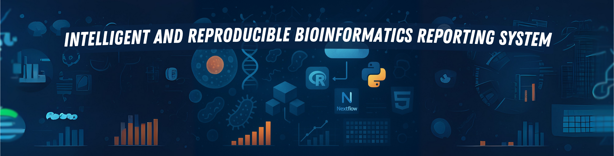

<p align="center">
  
</p>

<div align="center">
  <h1>GUÍA GENERAL DE USUARIO</h1>
</div>

<br>

<div align="center">

[](https://www.r-project.org/) [](https://www.python.org/) [](https://quarto.org/) [](https://www.docker.com/) [](https://shiny.rstudio.com/) [](https://apptainer.org/) [](https://developer.mozilla.org/en-US/docs/Web/HTML) [](https://developer.mozilla.org/en-US/docs/Web/CSS) [](https://d3js.org/) [](https://developer.mozilla.org/en-US/docs/Web/JavaScript) [](https://www.nextflow.io/) [](https://docs.conda.io/en/latest/) [](https://rmarkdown.rstudio.com/) [](https://jupyter.org/) [](https://git-scm.com/) [](https://github.com/) [](https://spacy.io/) [](https://www.markdownguide.org/) [](https://www.latex-project.org/)

</div>


<br>
<br>

---

## 1. Propósito y alcance

La presente guía está dirigida a **usuarios finales y desarrolladores** que deseen instalar, configurar y ejecutar el sistema de forma reproducible.  
En particular, se abordan:

- La preparación del entorno (dependencias y configuraciones).  
- La construcción y gestión de contenedores (Docker y Apptainer).  
- La ejecución global del sistema en diferentes entornos (local, Docker, HPC).  
- El uso práctico de la **app Shiny** como interfaz interactiva.  
- La localización de outputs y logs.  
- Resolución de problemas y buenas prácticas.

> ℹ️ Para detalles específicos de cada tipo de análisis (Bulk RNA-seq, scRNA-seq y Metagenómica), consultar los documentos correspondientes en la carpeta [`6-info/`](./).


<br>
<br>

---

## 2. Requisitos y preparación del entorno

### Dependencias del sistema
El sistema está diseñado para ejecutarse de manera **contenida y reproducible**. Aun así, es necesario disponer de:

- **Docker** (≥ 20.10)  
- **Apptainer** (≥ 1.2) para entornos HPC.  
- **R** (≥ 4.3) con librerías de soporte para la app Shiny.  
- **Python** (≥ 3.9) en caso de ejecutar scripts auxiliares fuera del contenedor.  

Se recomienda también contar con:
- **Git** para la gestión del repositorio.  
- **Make** o scripts de automatización, cuando estén disponibles.


<br>

### Archivos de configuración

En la carpeta `config/` se encuentran los ficheros de configuración del sistema:  

- `config/global.yml` → parámetros generales aplicables a todos los análisis.  
- `config/docker/` → configuración específica para construcción de imágenes.  
- `config/shiny/` → parámetros y ajustes de la interfaz Shiny.  


<br>

### Variables de entorno

En el archivo `.env` (incluido en la raíz del repositorio) se definen:

- Puertos expuestos (`SHINY_PORT`, `API_PORT`).  
- Directorios de trabajo (`DATA_DIR`, `OUTPUT_DIR`).  
- Parámetros opcionales de rendimiento (`THREADS`, `MEMORY_LIMIT`).  

> 🔑 Antes de ejecutar el sistema, se recomienda revisar y personalizar el fichero `.env` según las necesidades locales.


<br>
<br>

---

## 3. Contenedores: instalación y gestión

### Docker

Construcción de la imagen principal:

```bash
docker build -t genoscribe:1.0 .
```

Ejecución interactiva con volumen montado:

```bash
docker run -it --rm \
  -p 8787:8787 \
  -p 3838:3838 \
  -v $(pwd)/data:/app/data \
  genoscribe:latest
```

Gestión de imágenes:

* `docker images` → listar imágenes disponibles.
* `docker rmi <ID>` → eliminar imágenes obsoletas.
* `docker system prune -a` → limpieza general (con precaución).


<br>

### Apptainer

Construcción a partir del `Dockerfile`:

```bash
apptainer build genoscribe.sif docker-daemon://genoscribe:latest
```

Ejecución en entorno HPC:

```bash
apptainer exec --bind /data:/app/data genoscribe.sif Rscript scripts/run_pipeline.R
```


<br>

### Buenas prácticas

* Etiquetar imágenes con versión (`genoscribe:v1.0.0`).
* Documentar hashes de imágenes para reproducibilidad.
* Evitar acumular capas intermedias con limpiezas regulares.


<br>
<br>

---

## 4. Ejecución del sistema (global)

### Modos de ejecución

* **Local**: recomendado para pruebas rápidas.
* **Docker**: entorno controlado, ideal para portabilidad.
* **Apptainer/HPC**: ejecución en clústeres con gestores de colas (ej. SLURM).

Ejemplo con Docker:

```bash
docker run --rm -p 3838:3838 genoscribe:latest
```


<br>

### Estructura de carpetas de trabajo

```
├── data/           # Datos de entrada
├── output/         # Resultados finales
├── tmp/            # Archivos temporales
├── config/         # Configuraciones globales y de análisis
└── logs/           # Registros de ejecución
```


<br>

### Parámetros globales

Los parámetros generales se definen en `config/global.yml` y pueden sobrescribirse:

* En la línea de comando (`--threads 16`).
* En la interfaz Shiny.
* Mediante archivos YAML personalizados.


<br>
<br>

---

## 5. App Shiny: uso práctico

### Lanzamiento

Desde Docker:

```bash
docker run -p 3838:3838 genoscribe:latest shiny
```

Acceso en navegador:
👉 [http://localhost:3838](http://localhost:3838)


<br>

### Mapa de navegación

La app está organizada en pestañas principales:

1. **Carga de datos** → importación de FASTQ, metadatos o matrices.
2. **Configuración** → definición de parámetros globales y específicos.
3. **Ejecución** → lanzamiento de análisis con seguimiento en tiempo real.
4. **Resultados** → exploración de informes, gráficos y tablas.
5. **Exportación** → descarga de informes en PDF/HTML.


<br>

### Flujo típico

1. Cargar los datos de entrada.
2. Configurar parámetros (manual o usando presets).
3. Ejecutar el pipeline.
4. Revisar resultados en panel interactivo.
5. Exportar informe final.

> 🎥 Aquí se recomienda incluir **gifs o capturas** mostrando cada paso en la interfaz.


<br>

### Persistencia de configuraciones

Las configuraciones establecidas en la interfaz pueden guardarse y reutilizarse mediante archivos `.yml`.


<br>
<br>

---

## 6. Outputs globales y logs

* **Informes** → guardados en `output/reports/`.
* **Artefactos de análisis** (matrices, tablas intermedias) → `output/data/`.
* **Logs de ejecución** → `logs/` con nomenclatura `<fecha>_<modulo>.log`.

Ejemplo de estructura de salida:

```
output/
 ├── reports/
 │    ├── analysis_bulk.pdf
 │    ├── analysis_sc.html
 └── data/
      ├── counts_matrix.tsv
      └── deg_results.xlsx
```


<br>
<br>

---

## 7. Resolución de problemas (FAQ) y diagnóstico

### Errores frecuentes

* **Puerto ocupado (3838)** → modificar variable `SHINY_PORT` en `.env`.
* **Permisos en volúmenes** → añadir flag `--user $(id -u):$(id -g)` al comando de Docker.
* **Falta de memoria** → ajustar parámetro `MEMORY_LIMIT` en `.env`.
* **Error en referencias genómicas** → verificar rutas en `config/global.yml`.


<br>

### Cómo reportar incidencias

1. Adjuntar log correspondiente (`logs/`).
2. Describir el entorno (OS, versión de Docker/Apptainer).
3. Abrir issue en [GitHub Issues](../issues).


<br>
<br>

---

## 8. Apéndices

### Cheatsheet de comandos

```bash
# Construir imagen
docker build -t genoscribe:latest .

# Ejecutar app Shiny
docker run -p 3838:3838 genoscribe:latest shiny

# Ejecutar pipeline desde Apptainer
apptainer exec genoscribe.sif Rscript scripts/run_pipeline.R
```


<br>

### Glosario

* **FASTQ**: formato estándar de lecturas de secuenciación.
* **QC**: control de calidad de lecturas.
* **Pipeline**: flujo de análisis compuesto por etapas encadenadas.
* **Shiny**: framework en R para construir aplicaciones web interactivas.
