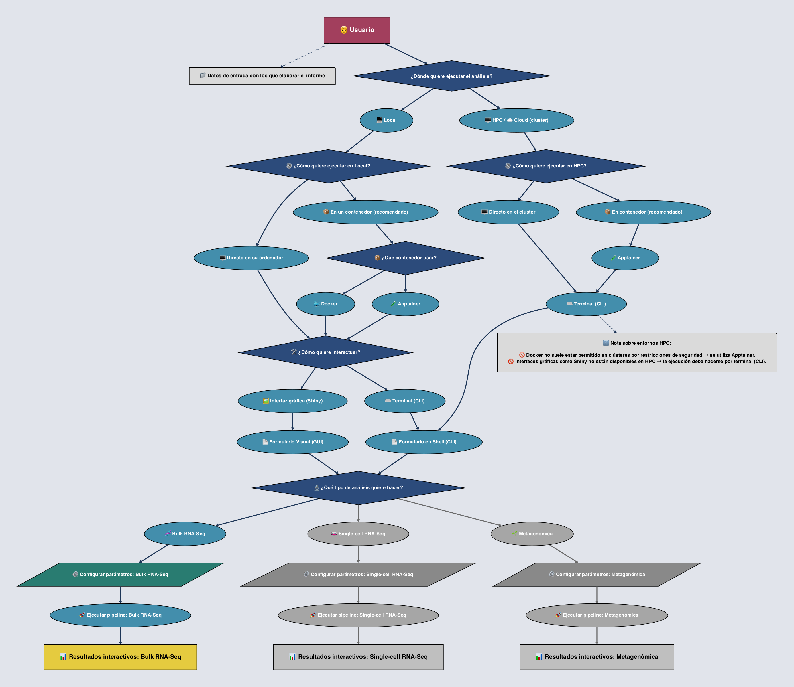

<p align="center">
  
</p>

<div align="center">
  <h1>Sistema Inteligente y Reproducible de Generación de Informes Bioinformáticos</h1>
  <h2>Guía de Usuario para Análisis Bulk RNA-Seq</h2>

  <hr style="border:none; height:0.3px; background-color:#777; width:65%; margin:30px auto 35px auto;">

  <p>
    <a href="https://www.r-project.org/"></a>
    <a href="https://rmarkdown.rstudio.com/"></a>
    <a href="https://shiny.rstudio.com/"></a>
    <a href="https://quarto.org/"></a>
    <a href="https://www.python.org/"></a>
    <a href="https://spacy.io/"></a>
    <a href="https://jupyter.org/"></a>
    <a href="https://www.w3.org/html/"></a>
    <a href="https://www.w3.org/Style/CSS/"></a>
    <a href="https://www.javascript.com/"></a>
    <a href="https://www.d3js.org/"></a>
    <a href="https://www.nextflow.io/"></a>
    <a href="https://www.bioconductor.org/"></a>
    <a href="https://docs.conda.io/en/latest/"></a>
    <a href="https://www.docker.com/"></a>
    <a href="https://apptainer.org/"></a>
    <a href="https://www.markdownguide.org/"></a>
    <a href="https://git-scm.com/"></a>
    <a href="https://github.com/adrichez/genoscribe"></a>
    <a href="https://www.latex-project.org/"></a>
  </p>

  <p>
    <a href="#section-1">¿Qué es?</a> • 
    <a href="#section-2">Highlights</a> • 
    <a href="#section-3">Estructura</a> • 
    <a href="#section-4">Requisitos</a> • 
    <a href="#section-5">Workflow</a> • 
    <a href="#section-6">Quickstart</a> • 
    <a href="#section-7">Docs</a> • 
    <a href="#section-8">Tecnologías</a> • 
    <a href="#section-9">Objetivos</a> • 
    <a href="#section-10">Contacto</a>
  </p>
</div>


<br>
<br>

---

<h2 id="section-1">1. 📖 Introducción y contexto</h2>

El presente documento constituye la **guía de usuario** para el análisis de datos de **Bulk RNA-Seq** dentro del sistema **GenoScribe**.  
En él se explican los pasos, parámetros y consideraciones necesarias para ejecutar este tipo de análisis, desde la **descarga del proyecto** y la **construcción del contenedor**, hasta la **ejecución del pipeline** y la **generación del informe bioinformático final**.  

A diferencia de otras guías técnicas, el objetivo aquí no es solo indicar qué comandos ejecutar, sino también **ofrecer un marco conceptual y práctico** que permita comprender el valor del análisis y de los informes generados.  


<hr style="border:none; height:1px; background-color:#666; width:85%; margin:60px 0 30px 0;">

<h3 id="section-1-1">1.1 🧬 ¿Qué es Bulk RNA-Seq?</h3>  

El **Bulk RNA-Seq** es una técnica de secuenciación masiva de ARN que permite medir la **expresión génica global** en una muestra biológica.  
En lugar de analizar célula por célula (como ocurre en *single-cell RNA-Seq*), este método obtiene un **perfil promedio** de todas las células presentes en la muestra.  

🔹 **Aplicaciones principales del Bulk RNA-Seq:**  
- 📊 Comparación de expresión génica entre condiciones (ej. tratado vs. control).  
- 🔍 Identificación de **genes diferencialmente expresados (DEGs)**.  
- 🌱 Descubrimiento de **rutas biológicas activadas o reprimidas**.  
- 🧪 Estudio de perfiles transcriptómicos en **tejidos, órganos o líneas celulares**.  


<hr style="border:none; height:1px; background-color:#666; width:85%; margin:60px 0 30px 0;">

<h3 id="section-1-2">1.2 ❓ Ejemplo de pregunta biológica</h3>  

Un investigador puede plantear cuestiones como:  

👉 *“¿Qué genes cambian su expresión en plantas de **Arabidopsis thaliana** cuando se someten a estrés por sequía en comparación con plantas en condiciones normales?”*  

Con Bulk RNA-Seq es posible obtener la respuesta mediante:  
- La **cuantificación de lecturas** alineadas a genes o transcritos.  
- La identificación de **genes sobrerrepresentados o infrarepresentados**.  
- El análisis del impacto en **procesos biológicos y rutas metabólicas**.  


<hr style="border:none; height:1px; background-color:#666; width:85%; margin:60px 0 30px 0;">

<h3 id="section-1-3">1.3 🎯 Objetivo de esta guía</h3>  

El propósito de esta guía no es únicamente mostrar cómo ejecutar el pipeline, sino sobre todo:  

1. 📂 **Centralizar** los datos obtenidos o generados por herramientas bioinformáticas.  
2. 📝 **Transformar** esos resultados en un **informe automatizado, claro y reproducible**.  
3. 👩‍🔬 **Facilitar la comprensión** de los resultados para investigadores sin necesidad de explorar manualmente cada archivo de salida.  
4. 🌐 **Mejorar la comunicación científica**, generando informes listos para ser **compartidos en equipos de investigación, colaboraciones o incluso publicaciones**.  


<hr style="border:none; height:1px; background-color:#666; width:85%; margin:60px 0 30px 0;">

<h3 id="section-1-4">1.4 ✨ Valor añadido de GenoScribe</h3>  

Uno de los principales retos de los análisis bioinformáticos es que los resultados suelen presentarse en **archivos dispersos, de difícil lectura** o poco intuitivos para investigadores no especializados en programación.  

⚡️ Aquí es donde **GenoScribe marca la diferencia**:  
- Genera **informes interactivos** con gráficos, tablas y resúmenes claros.  
- Permite **reproducibilidad**: cualquier investigador puede volver a ejecutar el análisis con los mismos parámetros y obtener el mismo informe.  
- Hace que la **bioinformática sea más accesible**, transformando datos complejos en **conocimiento visual y compartible**.  

> 💡 **En resumen:** GenoScribe no solo ejecuta análisis, sino que **traduce la complejidad en información útil y comunicable**.


<br>
<br>

---

<h2 id="section-2">2. 📂 Proyecto en GitHub y requisitos</h2>

El proyecto **GenoScribe** está publicado en GitHub y se organiza de forma modular para separar:  
- la **interfaz de usuario** (app Shiny),  
- los **pipelines de análisis** (Nextflow + Quarto),  
- los **entornos reproducibles** (Docker / Apptainer),  
- la **documentación**,  
- y los **informes de ejemplo**.  

Esta organización permite que cada tipo de análisis (Bulk RNA-Seq, scRNA-Seq, Metagenómica) disponga de su propia carpeta con todo lo necesario para ser ejecutado, mantenido y extendido de manera independiente.


<hr style="border:none; height:1px; background-color:#666; width:85%; margin:60px 0 30px 0;">

<h3 id="section-2-1">2.1 🏗️ Estructura global del repositorio</h3>

```plaintext
genoscribe         # Directorio principal del proyecto
├── 1-app          # App Shiny e interfaz web
├── 2-pipelines    # Pipelines bioinformáticos (Bulk, scRNA, Metagenómica)
├── 3-containers   # Definición de entornos reproducibles (Docker / Apptainer)
├── 4-launch       # Scripts de ejecución (local, contenedor, HPC/cloud)
├── 5-examples     # Informes generados como referencia
├── 6-info         # Documentación técnica y especificaciones
└── README.md      # Guía general del proyecto
```

Cada directorio tiene un rol específico y está descrito con mayor detalle en el README general.


<hr style="border:none; height:1px; background-color:#666; width:85%; margin:60px 0 30px 0;">

<h3 id="section-2-2">2.2 🧬 Carpeta específica de Bulk RNA-Seq</h3>

El pipeline para este tipo de análisis se encuentra en [genoscribe/2-pipelines/1-bulk-rna-seq](../2-pipelines/1-bulk-rna-seq).

Dentro de esta carpeta se incluyen todos los recursos necesarios para ejecutar el análisis y generar informes Quarto:

```plaintext
1-bulk-rna-seq
├── _quarto.yml
├── index.qmd
├── main.nf
├── nextflow.config
├── params.yml
├── report
├── resources
│   ├── 1-essential
│   │   ├── 1-images
│   │   │   ├── 0-icono
│   │   │   │   ├── favicon.ico
│   │   │   │   └── favicon.svg
│   │   │   ├── 1-portada
│   │   │   │   └── bulk_rna_seq_cover.jpg
│   │   │   └── 2-inicio
│   │   │       └── miARma-Seq-workflow.png
│   │   ├── 2-archives
│   │   │   └── miARma_mRNAs_pipeline_STAR.txt
│   │   └── 3-scripts
│   │       ├── 1-R
│   │       │   ├── nextflow-code
│   │       │   │   └── procesar_rpkm.R
│   │       │   └── sections-code
│   │       │       ├── seccion4.R
│   │       │       └── seccion5.R
│   │       ├── 2-Quarto
│   │       │   ├── Tab2-Resumen
│   │       │   │   └── resumen.qmd
│   │       │   └── Tab3-Analisis
│   │       │       ├── 0-contexto.qmd
│   │       │       ├── 1-revision-inicial.qmd
│   │       │       ├── 2-evaluacion-calidad.qmd
│   │       │       ├── 3-alineamiento.qmd
│   │       │       ├── 4-cuantificacion.qmd
│   │       │       ├── 5-analisis-estadistico.qmd
│   │       │       ├── 5.1-normalizacion.qmd
│   │       │       ├── 5.2-evaluacion-calidad-normalizacion.qmd
│   │       │       ├── 5.3-analisis-expresion.qmd
│   │       │       ├── 5.4-analisis-funcional.qmd
│   │       │       └── 6-conclusiones.qmd
│   │       ├── 3-CSS
│   │       │   └── styles.css
│   │       └── 4-Python
│   │           └── html_tag_counter.ipynb
│   └── 2-nextflow-results
│       ├── 1-project-data
│       ├── 2-fastqc-report
│       └── 3-analisis-estadistico
├── run_cleaning_dir.sh
├── run_pipeline_shell.sh
└── run_pipeline_shiny.sh
```

Más en detalle, tenemos:

* **`main.nf`** → script principal en **Nextflow** que orquesta el pipeline de Bulk RNA-Seq.
* **`nextflow.config`** → configuración general (recursos, perfiles de ejecución, paths).
* **`params.yml`** → parámetros del pipeline (incluye rutas de entrada, metadatos y opciones clave).
* **`index.qmd`** → documento principal de Quarto que incluye el contenido de la pestaña inicial del informe.
* **`_quarto.yml`** → define la estructura del informe final generado con **Quarto**.
* **`report/`** → directorio donde se generará el informe HTML final.
* **`resources/`** → recursos organizados en:
  * `1-essential/` → imágenes (portada, iconos), scripts en R, Python y estilos CSS y demás plantillas Quarto el resto de pestañas.
  * `2-nextflow-results/` → directorios de salida de Nextflow (datos procesados, QC, estadísticos, copia de datos esenciales proporcionados por el usuario para la generación del informe).
* **(`run_pipeline_shell.sh` y `run_pipeline_shiny.sh`)** → permiten ejecutar el análisis directamente desde la terminal o integrarlo con la app Shiny con un simple comando.
* **`run_cleaning_dir.sh`** → script para limpiar los directorios de trabajo generados durante el análisis una vez finalizado si estos ya no son necesarios y así liberar espacio en disco.

📌 En paralelo, los resultados generados y un ejemplo completo pueden encontrarse en [genoscribe/5-examples/1-bulk-rna-seq](../5-examples/1-bulk-rna-seq).

Todo informe generado tendría la siguiente estructura:

```plaintext
1-bulk-rna-seq
├── index.html
├── resources
└── site_libs
```

Donde:

- `index.html` es el informe final generado por Quarto (abrir esto en el navegador).
- `resources/` contiene todos los recursos utilizados en el informe (imágenes, scripts, estilos, etc.).
- `site_libs/` incluye las bibliotecas necesarias para el correcto funcionamiento del informe.

Aquí se incluye un informe final (`index.html`) junto con los recursos asociados para comprender el **formato esperado de salida**.


<hr style="border:none; height:1px; background-color:#666; width:85%; margin:60px 0 30px 0;">

<h3 id="section-2-3">2.3 ⚙️ Requisitos básicos</h3>

Antes de utilizar el sistema y ejecutar el pipeline de **Bulk RNA-Seq** asegúrese de contar con los siguientes elementos para garantizar un funcionamiento correcto y reproducible:

* 🐳 **Docker o Apptainer** → imprescindibles para construir y ejecutar los **contenedores** que incluyen la aplicación Shiny, los pipelines y todas las dependencias bioinformáticas.

  * Docker: recomendado para entornos de desarrollo, uso local y en la nube.
  * Apptainer (antes Singularity): recomendado en clústeres HPC o entornos donde Docker no está permitido.

* 💻 **Terminal / Línea de comandos** → utilizada para lanzar los scripts y gestionar la ejecución de los contenedores.

  * Compatible con **macOS, Linux y Windows**.
  * En Windows se recomienda **WSL2 (Windows Subsystem for Linux)**, **Git Bash** o **PowerShell** con soporte adecuado para contenedores.

* 🌐 **Navegador web moderno** → necesario para explorar los **informes HTML interactivos**.

  * Se recomienda **Google Chrome** o **Firefox**.
  * Safari y Edge son compatibles pero pueden presentar limitaciones con algunos gráficos **D3.js** o en la visualización de algunos archivos incrustados.

* 📶 **Conexión a internet** → (opcional) necesaria si:

  * deseas descargar datos de referencia o bases externas durante la ejecución de un pipeline,
  * o si quieres actualizar imágenes de contenedores.
  * El sistema también puede ejecutarse **100% offline** si ya cuenta con los recursos necesarios preinstalados.

* 💾 **Recursos mínimos recomendados** → para un uso fluido en análisis típicos de RNA-seq o metagenómica:

  * **RAM**: ≥ ideal ≥ 8 GB.
  * **CPU**: ≥ 4 núcleos.
  * **Almacenamiento**: ≥ 30 GB libres (la imagen del contenedor pesa unos 15 GB).

> 💡 Con estos requisitos cumplidos, la instalación y ejecución del sistema es directa y garantiza que todos los elementos interactivos de los informes funcionen de manera correcta y reproducible.


<br>
<br>

---

<h2 id="section-3">3. 🔄 Workflow del análisis</h2>

El **workflow de GenoScribe** describe el recorrido completo desde la preparación de los datos hasta la obtención del informe interactivo final. Incluye decisiones clave como el **entorno de ejecución**, el uso de **contenedores** y la elección de la **interfaz de usuario**.

---

<h3 id="section-3.1">3.1. 📝 Diagrama general</h3>

El siguiente **diagrama de flujo esquemático** representa las rutas disponibles para ejecutar GenoScribe (centrándonos en el **pipeline de Bulk RNA-Seq**):

<p align="center">
  
</p>

**Rutas principales del workflow:**

* 💻 **Ejecución Local**

  * Directamente en el **ordenador** o, preferiblemente, dentro de un **contenedor**.
  * Contenedores disponibles en **Docker** y **Apptainer**.
  * Interacción mediante **terminal (CLI)** o **interfaz Shiny**.

* 🖥️ **Ejecución en HPC / Nube**

  * Directamente en el **cluster** o en un **contenedor Apptainer** (Docker no suele estar permitido).
  * Interacción mediante **CLI** exclusivamente.

> 💡 **Consejo práctico:** siempre que sea posible, usa **contenedores** para asegurar **reproducibilidad**, independencia de librerías y mayor facilidad de despliegue.
> En entornos HPC/Nube, puede ser necesario cargar **módulos del sistema** o definir variables de entorno adicionales antes de la ejecución.

Tras definir la ruta de ejecución, el usuario completa un **formulario de parámetros**:

* 📄 **GUI (Shiny)** → disponible solo en local.
* 📄 **CLI (shell)** → disponible tanto en local como en HPC/Nube.

Luego selecciona el **tipo de análisis**:

* 🧬 **Bulk RNA-Seq**
* 🧫 **scRNA-Seq**
* 🌱 **Metagenómica**

Cada análisis activa su **pipeline específico**, que culmina en la generación de un **informe HTML interactivo** con resultados listos para explorar, descargar y compartir.

---

<h3 id="section-3.2">3.2. 📐 Pasos resumidos</h3>

El siguiente esquema muestra de manera simplificada la **ejecución típica** usando contenedores y la **interfaz Shiny**:

```ascii
→ Descargar proyecto desde GitHub
   → Construir la imagen genoscribe:1.0
   → Crear contenedor genoscribe_container
   → Iniciar contenedor
   → Lanzar app Shiny en puerto 3838
   → Seleccionar tipo de análisis en el formulario
   → Completar parámetros del experimento
   → Ejecutar pipeline mediante Nextflow
   → Generar outputs y el informe HTML interactivo
   → Acceder y explorar informe HTML
```

✅ Este esquema permite visualizar **rápidamente** el recorrido completo: desde la preparación y ejecución hasta la **obtención del informe final**.


<hr style="border:none; height:1px; background-color:#666; width:85%; margin:60px 0 30px 0;">

<h3 id="section-3.3">3.3. 🎬 Demostración visual</h3>

El siguiente **GIF** ofrece una visión dinámica del flujo principal: inicio de la app Shiny, completado del formulario, selección del análisis y ejecución del pipeline dentro del contenedor. El proceso finaliza con la **generación automática del informe HTML interactivo**:

<p align="center">
  
</p>

> 💡 **Nota:** Este GIF es una **guía visual rápida** y no muestra todos los pasos intermedios ni outputs secundarios. Para información completa, incluyendo **entradas, salidas y parámetros específicos**, consulta las [Guías de usuario extendidas](6-info).


<br>
<br>

---

<h2 id="section-4">4. ⬇️ Descarga y preparación del entorno</h2>

Antes de ejecutar cualquier análisis con **GenoScribe**, es necesario obtener el proyecto completo y asegurarse de que todas las dependencias estén disponibles. Esta sección describe cómo **clonar o descargar el repositorio**, así como los pasos iniciales de preparación del entorno, tanto para usuarios que trabajen **en local** como aquellos que utilicen **HPC o la nube**.

El objetivo es que cualquier usuario pueda iniciar GenoScribe de manera rápida y reproducible, con un flujo de trabajo consistente y control sobre versiones y actualizaciones. Además, se facilita la construcción de contenedores (Docker o Apptainer), que aseguran un entorno aislado y preconfigurado, evitando conflictos de dependencias y problemas de compatibilidad.


<hr style="border:none; height:1px; background-color:#666; width:85%; margin:60px 0 30px 0;">

<h3 id="section-4.1">4.1. 🌐 Clonar o descargar el proyecto</h3>

Para obtener todos los **códigos, pipelines, scripts y archivos necesarios** existen dos opciones principales: **clonar el repositorio mediante Git** o **descargar un ZIP desde GitHub**.

**Opción recomendada: clonar con Git**

```bash
git clone https://github.com/adrichez/genoscribe.git
cd genoscribe
```

Clonar el repositorio permite mantener el proyecto **actualizado fácilmente** mediante `git pull`, y ofrece la máxima flexibilidad para usuarios que planeen ejecutar pipelines de forma continua o modificar scripts según sus necesidades. Además, permite gestionar versiones y mantener un historial de cambios controlado.

> 💡 Ventaja: ideal para usuarios que planean trabajar regularmente con GenoScribe o integrar nuevas funcionalidades en el futuro.

**Alternativa: descargar ZIP desde GitHub**

1. Accede a [https://github.com/adrichez/genoscribe](https://github.com/adrichez/genoscribe).
2. Pulsa **Code → Download ZIP**.
3. Descomprime el archivo y accede a la carpeta del proyecto desde la terminal.

> ⚡ Esta opción es útil para pruebas rápidas o para sistemas donde **Git no está disponible**, aunque no permite actualizar fácilmente el repositorio ni gestionar versiones.


<hr style="border:none; height:1px; background-color:#666; width:85%; margin:60px 0 30px 0;">

<h3 id="section-4.2">4.2. 🛠️ Instalación de dependencias</h3>

GenoScribe requiere diversas herramientas y librerías para ejecutar correctamente los pipelines y generar los informes interactivos. La instalación depende del **modo de ejecución** elegido: dentro de un contenedor (Docker o Apptainer) o directamente en el sistema local sin contenedor.


<hr style="border:none; height:1.2px; background-color:#555; width:65%; margin:35px 0 20px 0;">

<h4 id="section-4.2.1">4.2.1. 📦 Dentro de contenedor (Docker / Apptainer)</h4>

Si se ejecuta GenoScribe dentro de un contenedor, **todas las dependencias ya están preinstaladas**. Esto incluye:

* Nextflow para la ejecución de pipelines.
* R con paquetes necesarios para análisis y generación de informes (shiny, tidyverse, ggplot2, DT, plotly, entre otros).
* Python y librerías bioinformáticas como `pandas`, `numpy`, `scipy`, `scanpy`, `biopython`.
* Quarto CLI para renderizar informes HTML interactivos.
* MultiQC para resumen de calidad de secuencias.
* Miniconda/Mamba y entornos específicos para análisis (por ejemplo, bulk RNA-seq).

> ✅ **Ventaja:** el contenedor garantiza un entorno reproducible y controlado, sin conflictos de dependencias. Esta es la opción **recomendada** para la ejecución de pipelines, tanto en local como en HPC o nube.


<hr style="border:none; height:1.2px; background-color:#555; width:65%; margin:35px 0 20px 0;">

<h4 id="section-4.2.2">4.2.2. 💻 Sin contenedor (local)</h4>

Ejecutar GenoScribe directamente en el sistema local requiere instalar manualmente todas las herramientas y librerías. Esto se puede deducir del **Dockerfile**, que lista los paquetes y dependencias necesarias:

* **Nextflow**: se instala con `curl -s https://get.nextflow.io | bash`.
* **R y RStudio**: incluyendo paquetes clave como `shiny`, `tidyverse`, `ggplot2`, `plotly`, `DT`, `dplyr`, `readxl`, `stringr`, `purrr`, `quarto`, `rmarkdown`, entre otros.
* **Python 3** y librerías bioinformáticas: `pandas`, `numpy`, `scipy`, `scanpy`, `biopython`.
* **Quarto CLI**: se descarga e instala desde [quarto.org](https://quarto.org).
* **Conda / Mamba**: para gestión de entornos y creación de entornos específicos (por ejemplo, `env_bulk_rna_seq.yml`).
* **Paquetes del sistema**: herramientas de compilación (`libssl-dev`, `libcurl4-openssl-dev`, `libxml2-dev`, `pkg-config`), Java (`openjdk-17-jre-headless`), utilidades (`curl`, `git`, `unzip`, `nano`, `less`).

> ⚠️ **Nota:** esta opción es más propensa a errores de instalación y conflictos de dependencias, y se recomienda principalmente **para depuración, desarrollo o pruebas rápidas**. Para análisis reproducibles y robustos, el uso de contenedores es siempre preferible.


<hr style="border:none; height:1.2px; background-color:#555; width:65%; margin:35px 0 20px 0;">

<h4 id="section-4.2.3">4.2.3. 📝 Resumen y recomendaciones</h4>

1. **Contenedor** → opción recomendada, ideal para producción, local/HPC/nube o ejecución repetida: reproducible, seguro y listo para usar.
2. **Local sin contenedor** → solo para pruebas, desarrollo o depuración: requiere instalación manual de todas las dependencias y configuración cuidadosa del entorno.

> 💡 **Consejo práctico:** aunque se ofrece la opción de ejecución local sin contenedor, **la instalación y mantenimiento de dependencias puede ser compleja**. Construir y ejecutar el contenedor simplifica enormemente este proceso y asegura resultados consistentes.


Perfecto, Adrián. Aquí tienes la subsección de **construcción del contenedor** desarrollada y más detallada, con subsubsecciones y explicaciones claras, además de la mención al GIF en la sección del workflow:


<hr style="border:none; height:1px; background-color:#666; width:85%; margin:60px 0 30px 0;">

<h3 id="section-4.3">4.3. 📦 Construcción del contenedor</h3>

GenoScribe puede ejecutarse dentro de **Docker** o adaptarse a **Apptainer**. Construir el contenedor localmente garantiza que todas las dependencias estén presentes, permite personalizar librerías y versiones, y asegura reproducibilidad total del análisis, tanto en entornos locales como en HPC o nube.

> ⚠️ **Importante:** todos los comandos de construcción de contenedores deben ejecutarse desde la **raíz del proyecto `genoscribe`**.


<hr style="border:none; height:1.2px; background-color:#555; width:65%; margin:35px 0 20px 0;">

<h4 id="section-4.3.1">4.3.1. 🐳 Construcción de Docker</h4>

Para sistemas donde Docker está disponible (local, servidores con soporte Docker), se recomienda construir la imagen desde el Dockerfile incluido en el proyecto:

```bash
# Desde la raíz del proyecto genoscribe
docker build -f 3-containers/1-docker/Dockerfile -t genoscribe:1.0 .

# Reconstrucción completa sin usar cache
docker build --no-cache -f 3-containers/1-docker/Dockerfile -t genoscribe:1.0 .
```

**Explicación de pasos importantes del Dockerfile:**

1. Imagen base `rocker/shiny:4.4.1` (R + Shiny Server).
2. Paquetes de sistema: librerías esenciales para R, Python, Java, compilación y utilidades (`libssl-dev`, `git`, `python3`, etc.).
3. Nextflow: ejecución de pipelines.
4. Quarto CLI: generación de informes interactivos.
5. Paquetes de R: `tidyverse`, `ggplot2`, `plotly`, `DT`, `readxl`, etc.
6. Python y librerías bioinformáticas: `pandas`, `numpy`, `scanpy`, `biopython`, entre otras.
7. Miniconda + Mamba: creación de entornos específicos como `env_bulk_rna_seq.yml`.
8. Copiado de carpetas del proyecto.
9. Permisos y enlaces simbólicos para Shiny y generación de reportes.
10. Exposición del puerto 3838.

> 💡 Construir la imagen localmente permite personalizar versiones de librerías, modificar entornos Conda y garantizar que funcione en distintos entornos sin problemas.


<hr style="border:none; height:1.2px; background-color:#555; width:65%; margin:35px 0 20px 0;">

<h4 id="section-4.3.2">4.3.2. 🧪 Construcción de Apptainer</h4>

En entornos HPC o donde Docker no está disponible, existen varias formas de generar un contenedor Apptainer:

**a) A partir de la imagen Docker construida localmente:**

```bash
# Desde la raíz del proyecto genoscribe
apptainer build genoscribe.sif docker-daemon://genoscribe:1.0
```

**b) Descargando imagen preconstruida desde Docker Hub:**

```bash
# Desde la raíz del proyecto genoscribe
apptainer build genoscribe.sif docker://adrichez/genoscribe:1.0
```

**c) (Experimental) Creación desde archivo `.def`:**

Se encuentra en [genoscribe/3-containers/2-apptainer/genoscribe.def](../3-containers/2-apptainer/genoscribe.def). Esta opción permite construir directamente un contenedor Apptainer sin pasar por Docker, aunque todavía está en fase de pruebas:

```bash
# Desde la raíz del proyecto genoscribe
apptainer build genoscribe.sif 3-containers/2-apptainer/genoscribe.def
```

**Notas importantes:**

* La opción `.def` es útil para usuarios avanzados que quieren construir un contenedor puramente Apptainer.
* Suele usarse **solo vía CLI**, ya que Shiny no siempre es compatible en HPC.
* Garantiza reproducibilidad y aislamiento de dependencias, similar a Docker.


<hr style="border:none; height:1.2px; background-color:#555; width:65%; margin:35px 0 20px 0;">

<h4 id="section-4.3.3">4.3.3. 🚀 Uso de imágenes preconstruidas (opción rápida)</h4>

```bash
# Docker
docker pull adrichez/genoscribe:1.0

# Apptainer
apptainer build genoscribe.sif docker://adrichez/genoscribe:1.0
```

* ✅ Inicio inmediato sin compilar.
* ⚠️ Menor flexibilidad para modificar dependencias.


<hr style="border:none; height:1.2px; background-color:#555; width:65%; margin:35px 0 20px 0;">

<h4 id="section-4.3.4">4.3.4. 🎬 Visualización del proceso (GIF)</h4>

El flujo completo, desde la **construcción de la imagen hasta la generación del informe con Shiny**, se puede visualizar en el **GIF de ejemplo** mostrado en el apartado anterior **<a href="#section-3.3">Demostración visual</a>**.

> 📌 Ilustra todo el proceso de preparación del entorno, permitiendo comprender de manera visual la secuencia de pasos recomendada.


<br>
<br>

---

<h2 id="section-5">5. 🚀 Métodos de uso</h2>

GenoScribe ofrece distintos modos de ejecución según el perfil del usuario y el entorno disponible.  

Esta sección describe de manera detallada **cómo iniciar la app, ejecutar pipelines desde la terminal y adaptarse a distintos entornos (local, HPC o nube)**, permitiendo al usuario elegir el flujo de trabajo más adecuado para sus necesidades.  

Se incluyen recomendaciones, diferencias entre GUI y CLI, y consideraciones de reproducibilidad y escalabilidad.


<hr style="border:none; height:1px; background-color:#666; width:85%; margin:60px 0 30px 0;">

<h3 id="section-5.1">5.1. 🖼️ Ejecución de la app (modo interactivo)</h3>

**Descripción:**  

El modo interactivo permite iniciar GenoScribe con una **interfaz visual Shiny**, guiando al usuario paso a paso desde la selección del tipo de análisis hasta la obtención de informes finales.

**Comandos según entorno:**

* 🐳 **Dentro de contenedor Docker:**

  ```bash
  ./4-launch/2-docker/run_app_shiny.sh
  ```

* 💻 **Local sin contenedor:**

  ```bash
  ./4-launch/1-local/run_app_shiny.sh
  ```

**Ventajas del modo interactivo:**

* Abre la interfaz **Shiny** en el navegador, facilitando la exploración visual.
* Permite seleccionar el **tipo de análisis** (Bulk RNA-Seq, scRNA-Seq o Metagenómica).
* Completa los **parámetros del experimento** mediante formularios interactivos.
* Lanza automáticamente los pipelines y genera informes **HTML interactivos**, que incluyen tablas, gráficos y resultados resumidos.
* Ideal para usuarios novatos, para validación rápida de parámetros y para aprendizaje del flujo de trabajo.

> 🌟 **Tip:** aunque el modo GUI es más intuitivo, puede ser más lento en grandes volúmenes de datos. Para análisis masivos, considera el modo CLI.


<hr style="border:none; height:1px; background-color:#666; width:85%; margin:60px 0 30px 0;">

<h3 id="section-5.2">5.2. ⌨️ Ejecución desde la terminal (CLI)</h3>

**Descripción:**  

La ejecución por línea de comandos permite un **control total sobre los pipelines**, es más rápida y escalable, y es la opción recomendada para HPC, procesamiento por lotes o automatización.

**Comandos según entorno:**

* 🐳 **Docker:**

  ```bash
  ./4-launch/2-docker/run_app_shell.sh
  ```

* 🧪 **Apptainer / HPC:**

  ```bash
  ./4-launch/3-apptainer-hpc/run_app_shell.sh
  ```

* 💻 **Local sin contenedor:**

  ```bash
  ./4-launch/1-local/run_app_shell.sh
  ```

**Ventajas del modo CLI:**

* Ejecuta pipelines directamente desde la terminal, sin interacción visual.
* Genera informes reproducibles automáticamente, compatibles con Quarto y HTML.
* Adecuado para **automatización**, ejecución por lotes y grandes volúmenes de datos.
* Permite integración con scripts externos y gestión avanzada de parámetros.

> 💡 **Recomendación:** el modo CLI es ideal para usuarios avanzados, automatización de flujos y ejecución en HPC o nube.


<hr style="border:none; height:1px; background-color:#666; width:85%; margin:60px 0 30px 0;">

<h3 id="section-5.3">5.3. 🌍 Ejecución en Local vs HPC/Nube</h3>

GenoScribe se puede ejecutar en distintos entornos, y la elección depende de **recursos disponibles, interfaz deseada y volumen de datos**.

| Entorno    | Contenedor         | Interfaz    | Consideraciones                                                                               |
| ---------- | ------------------ | ----------- | --------------------------------------------------------------------------------------------- |
| Local      | Docker / Apptainer | Shiny / CLI | Máxima flexibilidad, GUI disponible, fácil depuración                                         |
| Local      | Ninguno            | Shiny / CLI | Requiere instalación manual de dependencias, útil para pruebas y desarrollo                   |
| HPC / Nube | Apptainer          | CLI         | GUI no disponible, puede requerir módulos del sistema y configuración de variables de entorno |

> 🔹 **Consejo:** siempre que sea posible, ejecutar dentro de un **contenedor** para garantizar **reproducibilidad, aislamiento de dependencias y consistencia de resultados**.


<hr style="border:none; height:1px; background-color:#666; width:85%; margin:60px 0 30px 0;">

<h3 id="section-5.4">5.4. 🎬 Flujo de ejecución resumido (GIF)</h3>

Para visualizar el **proceso completo de ejecución**, desde la construcción de la imagen del contenedor hasta la obtención del informe final, se puede consultar, al igual que en apartado anterior, el **GIF de ejemplo** en la sección **<a href="#section-3.3">Demostración visual</a>**.

> 📌 **Nota:** este GIF sirve como guía visual para entender el flujo recomendado, aunque los comandos pueden ejecutarse directamente en terminal para usuarios avanzados.


<br>
<br>

---

## 6. Parámetros específicos

* Parámetros que requiere este análisis (ej.: estructura de carpetas a adjuntar, ficheros esperados).
* Ejemplos prácticos de carpetas de entrada y cómo deben organizarse.
* Explicación de la procedencia de los datos (p.ej. outputs de **miARMA-Seq** u otro pipeline externo).

## 7. Etapas del pipeline

* Breve descripción de las fases internas (QC, alineamiento, cuantificación, DEG, enriquecimiento, etc. según el caso).
* Ejemplo de outputs intermedios.

## 8. Resultados e informe

* Descripción del **informe generado**:

  * Qué incluye (tablas, gráficas, resúmenes).
  * Ejemplos de resultados relevantes.
* 📸 GIF mostrando un informe real (scroll animado).

## 9. Comentarios finales

* Objetivos de este módulo dentro del proyecto.
* Limitaciones / futuras mejoras.


<br>
<br>

---

<h2 id="section-10">10. 📬 Contacto</h2>

Para consultas, sugerencias o reportes de errores relacionados con este proyecto, puedes contactarnos a través de:

<ul style="list-style:none; padding:0; margin:0; gap:10px;">
  <li style="display:flex; align-items:center; gap:10px; margin-bottom:8px;">
    <a href="mailto:asanca33@gmail.com" style="text-decoration:none;">
      <span style="background-color:#ff6f61;color:white;padding:4px 10px;border-radius:12px;font-weight:bold;">📧 Email</span>
    </a>
    <span>Correo electrónico para consultas: <a href="mailto:asanca33@gmail.com">asanca33@gmail.com</a></span>
  </li>

  <li style="display:flex; align-items:center; gap:10px; margin-bottom:8px;">
    <a href="https://github.com/adrichez/genoscribe" style="text-decoration:none;">
      <span style="background-color:#6cc644;color:white;padding:4px 10px;border-radius:12px;font-weight:bold;">🐙 GitHub</span>
    </a>
    <span>Repositorio y contribuciones: <a href="https://github.com/adrichez/genoscribe">https://github.com/adrichez/genoscribe</a></span>
  </li>

  <li style="display:flex; align-items:center; gap:10px; margin-bottom:8px;">
    <a href="6-info/" style="text-decoration:none;">
      <span style="background-color:#1da1f2;color:white;padding:4px 10px;border-radius:12px;font-weight:bold;">📚 Docs</span>
    </a>
    <span>Documentación adicional: <a href="6-info/">6-info/</a></span>
  </li>
</ul>

<br>

<hr style="border:none; height:0.3px; background-color:#777; width:65%; margin:20px auto 25px auto;">

<p align="center" style="margin-top:0.5rem; color:#777; font-size:0.95rem;">
💡 Sus comentarios y contribuciones ayudan a que GenoScribe sea más <strong>robusto, reproducible y accesible</strong> para la comunidad bioinformática.
</p>
