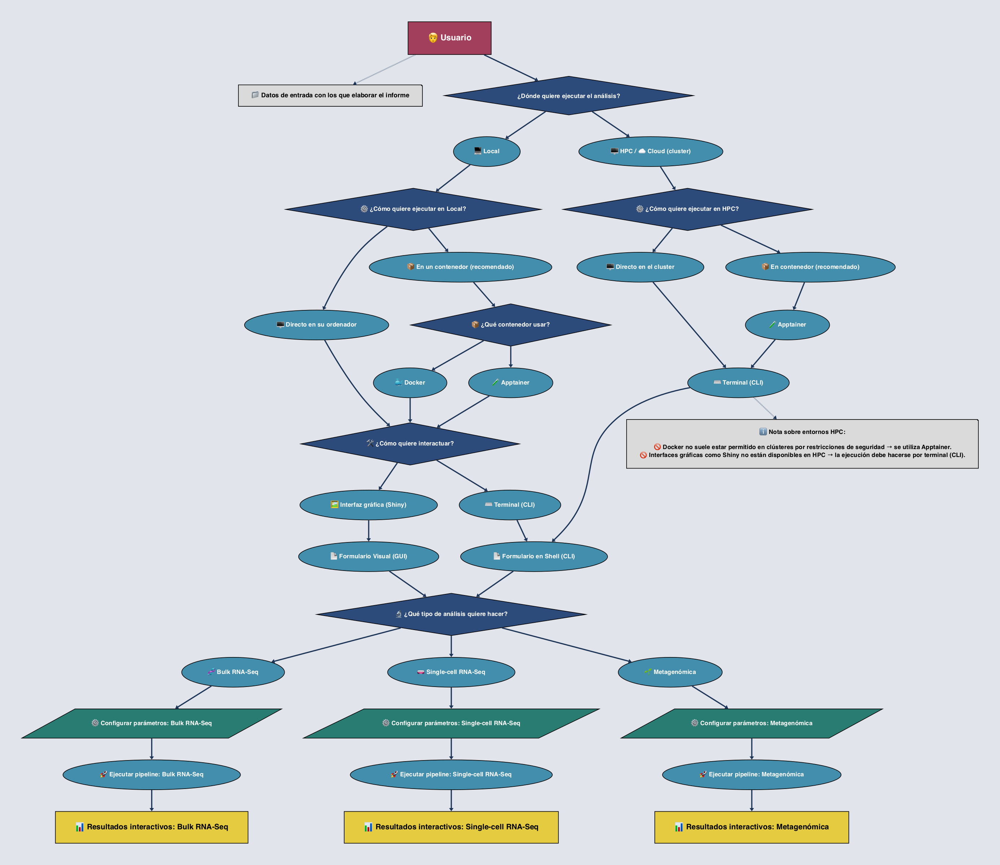

<p align="center">
  
</p>

<div align="center">
  <h1>Sistema Inteligente y Reproducible de Generación de Informes Bioinformáticos</h1>
  <p>Automatiza la generación de informes interactivos desde pipelines ómicos (Bulk RNA-Seq / scRNA-Seq / Metagenómica) en contenedores y entornos cloud/HPC.</p>

  <hr style="border:none; height:0.3px; background-color:#777; width:65%; margin:30px auto 35px auto;">

  <p>
    <a href="https://www.r-project.org/"></a>
    <a href="https://rmarkdown.rstudio.com/"></a>
    <a href="https://shiny.rstudio.com/"></a>
    <a href="https://quarto.org/"></a>
    <a href="https://www.python.org/"></a>
    <a href="https://spacy.io/"></a>
    <a href="https://jupyter.org/"></a>
    <a href="https://www.w3.org/html/"></a>
    <a href="https://www.w3.org/Style/CSS/"></a>
    <a href="https://www.javascript.com/"></a>
    <a href="https://www.d3js.org/"></a>
    <a href="https://www.nextflow.io/"></a>
    <a href="https://www.bioconductor.org/"></a>
    <a href="https://docs.conda.io/en/latest/"></a>
    <a href="https://www.docker.com/"></a>
    <a href="https://apptainer.org/"></a>
    <a href="https://www.markdownguide.org/"></a>
    <a href="https://git-scm.com/"></a>
    <a href="https://github.com/adrichez/genoscribe"></a>
    <a href="https://www.latex-project.org/"></a>
  </p>

  <p>
    <a href="#section-1">¿Qué es?</a> • 
    <a href="#section-2">Highlights</a> • 
    <a href="#section-3">Estructura</a> • 
    <a href="#section-4">Requisitos</a> • 
    <a href="#section-5">Workflow</a> • 
    <a href="#section-6">Quickstart</a> • 
    <a href="#section-7">Docs</a> • 
    <a href="#section-8">Tecnologías</a> • 
    <a href="#section-9">Objetivos</a> • 
    <a href="#section-10">Contacto</a>
  </p>
</div>


<br>
<br>

---

<h2 id="section-1">1. 🚀 Descripción del proyecto</h2>

**GenoScribe** es un **sistema inteligente y reproducible** que transforma automáticamente los resultados de **pipelines ómicos** en **informes interactivos y estandarizados**. Su objetivo es simplificar la interpretación de datos complejos y facilitar la comunicación de hallazgos en proyectos de *Bulk RNA-Seq, scRNA-Seq y Metagenómica*.  

La herramienta central es una **aplicación Shiny** que permite al usuario definir de forma sencilla los **parámetros del experimento** (por ejemplo, la carpeta de resultados con archivos `.fastq`, tablas `.xlsx` o reportes de **MultiQC**). A partir de ahí, el sistema ejecuta el **pipeline correspondiente** dentro de un **contenedor aislado** (Apptainer/Docker), garantizando **consistencia**, **reproducibilidad** y aislamiento de dependencias.  

El flujo culmina en la generación de un **informe Quarto en HTML** completamente adaptado a los datos procesados. Cada informe integra:  

- **Visualizaciones dinámicas** y personalizables  
- **Tablas filtrables** y exportables  
- **Resúmenes ejecutivos** con los principales hallazgos  
- **Metadatos de ejecución** (versiones, parámetros, logs) que aseguran trazabilidad  

Gracias a este enfoque, los investigadores pueden **explorar, compartir y documentar resultados** de forma ágil, reduciendo la carga manual y estandarizando la presentación de informes.  

Diseñado para ser **flexible y escalable**, GenoScribe puede ejecutarse en **local**, en **HPC** o en la **nube**, ofreciendo una **solución robusta** que acelera la interpretación de datos y optimiza la toma de decisiones.  


<br>
<br>

---

<h2 id="section-2">2. ⭐ Características principales</h2>

- 🧬 **Pipelines soportados** → Compatible con **Bulk RNA-Seq, scRNA-Seq y análisis metagenómicos**. Cada flujo de trabajo está **preconfigurado** para procesar datos crudos (por ejemplo `.fastq`, `.bam` o conteos) y generar resultados listos para análisis. Esto reduce la necesidad de pasos manuales, disminuye errores y asegura resultados consistentes en cada ejecución.  

- 📊 **Informes interactivos** → Los resultados se presentan como **informes HTML dinámicos** construidos con **Quarto** y potenciados con **visualizaciones interactivas en D3.js**. Los usuarios pueden **explorar gráficos**, **filtrar tablas**, navegar entre secciones y descargar figuras de interés, transformando datos complejos en información clara y accesible.  

- 🤖 **IA/NLP para resúmenes automáticos** → Integración de **modelos de inteligencia artificial y procesamiento de lenguaje natural (NLP)** que generan **resúmenes ejecutivos automáticos**. Estos destacan los **hallazgos clave**, patrones relevantes y posibles interpretaciones biológicas, ofreciendo al usuario una visión rápida sin necesidad de revisar cada tabla o gráfico en detalle.  

- 🐳 **Reproducibilidad garantizada con contenedores** → Cada pipeline se ejecuta dentro de un **contenedor Apptainer o Docker**, lo que asegura **aislamiento total de dependencias**, **consistencia entre entornos** y la posibilidad de **replicar los análisis** en cualquier sistema, sin conflictos de software ni configuraciones ocultas.  

- ☁️ **Despliegue flexible (local / HPC / nube)** → El sistema puede ejecutarse en **ordenadores personales**, en **clústeres HPC** o en **plataformas de nube**. Esta flexibilidad permite adaptarse a distintos volúmenes de datos y necesidades computacionales, maximizando la eficiencia sin comprometer la seguridad o la reproducibilidad.  

- 📦 **Estandarización y trazabilidad** → Cada informe incluye **metadatos de ejecución**, como versiones de software, parámetros empleados y registros de procesamiento. De este modo, se asegura la **trazabilidad completa** y la posibilidad de **auditar o replicar** cualquier resultado en el futuro.  


<br>
<br>

---

<h2 id="section-3">3. 📂 Estructura del proyecto</h2>

El repositorio está organizado de forma modular para separar claramente la **interfaz de usuario**, los **pipelines de análisis**, los **entornos reproducibles** y la **documentación**. Esto facilita la navegación, el mantenimiento y la extensión del sistema.

```plaintext
genoscribe         # Directorio principal del proyecto
├── 1-app          # App Shiny y recursos web
├── 2-pipelines    # Pipelines de análisis y plantillas Quarto
├── 3-containers   # Definición de entornos reproducibles
├── 4-launch       # Scripts de lanzamiento
├── 5-examples     # Informes de ejemplo
├── 6-info         # Documentación y especificaciones
└── README.md      # Documento con información general del proyecto
```

<br>

A continuación se detalla la función de cada directorio:

- **`1-app/`** → Contiene la aplicación Shiny, formularios para introducir parámetros, selección del tipo de experimento y paneles interactivos con R, JS y D3.js, junto con los recursos front-end.  
- **`2-pipelines/`** → Incluye los pipelines bioinformáticos por tipo de análisis y las plantillas Quarto para generar los informes finales, así como archivos de ejemplo y scripts en R, Python o Snakemake/Nextflow.  
- **`3-containers/`** → Define los entornos reproducibles, incluyendo Dockerfiles o recetas Apptainer, dependencias específicas y versionado de imágenes.  
- **`4-launch/`** → Scripts para ejecutar la app Shiny y desplegar los pipelines en local, contenedores, HPC o cloud, incluyendo utilidades de montaje de volúmenes y registro de logs.  
- **`5-examples/`** → Informes de ejemplo generados a partir de los pipelines y plantillas para cada tipo de análisis, que ilustran el formato y contenido esperado de los resultados finales.  
- **`6-info/`** → Documentación técnica y especificaciones detalladas para cada tipo de análisis, así como guías de usuario generales.   
- **`README.md`** → Documento principal con descripción general, estructura del proyecto, guía rápida de uso y enlaces a la documentación detallada.  


<br>
<br>

---

<h2 id="section-4">4. ⚙️ Requisitos</h2>

Antes de utilizar el sistema, asegúrese de contar con los siguientes elementos para garantizar un funcionamiento correcto y reproducible:

* 🐳 **Docker o Apptainer** → imprescindibles para construir y ejecutar los **contenedores** que incluyen la aplicación Shiny, los pipelines y todas las dependencias bioinformáticas.

  * Docker: recomendado para entornos de desarrollo, uso local y en la nube.
  * Apptainer (antes Singularity): recomendado en clústeres HPC o entornos donde Docker no está permitido.

* 💻 **Terminal / Línea de comandos** → utilizada para lanzar los scripts y gestionar la ejecución de los contenedores.

  * Compatible con **macOS, Linux y Windows**.
  * En Windows se recomienda **WSL2 (Windows Subsystem for Linux)**, **Git Bash** o **PowerShell** con soporte adecuado para contenedores.

* 🌐 **Navegador web moderno** → necesario para explorar los **informes HTML interactivos**.

  * Se recomienda **Google Chrome** o **Firefox**.
  * Safari y Edge son compatibles pero pueden presentar limitaciones con algunos gráficos **D3.js** o en la visualización de algunos archivos incrustados.

* 📶 **Conexión a internet** → (opcional) necesaria si:

  * deseas descargar datos de referencia o bases externas durante la ejecución de un pipeline,
  * o si quieres actualizar imágenes de contenedores.
  * El sistema también puede ejecutarse **100% offline** si ya cuenta con los recursos necesarios preinstalados.

* 💾 **Recursos mínimos recomendados** → para un uso fluido en análisis típicos de RNA-seq o metagenómica:

  * **RAM**: ≥ ideal ≥ 8 GB.
  * **CPU**: ≥ 4 núcleos.
  * **Almacenamiento**: ≥ 30 GB libres (la imagen del contenedor pesa unos 15 GB).

> 💡 Con estos requisitos cumplidos, la instalación y ejecución del sistema es directa y garantiza que todos los elementos interactivos de los informes funcionen de manera correcta y reproducible.


<br>
<br>

---

<h2 id="section-5">5. 🎯 Flujo de trabajo</h2>

Este apartado describe cómo un usuario interactúa con el sistema para generar **informes bioinformáticos automáticos e interactivos** a partir de sus datos. Se presenta en tres niveles: diagrama general, flujo resumido en ASCII y demostración visual con GIF.


<hr style="border:none; height:1px; background-color:#666; width:85%; margin:60px 0 30px 0;">

<h3 id="section-5.1">5.1. 📝 Diagrama general</h3>

El **diagrama de flujo** ilustra de forma esquemática las decisiones y rutas que el usuario puede seguir desde la entrada de datos hasta la generación del informe final:

<p align="center">
  
</p>

**Recorrido resumido:**

* 💻 **Ejecución Local:**  

  * Directamente en el **ordenador** o dentro de un **contenedor** (recomendado).
  * Contenedores disponibles en **Docker** o **Apptainer**.
  * Interacción mediante **terminal (CLI)** o **interfaz Shiny**.

* 🖥️ **Ejecución HPC / Nube:**  

  * Directamente en el **cluster** o dentro de un **contenedor Apptainer** (Docker no suele estar permitido).
  * Interacción exclusivamente mediante **CLI**.

> 💡 **Consejo:** Ejecutar siempre dentro de un **contenedor** garantiza **reproducibilidad**, aislamiento de dependencias y facilita la gestión. La ejecución directa se recomienda solo para pruebas o debugging.
> En HPC/Cloud pueden requerirse pasos adicionales, como cargar **módulos del sistema** o configurar variables de entorno, para asegurar que todas las dependencias estén disponibles.

Luego, el usuario completa un **formulario con los parámetros del experimento**:

* 📄 **GUI (Shiny)** → Local.
* 📄 **CLI (shell)** → Local o HPC/Cloud.

Después, se selecciona el **tipo de análisis**:

* 🧬 **Bulk RNA-Seq**
* 🧫 **Single-cell RNA-Seq (scRNA-Seq)**
* 🌱 **Metagenómica**

Cada análisis requiere configurar parámetros específicos y ejecutar el **pipeline correspondiente**, que culmina con la **generación de un informe HTML interactivo**, listo para explorarse, descargarse y compartirse.

**Resumen conceptual del workflow:**

1. Preparación de **datos de entrada**.
2. Elección del **entorno de ejecución** (Local vs HPC/Cloud).
3. Decisión sobre uso de **contenedor**.
4. Selección de **interfaz de usuario** (CLI o Shiny).
5. Elección del **tipo de análisis**.
6. Configuración de **parámetros específicos** y ejecución del pipeline.
7. Obtención del **informe HTML interactivo**.


<hr style="border:none; height:1px; background-color:#666; width:85%; margin:60px 0 30px 0;">

<h3 id="section-5.2">5.2. 📐 Pasos resumidos</h3>

Este flujo simplificado muestra, paso a paso, la ejecución típica del sistema empleando contenedores y la interfaz Shiny:

```ascii
→ Descargar proyecto desde GitHub
   → Construir la imagen genoscribe:1.0
   → Crear contenedor genoscribe_container
   → Iniciar contenedor
   → Lanzar app Shiny en puerto 3838
   → Seleccionar tipo de análisis en el formulario
   → Completar parámetros del experimento
   → Ejecutar pipeline mediante Nextflow
   → Generar outputs y el informe HTML interactivo
   → Acceder y explorar informe HTML
```

Este esquema permite **visualizar rápidamente** la secuencia completa de pasos, incluyendo preparación, ejecución y obtención del informe final.


<hr style="border:none; height:1px; background-color:#666; width:85%; margin:60px 0 30px 0;">

<h3 id="section-5.3">5.3. 🎬 Demostración visual</h3>

El siguiente **GIF** ofrece una visión dinámica del flujo principal: inicio de la app Shiny, completado del formulario, selección del análisis y ejecución del pipeline dentro del contenedor. El proceso finaliza con la **generación automática del informe HTML interactivo**:

<p align="center">
  
</p>

> 💡 **Nota:** Este GIF es una **guía visual rápida** y no muestra todos los pasos intermedios ni outputs secundarios. Para información completa, incluyendo **entradas, salidas y parámetros específicos**, consulta las [Guías de usuario extendidas](6-info).


<br>
<br>

---

<h2 id="section-6">6. 🚀 Guía rápida de uso (Quickstart)</h2>

Esta sección explica cómo poner en marcha **GenoScribe** de forma rápida, reproducible y flexible. Incluye **descarga del proyecto, preparación del entorno, construcción del contenedor y ejecución de pipelines**, con opciones adaptadas a distintos niveles de usuario y tipos de infraestructura (local, HPC o nube).

> ⚡ Para información más detallada sobre cada tipo de análisis y flujos específicos, revisa las guías completas en `6-info/`.


<hr style="border:none; height:1px; background-color:#666; width:85%; margin:60px 0 30px 0;">

<h3 id="section-6.1">6.1. 📦 Descarga del proyecto</h3>

Existen varias formas de obtener todo el código, pipelines y archivos necesarios para iniciar GenoScribe.


<hr style="border:none; height:1.2px; background-color:#555; width:65%; margin:35px 0 20px 0;">

<h4 id="section-6.1.1">6.1.1. Clonar con Git (recomendado)</h4>

La opción más flexible y recomendable es **clonar el repositorio**, lo que permite mantenerlo actualizado fácilmente y gestionar versiones mediante `git pull`.

```bash
git clone https://github.com/adrichez/genoscribe.git
cd genoscribe
```

> 💡 Ventaja: facilita actualizaciones y control de versiones, ideal para usuarios que planean ejecutar el sistema regularmente o integrar nuevas funcionalidades.


<hr style="border:none; height:1.2px; background-color:#555; width:65%; margin:35px 0 20px 0;">

<h4 id="section-6.1.2">6.1.2. Descargar ZIP desde GitHub</h4>

Para un uso puntual o en sistemas sin Git, se puede descargar el ZIP directamente:

1. Accede a [https://github.com/adrichez/genoscribe](https://github.com/adrichez/genoscribe).
2. Pulsa **Code → Download ZIP**.
3. Descomprime y accede a la carpeta desde la terminal.

> 💡 Nota: esta opción es más limitada para actualizaciones, pero útil para pruebas rápidas o entornos donde Git no está disponible.


<hr style="border:none; height:1px; background-color:#666; width:85%; margin:60px 0 30px 0;">

<h3 id="section-6.2">6.2. 🛠️ Modos de uso</h3>

GenoScribe puede ejecutarse de **dos formas principales**:

1. **Dentro de un contenedor** (Docker o Apptainer) – recomendado ✅
2. **En local sin contenedor** – para usuarios avanzados o depuración 🖥️

Cada enfoque ofrece **dos modos de ejecución**:

* **💻 Interfaz Shiny** – visual e interactiva, ideal para exploración guiada.
* **⚡ Nextflow / CLI** – ejecución directa, automatizada y más rápida, adecuada para grandes volúmenes o pipelines por lotes.


<hr style="border:none; height:1.2px; background-color:#555; width:65%; margin:35px 0 20px 0;">

<h4 id="section-6.2.1">6.2.1. Usando Docker o Apptainer</h4>

**Ventajas de usar contenedor:**

* Entorno preconfigurado con todas las dependencias necesarias.
* Ejecución consistente y reproducible en distintos sistemas operativos o servidores.
* Flujo estable, seguro y controlado, ideal para proyectos colaborativos o pipelines complejos.

**Modos de ejecución dentro del contenedor:**

* **💻 Shiny (GUI)**

  * Completa formularios visuales para definir parámetros del experimento.
  * Lanza automáticamente los pipelines y genera informes Quarto interactivos.
  * Ideal para usuarios novatos o exploración de resultados paso a paso.

* **⚡ Nextflow (CLI)**

  * Ejecuta los pipelines directamente desde la terminal.
  * Permite automatización avanzada y ejecución por lotes de datos.
  * Genera informes HTML de forma reproducible, sin necesidad de interacción visual.

> 🔹 Nota: Shiny puede ser más lenta que Nextflow con grandes volúmenes de datos. Apptainer, orientado a HPC, suele ejecutarse solo vía CLI, dado que la interfaz gráfica no siempre está disponible.


<hr style="border:none; height:1.2px; background-color:#555; width:65%; margin:35px 0 20px 0;">

<h4 id="section-6.2.2">6.2.2. En local sin contenedor</h4>

**Consideraciones para ejecución local:**

* Requiere instalar todas las dependencias de R, Python, librerías bioinformáticas y herramientas (Nextflow, Quarto, Conda).
* Útil para depuración, pruebas rápidas o desarrollo de pipelines.
* Generalmente más rápido que el contenedor, pero menos controlado y con mayor riesgo de conflictos de dependencias.

**Modos de ejecución:**

* **💻 Shiny (GUI)** – idéntico al contenedor, permite interacción visual y guiada.
* **⚡ Nextflow (CLI)** – ejecución directa desde terminal, rápida y automatizable.

> 🔹 Nota: Shiny es una capa visual sobre Nextflow, facilitando la selección de parámetros. Nextflow permite ejecución directa, rápida y por lotes, tanto en local como en contenedor.


<hr style="border:none; height:1px; background-color:#666; width:85%; margin:60px 0 30px 0;">

<h3 id="section-6.3">6.3. 🐳 Construcción del contenedor</h3>

GenoScribe puede ejecutarse en **Docker** o adaptarse a **Apptainer/HPC**. Se recomienda construir la imagen localmente para mayor flexibilidad y control.


<hr style="border:none; height:1.2px; background-color:#555; width:65%; margin:35px 0 20px 0;">

<h4 id="section-6.3.1">6.3.1. Construir imagen local (recomendado)</h4>

```bash
# Con cache (rápido)
docker build -f 3-containers/1-docker/Dockerfile -t genoscribe:1.0 .

# Sin cache (reconstrucción completa)
docker build --no-cache -f 3-containers/1-docker/Dockerfile -t genoscribe:1.0 .
```

**Adaptación a Apptainer/HPC:**

```bash
apptainer build genoscribe.sif docker-daemon://genoscribe:1.0
```

> 🔹 Construir localmente permite personalizar dependencias, optimizar recursos y garantizar que la misma imagen funcione tanto en entornos locales como HPC/nube, asegurando reproducibilidad total.


<hr style="border:none; height:1.2px; background-color:#555; width:65%; margin:35px 0 20px 0;">

<h4 id="section-6.3.2">6.3.2. Descargar imagen preconstruida (alternativa rápida)</h4>

```bash
docker pull adrichez/genoscribe:1.0
```

**Adaptación a Apptainer/HPC:**

```bash
apptainer build genoscribe.sif docker://adrichez/genoscribe:1.0
```

> ⚡ Ventaja: inicio inmediato, sin construcción local.
> ⚙️ Desventaja: menos flexible para modificar dependencias o personalizar el contenedor.


<hr style="border:none; height:1px; background-color:#666; width:85%; margin:60px 0 30px 0;">

<h3 id="section-6.4">6.4. 🔄 Lanzar la app o ejecutar pipelines</h3>

Una vez descargado el proyecto y construido el contenedor, el siguiente paso es **poner en marcha GenoScribe**.  
Existen varias formas de hacerlo según las necesidades del usuario:  

* 👉 mediante la **app Shiny**, que ofrece una experiencia visual e interactiva guiada.  
* ⚡ o bien mediante **Nextflow en la terminal (CLI)**, pensado para flujos más rápidos, lotes de datos o entornos HPC.  

A continuación se describen ambas opciones, comenzando por la ejecución con Shiny.


<hr style="border:none; height:1.2px; background-color:#555; width:65%; margin:35px 0 20px 0;">

<h4 id="section-6.4.1">6.4.1. Ejecutar Shiny (visual)</h4>

```bash
./4-launch/2-docker/run_app_shiny.sh
```

* Abre automáticamente la interfaz gráfica en el navegador.
* Permite seleccionar tipo de análisis y completar parámetros del experimento de forma guiada.
* Lanza pipelines con Nextflow internamente.
* Genera informes HTML interactivos reproducibles.

> 🔹 Ideal para usuarios novatos o flujos guiados paso a paso.


<hr style="border:none; height:1.2px; background-color:#555; width:65%; margin:35px 0 20px 0;">

<h4 id="section-6.4.2">6.4.2. Ejecutar Nextflow (CLI)</h4>

```bash
./4-launch/2-docker/run_app_shell.sh
```

* Ejecuta pipelines directamente desde la terminal.
* Genera informes Quarto automáticamente.
* Más rápido y adecuado para grandes volúmenes o automatización por lotes.

**Apptainer/HPC:**

```bash
apptainer exec genoscribe.sif ./4-launch/3-apptainer-hpc/run_app_shell.sh
```


<hr style="border:none; height:1.2px; background-color:#555; width:65%; margin:35px 0 20px 0;">

<h4 id="section-6.4.3">6.4.3. Ejecución en local sin contenedor</h4>

```bash
./4-launch/1-local/run_app_shiny.sh
./4-launch/1-local/run_app_shell.sh
```

> 🔹 Funcionalidad idéntica a contenedores, útil para depuración, desarrollo y pruebas rápidas.


<hr style="border:none; height:1px; background-color:#666; width:85%; margin:60px 0 30px 0;">

<h3 id="section-6.5">6.5. 🧹 Scripts útiles</h3>

* **run\_cleaning.sh** – limpia logs, cachés y directorios temporales (`work`, `_quarto`, etc.) para liberar espacio y evitar conflictos en ejecuciones sucesivas.
* **access\_container.sh** – abre terminal dentro de contenedor Docker o Apptainer para inspección manual, depuración o ejecución de comandos personalizados.

> 💡 Mantener el entorno limpio y con control total sobre pipelines y outputs garantiza reproducibilidad y facilita la gestión de proyectos bioinformáticos complejos.


<br>
<br>

---

<h2 id="section-7">7. 📚 Documentación detallada</h2>

Toda la documentación técnica y guías de uso de **GenoScribe** se encuentran organizadas en la carpeta [`6-info/`](6-info/), diseñada para guiar al usuario paso a paso en la generación de informes, desde la **descarga del proyecto** hasta la obtención del **informe final**, adaptándose a cada tipo de análisis ómico. Esta estructura permite acceder fácilmente a instrucciones generales y específicas según las necesidades del experimento.

Cada guía incluye:

1. **Preparación del entorno** → descarga del proyecto desde GitHub o ZIP, construcción de contenedores (Docker/Apptainer) y configuración de dependencias.
2. **Selección del tipo de análisis** → Bulk RNA-Seq, scRNA-Seq o Metagenómica, con descripción de los objetivos biológicos y aplicaciones típicas.
3. **Parámetros de ejecución** → instrucciones detalladas sobre qué archivos de entrada se requieren, cómo rellenar formularios en Shiny o configurar YAML/CLI en Nextflow, y parámetros específicos de cada pipeline.
4. **Ejecución del pipeline** → paso a paso del flujo automatizado, incluyendo generación de resultados intermedios, logs y trazabilidad de los procesos.
5. **Generación de informes interactivos** → instrucciones para obtener los informes Quarto en HTML, incluyendo visualizaciones dinámicas, tablas filtrables, resúmenes ejecutivos y metadatos de ejecución.
6. **Interpretación y seguimiento** → consejos para explorar los resultados, identificar hallazgos clave y mantener un registro reproducible de cada análisis.

Guías específicas por tipo de análisis:

* [**Bulk RNA-Seq**](6-info/1_BULK_RNA_SEQ_SPECS.md) → describe el flujo completo de análisis de RNA convencional, desde la preparación de archivos `.fastq` hasta la generación de informes interactivos, incluyendo ejemplos de visualizaciones y tablas de expresión diferencial.
* [**scRNA-Seq**](6-info/2_SC_RNA_SEQ_SPECS.md) → guía paso a paso para el análisis de células individuales, detallando filtrado de células y genes, normalización, reducción de dimensionalidad y generación de informes interactivos específicos.
* [**Metagenómica**](6-info/3_METAGENOMIC_SPECS.md) → documentación completa para análisis de comunidades microbianas, desde el preprocesamiento de secuencias, identificación de taxonomía y diversidad microbiana, hasta la interpretación de resultados y visualización de informes interactivos.

> 💡 Esta estructura permite que el usuario pueda **consultar rápidamente la guía adecuada** según el tipo de experimento, comprender el flujo completo de generación de informes y profundizar en los detalles técnicos sin perder la visión global del proyecto. Cada guía está pensada para acompañar al usuario desde la **configuración inicial** hasta la **exploración de resultados finales**, asegurando reproducibilidad y trazabilidad en todos los análisis.


<br>
<br>

---

<h2 id="section-8">8. 🛠 Tecnologías principales</h2>

El proyecto combina un conjunto de herramientas y librerías modernas que permiten un flujo de trabajo **inteligente, reproducible e interactivo**. Se integran lenguajes de programación, sistemas de contenedores, plataformas de computación en la nube y librerías de visualización y procesamiento de lenguaje natural, asegurando que tanto el análisis como la generación de informes sean robustos y escalables.  

| Categoría         | Herramientas / Librerías                           |
|-------------------|----------------------------------------------------|
| Lenguajes         | R, Python, JavaScript, HTML, CSS, bash, Markdown   |
| Pipelines         | Nextflow, Conda                                     |
| Informes          | Quarto, R Markdown, Jupyter                        |
| Contenedores      | Apptainer / Docker                                 |
| Visualización     | D3.js, ggplot2, plotly                             |
| IA / NLP          | spaCy, HuggingFace Transformers                    |
| Cloud / HPC       | Picasso, Finisterrae III, almacenamiento S3        |

El uso de **R y Python** permite ejecutar análisis bioinformáticos complejos y manipular grandes volúmenes de datos, mientras que **JavaScript** y **D3.js** potencian la interactividad en los informes. La combinación de **Quarto, R Markdown y Jupyter** garantiza una documentación reproducible y flexible. Los **contenedores Apptainer/Docker** aseguran que los pipelines se ejecuten de manera consistente en distintos entornos, y la integración con **cloud/HPC** permite escalar el procesamiento según la complejidad de los experimentos. Además, las librerías de **IA y NLP** como spaCy y HuggingFace Transformers facilitan el análisis de texto y la generación de informes automatizados.


<br>
<br>

---

<h2 id="section-9">9. 🎯 Objetivos y casos de uso</h2>

El proyecto tiene como objetivo principal ofrecer un **sistema inteligente, reproducible y fácil de usar** para generar **informes bioinformáticos automáticos e interactivos** a partir de los resultados de pipelines ómicos. Esto permite a los investigadores y analistas de datos **ahorrar tiempo**, reducir errores manuales y estandarizar la presentación de resultados complejos.

Entre los **casos de uso** más comunes se incluyen:

* 🧬 Investigadores de **RNA-Seq (bulk o single-cell)** que necesitan generar informes detallados de expresión génica sin tener que programar cada análisis manualmente.  
* 🔬 Equipos de **metagenómica** que desean explorar rápidamente la composición de comunidades microbianas y generar visualizaciones interactivas.  
* 🏢 Laboratorios y centros de bioinformática que buscan **reproducibilidad**, asegurando que los mismos análisis se puedan ejecutar en distintos entornos (local, HPC o cloud) sin inconsistencias.  

Las principales **ventajas** del sistema son:

* ⚡ **Automatización completa** del flujo de análisis desde los datos crudos hasta el informe interactivo.  
* 📈 **Interactividad y visualización avanzada** mediante Quarto y D3.js, que facilita la exploración de resultados.  
* 🔒 **Reproducibilidad total** gracias al uso de contenedores (Apptainer/Docker) y entornos versionados.  
* 🌐 **Flexibilidad y escalabilidad**, permitiendo ejecutar pipelines en distintas infraestructuras y adaptar los informes según el tipo de experimento y las necesidades del usuario.  

En resumen, este sistema está dirigido a **investigadores, bioinformáticos y equipos de análisis de datos ómicos** que buscan una solución integral, reproducible y visualmente atractiva para la generación de informes bioinformáticos de alta calidad.


<br>
<br>

---

<h2 id="section-10">10. 📬 Contacto</h2>

Para consultas, sugerencias o reportes de errores relacionados con este proyecto, puedes contactarnos a través de:

<ul style="list-style:none; padding:0; margin:0; gap:10px;">
  <li style="display:flex; align-items:center; gap:10px; margin-bottom:8px;">
    <a href="mailto:asanca33@gmail.com" style="text-decoration:none;">
      <span style="background-color:#ff6f61;color:white;padding:4px 10px;border-radius:12px;font-weight:bold;">📧 Email</span>
    </a>
    <span>Correo electrónico para consultas: <a href="mailto:asanca33@gmail.com">asanca33@gmail.com</a></span>
  </li>

  <li style="display:flex; align-items:center; gap:10px; margin-bottom:8px;">
    <a href="https://github.com/adrichez/genoscribe" style="text-decoration:none;">
      <span style="background-color:#6cc644;color:white;padding:4px 10px;border-radius:12px;font-weight:bold;">🐙 GitHub</span>
    </a>
    <span>Repositorio y contribuciones: <a href="https://github.com/adrichez/genoscribe">https://github.com/adrichez/genoscribe</a></span>
  </li>

  <li style="display:flex; align-items:center; gap:10px; margin-bottom:8px;">
    <a href="6-info/" style="text-decoration:none;">
      <span style="background-color:#1da1f2;color:white;padding:4px 10px;border-radius:12px;font-weight:bold;">📚 Docs</span>
    </a>
    <span>Documentación adicional: <a href="6-info/">6-info/</a></span>
  </li>
</ul>

<br>

<hr style="border:none; height:0.3px; background-color:#777; width:65%; margin:20px auto 25px auto;">

<p align="center" style="margin-top:0.5rem; color:#777; font-size:0.95rem;">
💡 Sus comentarios y contribuciones ayudan a que GenoScribe sea más <strong>robusto, reproducible y accesible</strong> para la comunidad bioinformática.
</p>
